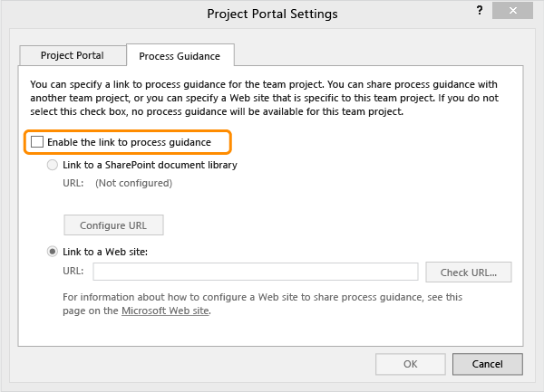
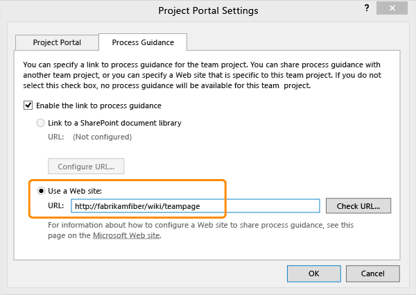
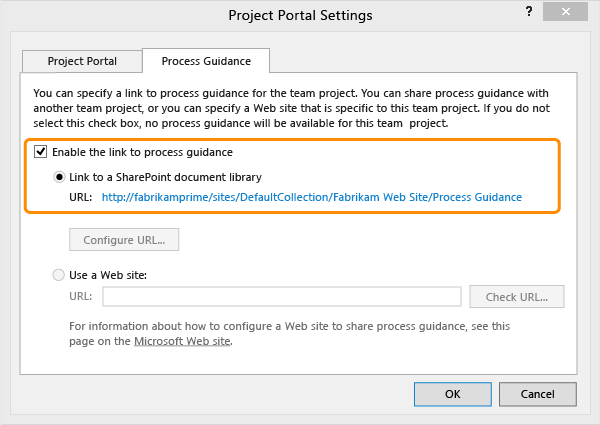

# Configure or redirect process guidance  

[!INCLUDE [temp](../includes/version-vsts-tfs-all-versions.md)]

Your team can use process guidance to capture how they coordinate work on a team project, how to use work item types (WITs), and how to work with reports throughout the project life cycle. For generic guidance, see [Agile](../../boards/work-items/guidance/agile-process.md), [Scrum](../../boards/work-items/guidance/scrum-process.md), and [CMMI](../../boards/work-items/guidance/cmmi-process.md) process template artifacts. You can customize your own process guidance and redirect the F1 help links from select artifacts to point to your custom guidance.  
  
 If your team project was created using the Basic configuration or is hosted on Azure DevOps Services, neither your project portal nor process guidance is enabled. This means that the links that redirect F1 help within a work item form aren't available.  
  
 To configure a project portal, see [Configure or add a project portal](configure-or-add-a-project-portal.md). If you want to configure process guidance, choose from one of the following options based on your deployment configuration and team requirements:  
  
-   [Determine if process guidance is enabled for your team project](#guid_enabled). 
     Choose this option to determine if process guidance is enabled.  
  
-   [Specify a website that hosts your custom process guidance](#simple).  
  
     Choose this option if you want to use a website that doesn't require SharePoint integration or your team project is hosted on Azure DevOps Services. Note that with this option, F1 help links within work item forms will not be redirected to your custom process guidance.  
  
-   [Specify a SharePoint document library that contains your process guidance](#sp).  
  
     Choose this option if you have already configured TFS to integrate with a SharePoint Web application, and you want F1 help links within work item forms to open to process guidance content. Also, choose this option when you want to share process guidance across several team projects within an organization.  
  
-   [Upload process guidance support files from a process template](#upload)  
  
     Choose this option when your SharePoint document library doesn't contain the support files used to redirect help links to process guidance content.  
  
-   [Modify support files that redirect process guidance to your custom guidance](#redirect)  
  
     Choose this option when you have a SharePoint site configured as your project portal and you want to modify the support files to redirect process guidance links to your custom process guidance.  
  
<a name="guid_enabled"></a> 

## Determine if process guidance is enabled for your team project portal  
  
1.  From Visual Studio>Team Explorer, [connect to your team project](../organizations/projects/connect-to-projects.md).  
  
2.  Open Portal Settings.  
  
       
  
3.  Choose the Process Guidance tab. When the **Enable the link to process guidance** check box is not selected, process guidance is not enabled.  
  
       
  
     When process guidance is not enabled, F1 help links within work item forms will not open help content.  


<a name="simple"></a> 

##  Specify a website for your process guidance 

 Choose this option when you aren't using SharePoint Products or when your team project is hosted on Azure DevOps Services.  
  
1.  If you aren't a member of the Project Administrators group, [get added now](../organizations/security/set-project-collection-level-permissions.md).  
  
2.  Open Portal Settings and choose the Process Guidance tab.  
  
3.  Enable the link to process guidance and then enter the URL for the website you've prepared for your team project portal.  
  
       
  
4.  To redirect F1 help links to point to content on your website, [upload](#upload) and then [modify the support files](#redirect).  
  

<a name="sp"></a> 

## Specify a SharePoint document library that contains your process guidance  

Some process guidance links will work only if process guidance has been enabled for your team project.  
  
1.  If you aren't a member of the Team Project Administrators group, [get added now](../organizations/security/set-project-collection-level-permissions.md).  
  
2.  Open Portal Settings and choose the Process Guidance tab.  
  
3.  Enable the link to process guidance and then configure the URL.  
  
4.  Enter the URL for the SharePoint document library that contains the process guidance support files or content.  
  
       


<a name="upload"></a> 


##  Upload files that support linking to process guidance  
  
1.  To obtain the process guidance support files for your team project, download them using the Process Template Manager. See [Download the latest version of the process templates](../boards/work-items/guidance/manage-process-templates.md).  
  
2.  Upload the contents of the Windows SharePoint Services/Process Guidance folder to the SharePoint document library that you have configured for process guidance.  
  
     Depending on your process template, upload the following files into the indicated folders.  
  
    |Folder|Scrum|Agile|CMMI|  
    |------------|-----------|-----------|----------|  
    |Process Guidance|ProcessGuidance.html|ProcessGuidance.html|ProcessGuidance.html|  
    |Process Guidance/Supporting Files|Bug.htm<br />CodeReviewRequest.htm<br />CodeReviewResponse.htm<br /> Feature.htm<br />FeedbackRequest.htm<br /> FeedbackResponse.htm<br /> Impediment.htm<br /> Impediment.htm<br /> ProductBacklogItem.htm<br /> SharedSteps.htm<br /> Task.htm<br /> TestCase.htm|AboutWorkItems.htm<br /> Bug.htm<br /> CodeReviewRequest.htm<br /> CodeReviewResponse.htm<br /> Feature.htm<br /> FeedbackRequest.htm<br /> FeedbackResponse.htm<br /> Issue.htm<br /> SharedSteps.htm<br /> Task.htm<br /> TestCase.htm<br /> UserStory.htm|AboutWorkItems.htm<br /> Bug.htm<br /> ChangeRequest<br /> CodeReviewRequest.htm<br /> CodeReviewResponse.htm<br /> Feature.htm<br /> FeedbackRequest.htm<br /> FeedbackResponse.htm<br /> Issue.htm<br /> Requirement.htm<br /> Review.htm<br /> Risk.htm<br /> SharedSteps.htm<br /> Task.htm<br /> TestCase.htm|  


<a name="redirect"></a> 


##  Modify support files that redirect process guidance to your custom guidance  

 You can redirect users to customized content by modifying the redirect links contained within the process guidance support and report files.  
  
 The  process guidance icon is designed to look for an `.aspx`, `.htm`, or `.html` file. These files can either contain the content or provide a URL that redirects to it.  
  
 These files must be uploaded to a folder labeled `Supporting Files`, within the SharePoint document library configured for process guidance for the team project.  
  
#### Upload .aspx content pages  
  
-   For each work item type for which you want to provide process guidance, upload the .aspx content page that you named to match the work item type to your process guidance website.  
  
     You must name the `.aspx` file to match the WORKITEMTYPE value in the type definition. For example, if the process guidance content is about the bug type of work item, which has `<WORKITEMTYPE name="Bug">` within its type definition, name the file `Bug.aspx`.  
  
#### Modify a process guidance support file  
  
1.  In the Process Guidance folder and its subfolder Supporting Files, open each `.htm` file that you downloaded in step 1 of [Upload process guidance support files](#upload).  
  
2.  In each file, locate the `meta` statement that specifies the URL. For example:  
  
    ```html
    <meta http-equiv="Refresh" content="0;URL=https://go.microsoft.com/fwlink/?LinkId=190653" />  
    ```  
  
3.  Replace the value specified for the URL with the URL of the customized guidance stored on your configured process guidance website. For example:  
  
    ```html
    <meta http-equiv="Refresh" content="0;URL=http://YourPortal/Process Guidance/scrum/html/Bug.html" />  
    ```  
  
4.  Save and close each file.  
  
5.  Upload each file to your process guidance website.  
  
     These files must be stored in the appropriate folder as indicated in step 2 of [Upload process guidance support files](#upload), above.  
  
#### Modify a process guidance link within a report  
  
1.  From Visual Studio, choose **Team, Show Report Site**.  
  
2.  Open the folder that contains the report that you want to modify.  
  
3.  Open the short-cut menu for the report and choose **Download**.  
  
4.  Open the file in Visual Studio or a text editor.  
  
5.  Locate the `Hyperlink` statement within the report.  
  
6.  Replace the URL in that statement with the URL of the file that contains your customized content.  
  
7.  Save and close the file.  
  
8.  Return to the Report Manager folder of the report, and choose **Upload File**.  
  
## Related notes 
  
<a name="access_pg"></a> 

###  How do I access process guidance from work items or reports?  
 **A: For work items**: From Team Explorer, press F1 or choose the  process guidance icon from an open work item.  
  
 The  process guidance icon appears only on the work item forms opened from Team Explorer and only when your team project has process guidance enabled and configured.  
  
 When you choose the  process guidance icon that appears in the work item forms in Team Explorer, a web browser opens and the page that's defined in the process guidance support file for the corresponding work item type is displayed.  If you have not configured your team project with a project portal, or you haven't uploaded the process guidance support files to the project portal, then this link will be inactive.  
  
 **For reports**: From an open report in Report Manager, choose the **How to Use this Report** link at the bottom of a report.  
  
 Depending on your settings, a web browser page opens to the standard process guidance content or your customized process guidance opens.  
  
<a name="addportal"></a> 

###  Q: Can I embed process guidance within a work item form?  

 **A:** Yes. To specify text or a hyperlink within a work item form, see [LabelText and Text](../reference/xml/labeltext-and-text-xml-elements-reference.md).  
  
 To embed a webpage or html content within a work item form, see [WebpageControlOptions](../reference/xml/webpagecontroloptions-xml-elements-reference.md).