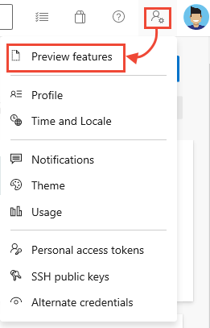
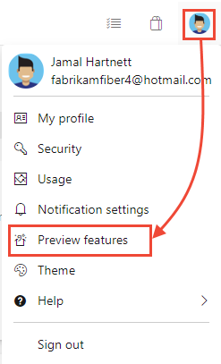
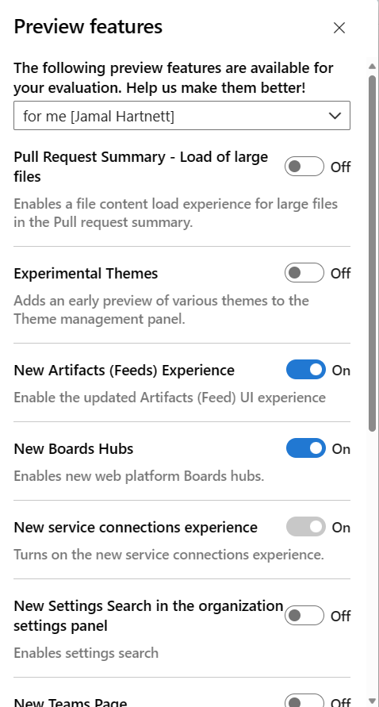
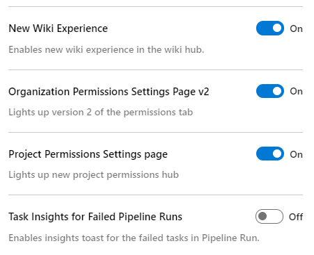
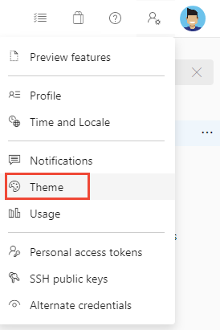
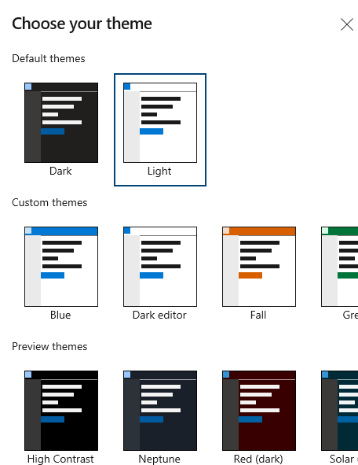

# Manage or enable features 

[!INCLUDE [version-gt-eq-2020](../../includes/version-gt-eq-2020.md)] 

::: moniker range="azure-devops"

As new features are introduced, you can turn them on or off. That way, you can try them out, provide feedback, and work with those features that meet your requirements.  

Some preview features provide access to entire new functionality. Others, such as the New Wiki experience, reflect a change to the user interface, but little or no change in functionality. 

> [!NOTE]   
> It may take up to three weeks after a release to Azure DevOps Services for the preview feature to appear in your organization. The [latest release notes](/azure/devops/release-notes/features-timeline) usually provide information on new preview features. You can turn on or off select features for Azure DevOps Services. Preview features become available first on Azure DevOps Services and then become standard features with an update to Azure DevOps Server. At some point, the preview feature moves out of preview status and becomes a regular feature of the web portal.  

::: moniker-end

::: moniker range="azure-devops-2020"

There are a few features you or an administrator can enable or disable. Some  features provide access to entire new functionality, while others provide a change to the user interface.  

::: moniker-end

::: moniker range="azure-devops"

The follow table indicates which preview features can be enabled per user or team member, and those that can be enabled for the organization.  You must be a member of the Project Collection Administrators group to change a preview feature at the organization-level. 

---
:::row:::
   :::column span="3":::
      **Preview features**
   :::column-end:::
   :::column span=".5"::: 
      **Per user**
   :::column-end:::
   :::column span=".5"::: 
      **Per organization**
   :::column-end:::
:::row-end:::
---
:::row:::
   :::column span="3":::
      [Analytics Views](../../report/powerbi/what-are-analytics-views.md)  
      [Copy Dashboard Experience](../../report/dashboards/copy-dashboard.md)  
      [Dependency Tracker](https://marketplace.visualstudio.com/items?itemName=ms-eswm.dependencytracker&ssr=false#overview) Preview Features  
      [Experimental themes](#experimental-themes)  
      [Full Access to Azure Pipelines for Stakeholders](../../organizations/security/provide-stakeholder-pipeline-access.md)  
   :::column-end:::
   :::column span=".5"::: 
       ✔️   
       ✔️   
       ✔️   
       ✔️   
      &nbsp;  
   :::column-end:::
   :::column span=".5"::: 
       ✔️   
       ✔️   
       ✔️   
       ✔️   
       ✔️   
   :::column-end:::
:::row-end:::
---
:::row:::
   :::column span="3":::
      [Historical graph for agent pools](../../pipelines/agents/pool-consumption-report.md)  
      [Limit user visibility and collaboration to specific projects](../../organizations/projects/about-projects.md#project-scoped-user-group)  
      [New account manager](#account-manager)  
      New Artifacts (Feeds) Experience (accessbility updates)  
      [New Boards Hubs](https://devblogs.microsoft.com/devops/azure-boards-ux-modernization-public-preview/) 
   :::column-end:::
   :::column span=".5"::: 
       ✔️   
      &nbsp;  
       ✔️   
       ✔️   
       ✔️   
   :::column-end:::
   :::column span=".5"::: 
       ✔️   
       ✔️   
       ✔️   
       ✔️   
       ✔️   
   :::column-end:::
:::row-end:::
---
:::row:::
   :::column span="3":::
      [New boards reports](../../report/dashboards/overview.md#in-context-reports-work-tracking)  
      [New release progress views](/azure/devops/release-notes/2018/may-30-vsts#visualize-release-progress)  
      [New service connections experience](../../pipelines/library/service-endpoints.md)  
      [New Settings Search in the organization settings panel](../../organizations/settings/search-settings.md)  
      [New Teams page](../../organizations/settings/add-teams.md)  
   :::column-end:::
   :::column span=".5"::: 
       ✔️   
       ✔️   
       ✔️   
       ✔️   
       ✔️   
   :::column-end:::
   :::column span=".5"::: 
       ✔️   
       ✔️   
       ✔️   
       ✔️   
       ✔️   
   :::column-end:::
:::row-end:::
---
:::row:::
   :::column span="3":::
      New Wiki experience  
      [Organization Permissions Settings Page v2](../../organizations/security/set-project-collection-level-permissions.md#collection-level)  
      [Project Permissions Settings page](../../organizations/security/set-project-collection-level-permissions.md#project-level)  
      [Task Insights for Failed Pipeline Runs](../../pipelines/get-started/multi-stage-pipelines-experience.md#task-insights-for-failed-pipeline-runs)   
      [YAML templates editor](../../pipelines/get-started/yaml-pipeline-editor.md#view-and-edit-templates)
   :::column-end:::
   :::column span=".5":::
       ✔️   
       ✔️   
       ✔️   
       ✔️   
       ✔️  
   :::column-end:::
   :::column span=".5"::: 
       ✔️   
       ✔️   
       ✔️   
       ✔️   
       ✔️  
   :::column-end:::
:::row-end:::
---

::: moniker-end

::: moniker range="azure-devops-2020"
The follow table indicates those features that you can enable as a user, project administrator, or project collection administrator. These preview features are only available to manage for Azure DevOps Server 2020 RTW. 

---
:::row:::
   :::column span="2":::
      **Feature**
   :::column-end:::
   :::column span="1":::
      **User**
   :::column-end:::
   :::column span="1":::
      **Project**
   :::column-end:::
   :::column span="1":::
      **Collection**
   :::column-end:::
:::row-end:::
---
:::row:::
   :::column span="2":::
      [New service connections experience](../../pipelines/library/service-endpoints.md)    
      [Selective artifacts download feature for collection/project](../../pipelines/process/phases.md#artifact-download)  
   :::column-end:::
   :::column span="1":::
      ✔️   
      &nbsp;   
   :::column-end:::
   :::column span="1":::
      &nbsp;     
      ✔️   
   :::column-end:::
   :::column span="1":::
      ✔️   
      ✔️   
   :::column-end:::
:::row-end:::
---

::: moniker-end

::: moniker range="azure-devops"

## Enable features for your use  

From time to time, a new feature is introduced in Preview mode, which allows you to turn it on or off. 

<a id="account-manager" />

To access the Preview features options, open your profile menu. The profile menu appears as shown below based on whether the **New Account Manager** feature has been enabled or not. The **New Account Manager** preview feature turns on enhanced user interface options for managing account information. The menu options move under the **User settings** icon from where they were previously under the **Account manager for your account** icon. 

#### [New Account Manager enabled](#tab/new-account-enabled)

Choose :::image type="icon" source="../../media/icons/user-settings-gear.png" border="false"::: **User settings**, and then choose **Preview features**. 

> [!div class="mx-imgBorder"]  
>    

#### [New Account Manager not enabled](#tab/new-account-not-enabled)

Choose **Account manager for your account** and then choose **Preview features**. 

> [!div class="mx-imgBorder"]  
> 

---

To enable or disable a feature, choose the slider. 

> [!div class="mx-imgBorder"]  
>  

For information on other user settings and preferences, see [Set user preferences](../../organizations/settings/set-your-preferences.md).

## Enable features at the organization level 

When you enable a feature at the organization level, you essentially turn it on for all users of your account. Each user can then disable the feature if they so choose. If you disable a feature at the organization level, user settings are not changed. Users can enable or disable the feature on their own. 

> [!TIP]  
> If you don't see the **for this account** menu option, then you aren't a member of the Project Collection Administrators group. To get added as one, see [Add administrators, set permissions at the team project or collection level](../../organizations/security/set-project-collection-level-permissions.md).  

> [!div class="mx-imgBorder"]  
> 

> [!div class="mx-imgBorder"]  
> 
> 
::: moniker-end

::: moniker range="azure-devops-2020"

## Enable or disable a feature   

1. Open your profile menu by choosing your image icon and select **Manage features**.  

	:::image type="content" source="media/manage-features/open-profile-2020.png" alt-text="Open profile menu":::

1. Select the level from the menu provided. 

	> [!TIP]  
	> If you don't see the **for this project** or **for this collection** menu options, then you aren't an administrator. To get added as one, see [Add administrators, set permissions at the team project or collection level](../../organizations/security/set-project-collection-level-permissions.md).  

1. To enable or disable a feature, choose the slider. 

	**User-level**  
	:::image type="content" source="media/manage-features/manage-features-user-2020.png" alt-text="Manage features for the user":::

	**Project-level**  
	:::image type="content" source="media/manage-features/manage-features-project-2020.png" alt-text="Manage features for the project":::

	**Collection-level**  
	:::image type="content" source="media/manage-features/manage-features-collection-2020.png" alt-text="Manage features for the collection":::

When you enable a feature at the project or collection-level, you essentially turn it on for all users. If you disable a feature at the project or collection-level, user settings are not changed. Users can enable or disable the feature on their own. 

::: moniker-end

::: moniker range="azure-devops"

## Experimental themes  

When you select **Theme** from the Profile menu you can select between **Dark** and **Light** themes for the display of Azure DevOps web portal. 

> [!div class="mx-imgBorder"]  
> 

With **Experimental themes** enabled, you can select among a number of additional themes. 

> [!div class="mx-imgBorder"]  
> 

## Features now enabled for all Azure DevOps Services 

### General

- [New user hub](../../organizations/accounts/add-organization-users.md)  
- [New PAT experience](/azure/devops/release-notes/2018/sprint-140-update#manage-your-personal-access-tokens-with-filtering-and-paging)  
- [New Navigation](https://devblogs.microsoft.com/devops/new-navigation/)

### Azure Pipelines
 
- [Pipeline decorators](../../extend/develop/add-pipeline-decorator.md)  
- [Multi-stage pipelines](../../report/powerbi/../../pipelines/process/stages.md)  
- [Test tab in new web platform](../../pipelines/test/review-continuous-test-results-after-build.md)
- [Test analytics in new web platform](../../pipelines/test/test-analytics.md)  
- [New builds hub](/azure/devops/release-notes/2018/sep-10-azure-devops-launch#manage-build-pipelines-using-the-new-builds-page)
- [Build with multiple queues](https://github.com/Microsoft/vsts-agent/blob/master/docs/preview/yamlgettingstarted.md)  
- [New Releases Hub](/azure/devops/release-notes/2018/jun-19-vsts#organize-your-release-definitions-in-folders) 
- [Approval gates in releases](../../pipelines/release/approvals/index.md) - [New Release Definition Editor](../../pipelines/release/define-multistage-release-process.md)  
- [Symbol server](../../pipelines/artifacts/symbols.md)  
- [Task tool installers](../../pipelines/process/tasks.md#tool-installers)  

### Azure Boards 

- [New Delivery Plans Experience](../../boards/plans/review-team-plans.md)  
- [Enable group by tags for work item chart widget on dashboard](../../boards/queries/add-tags-to-work-items.md#group-by-tags)  
- [New Rich Text Editor](../../boards/queries/share-plans.md#rich-text)- [New Queries Experience](../../boards/queries/view-run-query.md)   
- [New Work Items](../../boards/work-items/view-add-work-items.md)   

### Azure Repos

- New TFVC pages
- [Git Forks](../../repos/git/forks.md) 
- [New Repos pull request experience](https://devblogs.microsoft.com/devops/introducing-the-new-pull-request-experience-for-azure-repos)  
- [New Repos settings experience](/azure/devops/release-notes/2020/sprint-168-update#new-web-platform-conversion--repository-settings)  
- [New Repos landing pages](/azure/devops/release-notes/2019/sprint-159-update#new-web-ui-for-azure-repos-landing-pages-preview)  
- [Pull Request Status Policy](../../repos/git/pr-status-policy.md) 

### Azure Artifacts 

- [NuGet.org upstream sources](../../artifacts/nuget/upstream-sources.md) 
- [Updated package experience](../../artifacts/index.yml) 

### Azure Test Plans

- [New Test Plans Page](../../test/navigate-test-plans.md)  
- [New Test Plan Experience](/azure/devops/release-notes/2018/jun-19-vsts#test-1)  

### Dashboards and Analytics 

- [Analytics Views](../../report/powerbi/what-are-analytics-views.md)
- [New Dashboards Experience](../../report/dashboards/dashboards.md)  

### Social tools 

- [Wiki](../wiki/add-edit-wiki.md)  
- [Combine email recipients](../../notifications/manage-team-group-global-organization-notifications.md) 
- [New experience in Code, Work Item, & Wiki search](/azure/devops/release-notes/2017/oct-06-vsts#code)  
- [Out of the box notifications](../../notifications/manage-your-personal-notifications.md)   
- [Team expansion for notifications](../../notifications/manage-team-group-global-organization-notifications.md)

### Organization, project, and billing management
- [Streamlined User Management](../../organizations/accounts/add-organization-users.md)   

::: moniker-end

## Related articles

- [Set user preferences](../../organizations/settings/set-your-preferences.md)
- [Azure DevOps Feature Timeline](/azure/devops/release-notes/features-timeline)
