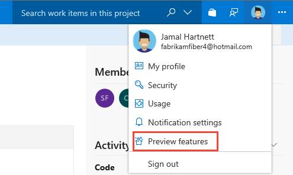

# Enable preview features 

[!INCLUDE [temp](../../_shared/version-vsts-only.md)] 

As new features are introduced, you can turn them on or off. That way, you can try them out, provide feedback, and work with those features that meet your requirements.  

Some features provide a new user interface and functionality, which can be managed per user or team member. Others support a default experience for the account and are managed by an account administrator. 
 
> [!NOTE]   
> You can turn on or off select features for Azure DevOps Services. Preview features become available first on Azure DevOps Services and then become standard features with an update to TFS. At some point, the preview feature moves out of preview status and becomes a regular feature of the web portal.  

> [!div class="mx-tdBreakAll"]  
> |[Preview features per user](#user-level)| [Preview features per Azure DevOps Services organization](#account-level)|  
> |-------------|----------|  
> |- [New build result page]() - [New Navigation](https://devblogs.microsoft.com/devops/2018/06/19/new-navigation/) - [New release progress views](../../pipelines/preview/new-release-summary.md) - [New Releases Hub](/azure/devops/release-notes/2018/jun-19-vsts#organize-your-release-definitions-in-folders)   |- [Build with multiple queues](https://github.com/Microsoft/vsts-agent/blob/master/docs/preview/yamlgettingstarted.md) - [Build YAML Definitions](../../pipelines/get-started-yaml.md) - [Git Forks](../../repos/git/forks.md) - New build results page - [New Navigation](https://devblogs.microsoft.com/devops/2018/06/19/new-navigation/) - [New release progress views](../../pipelines/preview/new-release-summary.md) - [New Releases Hub](/azure/devops/release-notes/2018/jun-19-vsts#organize-your-release-definitions-in-folders)  |

## Enable features for your use  

From time to time, a new feature is introduced in Preview mode, which allows you to turn it on or off. 

# [New navigation](#tab/new-nav)

0. To access the Preview features options, open your profile menu, and select **Preview features**. 

	> [!div class="mx-imgBorder"]  
	> 

0. To enable or disable a feature, choose the slider. 

	> [!div class="mx-imgBorder"]  
	>  

# [Previous navigation](#tab/previous-nav)  

0. To access the Preview features options, open your profile menu, and select **Preview features**. 

	> [!div class="mx-imgBorder"]  
	>   

0. To enable or disable a feature, choose the slider. 

	> [!div class="mx-imgBorder"]  
	>  

---

## Enable features at the organization (account) level (for all users)  

When you enable a feature at the organization level, you essentially turn it on for all users of your account. Each user can then disable the feature if they so choose.

> [!TIP]  
> If you don't see the **for this account** menu option, then you aren't an account administrator. To get added as one, see [Add administrators, set permissions at the team project or collection level](../../organizations/security/set-project-collection-level-permissions.md).  

> [!div class="mx-imgBorder"]  
> 

## Features now enabled for all Azure DevOps Services projects 
- [Approval gates in releases](../../pipelines/release/approvals/index.md)  
- [Combine email recipients](../../notifications/howto-manage-team-notifications.md) 
- [New Dashboards Experience](../../report/dashboards/dashboards.md)  
- [New experience in Code, Work Item, & Wiki search](/azure/devops/release-notes/2017/oct-06-vsts#code)  
- [New Queries Experience](../../boards/queries/view-run-query.md)   
- [New Release Definition Editor](../../pipelines/release/define-multistage-release-process.md)  
- [New Test Plan Experience](/azure/devops/release-notes/2018/jun-19-vsts#test-1)  
- [New Work Items Hub](../../boards/work-items/view-add-work-items.md)   
- [NuGet.org upstream sources](../../artifacts/nuget/upstream-sources.md) 
- [Out of the box notifications](../../notifications/howto-manage-personal-notifications.md).   
- [Pull Request Status Policy](../../repos/git/pr-status-policy.md) 
- [Symbol server](../../pipelines/symbols/index.md)  
- [Streamlined User Management](../../accounts/add-account-users-assign-access-levels.md)   
- [Task tool installers](../../pipelines/process/tasks.md#tool-installers) 
- [Team expansion for notifications](../../notifications/howto-manage-team-notifications.md)
- [Updated package experience](../../artifacts/index.md) 
- [Wiki](../wiki/add-edit-wiki.md)  

