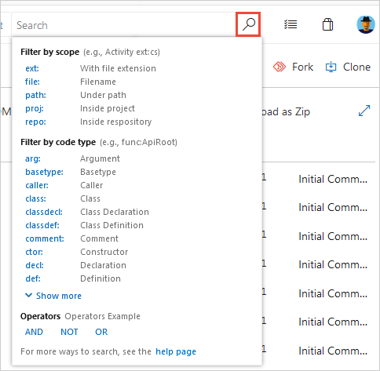
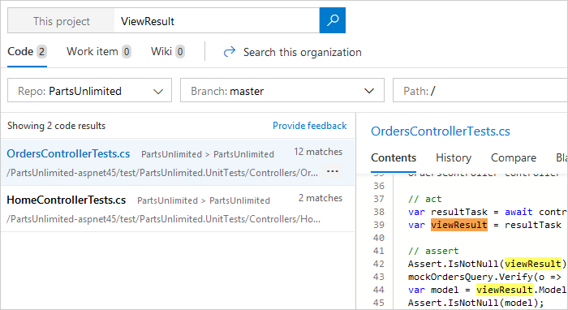
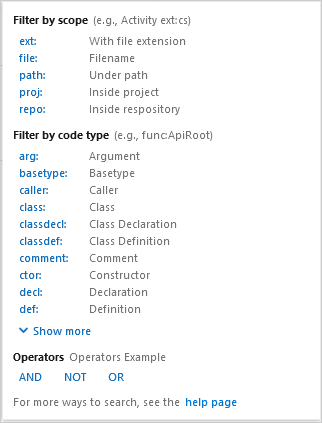

# Search your code

[!INCLUDE [version-header](_shared/version-header.md)]

Use Code Search to search across all of your projects, find specific types of code,
and easily drill down or widen your search

## Prepare

Go to [Visual Studio Marketplace](http://go.microsoft.com/fwlink/?LinkId=703823&clcid=0x409)
to install the extension as an administrator.
Non-administrative users can also go here to request the extension be added. 
For more details, see [Install an extension](../../marketplace/install-extension.md#install-extension) in the Marketplace documentation.

>Only users with Basic access can use Code Search.

## Start searching

# [New navigation](#tab/new-nav)

1. Open the **Azure Repos** section in Azure DevOps (see [Web portal navigation](../navigation/index.md)).

1. Choose the  icon at the top right of the window to show the search textbox.

       

1. Enter a search string in the textbox, and press _Enter_ (or choose the 
    icon) to start your search. 

# [Previous navigation](#tab/previous-nav)

1. In the search textbox at the top right of the window, check that the text says
   _Search code_. The search text box may say _Search work items_. In this case, use the drop-down selector to change it.

   

   If you don't see the 
   selector in the Search box, open the **Manage extensions** page 
   and check that Code Search is installed ([see Administer Search](administration.md)).

   

1. Enter a search string in the textbox, and press _Enter_ (or choose the 
    icon) to start your search.

---

## View the results

1. The search page shows a list of the matching code files. The selected file has all
   instances of the search string highlighted (only the first 100 hits are highlighted). 

   

   If you see a list of work items, ensure that **Code** is selected in the top left.

1. Sort the results as you need using the drop-down list of properties, or by relevance.

       

   > Open the search results in a new browser tab from either search box by
   pressing _Ctrl_ + _Enter_ or by holding _Ctrl_ and clicking  the
    icon.
   In Google Chrome and Firefox press _Ctrl_ + _Shift_ + _Enter_ to switch the focus
   to the new browser tab.

1. Try assembling more complex search strings using the operators and functions listed in the handy 
   drop-down list. Select the filter function or code type you want to include in your search string from the
   list, and type the criteria value.

       

   * You can find all instances of "ToDo" comments in your code simply by selecting `comment:` and typing `todo`. 

   * You can search in specific locations, such as within a particular path, by using a search string such as `Driver path:MyShuttle/Server`. 

   * You can search for files by name, such as `Driver file:GreenCabs.cs`, or just by file extension. For example, the search string 
    `error ext:resx` could be useful when you want to review all error strings in your code. 
    But even if your plain text search string (without specific file type functions) 
    matches part of a filename, the file appears in the list of found files.

   * You can combine two or more words by using Boolean operators; for example, `validate OR release`.

   * You can find an exact match to a set of words by enclosing your search terms in double-quotes. For example, `"Client not found"`. 

   * You can use the code type search functions with files written in C#, C, C++, Java, and Visual Basic.NET.

   * See also [full details of the search syntax](advanced-code-search-syntax.md#syntaxdetails). 

1. Widen your search to all projects, your entire organization, or narrow it to specific areas and types of code
   by selecting from the drop-down lists at the top of the page.

   

1. Use the tabs in the results page to view the history of the file and to compare versions of the file.

   

1. Choose the filename link at the top of this column to open the file in a new Code Explorer window.

   

1. Quickly [search for work items](work-item-search.md) containing the same search string, or search for the same string in your [project's wiki](../wiki/search-wiki.md).

   
 
## Next step

> [!div class="nextstepaction"]
> [Learn more about Code Search](advanced-code-search-syntax.md)
