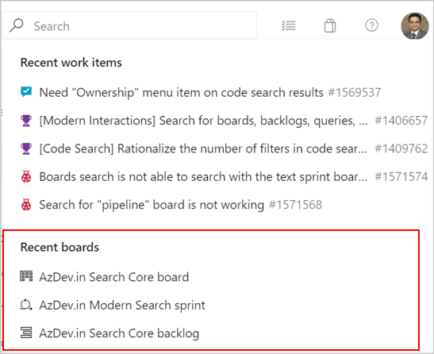
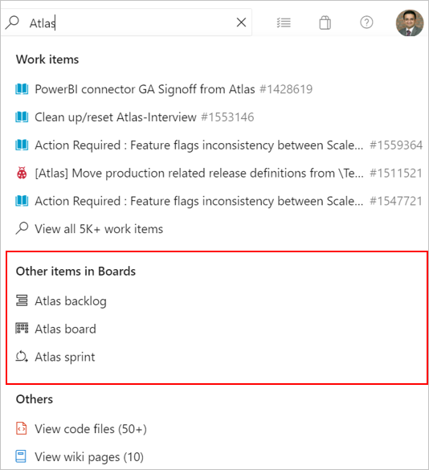
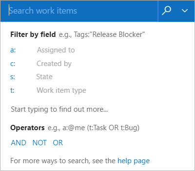

# Search for work items

[!INCLUDE [version-header](../../includes/version-tfs-2017-through-vsts.md)]

Work Item Search provides fast and flexible search across all your work items over all your projects. 

See also: [Adhoc vs managed work item queries](../../boards/queries/adhoc-vs-managed-queries.md?toc=/azure/devops/project/search/toc.json&bc=/azure/devops/project/search/breadcrumb/toc.json)

## Start searching

::: moniker range=">= azure-devops-2019"  

1. Open the **Azure Boards** section in Azure DevOps (see [Web portal navigation](../navigation/index.md)).

2. Choose :::image type="icon" source="media/shared/start-search-icon-new.png" border="false"::: **Search** at the top right of the window to show the search textbox.

       

3. Enter a search string in the textbox, and press _Enter_ to start your search. 

   Access your recently visited boards, backlogs, queries, and sprints. 

   

   You can also search for the boards, backlogs, queries and sprints across your project by entering the board name in the search box.

   

::: moniker-end

::: moniker range="<= tfs-2018"  

1. In the search textbox at the top right of the window, check that the text says
   _Search work items_.

       

2. If you have the Code Search extension installed, the search text box may
   say _Search code_. In this case, use the drop down selector to change it. 

3. Enter a search string in the textbox, and press _Enter_ to start your search. 

::: moniker-end

::: moniker range="< azure-devops-2019"  

1. In the search textbox at the top right of the window, check that the text says
   _Search work items_.

       

2. If you have the Code Search extension installed, the search text box may
   say _Search code_. In this case, use the drop-down selector to change it. 

3. Enter a search string in the textbox, and press _Enter_ to start your search. 

::: moniker-end

## View the results

1. Search results are displayed in a snippet view, where matches found are shown in bold.

   

   This is a full text search that uses simple search strings for words or phrases.
   Work item search matches derived forms of your search terms; for example, a search for
   "updating" will also find instances of the word "updated" and "update". Searches are _not_ case-sensitive.

1. Select a snippet of a work item to display it in the right window. 
   You can edit and manage this work item in the usual way.

   

   > Open the search results in a new browser tab from a search box by
   pressing _Ctrl_ + _Enter_.
   In Google Chrome or Firefox, press _Ctrl_ + _Shift_ + _Enter_ to switch the focus
   to the new browser tab. 

2. Fine-tune your search by specifying the fields to search. Enter `a:` and a user name
   to search for all items assigned to that user.

       

   The quick filters you can use are:

   * `a:` for **Assigned to:** 
   * `c:` for **Created by:** 
   * `s:` for **State** 
   * `t:` for **Work item type**

 
3. Start typing the name of a field in your work items; for example, type `ta`.

       

   The dropdown list shows work item field name suggestions 
   that match user input, helping the user search faster. For example, a search such as 
   **tags:Critical** finds all work items tagged 'Critical'. 

4. Add more filters to further narrow your search, and use Boolean operators
   to combine terms, if necessary. For example, 
   **a: Chris t: Bug s: Active** finds all active bugs assigned
   to a user named Chris.

5. Widen your search across all projects, or narrow it to specific types
   and states. Use the filter to show the selector lists.

       

6. Select the criteria you want in the drop-down selector lists, or search across the entire organization.

       

7. Sort the results as you need using the drop-down list of field names, work item types, or by relevance.

       

8. Quickly [search for code](code-search.md) containing the same search string, or search for the same string in your [project's wiki](../wiki/search-wiki.md).

   

## Next step

> [!div class="nextstepaction"]
> [Learn more about Work Item Search](advanced-work-item-search-syntax.md)
