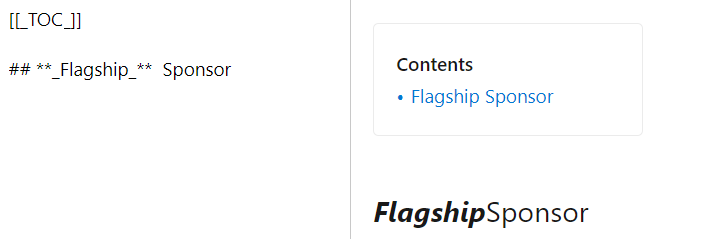
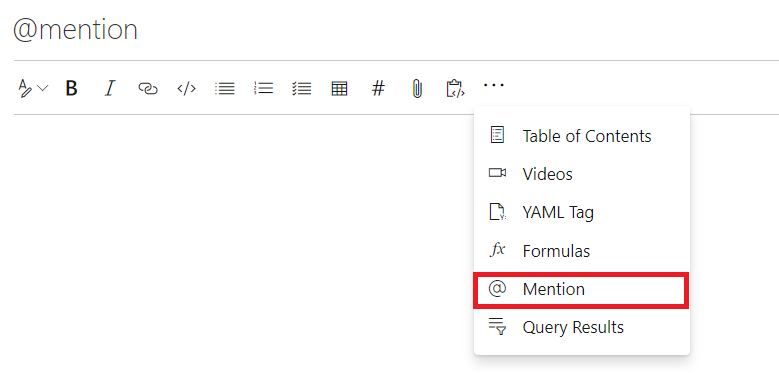
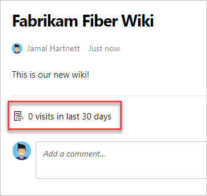

# Syntax guidance for Markdown usage in Wiki

[!INCLUDE [version-lt-eq-azure-devops](../../includes/version-lt-eq-azure-devops.md)] 

[!INCLUDE [version-selector](../../includes/version-selector.md)]

In this article, find some Wiki-specific Markdown syntax guidance for use in Azure DevOps.

::: moniker range=">= azure-devops-2019"

<a id="toc-wiki" > </a>

## Table of contents (TOC) for Wiki pages

To create a table of contents, add a \[[\_TOC\_]]. The TOC is generated when the tag gets added and there's at least one heading on the page.

> [!div class="mx-imgBorder"]
> 

The \[[\_TOC\_]] can be placed anywhere in the page to render the table of contents.
Only Markdown headings are considered for TOC (HTML heading tags aren't considered).

All HTML and Markdown tags get stripped from the headings while adding it inside the TOC block.
See the following example of how the TOC renders when you add bold and italics to a heading.

> [!div class="mx-imgBorder"]
> 

Consistency is maintained in the formatting in TOC.

> [!NOTE]
> The tag \[[\_TOC\_]] is case-sensitive. For example, \[[\_toc\_]] may not render the TOC. Also, only the first instance of [[\_TOC\_]] is rendered and the rest are ignored.

::: moniker-end

::: moniker range="azure-devops"

## Add Mermaid diagrams to a Wiki page

Mermaid lets you create diagrams and visualizations using text and code. Wiki supports the following Mermaid diagram types:

- [Sequence diagrams](https://mermaid-js.github.io/mermaid/#/sequenceDiagram)
- [Gantt charts](https://mermaid-js.github.io/mermaid/#/gantt)
- [Flowcharts](http://mermaid-js.github.io/mermaid/#/flowchart)

> [!NOTE]
> - Not all syntax in the previously linked content for diagram types works in Azure DevOps. For example, we don't support most HTML tags, Font Awesome, or LongArrow `---->`. 
> - Mermaid isn't supported in the Internet Explorer browser.

To add a Mermaid diagram to a wiki page, use the following syntax:

``` wiki-mermaid
::: mermaid
<mermaid diagram syntax>
:::
```
### Sequence diagram example

A sequence diagram is an interaction diagram that shows how processes operate with one another and in which order.

```markdown
::: mermaid
sequenceDiagram
    Alice->>John: Hello John, how are you?
    John-->>Alice: Great!
    Alice-)John: See you later!
:::
```

:::image type="content" source="media/wiki/wiki-mermaid-sequence-diagram.png" alt-text=".":::

### Gantt chart example

A Gantt chart records each scheduled task as one continuous bar that extends from the left to the right. The x axis represents time and the y records the different tasks and the order in which they're to be completed.

When you exclude a date, day, or collection of dates specific to a task, the Gantt chart accommodates those changes by extending an equal number of days toward the right, not by creating a gap inside the task.

```markdown
::: mermaid
gantt
    title A Gantt chart
    dateFormat YYYY-MM-DD
    excludes 2022-03-16,2022-03-18,2022-03-19
    section Section

    A task          :a1, 2022-03-07, 7d
    Another task    :after a1 , 5d
:::
```

:::image type="content" source="media/wiki/wiki-mermaid-gantt-chart.png" alt-text="image showing the Mermaid Live Editor with code and preview for Gantt chart.":::

### Flowchart example

A flowchart is composed of nodes, geometric shapes and edges, and arrows or lines.
The following example shows a flowchart using `graph` rather than `flowchart`. 

> [!NOTE]
> We don't support `---->` or `flowchart` syntax, nor links to and from `subgraph`.

```
:::mermaid
graph LR;
    A[Hard edge] -->|Link text| B(Round edge) --> C{Decision}
    C -->|One| D[Result one]
    C -->|Two| E[Result two]
:::
```

:::image type="content" source="media/wiki/wiki-mermaid-flowchart.png" alt-text="image showing the Mermaid Live Editor with code and preview for flowchart.":::

::: moniker-end

::: moniker range=">= azure-devops-2019"

## Add a collapsible section

To add a collapsible section in a wiki page, use the following syntax:

```html
# A collapsible section with markdown
<details>
  <summary>Click to expand!</summary>
  
  ## Heading
  1. A numbered
  2. list
     * With some
     * Sub bullets
</details>
```

:::image type="content" source="media/wiki/add-collapsible-section-wiki.png" alt-text="Screenshot showing markdown on one side and how the collapsible section renders on the other.":::

Make sure to add an empty line in the following areas:

- after the closing `</summary>` tag, otherwise the markdown/code blocks don't show correctly
- after the closing `</details>` tag if you have multiple collapsible sections

## Embed videos in a Wiki page

To embed videos from YouTube and Microsoft Streams in a wiki page, use the following syntax:

```markdown
::: video
<iframe width="560" height="315" src="https://www.youtube.com/embed/OtqFyBA6Dbk" frameborder="0" allow="autoplay; encrypted-media" allowfullscreen></iframe>
:::
```
The iframe is the embed iframe block of the YouTube or Microsoft Streams video.

**Result:**

<iframe width="560" height="315" src="https://www.youtube.com/embed/OtqFyBA6Dbk" frameborder="0" allow="autoplay; encrypted-media" allowfullscreen></iframe>

(The ending ":::" is required to prevent a break in the page)

## Embed Azure Boards query results in Wiki

To embed Azure Boards query results in a wiki page as a table, use the following syntax:

> [!div class="tabbedCodeSnippets"]
```Query syntax
::: query-table <queryid>
:::
```

For example:

:::
query-table 6ff7777e-8ca5-4f04-a7f6-9e63737dddf7
:::

You can also use the **toolbar** and the **query selector** to embed the query results in a wiki page.


For more information about how to copy the query URL, which provides a GUID for the query, see [Email query items or share query URL](../../boards/queries/view-run-query.md#email-query-items-or-share-a-query-url).

## @mention users and groups

To @mention users or groups in wiki, key in "@" in the wiki editor. This @mention opens autosuggest, from which you can mention users or groups to get notified by email.

> 

You can also select "@mention" from the edit toolbar.

> 

When you're editing pages directly in code, use the following pattern, `@<{identity-guid}>`.

::: moniker-end

::: moniker range=">= azure-devops-2020"

## Page visits for wiki pages

Automatically, you see an aggregated page visits count for the last 30 days on every page.

Use the batch API `pagesBatch` to see the daily quantity of visits to all pages in a paginated way. They aren't sorted by number of visits, however. For data over 30 days old, you can get all page visits using the rest API. Sort these pages based on the number of visits to get the top 100. You can store these visits in a dashboard or database.



> [!NOTE]
> A page visit is defined as a page view by a given user in a 15-minute interval.

::: moniker-end

<a id="link-work-items">  </a>

## Link to work items from a Wiki page

Enter the pound sign (`#`), and then enter a work item ID.

::: moniker range="tfs-2018"
> [!NOTE]
> This feature is available with TFS 2018.2 and later versions.
::: moniker-end

<a name="html"></a>

## HTML tag support in wiki pages

In wiki pages, you can also create rich content using HTML tags.

> [!TIP]
> You can nest Markdown within your HTML, but you must include a blank line between the HTML element and the markdown.


 ```HTML
<p>
  
  [A Markdown link](https://microsoft.com) 
</p>
```

> [!NOTE]
> Pasting rich content as HTML is supported in Azure DevOps Server 2019.1 and later versions.

**Example - Embedded video**

```HTML
<video src="path of the video file" width=400 controls>
</video>
```

```HTML
<video src="https://sec.ch9.ms/ch9/7247/7c8ddc1a-348b-4ba9-ab61-51fded6e7247/vstswiki_high.mp4" width=400 controls>
</video>
```

</br>
<strong>Result:</strong>
</br>
<video src="media/markdown-guidance/vstswiki_mid.mp4" width="600" controls>
</video>

**Example - Rich text format**

```HTML
<p>This text needs to <del>strikethrough</del> <ins>since it is redundant</ins>!</p>
<p><tt>This text is teletype text.</tt></p>
<font color="blue">Colored text</font>
<center>This text is center-aligned.</center>
<p>This text contains <sup>superscript</sup> text.</p>
<p>This text contains <sub>subscript</sub> text.</p>
<p>The project status is <span style="color:green;font-weight:bold">GREEN</span> even though the bug count / developer may be in <span style="color:red;font-weight:bold">red.</span> - Capability of span
<p><small>Disclaimer: Wiki also supports showing small text</small></p>
<p><big>Bigger text</big></p>
```

**Result:**


<!---
<p>This text needs to <del>strikethrough</del> <ins>since it is redundant</ins>!</p>
<p><tt>This text is teletype text.</tt></p>
<font color="blue">Colored text</font>
<center>This text is center-aligned.</center>
<p>This text contains <sup>superscript</sup> text.</p>
<p>This text contains <sub>subscript</sub> text.</p>
<p>The project status is <span style="color:green;font-weight:bold">GREEN</span> even though the bug count / developer may be in <span style="color:red;font-weight:bold">red.</span> - Capability of span
<p><small>Disclaimer: Wiki also supports showing small text</small></p>
<p><big>Bigger text</big></p>
-->

## Related articles

- [Project wiki](add-edit-wiki.md)
- [Wiki file structure](wiki-file-structure.md)
- [Wiki view history](wiki-view-history.md)
