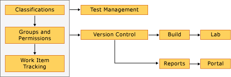

# Define dependencies for task groups and tasks in plug-in files

[!INCLUDE [version-lt-azure-devops](../../includes/version-lt-azure-devops.md)]


When you add a task group or a task to a plug-in file, you must add them in the correct sequence and declare any dependencies that the group or task has on the successful completion of other task groups or tasks. A task can depend on other tasks, requiring other tasks to complete before primary task can run. For example, the task to create work item queries cannot run until all the tasks to create work item types have successfully completed. Therefore, the task to upload work item queries depends on the task to upload the types of work items.  
  
<a name="required"></a> 
##  Required plug-ins and plug-in dependencies  

The following illustration shows the dependent relationships that are defined for the Team Foundation Server (TFS) [process templates](../../boards/work-items/guidance/choose-process.md). As the illustration shows, the plug-in for Work Item Tracking depends on the successful completion of the plug-in for Groups and Permissions, which depends on the successful completion of the plug-in for Classifications. The plug-ins for both Test Management and Version Control depend on the completion of the first three plug-ins. The plug-ins for Build, Lab, Reports, and Portal depend on the completion of the plug-in for Version Control.  
  
   
  
> [!TIP]  
>  If you define your task groups and tasks in each plug-in file in the same order as their dependencies, you make reading the file and eliminating dependency problems easier.  
  
Dependencies can be used to indicate the order in which plug-ins run in the **New Team Project Wizard**. Some plug-ins are always dependent on other plug-ins. Also, not all plug-ins are required for a process template.  
  
The following table identifies which plug-ins depend on other plug-ins. Only the plug-in for Classifications is required. All other plug-ins are optional. For more information about each plug-in, see [Overview of process template files](overview-process-template-files.md).  
  
|**Plug-in**|**Dependent Plug-ins**|  
|------------------|-----------------------------|  
|Build|Groups, VersionControl|  
|Classifications|None|  
|Groups|Classifications|  
|Lab|Build, Classifications, Groups, WorkItemTracking|  
|Portal|Classifications, Reporting, VersionControl, and WorkItemTracking|  
|Reporting|Classifications, VersionControl, and WorkItemTracking|  
|TestManagement|Classifications, Groups, and WorkItemTracking|  
|VersionControl|Classifications, Groups, and WorkItemTracking|  
|WorkItemTracking|Classifications and Groups|  
  
<a name="task_group"></a> 
## Define task group dependencies  
 Use the dependency element in tasks and groups to indicate when a dependency exists. The following example shows how to use the dependency element to specify that the WorkItemTracking task group depends on the Classification and Groups task groups.  
  
> [!div class="tabbedCodeSnippets"]
> ```XML
> <group id="WorkItemTracking" description="Workitem definitions uploading." completionMessage="Workitem definitions uploaded.">  
>    <dependencies>
>       <dependency groupId="Classification"/>
>       <dependency groupId="Groups"/>
>    </dependencies>  
>    <taskList filename="WorkItem Tracking\WorkItems.xml"/>  
> </group>  
> ```  
> 
> [!NOTE]
>  The **groupId** element references the **id** element value in the other group.  
  
The following table describes the elements that you use to define task group dependencies. For more information about how to define task groups, see [Process template XML elements reference](process-template-xml-elements-reference.md).  
  
|Element| Description and syntax|  
|-------------|-----------------|  
|**dependencies**|Required child element of **group**. Specifies the other groups on which a group depends.<br />`<dependencies>`<br />      `<dependency>. . . </dependency>`<br />`</dependencies>`|  
|**dependency**|Optional child element of **dependencies**. Specifies the ID of another task group on which this group depends. The other group must complete its tasks before this task group can start.<br /> `<dependency groupId="groupId" />`| 
  
<a name="task"></a> 
##  Defining task dependencies  
 The following example shows how to use the **dependency** element to specify that the WorkItems task depends on the task with an ID of "WITs."  
  
> [!div class="tabbedCodeSnippets"]
> ```XML  
> <task id="WIs" name="WorkItems" plugin="Microsoft.ProjectCreationWizard.WorkItemTracking" completionMessage="Work items uploaded"  completionDescription="Processing the actual work items used by work item tracking">  
>    <dependencies>
>       <dependency taskId="WITs" />
>    </dependencies>  
> ```  
  
 The following table describes the elements that you use to define task dependencies. For more information about how to define tasks, see [Define the tasks to process a plug-in](define-tasks-to-process-a-plug-in.md).  
  
|Element|Description and syntax| 
|-------------|------------| 
|**dependencies**|Optional child element of **task**. Specifies the other tasks on which a task depends.<br /> `<dependencies>`<br />      `<dependency>. . . </dependency>`<br />`</dependencies>`|  
|**dependency**|Optional child element of **dependencies**. Specifies the ID of another task on which this task depends. The other task must complete its tasks before this task can start.<br />`<dependency taskId="taskId" />`| 
  
## Related articles 
-  [Customize a process](customize-process.md)   
-  [Define the tasks to process a plug-in](define-tasks-to-process-a-plug-in.md)   
-  [Define the root tasks](define-root-tasks-process-template-plug-in.md)