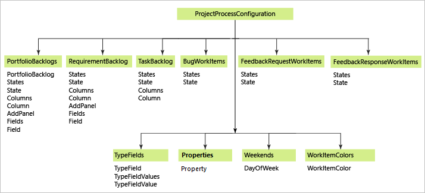
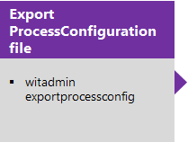
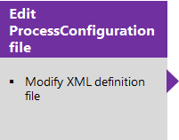
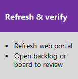
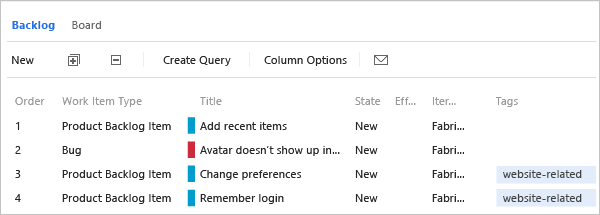
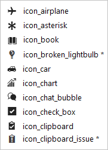
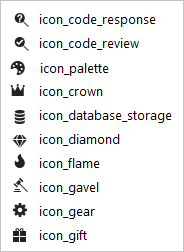
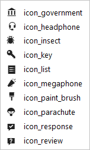
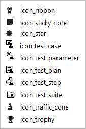

# Process configuration XML element reference

[!INCLUDE [version-lt-azure-devops-plus-xml-process](../../includes/version-lt-azure-devops-plus-xml-process.md)] 

Process configuration defines the default configuration and functional capabilities that your teams can access using the web portal Agile tools. These tools, include the product backlog, sprint backlogs, Kanban board, and task board and are customizable for each team you add to project.

Configuration elements specify the work item types (WITs), default columns, fields used by the tools, and other elements. The main configurations made determine which items will display for the portfolio, product, and sprint backlogs by defining the **PortfolioBacklog**, **RequirementBacklog**, and **TaskBacklog** sections of the process configuration XML definition file. In addition, process configuration defines the workflow mapping of state-to-state category for all WITs that require mapping.



For a summary of what you can configure through the user interface, see [Customize work tracking, Add teams and configure their Scrum and Kanban tools](../customize-work.md).

<a id="areas-to-customize">  </a>

Areas that you can customize through ProcessConfiguration:


> [!div class="mx-tdBreakAll"]  
> |Backlogs  |Work item types (WITs)  |Other tools  |  
> |-------------|----------|---------| 
> |- [Configure the quick add panel](#add) <br/>- [Define default columns](#columns) <br/>- [Map state categories for a WIT category](#map)<br/>- [Set number of task board items](#number_items)<br/>- [Set weekend days (Scrum)](#weekend_days) <sup>1</sup><br/>- [Set default Show bugs on backlogs](#behaviors)  <sup>1</sup><br/>- [Set default hidden backlogs](#behaviors) <sup>1</sup>  |- [Specify the WIT color](#wit-colors)<br/>- [Specify the workflow state color](#state-colors)  <sup>2</sup><br/>- [Specify the WIT icon](#wit-icons)  <sup>3</sup> |- [Assign Agile tool fields](#fields)<br/>- [Map tool-specific state categories](#tool_wits) <br/>- [Specify properties](#behaviors) |

> [!NOTE]  
> 1. Items noted with an asterisk set a default for the project. These items can be changed for each team through [team settings](../../organizations/settings/manage-teams.md).
> 2. Supported for Hosted XML, and for On-premises XML for TFS 2015.2 or later version.  
> 3. Supported for Hosted XML, and for On-premises XML for TFS 2017.2 or later version.  

> [!IMPORTANT]  
>If you want to customize your project to add custom work item types to appear on your backlogs or boards or add custom portfolio backlogs, see [Add a work item type to a backlog and board](../add-wits-to-backlogs-and-boards.md) and [Add portfolio backlogs](../add-portfolio-backlogs.md).  

### Update the process configuration 

> [!NOTE]    
>To access the latest version of the process templates, install the latest version of TFS and download the templates using the [Process Template Manager](../../boards/work-items/guidance/manage-process-templates.md).

To update the process configuration for a project, you export the XML definition file, edit it, and then import the file. You export these files either by [exporting a process](../../organizations/settings/work/import-process/import-process.md#export-a-process) or [exporting the process configuration definition file](../witadmin/witadmin-import-export-process-configuration.md).

[](../witadmin/witadmin-import-export-process-configuration.md)[](#areas-to-customize)[](../witadmin/witadmin-import-export-process-configuration.md)  

[!INCLUDE [temp](../../includes/process-editor.md)]  

<a id="backlog_page">  </a>

## Configure a backlog

You can customize the following elements for the product backlog, sprint backlogs, and portfolio backlogs:

-   **State category mappings**:&#160;&#160;Map workflow states to state categories  (previously referred to as a metastate). These mappings support the display of all Agile planning tools, including the Kanban and task boards.

-   **Quick add panel**:&#160;&#160;Specify the WITs and work item fields that appear for quickly adding items to the backlog.

    To change the types of work items that are considered backlog items or tasks, you add them to the corresponding category. For an example, see [Add bugs to the task board or backlog](../add-wits-to-backlogs-and-boards.md).

-   **Column fields**: Define the default fields and column sequence.

You configure backlogs within the XML sections that appear in the following sample:

> [!div class="tabbedCodeSnippets"]
> ```XML
> <PortfolioBacklogs>
>       <PortfolioBacklog category="Microsoft.EpicCategory" pluralName="Epics" singularName="Epic" workItemCountLimit="1000">
> . . . 
>       </PortfolioBacklog>
>       <PortfolioBacklog category="Microsoft.FeatureCategory" pluralName="Features" singularName="Feature" parent="Microsoft.EpicCategory" workItemCountLimit="1000">
> . . . 
>       </PortfolioBacklog>
> </PortfolioBacklogs>
> <RequirementBacklog category="Microsoft.RequirementCategory" pluralName="Stories" singularName="User Story" workItemCountLimit="1000">
> . . . 
> </RequirementBacklog>
> <TaskBacklog category="Microsoft.TaskCategory" pluralName="Tasks" singularName="Task" workItemCountLimit="1000">
> . . . 
> </TaskBacklog>
> ```
> 
> 
> [!NOTE]
> Depending on the process associated with your ProcessConfiguration file&mdash;[Agile](../../boards/work-items/guidance/agile-process.md), [Scrum](../../boards/work-items/guidance/scrum-process.md), or [CMMI](../../boards/work-items/guidance/cmmi-process.md)&mdash;the `pluralName` for the `RequirementCategory` will correspond to `Stories` (Agile), `Backlog Items` (Scrum), or `Requirements` (CMMI). All three are similar: they describe the customer value to delivered and the work to be performed.  


#### Syntax for PortfolioBacklogs elements

:::row:::
   :::column span="1":::
   **Element**
   :::column-end:::
   :::column span="3":::
   **Description**
   :::column-end:::
:::row-end:::

:::row:::
   :::column span="1":::
   **PortfolioBacklogs**

   :::column-end:::
   :::column span="3":::
   Optional. Container element for portfolio backlogs.

   :::column-end:::
:::row-end:::
:::row:::
   :::column span="1":::
   **PortfolioBacklog**

   :::column-end:::
   :::column span="3":::
   Optional. Up to five instances.  

   Container element that defines the state category mappings, default columns, and quick add panel for a portfolio backlog.

   ```
   <PortfolioBacklog category="PortfolioCategory" parent="ParentCategory"  
         pluralName="PluralName" singularName="SingleName" workItemCountLimit="MaximumLimit>  
         <States> . . . </States>  
         <Columns> . . . </Columns>  
         <AddPanel> . . . </ AddPanel>  
   </PortfolioBacklog >  
   ```
   Assign values to the attributes as described:

   
   - **category**: Specify the name of a category that you have defined in the categories definition file for the project that contains the WITs to be associated with this backlog type.

   - **parent**: Specify the name of the category that represents the parent portfolio backlog within the hierarchy.

   - **pluralName**: Specify the plural label to use when referring to the WITs associated with this backlog type. For example, Stories, Goals, Initiatives, or Epics.

   - **singularName**: Specify the singular label to use when referring to the WITs associated with this backlog type. For example, Story, Goal, Initiative, or Epic.

   - **workItemCountLimit**: Specify an integer. Default is 1000. Backlogs and boards will limit the count of items displayed based on this limit.
   
   :::column-end:::
:::row-end:::

:::row:::
   :::column span="1":::
   **RequirementBacklog**

   :::column-end:::
   :::column span="3":::
   Required. One instance only.

   Container element that defines the state category mappings, default columns, and quick add panel for the product backlog. The product backlog displays all active items in the team's backlog.

   ```
   <RequirementBacklog category="RequirementCategory"  
         pluralName="PluralName" singularName="SingleName"   
         workItemCountLimit="MaximumLimit" >  
         <States> . . . </States>
         <Columns> . . . </Columns>
         <AddPanel> . . . </ AddPanel>
   </RequirementBacklog >
   ```
   :::column-end:::
:::row-end:::

:::row:::
   :::column span="1":::
   **TaskBacklog**

   :::column-end:::
   :::column span="3":::
   Required. One instance only.

   Container element used to customize the layout of sprint backlogs.

   ```
   <TaskBacklog category="Microsoft.TaskCategory" pluralName="Tasks" 
   singularName="Task workItemCountLimit="MaximumLimit">
   . . . 
   </TaskBacklog > 
   ```
   :::column-end:::
:::row-end:::

#### Implementation notes
- By default, each backlog is restricted to a total of 1000 work items. You can change this limit by specifying a value for the `workItemCountLimit` attribute.  
- The values assigned to *CategoryName* must correspond to a category group defined for the project. You [specify category groups in the definition file for Categories](categories-xml-element-reference.md).  
- You use [portfolio backlogs](../../boards/backlogs/organize-backlog.md) to organize your backlog, view the rollup of backlog items at lower levels, and to view progress across several teams. New and upgraded projects contain two portfolio backlog levels: Features and Epics. You can add up to three additional levels. Only the top level portfolio backlog doesn't specify a parent category.  
- Your [product backlog](../../boards/backlogs/create-your-backlog.md) corresponds to your project plan, the roadmap for what your team plans to deliver. It lists work items whose WITs belong to the Requirements Category. In order to manage different WITs than those provided by your default project, you can add WITs to the Requirements Category and map the workflow states to state categories.  
- Your [sprint or iteration backlogs](../../boards/sprints/assign-work-sprint.md) display both the set of requirements that you and your team have committed to in a specific sprint cycle and the tasks that you have linked to those requirements. You link tasks to requirements using the parent-child link type. Because the WITs that appear on these backlogs correspond to the same types that appear on the product backlog, much of the customization work that you do for the product backlog will define the functionality of the sprint backlog.  

<a id="map">  </a>

### Map WIT category workflow states to state categories

Several WITs require their workflow states to be mapped to a state category. Workflow states define how a work item progresses from first activation or creation to closed or complete. For example, the states defined for the Scrum product backlog item define a progression of four states, from **New**, **Approved**, **Committed**, to **Done**, and also includes a fifth state, **Removed**, to account for a state removed from the backlog without being implemented. Workflow states are associated with the `value` attribute. 

State categories, on the other hand, determine how the Agile planning tools treat each workflow state. The primary state categories used by the backlog and task board are **Proposed**, **InProgress**, and **Complete**. State categories are associated with the `type` attribute. To learn more, see  [Workflow states and state categories](../../boards/work-items/workflow-and-state-categories.md). 

By associating each workflow state to a state category, the background operations performed to display the backlog and task boards know how to correctly interpret the status of each work item. For example, the following mappings are defined for the Scrum product backlog.

> [!div class="tabbedCodeSnippets"]
> ```XML
> <RequirementBacklog category="Microsoft.RequirementCategory" pluralName="Backlog items" singularName="Backlog item">
>       <States>
>       <State value="New" type="Proposed" />
>       <State value="Approved" type="Proposed" />
>       <State value="Committed" type="InProgress" />
>       <State value="Done" type="Complete" />
>       </States>
>  . . .
> </RequirementBacklog>
> ```

There are three groups of state categories: Agile, Bug, and Feedback. The following table describes the mapping attributes and values.

#### Syntax for States elements (WIT category)

:::row:::
   :::column span="1":::
   **Element**
   :::column-end:::
   :::column span="3":::
   **Description**
   :::column-end:::
:::row-end:::

:::row:::
   :::column span="1":::
   **State**

   :::column-end:::
   :::column span="3":::
   Required. Assigns a workflow state to a state category.

   ```
   <State value="ValueName" type="TypeName" />
   ```
   Valid values for *ValueName* correspond to a value assigned to a **STATE** within the **WORKFLOW** section of those WITs assigned to the category group.

   Valid values for *TypeName* correspond to one of the following enumerated values:
   
   - Agile: Use for all work item types.   
     - **Proposed**: Indicates work items that are new, not yet committed, or not yet being worked on. 
     - **InProgress**: Indicates work items that have been committed or are actively being worked on.
     - **Complete**: Indicates work items that have been implemented. For the [Kanban board](../../boards/boards/kanban-basics.md) to be valid, exactly one workflow state must be mapped to the **Complete** state category. If additional workflow states need to be represented, they can be mapped to the **Resolved** state category.  
     Once a workflow state transitions to a state that is associated with the **Complete** metastate, the associated work item will fall off the product backlog. However, it will continue to be listed in the last column on the Kanban board.<br/><br/>
   Work items in a workflow state that aren&#39;t mapped to one of the state categories don&#39;t appear on the backlog or board.
   - Bug: Use only for work item types grouped within the Bug Category. In addition to the Agile state categories, includes the **Resolved** state category which indicates bugs that have been resolved.<br/><br/>
   > [!NOTE]  
   > You can only assign the **Resolved** state category to a workflow state specified under the **BugWorkItems** element.   
   - Feedback: Use only for work item types grouped within the Feedback Request or Feedback Response categories. **Requested**, **Received**, **Reviewed**, and **Declined**. 
   :::column-end:::
:::row-end:::
:::row:::
   :::column span="1":::
   **States**

   :::column-end:::
   :::column span="3":::
   Specifies a collection of **State** elements that associate WIT workflow states with state categories.

   Required element for the following parent elements:
   
   - **BugWorkItems**
   - **PortfolioBacklog**
   - **RequirementBacklog**
   - **TaskBacklog**
   - **TestPlanWorkItems**
   - **TestSuiteWorkItems**
   - **FeedbackRequestWorkItems**
   - **FeedbackResponseWorkItems**    
   :::column-end:::
:::row-end:::

<a id="columns">  </a>

### Set default columns 

Specify which fields you want displayed on each backlog within the **Columns** section. Changes you make through the **Column Options** dialog persist until you change them again.

  

Here's the default configuration defined by the Scrum process template for the product backlog.

> [!div class="tabbedCodeSnippets"]
> ```XML
> <Columns>
>       <Column refname="Microsoft.VSTS.Common.Priority" width="400" />
>       <Column refname="System.Title" width="400" />
>       <Column refname="System.State" width="100" />
>       <Column refname="Microsoft.VSTS.Scheduling.Effort" width="50" />
>       <Column refname="System.IterationPath" width="200" />
> </Columns>
> ```

#### Syntax for Columns elements

:::row:::
   :::column span="1":::
   **Element**
   :::column-end:::
   :::column span="3":::
   **Description**
   :::column-end:::
:::row-end:::

:::row:::
   :::column span="1":::
   **Columns**

   :::column-end:::
   :::column span="3":::
   Specifies a collection of **Column** elements. Required element for the backlog elements: **PortfolioBacklog**, **RequirementBacklog**, and **TaskBacklog**.  
   :::column-end:::
:::row-end:::

:::row:::
   :::column span="1":::
   **Column**

   :::column-end:::
   :::column span="3":::
   Specifies a field to appear as a column on a backlog.  

   ```
   <Column refname="FieldReferenceName"  width="FieldWidth" />
   ```
   :::column-end:::
:::row-end:::

**Task board column headings**

The column headings that appear on the task board correspond to the workflow states assigned to the default WIT assigned to the Task Category. The column sequence corresponds to the natural progression of the workflow transitions, moving from left to right. To modify the column layout, you modify the workflow for the WIT assigned to the Task Category. The workflow states defined for the default task type in the Task Category must be assigned to a valid state category as described in [Map state categories for a category of work item types](#map).

<a id="add">  </a>

### Customize the quick add panel

You can add fields for any quick add panel. For example, the following example adds **Business Value** to the product backlog panel.

  

The panel only displays fields that are included in the **FIELDS** section of the WIT definition for the WIT selected. For example, if you select the bug WIT, then only Title displays, because Business Value isn't defined for bugs. To add another WIT to the panel, you add it to the Requirements Category as described  in [Add a work item type to a backlog and board](../add-wits-to-backlogs-and-boards.md).

The following code corresponds to the default assignments defined in the Visual Studio Scrum and MSF for Agile process templates.

> [!div class="tabbedCodeSnippets"]
> ```XML
> <AddPanel>
>       <Fields>
>       <Field refname="System.Title" />
>       </Fields>
> </AddPanel>
> ```

#### Syntax for AddPanel elements

:::row:::
   :::column span="1":::
   **Element**
   :::column-end:::
   :::column span="3":::
   **Description**
   :::column-end:::
:::row-end:::

:::row:::
   :::column span="1":::
   **AddPanel**

   :::column-end:::
   :::column span="3":::
   Container element used to specify the "quick add" experience, the fields to appear within the panel area where new backlog items are defined.  
   :::column-end:::
:::row-end:::

:::row:::
   :::column span="1":::
   **Fields**

   :::column-end:::
   :::column span="3":::
   Specifies a collection of **Field** elements.

   :::column-end:::
:::row-end:::

:::row:::
   :::column span="1":::
   **Field**

   :::column-end:::
   :::column span="3":::
   Specifies a work item field to appear within the panel for the product backlog.  

   ```
   <Field refname="FieldReferenceName"/>
   ```
   The same field should appear on the work item form of each WIT included in the category for the backlog.

   :::column-end:::
:::row-end:::

<a id="number_items">  </a>

### Set task board number of work items 
For performance reasons, the task board is restricted to display a maximum of 1000 work items. When you open the task board, all work items are loaded into cache. Limiting the number of work items may yield quicker load times. You can change this limit by specifying a value for the `workItemCountLimit` attribute of the **TaskBacklog** element.

For example, you can decrease the limit by specifying `workItemCountLimit="800"`:

> [!div class="tabbedCodeSnippets"]
> ```XML
> <TaskBacklog category="Microsoft.TaskCategory" pluralName="Tasks" singularName="Task" workItemCountLimit="800" >
> . . .
> </TaskBacklog>
> ```

<a id="tool_wits">  </a>

## Map state categories for tool-specific work item types

State category mappings are defined for additional WIT categories. For the Scrum process template, this includes mappings for the feedback request and response categories. For the MSF Agile and CMMI process templates, it also includes mappings for the bug category. (Scrum includes bugs in the Requirement Category and therefore defines the state category mappings within the **RequirementBacklog** section.)

> [!div class="tabbedCodeSnippets"]
> ```XML
> <FeedbackRequestWorkItems category="Microsoft.FeedbackRequestCategory" pluralName="Feedback Requests" singularName="Feedback Request">
>       <States>
>       <State value="Active" type="InProgress" />
>       <State value="Closed" type="Complete" />
>       </States>
> </FeedbackRequestWorkItems>
> <FeedbackResponseWorkItems category="Microsoft.FeedbackResponseCategory" pluralName="Feedback Responses" singularName="Feedback Response">
>       <States>
>       <State value="Active" type="InProgress" />
>       <State value="Closed" type="Complete" />
>       </States>
> </FeedbackResponseWorkItems>
> ``` 

The following table describes the additional elements used to define the state category mappings for tool-specific work item types. See [Map state categories for a category of work item types](#map) for information about assigning the actual state values and types. The *CategoryName* must correspond to a category defined for the project.

#### Syntax for tool-specific state category mapping elements

:::row:::
   :::column span="1":::
   **Element**
   :::column-end:::
   :::column span="2":::
   **Description**
   :::column-end:::
:::row-end:::

:::row:::
   :::column span="1":::
   **BugWorkItems**

   :::column-end:::
   :::column span="2":::
   Optional. Container element that defines the state category mappings for work item types assigned to the Bug Category. In addition to how these mappings are used in the display of Agile tools, they also control how the **My Work** feature in Team Explorer updates the bug state as developers move bugs using **My Work**. To learn more, see [Get your code reviewed (TFVC)](../../repos/tfvc/get-code-reviewed-vs.md).

   ```
   <BugWorkItems category="CategoryName"  
         pluralName="PluralName" singularName="SingleName">
         <States>
   . . .
         </States>
   </BugWorkItems>
   ```
   :::column-end:::
:::row-end:::

:::row:::
   :::column span="1":::
   **FeedbackRequestWorkItems**

   :::column-end:::
   :::column span="2":::
   Required. Do not customize. Container element that defines the state category mappings for work item types assigned to the feedback request category.

   ```
   <FeedbackResponseWorkItems category="CategoryName"  
         pluralName="PluralName" singularName="SingleName">
         <States>
   . . .
         </States>
   </FeedbackRequestWorkItems>
   ```
   :::column-end:::
:::row-end:::

:::row:::
   :::column span="1":::
   **FeedbackResponseWorkItems**

   :::column-end:::
   :::column span="2":::
   Required. Do not customize. Container element that defines the state category mappings for work item types assigned to the feedback response category.


   ```
   <FeedbackResponseWorkItems category="CategoryName"  
         pluralName="PluralName" singularName="SingleName">
         <States>
   . . .
         </States>
   </FeedbackResponseWorkItems>```
   :::column-end:::
:::row-end:::
:::row:::
   :::column span="1":::
   **TestPlanWorkItems**

   :::column-end:::
   :::column span="2":::
   Only required when you customize the workflow state for Test Plan and you support connections to the project from versions of Test Manager installed with Visual Studio 2013.2 or earlier versions.

   Container element that defines the state category mappings for work item types assigned to the Test Plan Category. For example:

   ```
   <TestPlanWorkItems category="Microsoft.TestPlanCategory"  
         pluralName="Test Plans" singularName="Test Plan">
          <States>
               <State type="InProgress" value="Design" />
               <State type="InProgress" value="Testing" />
               <State type="Complete" value="Signed Off" />
          </States>
   </TestPlanWorkItems>
   ```
   :::column-end:::
:::row-end:::

:::row:::
   :::column span="1":::
   **TestSuiteWorkItems**

   :::column-end:::
   :::column span="2":::
   Only required when you customize the workflow state for Test Suite and you support connections to the project from versions of Test Manager installed with Visual Studio 2013.2 or earlier versions.

   Container element that defines the state category mappings for work item types assigned to the Test Suite Category. For example:

   ```
   <TestSuiteWorkItems  
         category="Microsoft.TestSuiteCategory"  
         pluralName="Test Suites" singularName="Test Suite">
         <States>
              <State type="Proposed" value="Authoring" />
              <State type="InProgress" value="Testing" />
              <State type="Complete" value="Completed" />
         </States>
   </TestSuiteWorkItems>
   ```
   :::column-end:::
:::row-end:::

> [!NOTE]    
><b>Feature availability: </b>To map state categories for `TestPlanWorkItems` or `TestSuiteWorkItems`, you must upgrade your application-tier server to TFS 2013.3 or later version. Afterwards, you can customize the workflow state of test plans and test suites. To learn more, see [Test Plan and Test Suite features](/previous-versions/azure/devops/reference/upgrade/new-features-added#test-management).  


<a id="fields">  </a>

## Assign Agile tool fields  

You can change the work item fields that are used in calculating capacity, burndown charts, forecasting, and velocity. Any change you make to one of the default assignments should correspond to a change made to the WIT used to define and capture information for that value.

For example, if you change the `refname` assigned to `type="Activity"` then you should include the same field in the WIT definition assigned to the Task Category which captures the activity information.

> [!div class="tabbedCodeSnippets"]
> ```XML
> <TypeFields>
>     <TypeField refname="System.AreaPath" type="Team" />
>     <TypeField refname="Microsoft.VSTS.Scheduling.RemainingWork" type="RemainingWork" format="format h" />
>     <TypeField refname=" Microsoft.VSTS.Common.BacklogPriority" type="Order" />
>     <TypeField refname="Microsoft.VSTS.Scheduling.Effort" type="Effort" />
>     <TypeField refname="Microsoft.VSTS.Common.Activity" type="Activity" />
>     <TypeField refname="Microsoft.VSTS.Feedback.ApplicationStartInformation" type="ApplicationStartInformation" />
>     <TypeField refname="Microsoft.VSTS.Feedback.ApplicationLaunchInstructions" type="ApplicationLaunchInstructions" />
>     <TypeField refname="Microsoft.VSTS.Feedback.ApplicationType" type="ApplicationType">
>         <TypeFieldValues>
>             <TypeFieldValue value="Web application" type="WebApp" />
>             <TypeFieldValue value="Remote machine" type="RemoteMachine" />
>             <TypeFieldValue value="Client application" type="ClientApp" />
>         </TypeFieldValues>
>     </TypeField>
> </TypeFields>
> ```

#### Syntax for TypeFields elements

:::row:::
   :::column span="1":::
   **Element**
   :::column-end:::
   :::column span="3":::
   **Description**
   :::column-end:::
:::row-end:::

:::row:::
   :::column span="1":::
   **TypeFields**

   :::column-end:::
   :::column span="3":::
   Required. Specifies a collection of **TypeField** elements.

   :::column-end:::
:::row-end:::

:::row:::
   :::column span="1":::
   **TypeField**

   :::column-end:::
   :::column span="3":::
   Required. Specifies the reference name of a field whose value supports a type of activity for a feature area. The fields you specify should correspond to the fields that you use within the WITs used to capture the feature information.<br/><br/>

   ```
   <TypeField refname="FieldReferenceName"  
         type="NameOfType" [format="{0} TimeUnitString"] / >
   ```
   
   Specify the format only when `type="RemainingWork"`. You can specify any text string for the *TimeUnitString* that you want to have appear on the capacity bars on the current sprint backlog and on the task board.

   **For Agile tools:**
   
   - **Activity**: Used to support the capacity-by-activity feature. Specify the same field used in the WIT assigned to the Task Category.

   > [!NOTE]  
   > The values displayed by the Capacity tool reflect a union of all values defined for the field in all projects within the project collection instance. Therefore, to restrict the values that appear for sprint Capacity, you must make the values match in all the projects for the field assigned to `type="Activity"`.

   - **Effort**: Used to calculate the team velocity. Specify the same field used in the WIT assigned to the Requirement Category that you use to capture the estimated level of effort, story points, or size for the amount of work that a backlog item requires to implement.

   - **Order**: Used to define the sort order for items on the backlogs and boards. The system lists work items according to their ascending order as defined by the field for this type.

   > [!NOTE]  
   > You can move items by dragging them up or down the list on a backlog or board. As you move items, a background process updates the field assigned to the `type="Order"`.
   
   - **RemainingWork**: Used to calculate remaining work and burndown charts. Specify the same field used in the WIT assigned to the Task Category which you use to capture the hours, days, or other unit of measurement that remain to finish a task.<br/><br/>
   The value that you specify for **format** is used on the sprint backlogs and task boards wherever remaining work is reported. For example, when reporting capacity-by-activity or capacity per team member, or next to the column heading for the task states on the task board.<br/><br/>
   For *TimeUnitString*, specify any text string that you want to use to reflect the time value, such as hours or days.<br/><br/>
   For example, the following values are all valid:<br/><br/>
   `format="{0} h"`<br/><br/>
   `format="{0} hours"`<br/><br/>
   `format="hours {0}"`<br/><br/>
   `format="time {0}"`<br/><br/>
   - **Team**: Used to associate the backlogs with a team. The default value is System.AreaPath. To decouple teams from area paths, you can specify a different field, as described in [Use team fields instead of area paths to support teams](/previous-versions/azure/devops/reference/upgrade/use-team-fields-instead-area-paths).<br/><br/>
   **For the feedback request form:**<br/>
     > [!NOTE]  
     > You should not have to change the default assignments made for the following **TypeField** elements. These assignments correspond to the fields used to capture the corresponding information in the WIT assigned to the Feedback Request Category.  
   
   - **ApplicationStartInformation**: Used to capture the path to execute the application.

   - **ApplicationLaunchInstructions**: Used to capture launch instructions.

   - **ApplicationType**: Used to capture the type of application. The types listed correspond to the allowed values specified in the WIT definition for the feedback request.     
   :::column-end:::
:::row-end:::

:::row:::
   :::column span="1":::
   **TypeFieldValues**

   :::column-end:::
   :::column span="3":::
   Required for the **TypeFieldValue** when `type="ApplicationType"`.

   Specifies a collection of **TypeFieldValue** elements which are used in the feedback request form.

   :::column-end:::
:::row-end:::

:::row:::
   :::column span="1":::
   **TypeFieldValue**

   :::column-end:::
   :::column span="3":::
   Required. Do not customize.

   Specifies the name of an application type to appear on the feedback request form.

   ```
   <TypeFieldValue value="ApplicationTypeName" type="TypeApp"/>
   ```
   The default assignments correspond to the allowed values specified in the type definition for the feedback request form.

   ```
   <TypeFieldValues>
         <TypeFieldValue value="Web application" type="WebApp" />
         <TypeFieldValue value="Remote machine" type="RemoteMachine" />
         <TypeFieldValue value="Client application" type="ClientApp" />
   </TypeFieldValues>
   ```
   :::column-end:::
:::row-end:::

#### Implementation notes

- If you change a field within the **TypeFields** section, you should make the corresponding change in the WIT definition. For example, if you change the fields assigned to capture work **Effort**, then you should make the same change in the WIT definitions for the product backlog item and bug (for Scrum).

- You can look up the reference name for a field using this [index](../../boards/work-items/guidance/work-item-field.md).

<a id="weekend_days">  </a>

## Set non-working days 

Non-working days are removed from calculations made by the [capacity planning tool](../../boards/sprints//set-capacity.md) and [burndown charts](../../report/dashboards/configure-sprint-burndown.md). Default processes&mdash;[Agile](../../boards/work-items/guidance/agile-process.md), [Scrum](../../boards/work-items/guidance/scrum-process.md), or [CMMI](../../boards/work-items/guidance/cmmi-process.md)&mdash;specify Saturday and Sunday as non-working days. After you create a project, [each team can set their specific non-working days](../../organizations/settings/set-working-days.md).

> [!div class="tabbedCodeSnippets"]
> ```XML
> <Weekends>
>    <DayOfWeek>Saturday</DayOfWeek>
>    <DayOfWeek>Sunday</DayOfWeek>
> </Weekends>
> ```

#### Syntax for Weekends elements

:::row:::
   :::column span="1":::
   **Element**
   :::column-end:::
   :::column span="3":::
   **Description**
   :::column-end:::
:::row-end:::

:::row:::
   :::column span="1":::
   **DayOfWeek**

   :::column-end:::
   :::column span="3":::
   Required child of the **Weekends** element.

   Specifies a day of the week that corresponds to a non-working day.

   ```
   <DayOfWeek>NameOfADay</DayOfWeek>
   ```
   Valid names correspond to the English days of the week: **Sunday**, **Monday**, **Tuesday**, **Wednesday**, **Thursday**, **Friday**, and **Saturday**.

   > [!NOTE]  
   > You must specify the day of a week in English, regardless of the installed language of your on-premises TFS.  
   :::column-end:::
:::row-end:::

:::row:::
   :::column span="1":::
   **Weekends**

   :::column-end:::
   :::column span="3":::
   Optional. Container element used to specify non-working days.

   Specify non-working days when you want to account for non-working days in the calculation of capacity and burndown charts.

   :::column-end:::
:::row-end:::

<a id="wit-colors">  </a>

## Change the color for a work item type

At a glance, you can differentiate WITs when viewing a query result or backlog based on the color and icon assigned to the WIT. The system applies the color defined for the work item type to the [icon specified for the WIT](#wit-icons).  

  

The Scrum process template defines the following color assignments. Similar ones are made for the Agile and CMMI templates.

> [!div class="tabbedCodeSnippets"]
> ```XML
> <WorkItemColors>
>       <WorkItemColor primary="FF009CCC" secondary="FFD6ECF2" name="ProductBacklogItem" />
>       <WorkItemColor primary="FF773B93" secondary="FFEEE2F2" name="Feature" />
>    <WorkItemColor primary="FFFF7B00" secondary="FFFFD7B5" name="Epic" />
>       <WorkItemColor primary="FFF2CB1D" secondary="FFF6F5D2" name="Task" />
>       <WorkItemColor primary="FFCC293D" secondary="FFFAEAE5" name="Bug" />
>       <WorkItemColor primary="FFFF9D00" secondary="FFFCEECF" name="Code Review Request" />
>       <WorkItemColor primary="FFFF9D00" secondary="FFFCEECF" name="Code Review Response" />
>       <WorkItemColor primary="FFFF9D00" secondary="FFFCEECF" name="Feedback Request" />
>       <WorkItemColor primary="FFFF9D00" secondary="FFFCEECF" name="Feedback Response" />
>       <WorkItemColor primary="FFFF9D00" secondary="FFFCEECF" name="Impediment" />
>       <WorkItemColor primary="FFFF9D00" secondary="FFFCEECF" name="Shared Step" />
>       <WorkItemColor primary="FFFF9D00" secondary="FFFCEECF" name="Test Case" />
>    <WorkItemColor primary="FFFF9D00" secondary="FFFCEECF" name="Test Plan" />
>    <WorkItemColor primary="FFFF9D00" secondary="FFFCEECF" name="Test Suite" />
>    <WorkItemColor primary="FFFF9D00" secondary="FFFCEECF" name="Shared Parameter" />
> </WorkItemColors>
> ```


#### Syntax for WorkItemColors elements

:::row:::
   :::column span="1":::
   **Element**
   :::column-end:::
   :::column span="3":::
   **Description**
   :::column-end:::
:::row-end:::

:::row:::
   :::column span="1":::
   **WorkItemColors**

   :::column-end:::
   :::column span="3":::
   Optional. Container element for specifying colors for work item types.

   :::column-end:::
:::row-end:::

:::row:::
   :::column span="1":::
   **WorkItemColor**

   :::column-end:::
   :::column span="3":::
   Specifies the colors used to display a WIT within the web portal. The primary color is used in list displays. The secondary color is no longer referenced, however you must specify it for the syntax to validate.  

   When specifying the color, always prefix the six-digit Hex color code with **FF** which denotes that the color should be fully visible. 
 

   ```
   <WorkItemColor primary="HexColorCode" secondary="HexColorCode"  
      name="witName" />
   ```
   :::column-end:::
:::row-end:::

<a id="properties">  </a> 
<a id="behaviors">  </a> 

## Specify properties and behaviors

The first two properties that you can set, `BugsBehavior` and `HiddenBacklogs` set the default value for a project. However, each team can change the behavior through their team settings. The third property `StateColors` defines the colors associated with the workflow states for all WITs. The values you set are used for all teams across a project.   

Example `Properties` configuration:  

> [!div class="tabbedCodeSnippets"]
> ```XML
>  <Properties>  
>       <Property name="BugsBehavior" value="AsTasks" />  
>       <Property name="HiddenBacklogs" value="Microsoft.EpicCategory" />  
>       <Property name="StateColors" value="Active=#FF00FF00,Resolved=#FFFF0000" />
>       <Property name="WorkItemTypeIcons" value="Epic=Icon_Crown,Feature=Icon_Trophy,User Story=icon_book,
>         Task=icon_clipboard,Bug=icon_insect,Issue=icon_traffic_cone,
>         Test Plan=icon_test_plan,Test Suite=icon_test_suite,Test Case=icon_test_case,Shared Steps=icon_test_step,
>         Shared Parameter=icon_test_parameter" />  
>   </Properties>  
> ```

The `BugsBehavior` property determines how bugs, and other WITs defined in the Bug Category, show up on backlogs and boards. Basically, you can configure whether bugs are treated as requirements, as tasks, or not appear on backlogs and boards. For details, see [Show bugs on backlogs and board](../../organizations/settings/show-bugs-on-backlog.md).

The `HiddenBacklogs` property determines which backlogs/portfolio backlogs appear by default. The default is to show just the product backlog and one level of portfolio backlog, the Features backlog. Teams can determine if they want to activate the Epics backlog, or make other changes. For details, see [Organize your backlog, Activate backlog levels for your team](../../organizations/settings/select-backlog-navigation-levels.md).

#### Syntax for Properties elements

:::row:::
   :::column span="1":::
   **Element**
   :::column-end:::
   :::column span="3":::
   **Description**
   :::column-end:::
:::row-end:::

:::row:::
   :::column span="1":::
   **Properties**

   :::column-end:::
   :::column span="3":::
   Optional. Container element for specifying default properties and behaviors.

   :::column-end:::
:::row-end:::

:::row:::
   :::column span="1":::
   **Property**

   :::column-end:::
   :::column span="3":::
   Specifies the default assignment made to new teams or existing teams when updating a project with new features. Teams can choose the behavior they want through their team settings.

   Valid property names are:

   
   - **BugsBehavior** sets the default for the [Show bugs on backlogs and  board](../../organizations/settings/show-bugs-on-backlog.md). Allowed values correspond to:<br/>   
      - **AsRequirements** &mdash; Bugs appear on backlogs and boards similar to requirements (default for Scrum process)  
      - **AsTasks** &mdash; Bugs appear on backlogs and boards similar to tasks (default for Agile and CMMI processes)  
      - **Off** &mdash; Bugs don't appear on backlogs or boards  <br/>
   - **HiddenBacklogs** specifies the [backlog that's inactive by  default](../../organizations/settings/select-backlog-navigation-levels.md).
   - **StateColors** sets the color values for workflow states. (Requires TFS 2017 or later version)  
    <a id="state-colors">  </a>The value for the property is a comma-separated list of state names and hex colors. Prefix the six-digit Hex color code with FF which denotes that the color should be fully visible.  
   `<Property name="StateColors" value="stateName1=color1,  
   stateName2=color2,..." />`<br/><br/>   
   > [!NOTE]   
   > **Feature availability:** You can specify workflow state colors if you use Hosted XML or, for On-premises XML, you have upgraded to TFS 2015.2 or later version.     
   For additional details, see the next section, [Specify workflow state colors](#workflow-colors). 
   <a id="wit-icons">  </a>     
   - **WorkItemTypeIcons** defines the icon to display for each work item type. The icon displays in lists of work items and in work item forms. The default entry for the Agile process is as shown. You can only specify an icon from the [supported list of icons](#supported-icons).<br/><br/>
   ```
   <Property name="WorkItemTypeIcons" 
      value="Epic=Icon_Crown,Feature=Icon_Trophy,  
      User Story=icon_book,Task=icon_clipboard,Bug=icon_insect,  
      Issue=icon_traffic_cone,Test Plan=icon_test_plan,Test Suite=icon_test_suite,  
      Test Case=icon_test_beaker,Shared Steps=icon_test_step,Shared Parameter=icon_test_parameter" />
   ```
   > [!NOTE]    
   > **Feature availability:** You can customize the icons used for work item types if you use Hosted XML or, for On-premises XML, you have upgraded to TFS 2017.2 or later version.  
   :::column-end:::
:::row-end:::

<a id="workflow-colors">  </a> 

### Specify workflow state colors

> [!NOTE]    
><b>Feature availability: </b> To specify workflow state colors, you must upgrade to TFS 2015.2 or later version.   


The color you associate with your work item states will appear across the product. This includes the following areas:  

- Work item form (web portal, see [New work item experience](../process/new-work-item-experience.md))  
- Work item form links control (web portal, see [LinksControlOptions XML elements reference](linkscontroloptions-xml-elements.md))     
- Cards displayed on the [Kanban board](../../boards/boards/kanban-basics.md) and [task boards](../../boards/sprints//task-board.md) (For settings, see [Customize cards](../../boards/boards/customize-cards.md))       
- All backlogs (add State via column options)  
- Query results (add State via column options)

Here we show how it appears in the work item form:  

  

> [!NOTE]    
>No colors are displayed in the client work item forms or within the old links control within the client form. 

**Details:**
- You must specify the color as an eight-digit hexadecimal value, similar to that used for the color defined for a WIT    
- To add or edit colors, simply reimport your process configuration with the updated property  
- State colors are defined by name across all work item types, i.e., there is no way to have "Active" be one color for User Story and a different color for Bug    
- Unmapped colors are defaulted at runtime based on their meta-state mapping  
- States with no color defined, and no meta-state mapping will show an empty circle.  


<a id="supported-icons">  </a> 

### Specify WIT icons

> [!NOTE]  
> <b>Feature availability: </b> You can customize the icons used for work item types if you use Hosted XML or, for On-premises XML, you have upgraded to TFS 2017.2 or later version.  

The supported set of icons you can specify for a work item type are shown below. 

   

> [!NOTE]    
> Icons noted with an asterisk are supported on Azure DevOps Services and TFS 2017.3 and later versions.


The system applies the color defined for the work item type to the icon. Colors and icons appear in the web portal where ever work items are displayed. This includes under **Related work** in PRs, list of links, the **Project** pages as well as **Work** backlogs, boards, queries, and plans.  

For example, here you see a list view&hellip; 

 

and, here the icon is shown within the work item form.

  


## Related articles

Learn more about the web work item form and how to customize it from these additional topics: 

- [Add or modify a work item type](../add-modify-wit.md)    
- [Customize the new form](../customize-wit-form.md)  
- [WebLayout and Control elements](../../boards/backlogs/add-work-items.md)  
- [On-premises XML process model](../on-premises-xml-process-model.md)   

If you've added a custom WIT and want to add that to either the backlog or task board, you can. You just can't have them appear in both places. Learn how by reading [Add work item types to backlogs and boards](../add-wits-to-backlogs-and-boards.md).
