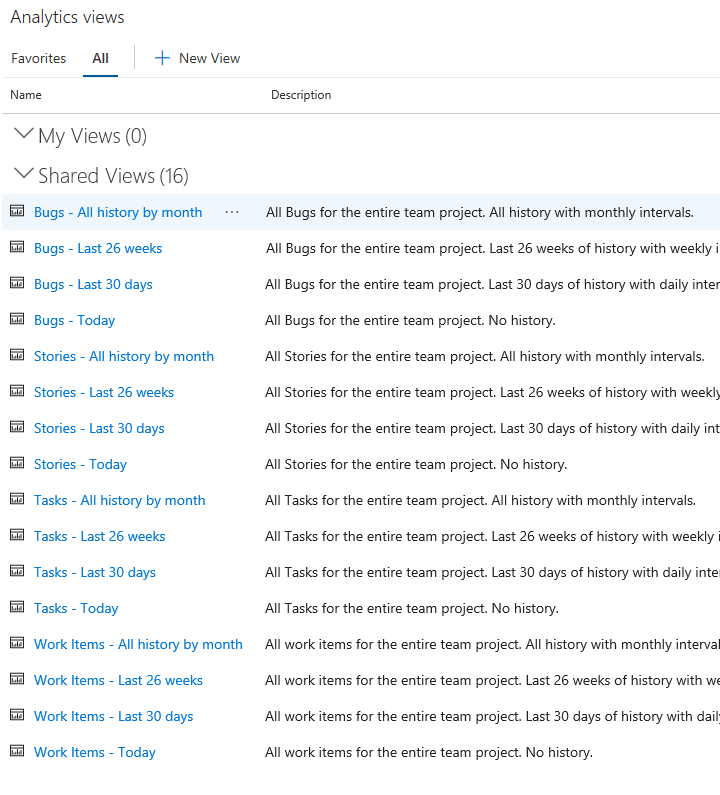
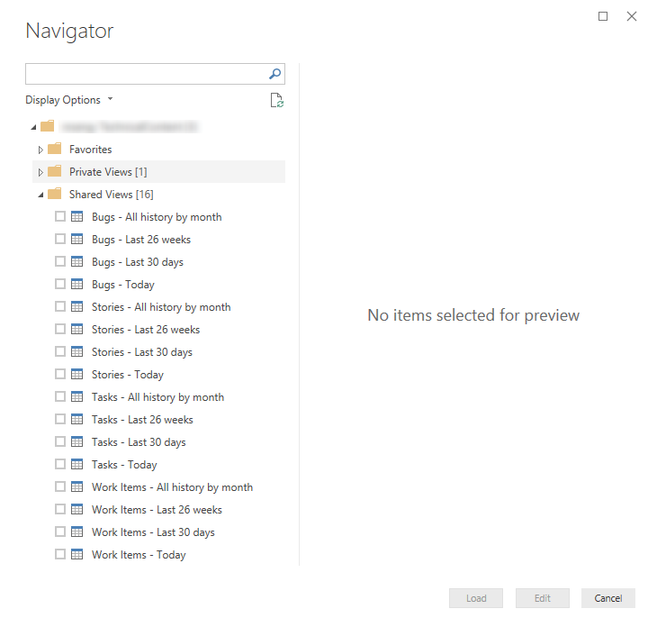
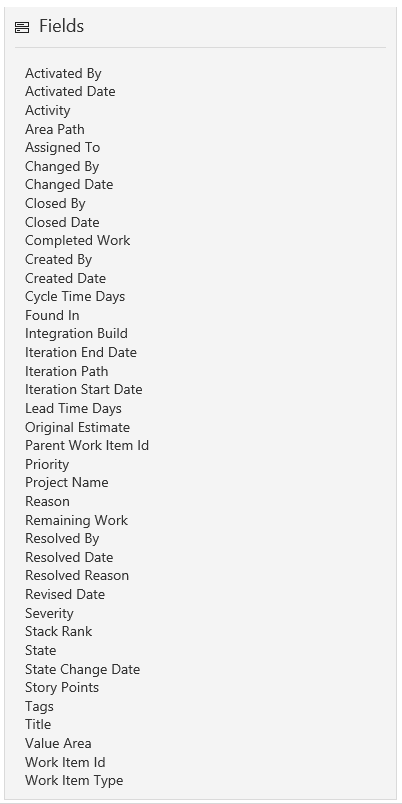

# Default Analytics views

[!INCLUDE [temp](../../_shared/version-azure-devops.md)]

An Analytics view filters Azure DevOps data derived from the Analytics Service. You use views to quickly load the data of interest in Power BI to generate reports. 

A default set of Analytics views are provided, as shown below. 

> [!div class="mx-imgBorder"] 
> 

[!INCLUDE [temp](../_shared/analytics-image-differences.md)] 

These views are immediately available from Power BI, as shown in the Navigator dialog illustrated below, and are a great way to get started.

> [!div class="mx-imgBorder"] 
> 

Each default Analytics view provides a combination of options for work item types and historical data. The following tables describe each set of options. 

**Options for work item types**

> [!div class="mx-tdCol2BreakAll"]
> |Work item type option | Description |
> |------|---------|
> | Bugs | Load current or historical state of Bugs only |
> | Requirement Backlog | Load current or historical state of Stories, Backlog Items or Requirements |
> | Tasks | Load current or historical state of Tasks
> | Work Items | Load current or historical state of all work items  |

**Options for historical data**

> [!div class="mx-tdCol2BreakAll"]
> |Historical option | Description |
> |------|---------|
> | Today | Loads only the most recent revision for each work item |
> | Last 30 days | Loads work item history for the last 30 days, on a daily interval |
> | Last 26 weeks | Loads work item history for the last 26 weeks, on a weekly interval |
> | All history by month | Loads all work item history, on a monthly interval |

## Common reportable fields  
Default views automatically include the most common fields for the included work item types used for reporting. All custom fields are included. 

For example, the following fields are included when filtered for bugs and user stories. You can look up the description of most of these fields from the [Work item field index](../../boards/work-items/guidance/work-item-field.md).  

> [!div class="mx-imgBorder"]
> 

Two fields that are reported on are only available from the Analytics Service data store, Cycle Time Days and Lead Time Days. To learn more about how these days are calculated, see [Cumulative flow, lead time, and cycle time guidance, Lead time versus cycle time](../dashboards/cumulative-flow-cycle-lead-time-guidance.md#lead-time-versus-cycle-time).

## When a default view doesn't meet your needs 

The default Analytics views return all the specified data in a project. They work well for customers with smaller datasets. For larger datasets, the amount of data generated by a default view  may be too large for Power BI to load. 

In these cases, you can [create a custom Analytics view](analytics-views-create.md) to fine-tune the records, fields, and history loaded into Power BI.  

## Related articles

- [Create an Analytics view](analytics-views-create.md) 
- [Manage Analytics views](analytics-views-manage.md) 
- [Data available from the Analytics Service](data-available-in-analytics.md)
- [Dataset design for the Power BI Azure DevOps Connector](../powerbi/data-connector-dataset.md)
- [Grant permissions to access the Analytics service](./analytics-security.md)
