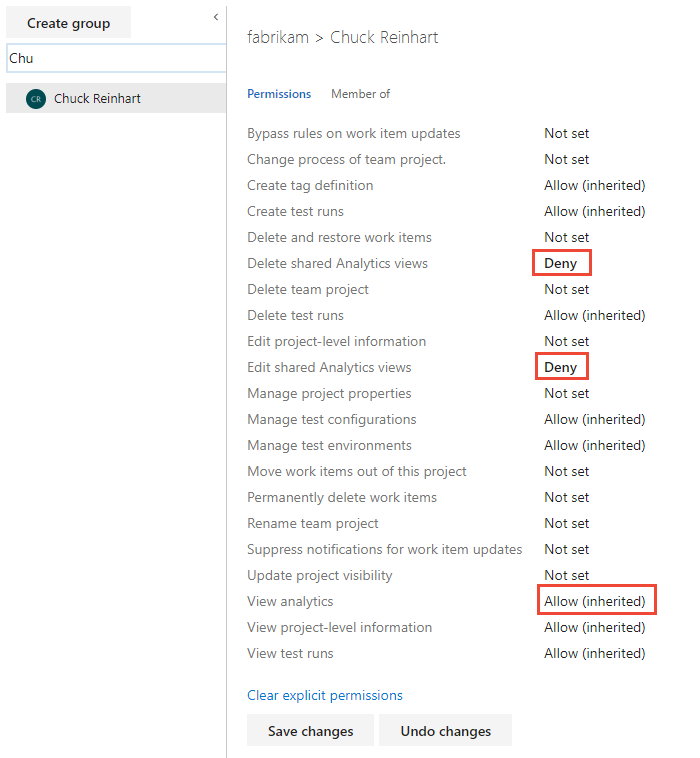

# Set permissions to access the Analytics Service and Analytics views

[!INCLUDE [temp](../../_shared/version-azure-devops.md)]

To use [Power BI for Azure DevOps](index.md) or to exercise an OData query for the Analytics Service, you must be granted the **View analytics** permission. By default, the **View analytics** permission is set for all project valid users. 

To edit an Analytics view or connect to an Analytics view in Power BI, you must have permissions for that view. 

If you are just adding an Analytics widget to a dashboard or viewing an Analytics widget added to a dashboard, then no special permissions are required. 

## Set permissions 

You grant or restrict permissions to a user by setting one or more permissions for the Analytics service to **Allow** or **Deny** through the project **Security** page. By default, all members of the Contributors group are granted access to edit and delete shared Analytics views, and view Analytics service data.  
  
0. Open **Project Settings>Security**. For details, see [Set permissions at the project-level or project collection-level](../../organizations/security/set-project-collection-level-permissions.md). 
  
0. Choose the person or group that you want to modify permissions for and then change their permission assignment. 

	For example, here we set the permissions for Chuck Reinhart, denying him permission to delete or modify shared Analytics views, but allowing him to access the Analytics service data. 

	> [!div class="mx-imgBorder"]  
	>  

	To learn more about working with permissions, see [Security & identity](../../organizations/security/index.md).

> [!NOTE]  
> The Analytics Service does not support security at the area path level. Therefore, if a user has access to a project and can report on that project but they don't have access to work items in specific areas of that project, they can view data through the Analytics Service. Therefore, to protect your data, the best practice is to not allow reporting against the Analytics Service for any user who does not have access to all data within a project.  

[!INCLUDE [temp](_shared/manage-shared-view-permissions.md)]

## Access denied response 

The Analytics Service is designed to provide accurate data, not data trimmed by your security settings.  

For example, take the following scenario:

- Project A has 200 work items  
- Project B has 100 work items  

If a user with access to both projects issues a query that says "give me the sum of all work items in Project A
and Project B" the result will be 300 which is as expected. Now, say that another user who only has access to
Project B makes the same query, you might expect the query to return 100. However, the Analytics Service will not return
a result at all in the latter case. Instead, it will return a "Project access denied" error. It does this because it could not return the entire dataset, so it returns nothing at all.  

This behavior is different from that provided by the current Work Item Query editor, which would return all
the work items in Project B but nothing from Project A without informing you that there is missing data. 

Because of this scenario, the recommended approach for querying the Analytics Service is to always provide
a project level filter instead of using a global query. For information on providing a project level filter, see [WIT analytics](../extend-analytics/wit-analytics.md).

## Related articles 

-  [Set permissions at the project-level or project collection-level](../../organizations/security/set-project-collection-level-permissions.md)
-  [Power BI integration overview](../powerbi/overview.md)
