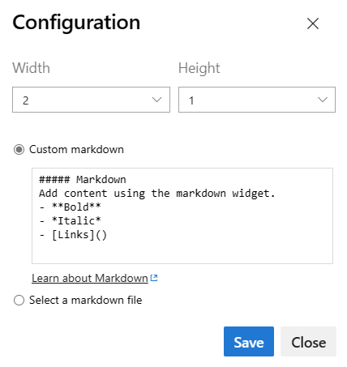

# Add Markdown to a dashboard

[!INCLUDE [version-lt-eq-azure-devops](../../includes/version-lt-eq-azure-devops.md)]

<a id="markdown-widget">  </a> 

The Markdown widget is a versatile tool that allows you to support your team and stakeholders by adding valuable information directly to your dashboard. You can use it to display the following items:

- Team goals
- Links to team backlogs or boards
- Links to metrics
- Links to other items located in a network share, such as a OneNote, SharePoint site, or wiki pages
- Important dates or target deadlines

By using the Markdown widget, you can ensure that essential information is easily accessible and visible to your team and stakeholders.
The following example shows team information and links: 
:::image type="content" source="../../project/wiki/media/markdown-guidance/markdown-widget-configured.png" alt-text="Screenshot of sample Markdown widget.":::

[!INCLUDE [temp](../includes/dashboard-prerequisites.md)]  

## Supported Markdown syntax

The Markdown widget supports CommonMark standard features, such as: 
- Headings 
- Paragraphs and line breaks
- Blockquotes
- Horizontal rule 
- Emphasis (bold, italics, strikethrough)
- Tables
- Lists, both ordered and unordered  
- Links
- Images 
- Character escaping

For more information, see [Syntax guidance for basic Markdown usage](../../project/wiki/markdown-guidance.md).

For performance reasons, the Markdown widget doesn't add support for many extended features, many of which are supported in the wiki. Extended capabilities would impede widget load time. For example, the following extended Markdown features aren't supported in the Markdown widget:
- HTML syntax embedded
- Code highlighting (wiki/others support language-syntax aware color coding, CommonMark just renders code as plain preformatted text)
- Checklists
- Emoji characters  
- Attachments
- Math formulas

## Add the Markdown widget

Do the following steps to add the Markdown widget. To add a dashboard, see [Add, rename, and delete dashboards](dashboards.md).  

1. Sign in to your project (```https://dev.azure.com/{Your_Organization/Your_Project}```).
2. Select **Dashboards**.
3. Select :::image type="icon" source="media/icons/edit-icon.png" border="false"::: **Edit**. The widget catalog automatically opens.  
4. Add or drag the Markdown widget onto the dashboard where you want it located.  

    

5. Select **Done Editing** to exit dashboard editing. This action dismisses the widget catalog. You can then configure the Markdown widget as needed.
6. Select :::image type="icon" source="../../media/icons/more-actions.png" border="false"::: more actions >   **Configure**.

   :::image type="content" source="media/widget-more-actions-configure.png" alt-text="Screenshot shows three dots for more actions, and the highlighted Configure button.":::

7. (Optional) Adjust the widget size as needed to fit the contents of the Markdown. The largest size is 10 tiles wide by 10 tiles tall. You can always adjust the size later. 
8. Enter text and Markdown syntax into the configuration dialog. For supported syntax, see [Syntax guidance for Markdown files, widgets, wikis, and pull request comments](../../project/wiki/markdown-guidance.md).

   

   > [!NOTE]  
   > - Links to documents on file shares using `file://` aren't supported. This restriction is implemented for security purposes. 
   > - To link to a wiki page, use the following syntax:<br/>
   > `/ProjectName/_wiki/wikis/WikiRepositoryName?pagePath=/FileName`
   > - To link to a repository file, page, or image within the project, choose **Select a markdown file**, choose your **Repository**, **Branch**, and **Path** from the dropdown menus.

9. **Save** your changes.

## Related articles
- [Add and manage dashboards](dashboards.md)
- [Add a widget to a dashboard](add-widget-to-dashboard.md)
- [Get syntax guidance for Markdown files, widgets, wikis, and pull request comments](../../project/wiki/markdown-guidance.md)
- [Browse marketplace widgets](https://marketplace.visualstudio.com/search?term=widget&target=VSTS&category=All%20categories&sortBy=Relevance)


