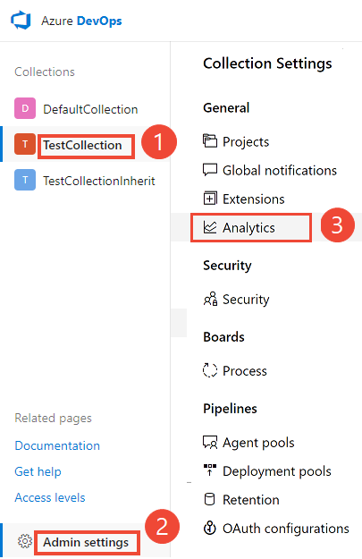
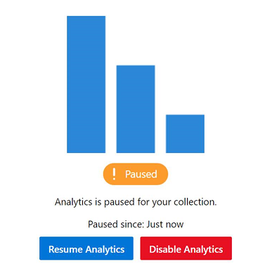
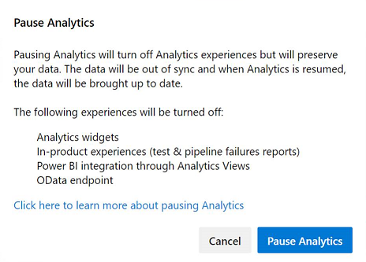
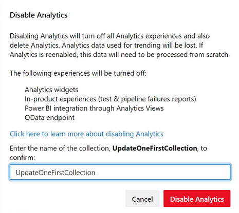
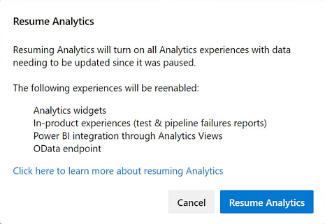
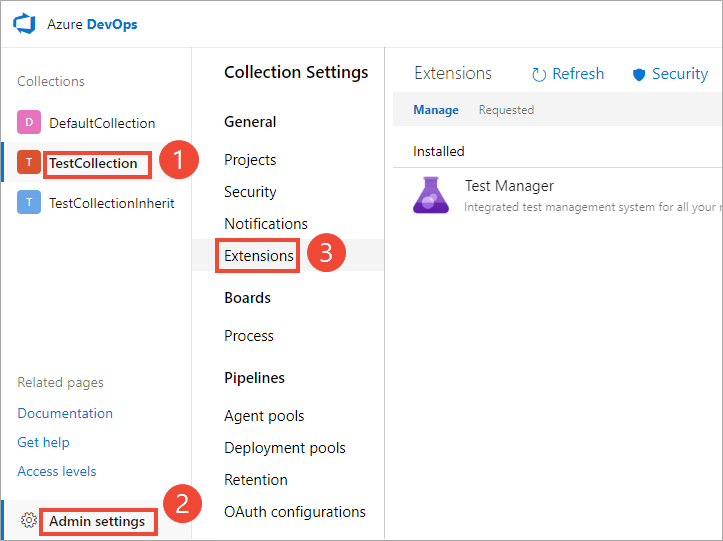
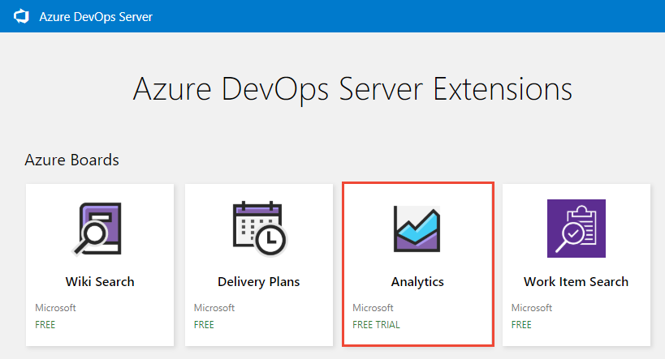
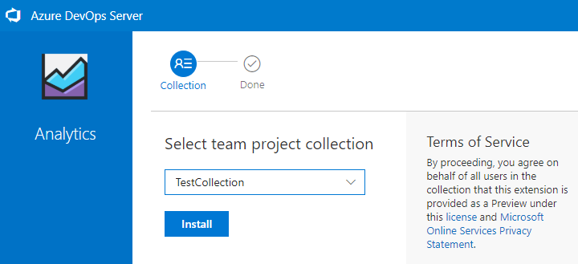
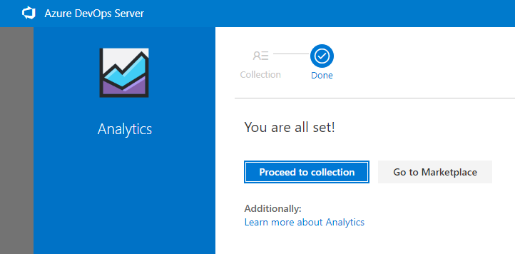
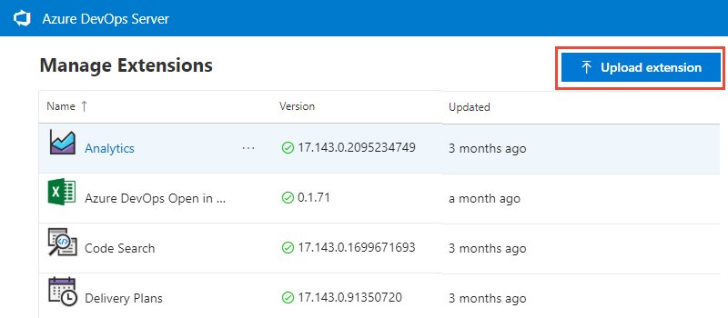

# Install or enable the Analytics service

[!INCLUDE [version-gt-eq-2019-lt-azure-devops](../../includes/version-gt-eq-2019-lt-azure-devops.md)]

::: moniker range=">= azure-devops-2020" 

For Azure DevOps Server 2020 and later versions, the Analytics service is generally available. It's automatically enabled for all new project collections added to your server. For project collections upgraded from a previous version, you may need to [manually enable it](#enable-analytics). You enable Analytics for each project collection for which you want to generate Analytics reports. 

::: moniker-end

::: moniker range="azure-devops-2019" 

Analytics is in Preview for Azure DevOps Server 2019. For Azure DevOps Server 2019, you [install the Analytics extension](#install-analytics) from your local marketplace for each project collection you want to use Analytics. For Azure DevOps Server 2019.1, you [enable Analytics](#enable-analytics) for each project collection you want to use Analytics. Analytics supports 

::: moniker-end

> [!NOTE]
> The Analytics Marketplace extension and Analytics are **not supported** for TFS 2018 or earlier versions.

Analytics supports access to Analytics widgets for all projects defined in the project collection. To learn more, see [What is Analytics?](../powerbi/what-is-analytics.md) and [Widgets based on Analytics](analytics-widgets.md). Data available in Analytics is summarized in [Data available from Analytics](../powerbi/data-available-in-analytics.md).

## Prerequisites

::: moniker range="azure-devops-2019"
**For Azure DevOps Server 2019.1:**
::: moniker-end

- You must have installed and configured your Azure DevOps Server. For details, see [Install and configure Azure DevOps on-premises](/azure/devops/server/install/get-started).
- You must have added at least one project collection. To add project collections, see [Manage project collections](/azure/devops/server/admin/manage-project-collections). 
- To enable, pause, disable, or resume Analytics, you must be a member of the **[Project Collection Administrators](../../organizations/security/change-organization-collection-level-permissions.md)**[ group](../../organizations/security/change-organization-collection-level-permissions.md) group with **[Edit collection-level information](../../organizations/security/permissions.md#collection)**[ permissions](../../organizations/security/permissions.md#collection).  

::: moniker range="azure-devops-2019"
**For Azure DevOps Server 2019:**

- You must have installed and configured your Azure DevOps Server. For details, see [Install and configure Azure DevOps on-premises](/azure/devops/server/install/get-started).
- You must have added at least one project collection. To add project collections, see [Manage project collections](/azure/devops/server/admin/manage-project-collections). 
- To install an extension, you must be a member of the **[Project Collection Administrators](../../organizations/security/change-organization-collection-level-permissions.md)**[ group](../../organizations/security/change-organization-collection-level-permissions.md) group with **[Edit collection-level information](../../organizations/security/permissions.md#collection)**[ permissions](../../organizations/security/permissions.md#collection) If you don't have permissions, you can [request extensions](../../marketplace/request-extensions.md) instead.
- To upload an extension, you must be a member of the [Azure DevOps Server Administrators](/azure/devops/server/admin/add-administrator) group with **[Edit instance-level information](../../organizations/security/permissions.md#server)**[ permissions](../../organizations/security/permissions.md#server).
   ::: moniker-end

## Enable Analytics

::: moniker range="azure-devops-2019" 

If you've upgraded to Azure DevOps Server 2019.1, you can enable Analytics for a project collection with the following steps. Otherwise, for Azure DevOps Server 2019, see [Install Analytics](#install-analytics). 

::: moniker-end

> [!NOTE]
> Analytics is automatically enabled for all newly created project collections.

1. From a web browser, select (1) the project collection, (2) **Collection Settings** or **Admin settings**, and then (3) **Analytics**.  

   > [!div class="mx-imgBorder"]  
   >  
1. Select **Enable Analytics**.  

   > [!div class="mx-imgBorder"]  
   >  

    Once enabled, Analytics staging jobs begin to populate the Analytics data tables. This process could take some time depending on the size of your collection. To learn more about the data tables, see [Analytics data model](../extend-analytics/data-model-analytics-service.md).

## Pause or disable Analytics

::: moniker range="azure-devops-2019"
If you've upgraded to Azure DevOps Server 2019.1, you can pause or disable Analytics for a project collection with the following steps. Otherwise, for Azure DevOps Server 2019, the equivalent actions are to [Disable or uninstall the Analytics extension](#disable-analytics-extension).
::: moniker-end

You can only pause or disable Analytics that has been previously enabled.  

1. From the **Analytics** settings page, select **Pause Analytics** or **Disable Analytics**. 

   > [!div class="mx-imgBorder"]  
   >  
1. Confirm that you want to pause or disable the service. 

   > [!div class="mx-imgBorder"]  
   >    

## Resume Analytics

::: moniker range="azure-devops-2019"
For Azure DevOps Server 2019.1, you can resume Analytics after you've paused it for a project collection. Resuming the service will re-enable staging jobs, which will update the data tables and make them current, updating since the time it was paused.
::: moniker-end

1. From the **Analytics** settings page, select **Resume Analytics**. 

   > [!div class="mx-imgBorder"]  
   >  
1. Confirm that you want to resume the service. 

   > [!div class="mx-imgBorder"]  
   >  

    Once enabled, Analytics staging jobs begin to populate the Analytics data tables. This process could take some time depending on the size of your collection. 

## What happens if I pause or disable Analytics?

Pausing Analytics or disabling the Analytics extension (2019), disables the following features:

- [Analytics widgets](analytics-widgets.md)
- [Analytics in-context reports, such as pipeline and test reports](overview.md)
- [Power BI integration using Analytics views](../powerbi/what-are-analytics-views.md)
- [OData endpoint queries](../extend-analytics/quick-ref.md) 

Pausing Analytics preserves your data but stops staging jobs from updating your data. You can resume the service later and your data will then be updated. 

Disabling Analytics or removing the Analytics extension (2019), turns off all Analytics staging jobs and deletes the Analytics data stored in the Analytics tables. All Analytics data that captures historical trends is lost. It doesn't delete any other data stored in your collection. You can't undo this action. Once historical data and trending data is deleted, you can't restore it. Re-enabling Analytics won't restore the historical data. 

With Analytics disabled or removed, the following actions occur: 

- No staging jobs are run, and the Analytics tables won't have updated information.  
- Table data is deleted, and if Analytics is re-enabled, all data will have to be repopulated from scratch.

::: moniker range="azure-devops-2019" 

> [!NOTE]
> Disabling Analytics in Azure DevOps Server 2019.1 is the same as uninstalling the Analytics extension for Azure DevOps Server 2019.

::: moniker-end

To learn more about the data tables, see [Analytics data model](../extend-analytics/data-model-analytics-service.md).

::: moniker range="azure-devops-2019" 

## Install the Analytics extension

If you haven't upgraded to Azure DevOps Server 2019.1, you can install the Analytics extension to gain access to Analytics widgets and reports for your project collection. The Analytics extension is shipped within the on-premises installer. Installing the extension simply enables the functionality. There isn't any need to download extension files manually to install.  

> [!TIP]
> The Analytics extension appears in the local gallery for Azure DevOps Server so that there isn't any need to download it from the Azure DevOps Marketplace.

1. From a web browser, select (1) the project collection, (2) **Admin settings**, and then (3) **Extensions**. 

     
1. Select **Browse local extensions**.  

   > [!div class="mx-imgBorder"]  
   >    

   > [!NOTE]
   > Installing the extension from the local marketplace is identical to installing from the hosted marketplace. The only difference is the hosted marketplace shows extension ratings and user comments.
1. The local Marketplace opens in a new browser tab. Select the Analytics extension card.  

   > [!div class="mx-imgBorder"]  
   >    

1. Select **Get it free**. 

   > [!div class="mx-imgBorder"]  
   >    

1. Select the project collection and then select **Install**.  

   > [!div class="mx-imgBorder"]  
   >  

1. Upon completion of install, you'll see an image similar to the following. Select **Proceed to collection** to return to the web portal for your collection.  

   > [!div class="mx-imgBorder"]  
   >    

    Optionally, if you want to install the Analytics extension on other project collections, select the browser back button. 

## Disable or uninstall the Analytics extension

If you choose to disable the Analytics extension, it will stop any jobs from running. Analytics data will be out of sync and associated features won't be available. However, no data is deleted.  Uninstalling the Analytics extension deletes the data from the Analytics database tables. Upon reinstall of the extension, the data is repopulated from scratch.

1. Open the extensions menu and select **Manage Extensions**.

   
1. In the **Manage** tab, open the shortcut menu for the extension.
1. Select **Disable** or **Uninstall** as required.

## Restore the Analytics extension if removed from the deployment

If you remove the Analytics extension from your deployment, you can install the extension from the online marketplace to restore it. You may be unable to use the online marketplace because of your server setup. For example, your firewall might block some outgoing connections. Even if that's the case, you can restore it to the local marketplace using the following steps.

1. Open **Collection settings** following the instructions provided in the section [Install the Analytics extension](#install-the-analytics-extension). 

    Select **Extensions**, and then **Browse local extensions**.
1. Scroll to the bottom of the page, and select **Manage Extensions**.

   > [!div class="mx-imgBorder"]  
   >    

1. Select **Upload extension** and then select **click to upload**. Browse to the folder containing the Microsoft.TeamFoundation.Extension.Analytics.vsix file.  

   > [!div class="mx-imgBorder"]  
   >    

    The .vsix file can be found in your application-tier folder installation in the following path.

    `C:\Program Files\Azure DevOps Server 2019\Tools\Deploy\TfsServicingFiles\Extensions\Microsoft.TeamFoundation.Extension.Analytics.vsix`

    Uploading the extension restores it to the local marketplace. From there, you can install it to a collection.

## How to determine if your server is disconnected?

If your server is disconnected from the Internet, you must install Analytics from the local marketplace. 

You can determine if your Azure DevOps Server is in a disconnected state. Check to see if the connected icon and server name appear at the top when browsing the hosted marketplace.

> [!div class="mx-imgBorder"]  
>    

When you navigate to the Marketplace from your on-premises server, an error doesn't display if you're not connected. It simply switches to the cloud service context.  

## Known issue

If you use a public URL to install the extension, for example `https://OnPrem.MyCompany.com`, you may get a callback error, such as a TLS/SSL error. 

To resolve this issue, you can install the extension from a machine that hosts the application tier and point to the local machine URL, for example `https://myMachineName`.

::: moniker-end

## Related articles

- [What is Analytics](../powerbi/what-is-analytics.md)
- [Data available from Analytics](../powerbi/data-available-in-analytics.md)
- [Grant permissions to access Analytics](../powerbi/analytics-security.md)
- [The Reporting Roadmap](../powerbi/reporting-roadmap.md) 
- [Extension FAQs](../../marketplace/faq-extensions.yml) 

<!--- QUESTION: when would an admin want to pause the service? when they are performing maintenance or moving a server? --> 