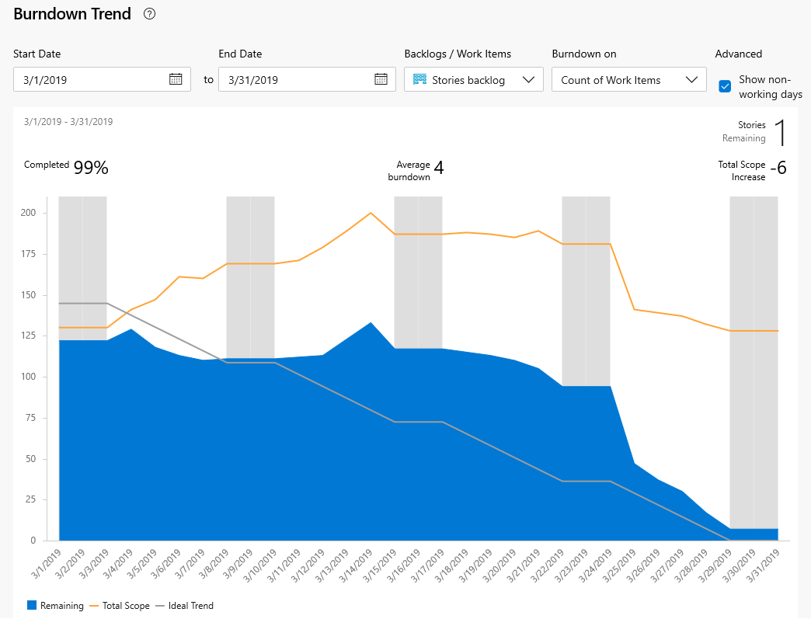
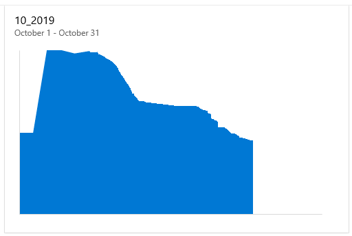
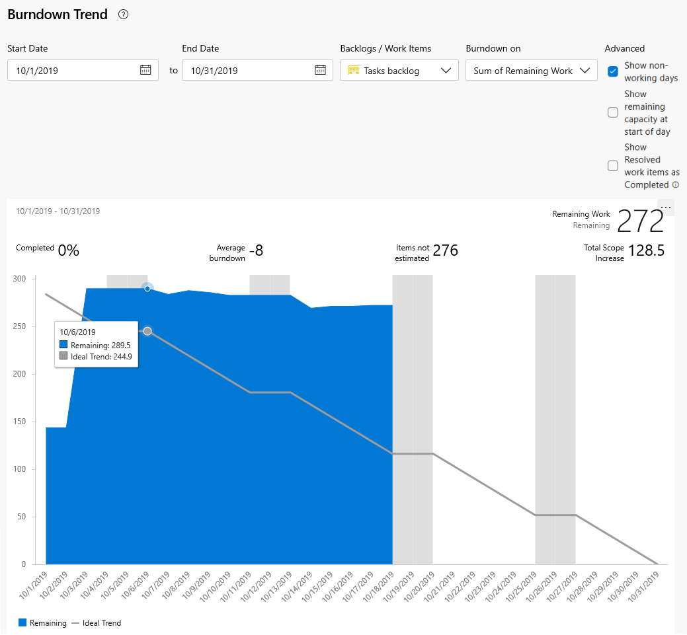
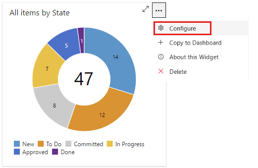
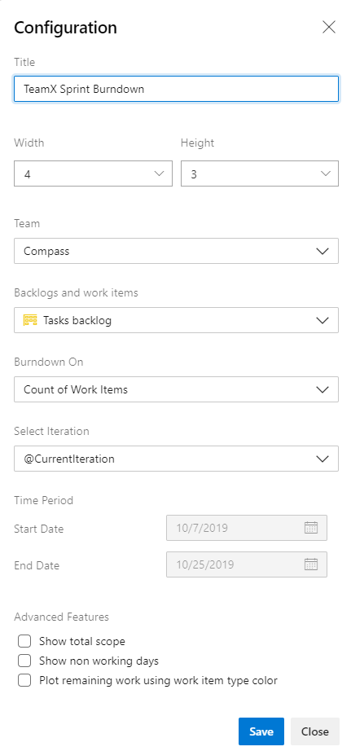
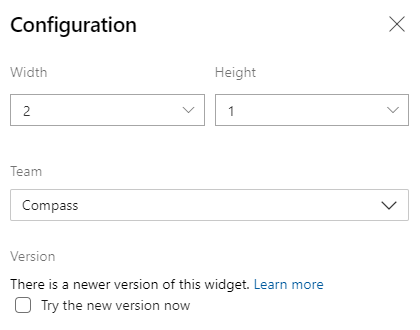
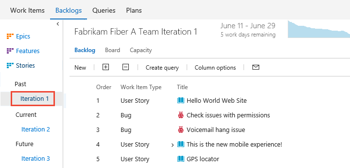
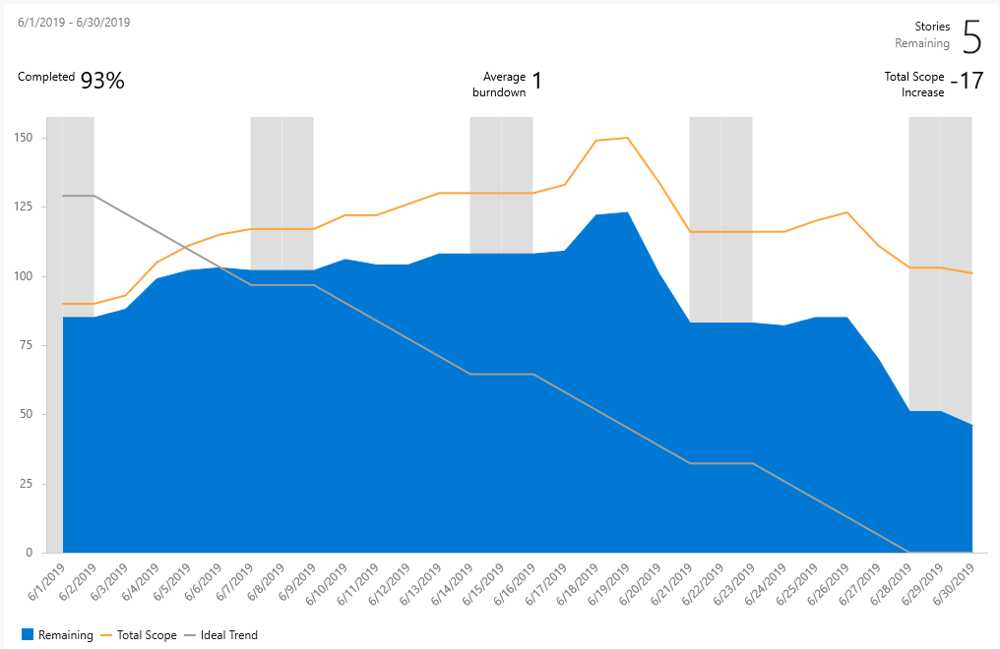
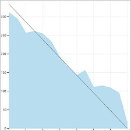

# Configure and monitor sprint burndown 

[!INCLUDE [temp](../includes/version-azure-devops-all.md)]

::: moniker range=">= azure-devops-2020"

Throughout your sprint, you can monitor the sprint burndown report to determine if your team is on track to complete its [sprint plan](../../boards/sprints/assign-work-sprint.md). There are two sprint accessible burndown charts: the in-context Burndown Trend report viewable from a team sprint backlog and the Sprint Burndown widget you can add to a dashboard. 

Both the report and the widget derive data from [Analytics](../powerbi/what-is-analytics.md). They support monitoring burndown based on a count of work items or a sum of Story Points/Size/Effort, Remaining Work, or other numeric field. 

You can add either the report or widget to a dashboard. Also, you can monitor progress using the [Analytics-based burndown or burnup widgets](configure-burndown-burnup-widgets.md). They provide more configuration options. 

::: moniker-end

::: moniker range="azure-devops-2019"

Throughout your sprint, you can monitor the sprint burndown report to determine if your team is on track to complete its [sprint plan](../../boards/sprints/assign-work-sprint.md). The in-context sprint burndown report supports tracking burndown based on Remaining Work assigned to sprint tasks. If you don't track tasks or Remaining Work, then you can use the [Analytics-based burndown and burnup widgets](configure-burndown-burnup-widgets.md). They provide more configuration options. 

::: moniker-end

::: moniker range=">= tfs-2015 < azure-devops-2019"

Throughout your sprint, you can monitor the sprint burndown chart to determine if your team is on track to complete its [sprint plan](../../boards/sprints/assign-work-sprint.md). Both the in-context sprint burndown report and the Sprint Burndown widget support tracking burndown based on Remaining Work assigned to sprint tasks. 

::: moniker-end

::: moniker range="tfs-2013"

Throughout your sprint, you can monitor the sprint burndown chart to determine if your team is on track to complete its [sprint plan](../../boards/sprints/assign-work-sprint.md). The in-context sprint burndown report supports tracking burndown based on Remaining Work assigned to sprint tasks. 

::: moniker-end

::: moniker range="azure-devops-2019"

> [!NOTE]  
> You can't add an in-context report to a dashboard. However, you can add the Sprint burndown widget or the [Analytics-based burndown or burnup widgets](configure-burndown-burnup-widgets.md) to a dashboard. 

::: moniker-end

::: moniker range=">= tfs-2015 <= tfs-2018"

> [!NOTE]  
> You can't add an in-context report to a dashboard. However, you can add the Sprint burndown widget to a dashboard. 

::: moniker-end

Use this article to learn about: 

::: moniker range=">= azure-devops-2020"
> [!div class="checklist"]  
> * Metrics tracked in the sprint burndown report and widget  
> * Team activities required to track tasks and Remaining Work      
> * How to set interactive controls to personalize your view of the sprint burndown report 
> * How to add the in-context Burndown Trend report to a dashboard  
> * How to configure the Sprint Burndown widgets  
> * How to view current and past sprint burndowns 

::: moniker-end

::: moniker range="<= azure-devops-2019"

> [!div class="checklist"]  
> * Metrics tracked in the sprint burndown report and widget  
> * Team activities required to track tasks and Remaining Work       
> * How to configure the Sprint Burndown widget 
> * How to view current and past sprint burndowns 

::: moniker-end

> [!NOTE]  
> Sprint burndown reports are derived from data tracked by a team during a sprint or iteration. To learn more, see [About teams and Agile tools](../../organizations/settings/about-teams-and-settings.md). 

## The in-context Burndown Trend report

::: moniker range=">= azure-devops-2020"

The Burndown Trend report is based on either a count of tasks or remaining work estimates, or other numeric fields that you define and update throughout the sprint cycle. For details, see [Sprint planning](../../boards/sprints/assign-work-sprint.md). To open this report, jump to the section [Open a Sprint backlog](#open-chart).   

A healthy sprint burndown report looks something like the image shown below. Typically, there will be a stair-case burndown as individual team members may only update their work items once a week or every few days. 
The **Total Scope** line indicates the number of work items added after the sprint starts. The **Ideal Trend** line is calculated based on the number of work items, days in the sprint, and number of working days.  

The blue area indicates the number of work items active or in progress each day of the sprint. As shown in this example, one work item is still active at the end of the sprint.  

[!INCLUDE [temp](../../includes/note-working-days-off.md)]

> [!div class="mx-imgBorder"]  
>  

> [!NOTE]  
> The **Total Scope** line reflects the number of work items added to the sprint. If the team's default iteration is the **\@CurrentIteration**, then new work items are added to the current iteration. The scope decreases as the Iteration Path is modified to another sprint, or work items are completed.  

::: moniker-end
 

::: moniker range="< azure-devops-2020"

The in-context sprint burndown report is based on the tasks and Remaining Work estimates you define and update throughout the sprint cycle. For details, see [Sprint planning](../../boards/sprints/assign-work-sprint.md) and [taskboard](../../boards/sprints/task-board.md). To open the sprint burndown chart, jump to the section [Open sprint burndown chart](#open-chart).   

<table>
<tr valign="top">
<td width="35%">

A healthy sprint burndown chart will look something like this. The <em>Ideal Trend</em> line connects the two points: 

-   <strong>(1)</strong> Team&#39;s total capacity at the start of the sprint -   <strong>(2)</strong> 0 Remaining Work at the end of the sprint. 

The slope represents the rate at which the team needs to burn down work to finish the sprint on time. 

The actual graph, the blue area, represents the total amount of planned sprint work and how it changes throughout the course of the sprint. The blue area corresponds to the sum of all remaining work set for all sprint tasks, and possibly bugs, that have the current sprint as their iteration path.  

</td>
<td>

</td>
</tr>
</table>

::: moniker-end

::: moniker range=">= tfs-2015"

## The Sprint Burndown widget

::: moniker-end

::: moniker range=">= azure-devops-2020"

In the widget catalog, you'll find two versions of the Sprint Burndown widget:  the Analytics-based **Sprint Burndown** and **Sprint Burndown (Legacy)** which is built from the work tracking data store.  

### Sprint Burndown widget

The Analytics-based Sprint Burndown widget provides an easy way to monitor progress for a team by showing work remaining for a given sprint. Work remaining is the vertical axis and time is the horizontal axis. You can define remaining work based on Stories or Tasks, and by counting the work items or summing a field. 

> [!div class="mx-imgBorder"] 
> 

The charts provide useful metrics to help you answer the question: *Are we on track to complete this set of work by the end a sprint?*
* Percentage work complete
* Number of work items not estimated (if using a field other than Remaining Work)
* Average burndown
* Total scope increase

### Sprint Burndown (Legacy) widget

The **Sprint Burndown (Legacy)** widget adds a chart based on Remaining Work defined for tasks in a team's current sprint. Select this version when you don't have access to Analytics. Configuration options include team selection, and widget size. 

> [!div class="mx-imgBorder"] 
> 

If your dashboard already has a legacy version available, you can easily upgrade the widget by editing the widget's configuration, and checking **Try the new version now**. You can always go back to the legacy version by unchecking the box.

::: moniker-end

::: moniker range=">= tfs-2015 < azure-devops-2020"

The **Sprint Burndown** widget adds a chart based on Remaining Work defined for tasks in the team's current sprint. There are no configuration options for this widget. 

> [!div class="mx-imgBorder"] 
>   

::: moniker-end

## Prerequisites  

[!INCLUDE [temp](../includes/analytics-widgets-prerequisites.md)]

::: moniker range=">= tfs-2015 < azure-devops-2019"

- You must be a member of a project. If you don't have a project yet, [create one](../../organizations/projects/create-project.md). 
- If you haven't been added as a project member, [get added now](../../organizations/security/add-users-team-project.md).  
- To add a widget to a team dashboard, you need to be a member of the team. You must have **Basic** access or greater, have [dashboard permissions](./dashboard-permissions.md), or be a [team admin](../../organizations/settings/add-team-administrator.md) or project admin.

::: moniker-end

::: moniker range="tfs-2013"

- You must be a member of a project. If you don't have a project yet, [create one](../../organizations/projects/create-project.md). 
- If you haven't been added as a project member, [get added now](../../organizations/security/add-users-team-project.md).  

::: moniker-end

## Team activities to track tasks and Remaining Work  

::: moniker range=">= azure-devops-2020"

To monitor sprint burndown, your team must [schedule sprints](../../boards/sprints/define-sprints.md) and [assign work to those sprints](../../boards/sprints/assign-work-sprint.md).

If you want to monitor sprint burndown based on tasks and Remaining Work, your team must carry out these extra actions.  
::: moniker-end

::: moniker range="<= azure-devops-2019"
To monitor sprint burndown, your team must [schedule sprints](../../boards/sprints/define-sprints.md) and [assign work to those sprints](../../boards/sprints/assign-work-sprint.md). For sprint burndown charts to show meaningful data, your team must carry out these extra actions.  
::: moniker-end

### Required activities: 

*   [Define and estimate tasks](../../boards/sprints/add-tasks.md#define-tasks) for each product backlog item you're working on in the sprint. If you work from your team's backlog and taskboard, the items you create will automatically be assigned to the current sprint (Iteration) and to your team's default Area Path.  
*   [Update Remaining Work for each sprint task](../../boards/sprints/task-board.md#update-tasks) as work progresses.  

### Recommended activities:

*   Define tasks that take a day or less to complete to lessen the effect of poor estimates.  
*   Don't divide tasks into subtasks. If you divide a task into subtasks, specify hours only for the subtasks. These hours are rolled up as summary values for the parent task.   
*   Update Remaining Work daily or several times within a week to support monitoring and achieve a smoother burndown chart.  
*   At the end of the sprint, update the task status of completed tasks and determine how to handle incomplete tasks.  

### Empty sprint burndown chart 

If your sprint burndown chart appears empty, check these points:
- Have you assigned tasks to the sprint associated with the chart?
- Have you assigned Remaining Work to the tasks assigned to the sprint? 
- Are the parent work items of the tasks assigned to the same sprint? If not, the tasks may appear in another sprint associated with the parent item. 

## Open a Sprint backlog

You view the in-context sprint burndown report from a team's Sprint backlog. 

::: moniker range=">= azure-devops-2020"

1. From your web portal, open your team's sprint backlog. (1) Check that you've selected the right project, (2) select **Boards>Sprints**, (3) select the correct team from the team selector menu, and lastly (4), select **Backlog**. 

    > [!div class="mx-imgBorder"]  
    > 

    To select another team, open the selector and select a different team or select the **View Sprint directory** option. Or, you can enter a keyword in the search box to filter the list of team backlogs for the project.

    > [!div class="mx-imgBorder"]  
    >  

2. To select a different sprint than the one shown, open the sprint selector and select the sprint you want. 

    > [!div class="mx-imgBorder"]  
    > 

    The system lists only those sprints that have been selected for the current team focus. If you don't see the sprints you want listed, then select **New Sprint** from the menu, and then select **Select existing iteration**. For details, see [Define iteration paths](../../organizations/settings/set-iteration-paths-sprints.md). 

::: moniker-end

::: moniker range="azure-devops-2019"

1. From your web browser, open your team's sprint backlog. (1) Check that you've selected the right project, (2) select **Boards>Sprints**, (3) select the correct team from the team selector menu, and lastly (4), select **Backlog**. 

    

    To select another team, open the selector and select a different team or select the :::image type="icon" source="../../media/icons/home-icon.png" border="false"::: **Browse all sprints** option. Or, you can enter a keyword in the search box to filter the list of team backlogs for the project.

    > [!div class="mx-imgBorder"]  
    >  

2. To select a different sprint than the one shown, open the sprint selector and select the sprint you want. 

    > [!div class="mx-imgBorder"]  
    > 

    The system lists only those sprints that have been selected for the current team focus. If you don't see the sprints you want listed, then select **New Sprint** from the menu, and then select **Select existing iteration**. For details, see [Define iteration paths](../../organizations/settings/set-iteration-paths-sprints.md). 

::: moniker-end

::: moniker range="<= tfs-2018"

1. From your web browser, open your team's sprint backlog. (1) Select the team from the project/team selector, select (2) **Work**, (3) **Backlogs**, and then (4) the product backlog, which is **Backlog items** (for Scrum), **Stories** (for Agile), or **Requirements** (for CMMI). 

    > [!div class="mx-imgBorder"]
    >  

    To select another team, open the project/team selector and select a different team or select the **Browse** option. 

    > [!div class="mx-imgBorder"]  
    >  

    The set of sprints selected for your team appears in the left pane. If you don't see any sprints listed, you can add sprints or select existing sprints for your team's use. To learn how, see [Define sprints](../../boards/sprints/define-sprints.md). 

1. Select the sprint whose burndown chart you want to view. 

    > [!div class="mx-imgBorder"]  
    > 

    The system lists only those sprints that have been selected for the current team focus. If you don't see the sprints you want listed, then see [Define iteration paths](../../organizations/settings/set-iteration-paths-sprints.md). 

::: moniker-end

<a id="view-context-report" />

## View the in-context Burndown Trend report   

::: moniker range=">= azure-devops-2020"

1. To open the Sprint burndown report, select **Analytics**. 

	> [!div class="mx-imgBorder"]  
	> 

1. Use the interactive controls to select from the following options:  

   1. The **Start Date** and **End Date** of the sprint. These dates will default to the team's current iteration sprint dates.   

   1. The **Backlogs/Work Items** to burn down on, either the product backlog&mdash;Stories, Issues, Product Backlog Items, or Requirements&mdash;or Tasks backlog to use. Your selection impacts the options available for the **Burndown on** menu.  

   1. The **Burndown on** field to use to calculate burndown, either a Count of Work Items or a sum of a field, such as Story Points, Effort, or Size.  

   1. Check or uncheck **Show non-working days**. Non-working days appear as gray bars in the background when enabled. Default non-working days are set for a team and for a team's sprint through the capacity page. See [Set working days](../../organizations/settings/set-working-days.md) and [Set sprint capacity](../../boards/sprints/set-capacity.md).  

      Select **Reset** to reset the controls to the default options. By default, the dates are set to the selected sprint. Changes to the start and end dates don't change any sprint date definitions. 

1. If you don't track Remaining Work in tasks, you can view burndown based on a count of work items/tasks. Hover over any point on the chart to show a summary of the data for a specific day.

### [Sum of Remaining Work](#tab/remaining-work)

When you choose to view the **Tasks backlog** and **Sum of Remaining Work**, the blue area shows the sum of Remaining Work per day for those tasks that are still active or in progress. As the Remaining Work is updated, the chart indicates the rate of burndown. The **Scope** trend line indicates the addition of Remaining Work after the start of the sprint. The **Ideal** trend line indicates the ideal burndown rate for the sprint. **Capacity** lines are only shown when the team has configured capacity.  

> [!div class="mx-imgBorder"]  
> 

### [Count of Work Items](#tab/work-items)

When you choose to view the **Count of Work Items**, the blue area shows the count of work items&mdash;could be stories/backlog items/requirements or tasks depending on the backlog selected&mdash;which are still active or in progress. The **Scope** trend line indicates when new work items are added after the start of the sprint. The **Ideal** trend line indicates the ideal burndown rate for the sprint. 

> [!div class="mx-imgBorder"]  
> 

### [Sum of Story Points](#tab/story-points)

When you choose to view the **Stories backlog** and **Sum of Story Points**, the blue area shows the sum of Story Points for all User Stories that are still active or in progress. The **Scope** trend line indicates when Story Points are added after the start of the sprint. The **Ideal** trend line indicates the ideal burndown rate for the sprint.   

> [!div class="mx-imgBorder"]  
> 

* * *

> [!NOTE]  
> The options for the sum fields depend on the numeric fields defined for task and requirement category work item types. The most common fields used to show the burndown trend are: 
> - Count of work items  
> - Sum of [Story Points, Effort, or Size](../../boards/queries/query-numeric.md#fields) 
> - Sum of [Remaining Work](../../boards/queries/query-numeric.md#fields). 

The selections you make are only set for you, and persist across sessions until you change them. 

::: moniker-end

::: moniker range="<= azure-devops-2019"

Select the chart to display it in a larger view. 

::: moniker-end

::: moniker range="azure-devops-2019"
> [!div class="mx-imgBorder"]  
> 

::: moniker-end

::: moniker range=">= tfs-2017 <= tfs-2018"
> [!div class="mx-imgBorder"]  
> 
::: moniker-end

::: moniker range="<= tfs-2015"
> [!div class="mx-imgBorder"]  
> 
::: moniker-end

::: moniker range="<= azure-devops-2019"

> [!div class="mx-imgBorder"]  
> 

::: moniker-end

::: moniker range=">= azure-devops-2020"

## Add the report to a dashboard

1. To add the report to a dashboard, select the :::image type="icon" source="../../media/icons/actions-icon.png" border="false"::: actions icon and select **Copy to Dashboard**.

	> [!div class="mx-imgBorder"]  
	>  

1. Select the dashboard and select **OK**.  

::: moniker-end

::: moniker range=">= tfs-2015"

## Add the Sprint Burndown widget to a dashboard  

::: moniker-end

::: moniker range=">= azure-devops-2020"

You can add the Sprint Burndown widget to a dashboard and select the team whose progress you want to monitor. You configure these widgets for one or more teams. 

1. If you haven't yet [added the Sprint Burndown widget to your dashboard](add-widget-to-dashboard.md), do that now. 

	You can filter the **Add** widget dialog with "sprint burndown" to quickly locate the two widgets available to you. 

	> [!div class="mx-imgBorder"]  
	>   
 
1. To configure the widget, select the :::image type="icon" source="../../media/icons/actions-icon.png" border="false"::: actions icon and select the **Configure** option. 

	> [!div class="mx-imgBorder"]  
	>  
::: moniker-end

::: moniker range="azure-devops-2019"

1. Select :::image type="icon" source="media/icons/edit-icon.png" border="false"::: **Edit** to add the Sprint burndown widget to your team dashboard.

	The widget catalog automatically opens. Drag the Sprint Burndown widget onto the dashboard. 

1. When you're finished with your additions, select  **Done Editing**. 

	The sprint burndown chart for the team's current sprint is added to the dashboard. There's no configuration option associated with this widget. 

	> [!div class="mx-imgBorder"]  
	>  

::: moniker-end

::: moniker range=">= tfs-2015 <= tfs-2018"

1. Select  to modify a dashboard. Select  to add a widget to the dashboard. 

	The widget catalog automatically opens. Add all the widgets that you want and drag their tiles into the sequence you want. 

1. When you're finished with your additions, select  **Done Editing**. 

	The sprint burndown chart for the team's current sprint is added to the dashboard. There's no configuration option associated with this widget. 

	> [!div class="mx-imgBorder"]  
	>  

::: moniker-end

::: moniker range=">= azure-devops-2020"

## Configure the Analytics-based Sprint Burndown widget 

1. To configure the widget, select the :::image type="icon" source="../../media/icons/actions-icon.png" border="false"::: actions icon and select the **Configure** option. 

	> [!div class="mx-imgBorder"] 
	>   

1. Modify the **Title** of the widget and select your preferred **Size**. The Sprint Burndown widget can scale up to 10x10.    

2. Make the following selections: 
	- **Team** - Select the **Team** you want to track.   

	- **Backlogs and work items** - Select the work items to include in your burndown. You can select to any backlog or a specific work item type.  

	- **Burndown on** - Choose how you want to burndown. You may burndown by count of work items or a sum based on a selected field.  

	- **Select iteration** - You may select **\@CurrentIteration**, or a specific iteration.  

	- **Time period** - If you selected **\@CurrentIteration**, these dates aren't editable, as they'll be automatically to the start/end date of the current iteration. If you selected a specific iteration, you may customize the start/end date for the burndown chart. 

2. **Advanced features**:  Check the boxes of the following options that you want to add to your chart.    
    - **Show total scope**: Displays both the historical and projected scope increase.  
    - **Show non working days**: Displays non working days on the burndown. When displayed, non working days are shaded.  
    - **Plot remaining using work item type color**: Displays remaining work based on the work item type color, rather than the default blue color. If multiple work items are included, then it stacks colors by work item type.  

[!INCLUDE [temp](../../includes/note-working-days-off.md)]

::: moniker-end

::: moniker range=">= azure-devops-2020"

## Configure the Sprint Burndown (Legacy) widget 

1. To configure the widget, select the :::image type="icon" source="../../media/icons/actions-icon.png" border="false"::: actions icon and select the **Configure** option. 

	> [!div class="mx-imgBorder"] 
	>   

	If your dashboard already has a legacy version available, you can easily upgrade the widget by editing the widget's configuration, and checking **Try the new version now**. You can always go back to the legacy version by unchecking the box.

::: moniker-end

## Current and past sprint burndown charts

As you complete each sprint, the system maintains a history of your activity. 

::: moniker range=">= azure-devops-2019"

To view a past sprint and its burndown chart, select the sprint from the Sprint selector.

> [!div class="mx-imgBorder"]  
>  

::: moniker-end

::: moniker range=">= tfs-2017 <= tfs-2018"

To view a past sprint and its burndown chart, select the sprint listed under the **Past** section of the sidebar.  

> [!div class="mx-imgBorder"]  
>  

::: moniker-end

::: moniker range=">= tfs-2013 <= tfs-2015"

To view a past sprint and its burndown chart, select the sprint listed under the **Past** section of the sidebar.  
  

::: moniker-end

You can review sprint burndown in-context reports to show the team patterns in execution. The burndown charts maintain a record of the team's ability to plan and estimate.  

::: moniker range=">= azure-devops-2020"

#### [May](#tab/may)

> [!div class="mx-imgBorder"]  
> 

#### [June](#tab/june)

> [!div class="mx-imgBorder"]  
>  

#### [July](#tab/july)

> [!div class="mx-imgBorder"]  
> 

::: moniker-end

::: moniker range="< azure-devops-2020"

| Sprint 1   |  Sprint 2  | Sprint 3 |  
|------------|------------|----------|  
| | | |  

::: moniker-end

Teams may find it useful to review these reports periodically during their sprint retrospectives. It may spark useful discussions and lead to setting one or more sprint goals, such as: 
*   How does our projected velocity match up to our actual velocity? 
*   How can we more accurately determine how much we can accomplish in a sprint? 
*   How can we complete work at a more regular pace throughout the sprint?

## Next steps

> [!div class="nextstepaction"]
> [Burndown guidance](burndown-guidance.md) 

In addition to the sprint burndown chart, teams can review the [velocity](team-velocity.md) at which they work sprint over sprint. The velocity chart tracks how many backlog items your team works on in a sprint. You can use your team velocity as input into the [forecast](../../boards/sprints/forecast.md) tool to help plan your sprints.   

## Related articles

You can learn more about defining, planning, and executing your sprints from these articles: 

- [Define iteration paths and configure team iterations](../../organizations/settings/set-iteration-paths-sprints.md) 
- [Sprint planning](../../boards/sprints/assign-work-sprint.md)  
- [Add tasks to backlog items](../../boards/sprints/add-tasks.md)
- [Update and monitor your Taskboard](../../boards/sprints/task-board.md)  
- [Scrum and best practices](../../boards/sprints/best-practices-scrum.md)

And, from these industry resources:  
- [Understanding the Scrum Burndown Chart](https://www.methodsandtools.com/archive/scrumburndown.php)  
- [Task sizing in Agile software development](https://www.solutionsiq.com/task-sizing-in-agile-software-development/)  

::: moniker range="<= azure-devops-2019"

For on-premises deployments, you can [specify the format that appears&mdash;**h** for hours or **d** for days&mdash;for the remaining work field](../../reference/xml/process-configuration-xml-element.md#fields).  

::: moniker-end