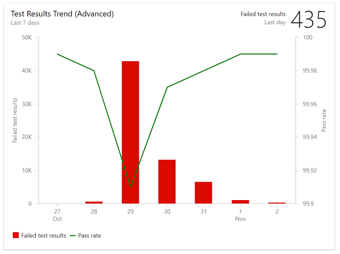
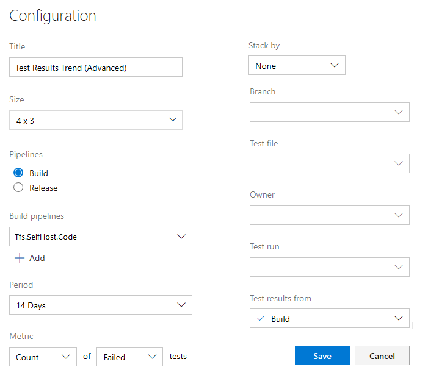

# Configure the Test Results Trend (Advanced) widget

[!INCLUDE [version-gt-eq-2019](../../includes/version-gt-eq-2019.md)]

Teams track their test collateral health to ensure effective continuous testing in a pipeline. For example, teams might track:
- Test pass percentage
- Test failures
- Test duration

With the **Test Results Trend** widget, you can monitor test trends over a period of time, detect patterns around test failures, test duration, and more, and generate actionable insights.

**Example Test Results Trend widget showing pass percentage and test failure for last 7 days**  

 

In this article you'll learn:

> [!div class="checklist"]  
> * The type of insights you can get by monitoring Test Results Trend charts  
> * Prerequisites for gaining actionable insights from the Test Results Trend charts  
> * How to install and configure the Test Results Trend widget 

> [!NOTE]   
> The Test Results Trend (Advanced) widget is based on Analytics and supported for Azure DevOps Server 2020 and later versions. For earlier versions, you can use the Test Results Trend widget. 

## Insights supported with Test Results Trend charts

With the Test Results Trend charts, you can gain the following insights:  
- Identify if test health is improving over time by monitoring trends of failures and average pass rate on each day
- Identify long running tests that are impacting a pipeline's efficiency by monitoring the average test duration on each day
- Identify patterns in test outcomes. *Has the test recently started to fail? Or, has the test always failed for the selected period? Or, is the test showing non-deterministic behavior?*  
- Obtain insights into specific areas of interest to you based on test file, branch, or stage you own by configuring specific filters.  
- Obtain insights into a specific area you test by configuring the widget to focus on a test file, branch, or stage. 

Test Results Trend charts require that you set up continuous testing in your build pipeline. To get deeper insights and data you can view the Test Failure report in the pipeline. For more information, see details [Analyze test results](../../pipelines/test/test-analytics.md#view-test-analytics-for-builds). 

## Prerequisites

To configure the Test Results Trend widget:  

::: moniker range="azure-devops"

- Be a member of a project. If you haven't been added as a project member, [get added now](../../organizations/accounts/add-organization-users.md). 
- Set up continuous testing for your build pipeline. For details, see [Run unit tests with your builds](../../pipelines/ecosystems/dotnet-core.md#run-your-tests).
- To add a widget to a team dashboard, you need to be a member of the team. Have at least **Basic** access, [dashboard permissions](./dashboard-permissions.md), or be a [team admin](../../organizations/settings/add-team-administrator.md) or project admin. Default settings provide all team members with permissions.
- Enable **Pipelines**. If disabled, none of the Analytics widgets for pipelines will display. To re-enable it, see [Turn an Azure DevOps service on or off](../../organizations/settings/set-services.md).
- Enable **Test Plans**. If disabled, the Test Results Trend widget displays an "Access not supported" error message. To enable test plans, see [Turn an Azure DevOps service on or off](../../organizations/settings/set-services.md).

::: moniker-end

::: moniker range="azure-devops-2019"

- Be a member of a project. If you haven't been added as a project member, [get added now](../../organizations/security/add-users-team-project.md).  
-  Set up continuous testing for your build pipeline. For details, see [Run unit tests with your builds](../../pipelines/ecosystems/dotnet-core.md#run-your-tests).
- Have installed the [Analytics Marketplace extension](../dashboards/analytics-extension.md). Be a member of the [**Project Collection Administrators** group](../../organizations/security/change-organization-collection-level-permissions.md) to add extensions.
- To add a widget to a team dashboard, you need to be a member of the team. Have at least **Basic** access, [dashboard permissions](./dashboard-permissions.md), or be a [team admin](../../organizations/settings/add-team-administrator.md) or project admin.
- Enable **Pipelines**. If disabled, none of the Analytics widgets for pipelines will display. To re-enable it, see [Turn an Azure DevOps service on or off](../../organizations/settings/set-services.md).

::: moniker-end

## Configure the Test Results Trend (Advanced) widget    

You can configure your Test Results Trend (Advanced) widget to show results for either build or release pipelines. 

1. From your team's dashboard, select the :::image type="icon" source="../../media/icons/actions-icon.png" border="false"::: actions icon for the Test Results Trend (Advanced) widget you want to configure and select **Configure**.
	
	Modify the **Title** and select either **Build** or **Release** for the type of **Pipelines** that you'll select.
   
	> [!div class="mx-imgBorder"]  
	>   

	Select the :::image type="icon" source="../../media/icons/blue-add.png" border="false"::: plus icon to add one or more pipelines. 

1. Next, select the **Period**, and then choose the metrics that you want to track. Optionally, apply filters for **Branch**, **Test file**, **Owner**, and **Test run**.   

2. Select **Save** when you're done. 

	The following image shows a chart with pass rate and test results for last seven days. 
   
	

## Next steps

> [!div class="nextstepaction"]
> [Test Analytics report](../../pipelines/test/test-analytics.md#view-test-analytics-for-builds).