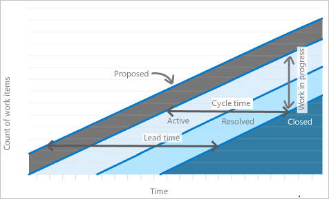
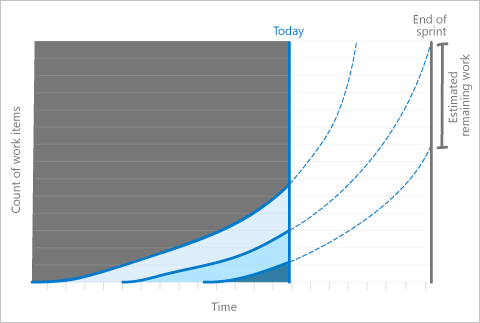
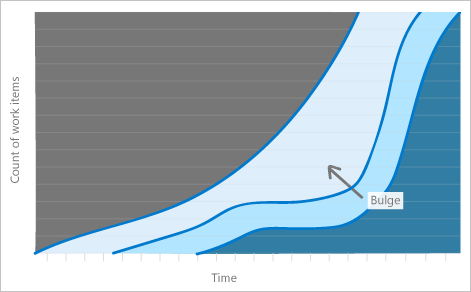

# Cumulative flow, lead time, and cycle time guidance

[!INCLUDE [version-lt-eq-azure-devops](../../includes/version-lt-eq-azure-devops.md)]

You use cumulative flow diagrams (CFD) to monitor the flow of work through a system. The two primary metrics to track, cycle time and lead time, can be extracted from the chart. To configure or view CFD charts, see [Configure a cumulative flow chart](cumulative-flow.md). 

::: moniker range=">= azure-devops-2019" 

Or, you can add the [Lead time and cycle time control charts](cycle-time-and-lead-time.md) to your dashboards. 

::: moniker-end

## Sample charts and primary metrics

:::row:::
   :::column span="2":::
      The Continuous flow CFD provides the chart most favored by teams that follow a lean process.  
      
      However, many teams have begun combining lean practices with Scrum or other methodologies which means they practice lean within the span of an iteration or sprint. In this situation the diagram takes on a slightly different look and provides two additional, and very valuable, pieces of information as shown in the next chart.
   :::column-end:::
   :::column span="3":::
      **Continuous flow**  
        
   :::column-end:::
:::row-end:::
:::row:::
   :::column span="2":::
      The Fixed period CFD shown here is for a completed sprint.  
      
      The top line represents the scope set for the sprint. And, because the work must be completed by the last day of the sprint, the slope of the Closed state indicates whether or not a team is on track to complete the sprint. The easiest way to think of this view is as a burnup chart.  
      
      The data is always depicted with the first step in the process as the upper left and the last step in the process as the bottom right.  
   :::column-end:::
   :::column span="3":::
      **Fixed period CFD for a completed sprint**  
       
   :::column-end:::
:::row-end:::
 

## Chart metrics  

CFD charts display the count of work items grouped by state/column over time. The two primary metrics to track, cycle time and lead time, can be extracted from the chart.  

---
:::row:::
   :::column span="1":::
      **Metric**
   :::column-end:::
   :::column span="3":::
      **Definition**
   :::column-end:::
:::row-end:::
---
:::row:::
   :::column span="1":::
      **Cycle Time** 1
   :::column-end:::
   :::column span="3":::
      Measures the time it takes to move work through a single process or workflow state. Calculation is from the start of one process to the start of the next process. 
   :::column-end:::
:::row-end:::
:::row:::
   :::column span="1":::
      **Lead Time** 1
   :::column-end:::
   :::column span="3":::
      *For a continuous flow process*: Measures the amount of time it takes from when a request is made (such as adding a proposed user story) until that request is completed (closed).  
      
      *For a sprint or fixed period process*: Measures the time from when work on a request begins until the work is completed  (i.e. the time from Active to Closed).
   :::column-end:::
:::row-end:::
:::row:::
   :::column span="1":::
      **Work in Progress**
   :::column-end:::
   :::column span="3":::
      Measures the amount of work or number of work items that are actively being worked.
   :::column-end:::
:::row-end:::
:::row:::
   :::column span="1":::
      **Scope**
   :::column-end:::
   :::column span="3":::
      Represents the amount of work committed for the given period of time. Only applies to fixed period processes.
   :::column-end:::
:::row-end:::
--- 
1 The CFD widget (Analytics) and built-in CFD chart (work tracking data store) don't provide discrete numbers on Lead Time and Cycle Time. However, the [Lead Time and Cycle Time widgets](cycle-time-and-lead-time.md) do provide these numbers.  

There's a well-defined correlation between Lead Time/Cycle Time and Work in Progress (WIP). The more WIP, the longer the cycle time, which also leads to longer lead times. The opposite is also true&mdash;the less WIP, the shorter the cycle and lead time. When the development team focuses on fewer items, they reduce the cycle and lead times. This correlation is a key reason why you can and should set [Work In Progress limits on the board](../../boards/boards/wip-limits.md).  

The count of work items indicates the total amount of work on a given day. In a fixed period CFD, a change in this count indicates scope change for a given period. In a continuous flow CFD, it indicates the total amount of work in the queue and completed for a given day.  

Decomposing work into specific board columns provides a view where work is in process. This view provides insights on where work is moving smoothly, where there are blockages and where no work is being done at all. It's difficult to decipher a tabular view of the data, however, the visual CFD chart provides evidence that something is happening in a given way. 

## Identify issues, take appropriate actions 
 
The CFD answers several specific questions and based on the answer, actions can be taken to adjust the process to move work through the system. Let's look at each of those questions here.

### Will the team complete work on time? 
 
This question applies to fixed period CFDs only. You gain an understanding by looking at the curve (or progression) of work in the last column of the board.  

  

In this scenario, it may be appropriate to reduce the scope of work in the iteration if it's clear that work, at a steady pace, isn't being completed quickly enough. It may indicate the work was underestimated and should be factored into the next sprints planning.  

There may however be other reasons that can be determined by looking at other data on the chart.  

### How is the flow of work progressing?

Is the team completing work at a steady pace? One way to tell is to look at the spacing between the different columns on the chart. Are they of a similar or uniform distance from each other from beginning to end? Does a column appear to flat-line over a period of multiple days? Or, does it seem to "bulge"?  

Mura, the lean term for flat lines and bulges, means unevenness and indicates a form of waste (Muda) in the system. Any unevenness in the system will cause bulges to appear in the CFD.  

Monitoring the CFD for flat lines and bulges supports a key part of the Theory of Constraints project management process. Protecting the slowest area of the system is referred to as the drum-buffer-rope process and is part of how work is planned.  

Two problems show up visually as flat lines and as bulges. 

:::row:::
   :::column span="2":::
      Flat lines appear when the team doesn&#39;t update their work with a regular cadence. The  [board](../../boards/boards/kanban-overview.md) provides the quickest way to transition work from one column to another.  
      Flat lines can also appear when the work across one or more processes takes longer than planned. Flat lines appear across many parts of the system because if only one part of the system or two parts of a system have problems then you'll see a bulge. 
   :::column-end:::
   :::column span="3":::
      **Flat lines**  
       
   :::column-end:::
:::row-end:::
:::row:::
   :::column span="2":::
      Bulges occur when work builds up in one part of the system and isn't moving through a process.  
      For example, a bulge can occur when testing takes a long period of time while development takes a shorter period of time, causing work to accumulate in the development state (bulges indicate that a succeeding step is having a problem, not necessarily the step in which the bulge is occurring). 
   :::column-end:::
   :::column span="3":::
      **Bulges**  
       
   :::column-end:::
:::row-end:::
  
### How do you fix flow problems? 

You can solve the problem of a lack of timely updates through:
- Daily stand-ups.
- Other regular meetings.
- Scheduling a daily team reminder email.  

Systemic flat-line problems indicate a more challenging problem, although such problems are rare.  Flat-lines indicate that work across the system has stopped. Underlying causes can be:
- Process-wide blockages.
- Processes taking a long time.
- Work shifting to other opportunities that aren't captured on the board. 

One example of systemic flat-line can occur with a features CFD. Feature work can take much longer than work on user stories because features are composed of several stories. In these situations, either the slope is expected (as in the example above) or the issue is well known and already being raised by the team as an issue. If it's a known issue, the problem resolution is outside the scope of this article.  

Teams can proactively fix problems that appear as CFD bulges. Depending on where the bulge occurs, the fix may be different. As an example, let's suppose that the bulge occurs in the development process. The bulge might be happening because running tests is taking much longer than writing code. Testers might also be finding a large number of bugs. When they continually transition the work back to the developers, the developers inherit a growing list of active work.  

Two potentially easy ways to solve this problem are: 1) Shift developers from the development process to the testing process until the bulge is eliminated or 2) change the order of work such that work that can be done quickly is interwoven with work that takes longer to do. Look for simple solutions to eliminate the bulges. 

> [!NOTE]   
> Because many different scenarios can occur which cause work to proceed unevenly, it's critical that you perform an actual analysis of the problem. The CFD will tell you that there is a problem and approximately where it is but you must investigate to get to the root cause(s). The guidance provided here indicate recommended actions which solve specific problems but which may not apply to your situation. 

### Did the scope change?  

Scope changes apply to fixed period CFDs only. The top line of the chart indicates the scope of work. A sprint is pre-loaded with the work to do on the first day. Changes to the top line indicate work was added or removed.  

The one scenario where you can't track scope changes with a CFD occurs when the same number of work items are added as removed on the same day. The line would continue to be flat. Compare several charts with one another. Monitor the specific issues. Use [View/configure sprint burndown](configure-sprint-burndown.md) to monitor scope changes. 

### Too much WIP?  

You can easily monitor [whether WIP limits have been exceed from the board](../../boards/boards/wip-limits.md). You can also monitor it from the CFD.  

A large amount of WIP usually shows up as a vertical bulge. The longer that there's a large amount of WIP, the more the bulge will expand to become an oval. It's an indication that the WIP is negatively affecting the cycle and lead time.  

Here's a good rule of thumb for works in progress. There should be no more than two items in progress per team member at any given time. The main reason for two items versus stricter limits is because reality frequently intrudes on any software development process.  

Sometimes it takes time to get information from a stakeholder, or it takes more time to acquire necessary software. There are any number of reasons why work might be halted. Having a second work item to pivot to provides some leeway. If both items are blocked, it's time to raise a red flag to get something unblocked&mdash;not just switch to yet another item. As soon as there are a large number of items in progress, the person working on those items will have difficulty context switching. It's more likely they'll forget what they were doing, and mistakes may occur.

::: moniker range=">= azure-devops-2019" 

## Lead time versus cycle time   

The diagram below illustrates how lead time differs from cycle time. Lead time is calculated from work item creation to entering a Completed state.  Cycle time is calculated from first entering an In Progress or Resolved state category to entering a Completed state category. 

### Illustration of lead time versus cycle time 

:::image type="content" source="media/cycle-lead-time-concept-intro.png" alt-text="Conceptual image of how cycle time and lead time are measured"::: 

If a work item enters a Completed state and then is reactivated, any extra time it spends in a Proposed, In Progress, or Resolved state will contribute to its lead/cycle time when it enters a Completed state category for the second time.

If your team uses the board, you'll want to understand how your columns map to workflow states. For more information on configuring your board, see [Add columns](../../boards/boards/add-columns.md). 

To learn more about how the system uses the state categories&mdash;Proposed, In Progress, Resolved, and Completed&mdash;see [Workflow states and state categories](../../boards/work-items/workflow-and-state-categories.md).   

## Plan using estimate delivery times based on lead/cycle times
  
You can use the average lead/cycle times and standard deviations to estimate delivery times. 

When you create a work item, you can use your team's average lead time to estimate when your team will complete that work item. Your team's standard deviation tells you the variability of the estimate. Likewise, you can use cycle time and its standard deviation to estimate the completion of a work item once work has begun.  

In the following chart, the average cycle time is eight days. The standard deviation is +/- six days. Using this data, we can estimate that the team will complete future user stories about 2-14 days after they begin work. The narrower the standard deviation, the more predictable your estimates.

### Example Cycle Time widget

## Identify process issues 

Review your team's control chart for outliers. Outliers often represent an underlying process issue. For example, waiting too long to complete PR reviews or not resolving an external dependency quickly.

As you can see in the following chart, which shows several outliers, several bugs took longer to complete than the team's average. Investigating why these bugs took longer may help uncover process issues. Addressing the process issues can help reduce your team's standard deviation and improve your team's predictability. 

### Example Cycle Time widget showing several outliers 

You can also see how process changes affect your lead and cycle time. For example, on May 15 the team made a concerted effort to limit the WIP and address stale bugs. You can see that the standard deviation narrows after that date, showing improved predictability. 

::: moniker-end

## Next steps

::: moniker range=">= azure-devops-2019" 
> [!div class="nextstepaction"]
> [Configure your cumulative flow charts](cumulative-flow.md) or 
> [Configure a lead time or cycle time chart](cycle-time-and-lead-time.md)
::: moniker-end

