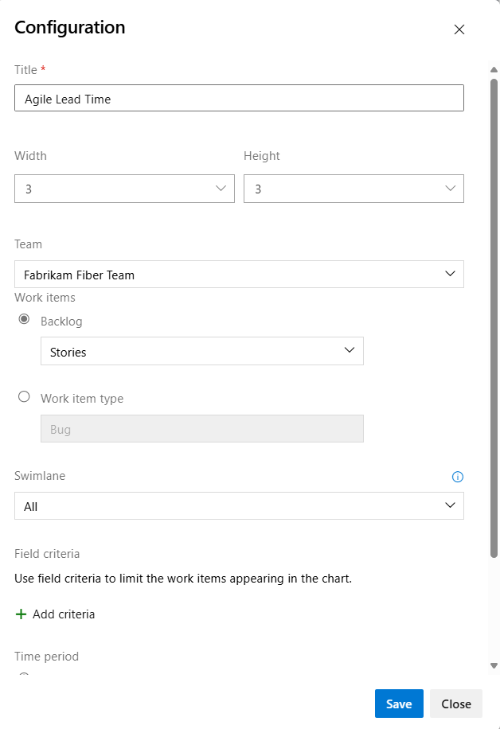
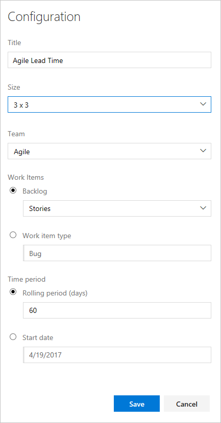

# Lead Time and Cycle Time widgets

[!INCLUDE [version-gt-eq-2019](../../includes/version-gt-eq-2019.md)]

Both lead time and cycle time widgets are useful to teams. They both indicate how long it takes for work to flow through their development pipeline. Lead time measures the total time elapsed from the creation of work items to their completion. Cycle time measures the time it takes for your team to complete work items once they begin actively working on them.  

The following diagram illustrates how lead time differs from cycle time. Lead time is calculated from work item creation to entering a completed state. Cycle time is calculated from first entering an In Progress or Resolved state category to entering a Completed state category. To understand how workflow states map to state categories, see [How workflow states and state categories are used in Backlogs and Boards](../../boards/work-items/workflow-and-state-categories.md). 

:::image type="content" source="media/cycle-lead-time-concept-intro.png" alt-text="Conceptual image of how cycle time and lead time are measured"::: 

These measures help teams plan, spot variations in efficiency, and identify potential process issues. The lower the lead and cycle times, the faster the throughput your team has.
 
In this article you'll learn:

> [!div class="checklist"] 
> * How to install and configure the Lead Time and Cycle Time widgets (Analytics)  
> * How to interpret the scatter-plot control charts  
> * How moving average and standard deviation are calculated in the charts

To learn more, see [Cumulative flow, lead time, and cycle time guidance](cumulative-flow-cycle-lead-time-guidance.md).

## Prerequisites  

[!INCLUDE [temp](../includes/analytics-widgets-prerequisites.md)]

## Add the widget to your dashboard   

1. (Optional) If you haven't yet configured your team's Kanban board, do that now. Define the [columns](../../boards/boards/add-columns.md) and [swimlanes](../../boards/boards/expedite-work.md) that support your workflow processes.  
2. If you haven't yet [added the widget to your dashboard](./add-widget-to-dashboard.md), do that now. There are two widgets: [Cycle Time](widget-catalog.md#cycle-time-widget) and [Lead Time](widget-catalog.md#lead-time-widget). Select the one you want to display and configure.

## Configure the Cycle Time and Lead Time widgets    

The Configuration dialog is the same for the Cycle Time and Lead Time widgets. You configure these widgets for a team. To learn more about teams, see [Add teams](../../organizations/settings/add-teams.md).  

::: moniker range=">= azure-devops-2020"

1. Select the :::image type="icon" source="../../media/icons/actions-icon.png" border="false"::: context menu icon and select **Configure** to open the configuration dialog. Modify the title, and then select the values you want to monitor:
   - Team
   - Backlog level
   - Swimlane
   - Field criteria
   - Time period  

	> [!div class="mx-imgBorder"]  
	> 

	To select a **Swimlane**, you must select a **Backlog**. 

	> [!NOTE]   
	> You can only select work item types that have been added to a backlog. To add work item types to a backlog, see [Customize your backlogs or boards (Inheritance process)](../../organizations/settings/work/customize-process-backlogs-boards.md). For On-premises XML process, see [Process configuration XML element reference](../../reference/xml/process-configuration-xml-element.md).

1. To further filter the work items used to calculate the lead or cycle time, specify the **Field Criteria**. For example, all the work items whose Release field is set to Milestone 1. 

	> [!div class="mx-imgBorder"]  
	> 
	
	
	> [!NOTE]   
	> Supplying no values to the filter may lead to selection of all workitems, or may be an invalid filter argument depending on type of filter criteria.

1. For a continuous flow, select **Rolling period** and specify the number of days you want to view on the chart.  

	Or, for a fixed scope view, select and specify the Start date. Select this view if your team employs a Scrumban process or follows a standard sprint process. 

	The main difference between these two types of charts is that the fixed scope chart will provide information (in most cases) of scope change.    

2. Select **Save** when done. The following image shows an example Lead Time chart showing 60 days of data. 
   
    :::image type="content" source="media/cycle-lead-time-lt-sample-chart.png" alt-text="Screenshot ofExample CFD chart, rolling 30 days.":::
	For your lead/cycle time charts to provide useful data, your team must quickly [update the status](../../boards/boards/kanban-basics.md#track-work) of those work items that the widgets track. 

::: moniker-end

::: moniker range="azure-devops-2019"

1. Select the :::image type="icon" source="../../media/icons/actions-icon.png" border="false"::: context menu icon and select **Configure** to open the configuration dialog. Modify the title and then select the values you want to monitor:
   - Team
   - Backlog level
   - Swimlane
   - Time period  

	

	To select a **Swimlane**, you must select a **Backlog**. 

1. For a continuous flow, select **Rolling period** and specify the number of days you want to view on the chart.  

	Or, for a fixed scope view, select and specify the Start date. Select this view if your team employs a Scrumban process or follows a standard sprint process. 

	The main difference between these two types of charts is that the fixed scope chart will provide information (in most cases) of scope change.    

2. Select **Save** when done. The following image shows an example Lead Time chart showing 60 days of data. 
   
    :::image type="content" source="media/cycle-lead-time-lt-sample-chart.png" alt-text="Screenshot  Example CFD chart, rolling 30 days, 2019 version.":::
	For your lead/cycle time charts to provide useful data, your team must quickly [update the status](../../boards/boards/kanban-basics.md#track-work) of those work items that the widgets track. 

::: moniker-end
 

## Interpret the scatter-plot control charts 

Both Lead Time and Cycle Time widgets display as scatter-plot control charts. They display summary information and provide several interactive elements. 

**Example Lead Time widget**  

:::image type="content" source="media/lead-time-control-chart.png" alt-text="Screenshot of Cycle Time widget.":::
The chart dots represent completed work items where their position on the horizontal axis represents the date the team completed them. Their position on the vertical axis represents the calculated lead time or cycle time. 
- Larger dots represent multiple work items with the same lead/cycle time 
- Dot color corresponds to the work item type displayed in the legend
- Dark gray dots correspond to a mix of work item types.

### Summary elements 

- Days on average (average lead time or cycle time) for the main work item types configured for the chart 
- The number of backlog work items used in the chart calculations; if there are more than three types of work items, you'll see a summary for Other  
- The black trend line indicates the moving average 
- The band around the trend line shows the standard deviation.

### Interactive elements  

- Hover over any dot to see which work items contributed to the data point and the lead/cycle time for those items  
- Select a dot to open the work item or query that lists the work items   
- To filter the chart, select a work item type in the legend (:::image type="icon" source="../../media/icons/user-story-icon.png" border="false":::, :::image type="icon" source="../../media/icons/bug-icon.png" border="false":::, or other icon)  to filter on that type; to return to the original chart, refresh the dashboard.  

## Moving average and standard deviation calculations 

The daily moving average value corresponds to the average of data points that fall within the moving average window. 
The time-based moving average window is calculated based on the current day and previous *N* days. *N* corresponds to 20% of the number of days the chart displays, rounded down to the nearest odd number. 

Here's an example. If the chart displays the last 30 days, then *N* = 5 days:
> 20% of 30 days is 6 days rounded down to the nearest odd number which is 5.

The moving average window for April 10 corresponds to the previous 5 days. So, the April 10 moving average is the average of all data points that fall on April 5 through April 10.  

If you don't have data points that fall within the moving average window, the chart doesn't show a moving average line. This scenario can occur if you're starting out and there aren't enough days to calculate a moving average.

The standard deviation appears as a band that encompasses the moving average. Standard deviation is calculated based on all data points falling within the same moving average window. Like moving average, if no data points fall within the moving average window, the chart doesn't plot standard deviation.  

## Related articles

We recommend your team review the lead/cycle time charts before or during each retrospective. Use lead time to help estimate delivery times and track service level agreements (SLAs). Use cycle time to identify potential process issues, spot variations in trends, and help with planning.   

- [Cumulative flow, lead time, and cycle time guidance](cumulative-flow-cycle-lead-time-guidance.md)  
- [Kanban basics](../../boards/boards/kanban-basics.md)  
- [Cumulative flow diagram](cumulative-flow.md)
- [Workflow states and state categories](../../boards/work-items/workflow-and-state-categories.md)
- [Agile](../../boards/work-items/guidance/agile-process.md), [Scrum](../../boards/work-items/guidance/scrum-process.md), and [CMMI](../../boards/work-items/guidance/cmmi-process.md) processes
