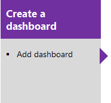
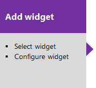
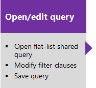
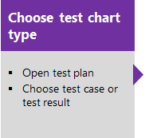
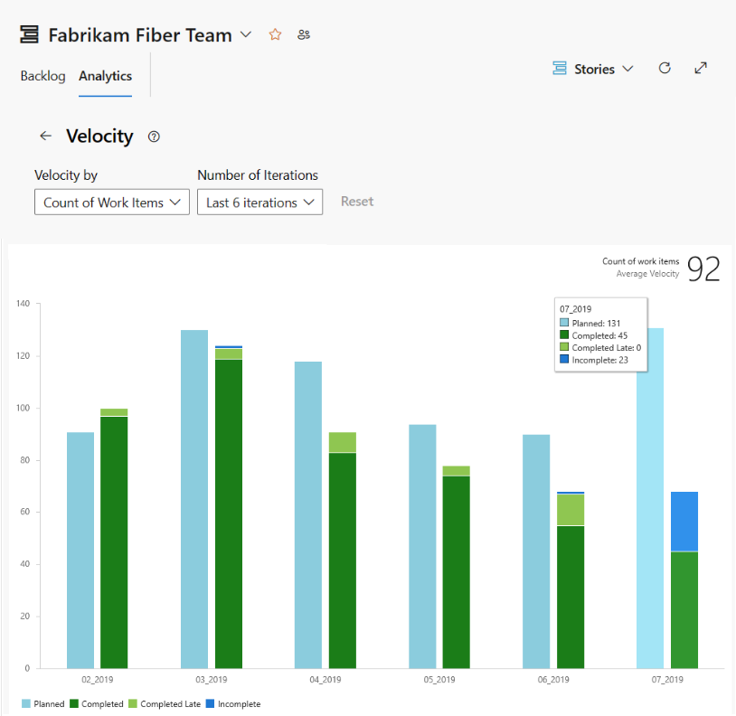

# About dashboards, charts, reports, & widgets   

[!INCLUDE [temp](../_shared/version-azure-devops-all.md)]

Gain visibility into your team's progress by adding one or more widgets or charts to your dashboard. Customizable, highly-configurable dashboards provide you and your teams with the flexibility to share information, monitor progress and trends, and improve your workflow processes.  Each team can tailor their dashboards to share information and monitor their progress.  

If you're just starting out, read [Add, rename, and delete dashboards](dashboards.md). If you're looking for instructions on a specific task, in context chart, widget, or report&mdash;review [Dashboards and widgets quick reference](quick-ref.md). To learn about our reporting solutions, read [Reporting Roadmap](../powerbi/reporting-roadmap.md).

[!INCLUDE [temp](../../_shared/version-selector-minimize.md)]

## Key concepts

::: moniker range="azure-devops"

- <strong>Dashboards</strong> are customizable interactive signboards that provide real-time information. Dashboards are associated with a team or a project and display configurable charts and widgets.
- <strong>Charts</strong> are query-based status or trend charts derived from a work item query or test results.
- <strong>Widgets</strong> display configurable information and charts on dashboards. The widget catalog provides brief descriptions of those widgets available to you. In addition, you can add widgets provided through the [Azure DevOps Marketplace](https://marketplace.visualstudio.com/azuredevops). 
- <strong>In-context reports</strong> are system-generated charts that support specific services. Examples are team velocity, sprint burndown, and the Cumulative Flow Diagram (CFD), and the Test Failures Report. These reports are displayed on the **Analytics** tab for a specific service and derive data from Analytics.  
- <strong>Power BI reports</strong> allow users to create rich, customized Power BI reports or other reports using OData queries of Analytics data and the returned JSON data.  

::: moniker-end  

::: moniker range="azure-devops-2019"

- <strong>Dashboards</strong> are customizable interactive signboards that provide real-time information. Dashboards are associated with a team and display configurable charts and widgets to show information.
- <strong>Charts</strong> are query-based status or trend charts derived from a work item query or test results. 
- <strong>In-context reports</strong> are system-generated charts that support specific services. Examples are team velocity, sprint burndown, and the Cumulative Flow Diagram (CFD), and the Test Failures Report. 
- <strong>Widgets</strong> display configurable information and charts on dashboards. The widget catalog provides brief descriptions of those widgets available to you. In addition, you can add widgets provided through the [Azure DevOps Marketplace](https://marketplace.visualstudio.com/azuredevops).
- <strong>Reports</strong>
	- <strong>Power BI reports</strong>: For project collections that support the Inherited process, allow users to create rich, customized Power BI reports or other reports using OData queries of Analytics data and the returned JSON data.  
	- <strong>SQL Server reports</strong>: For project collections that support the On-premises XML process model, allow users access to out-of-the-box SQL Server reports as well as support to create customized SQL Reports or Excel reports. This requires that the project is [configured to support SQL Server reporting](../admin/add-a-report-server.md).

::: moniker-end  

::: moniker range=">=tfs-2015 <= tfs-2018"

- <strong>Dashboards</strong> are customizable interactive signboards that provide real-time information. Dashboards are associated with a team and display configurable charts and widgets to show information.
- <strong>Charts</strong> are query-based status or trend charts derived from a work item query or test results. 
- <strong>Widgets</strong> display configurable information and charts on dashboards. The widget catalog provides brief descriptions of those widgets available to you. In addition, you can add widgets provided through the [Azure DevOps Marketplace](https://marketplace.visualstudio.com/azuredevops).
- <strong>In-context reports** are system-generated charts that support specific services. Examples are team velocity, sprint burndown, and the Cumulative Flow Diagram (CFD). 
- <strong>Reports</strong> correspond to out-of-the-box SQL Server reports as well as support to create customized SQL Reports or Excel reports. This requires that the project is [configured to support SQL Server reporting](../admin/add-a-report-server.md).

::: moniker-end  

::: moniker range="tfs-2013"
- <strong>Dashboards</strong> are customizable interactive signboards that provide real-time information. Dashboards are associated with a team and display configurable charts that you pin to the dashboard.
- <strong>Charts</strong> are query-based status or trend charts derived from a work item query or test results. 
- <strong>In-context reports</strong> are system-generated charts that support specific services. Examples are team velocity, sprint burndown, and the Cumulative Flow Diagram (CFD). 
- <strong>Reports</strong> correspond to out-of-the-box SQL Server reports as well as support to create customized SQL Reports or Excel reports. This requires that the project is [configured to support SQL Server reporting](../admin/add-a-report-server.md).

::: moniker-end  

::: moniker range=">= tfs-2015"

## Configurable dashboards

With dashboards, you can configure an array of charts and widgets. 

Each team can [add and configure multiple dashboards](dashboards.md) to share information, view status, progress, and trends, and access quick links and other functions. Easily add and rearrange widgets on the dashboard to show recent changes made to view build status, bug trends, and more. 

#### Sequence for adding and customizing a dashboard

<em>Click a box below to open the corresponding article.</em> 

 

::: moniker-end

## Charts: Work tracking status and trends

With flat-list queries, you can create various charts to monitor status, progress, and trends. To get started, you can open a shared query and create a chart based on your tracking interests. Chart types include status&mdash;pie, bar, column, stacked bar, and pivot&mdash;and trend&mdash;stacked area, line, and area&mdash;charts.   

### Sample Agile tool light-weight charts   

::: moniker range=">= azure-devops-2019"

> [!div class="mx-imgBorder"]  
>    

::: moniker-end

::: moniker range="<= tfs-2018"

   

::: moniker-end

#### Sequence for adding query-based charts to a dashboard  

<em>Click a box below to open the corresponding article.</em> 

   

Prior to monitoring work progress and trends, you'll need to have [planned your project and made progress on work you're tracking](../../boards/backlogs/create-your-backlog.md). 

## Charts: Manual testing progress, results, and trends  

The steps to creating charts that track manual testing progress and results are similar to those for tracking work. The starting point, however, begins with the test plan rather than a query. For example, you can find out how many test cases are ready to run, or how many tests are passing and failing in each test suite. 

### Sample light-weight test charts 
  

And, just like work item query-based charts, you can add these charts to a dashboard.  

**Sequence for adding test progress and result charts to a dashboard**  

::: moniker range=">= tfs-2015"

## Widgets 

You add widgets to a dashboard to display a chart, information, or set of links. Most widgets are configurable. For a description of each supported widget for your platform and version, see the [Widget catalog](widget-catalog.md). Here are the widgets that support the indicated service. 

::: moniker-end 

::: moniker range=">= azure-devops-2019"

<table valign="top">
<tbody valign="top">
<tr>
<td width="33%"> 
<strong>Boards</strong>
<ul>
<li><a href="widget-catalog.md#assigned-to-me-widget" data-raw-source="[Assigned to me](widget-catalog.md#assigned-to-me-widget)">Assigned to me</a></li>
<li><a href="configure-burndown-burnup-widgets.md" data-raw-source="[Burndown chart](configure-burndown-burnup-widgets.md)">Burndown chart</a></li>
<li><a href="configure-burndown-burnup-widgets.md" data-raw-source="[Burnup chart](configure-burndown-burnup-widgets.md)">Burnup chart</a> </li>
<li><a href="widget-catalog.md#chart-wit-widget" data-raw-source="[Chart for work items](widget-catalog.md#chart-wit-widget)">Chart for work items</a></li>
<li><a href="widget-catalog.md#cfd-widget" data-raw-source="[Cumulative flow diagram](widget-catalog.md#cfd-widget)">Cumulative flow diagram</a> </li>
<li><a href="cycle-time-and-lead-time.md" data-raw-source="[Cycle time](cycle-time-and-lead-time.md)">Cycle time</a></li>
<li><a href="cycle-time-and-lead-time.md" data-raw-source="[Lead time](cycle-time-and-lead-time.md)">Lead time</a> </li>
<li><a href="widget-catalog.md#new-work-item-widget" data-raw-source="[New Work item](widget-catalog.md#new-work-item-widget)">New Work item</a></li>
<li><a href="widget-catalog.md#query-results-widget" data-raw-source="[Query results](widget-catalog.md#query-results-widget)">Query results</a></li>
<li><a href="widget-catalog.md#query-tile-widget" data-raw-source="[Query tile](widget-catalog.md#query-tile-widget)">Query tile</a></li>
<li><a href="widget-catalog.md#sprint-burndown-widget" data-raw-source="[Sprint burndown](widget-catalog.md#sprint-burndown-widget)">Sprint burndown</a> </li>
<li><a href="widget-catalog.md#sprint-capacity-widget" data-raw-source="[Sprint capacity](widget-catalog.md#sprint-capacity-widget)">Sprint capacity</a></li>
<li><a href="widget-catalog.md#sprint-overview-widget" data-raw-source="[Sprint overview](widget-catalog.md#sprint-overview-widget)">Sprint overview</a> </li>
<li><a href="team-velocity.md" data-raw-source="[Velocity](team-velocity.md)">Velocity</a> </li>
<li><a href="widget-catalog.md#work-links-widget" data-raw-source="[Work links](widget-catalog.md#work-links-widget)">Work links</a></li>
</ul>
</td>
<td width="33%">
<strong>Repos</strong>
<ul>
<li><a href="widget-catalog.md#code-tile-widget" data-raw-source="[Code tile](widget-catalog.md#code-tile-widget)">Code tile</a></li>
<li><a href="widget-catalog.md#pull-request-widget" data-raw-source="[Pull request](widget-catalog.md#pull-request-widget)">Pull request</a> </li>
</ul>
<strong>Pipelines</strong>
<ul>
<li><a href="widget-catalog.md#build-history-widget" data-raw-source="[Chart for build history](widget-catalog.md#build-history-widget)">Chart for build history</a></li>
<li><a href="widget-catalog.md#deployment-status-widget" data-raw-source="[Deployment status](widget-catalog.md#deployment-status-widget)">Deployment status</a></li>
<li><a href="widget-catalog.md#release-definition-widget" data-raw-source="[Release pipeline overview](widget-catalog.md#release-definition-widget)">Release pipeline overview</a></li>
<li><a href="widget-catalog.md#requirements-quality-widget" data-raw-source="[Requirements quality](widget-catalog.md#requirements-quality-widget)">Requirements quality</a></li>
</ul>
<strong>Test Plans</strong>
<li><a href="widget-catalog.md#chart-test-plan-widget" data-raw-source="[Chart for test plans](widget-catalog.md#chart-test-plan-widget)">Chart for test plans</a></li>
<li><a href="widget-catalog.md#test-results-widget" data-raw-source="[Test results trend](widget-catalog.md#test-results-widget)">Test results trend</a></li>
<li><a href="widget-catalog.md#test-trend-results-advanced" data-raw-source="[Test results trend (Advanced)](widget-catalog.md#test-trend-results-advanced)">Test results trend (Advanced)</a></li>
</ul>
</td>
<td width="34%">
<strong>Informational</strong>
<ul>
<li><a href="widget-catalog.md#embedded-webpage-widget" data-raw-source="[Embedded web page](widget-catalog.md#embedded-webpage-widget)">Embedded web page</a></li>
<li><a href="widget-catalog.md#markdown-widget" data-raw-source="[Markdown](widget-catalog.md#markdown-widget)">Markdown</a></li>
<li><a href="widget-catalog.md#other-links-widget" data-raw-source="[Other links](widget-catalog.md#other-links-widget)">Other links</a> </li>
<li><a href="widget-catalog.md#team-members-widget" data-raw-source="[Team members](widget-catalog.md#team-members-widget)">Team members</a> </li>
<li><a href="widget-catalog.md#visual-studio-widget" data-raw-source="[Visual Studio Shortcuts](widget-catalog.md#visual-studio-widget)">Visual Studio Shortcuts</a></li>
<li><a href="widget-catalog.md#how-to-widget" data-raw-source="[Welcome](widget-catalog.md#how-to-widget)">Welcome</a></li>
</ul>
</td>
</tr>
</tbody>
</table>

::: moniker-end

::: moniker range="tfs-2018"

<table valign="top">
<tbody valign="top">
<tr>
<td width="33%"> 
<strong>Boards</strong>
<ul>
<li><a href="widget-catalog.md#assigned-to-me-widget" data-raw-source="[Assigned to me](widget-catalog.md#assigned-to-me-widget)">Assigned to me</a></li>
<li><a href="widget-catalog.md#chart-wit-widget" data-raw-source="[Chart for work items](widget-catalog.md#chart-wit-widget)">Chart for work items</a></li>
<li>Cumulative flow diagram</li>
<li><a href="widget-catalog.md#new-work-item-widget" data-raw-source="[New Work item](widget-catalog.md#new-work-item-widget)">New Work item</a> </li>
<li><a href="widget-catalog.md#query-results-widget" data-raw-source="[Query results](widget-catalog.md#query-results-widget)">Query results</a></li>
<li><a href="widget-catalog.md#query-tile-widget" data-raw-source="[Query tile](widget-catalog.md#query-tile-widget)">Query tile</a></li>
<li><a href="widget-catalog.md#sprint-burndown-widget" data-raw-source="[Sprint burndown](widget-catalog.md#sprint-burndown-widget)">Sprint burndown</a> </li>
<li><a href="widget-catalog.md#sprint-capacity-widget" data-raw-source="[Sprint capacity](widget-catalog.md#sprint-capacity-widget)">Sprint capacity</a> </li>
<li><a href="widget-catalog.md#sprint-overview-widget" data-raw-source="[Sprint overview](widget-catalog.md#sprint-overview-widget)">Sprint overview</a></li>
<li><a href="widget-catalog.md#work-links-widget" data-raw-source="[Work links](widget-catalog.md#work-links-widget)">Work links</a></li>
</ul>
</td>
<td width="33%">
<strong>Repos</strong>
<ul>
<li><a href="widget-catalog.md#code-tile-widget" data-raw-source="[Code tile](widget-catalog.md#code-tile-widget)">Code tile</a></li>
<li><a href="widget-catalog.md#pull-request-widget" data-raw-source="[Pull request](widget-catalog.md#pull-request-widget)">Pull request</a> </li>
</ul>
<strong>Pipelines</strong>
<ul>
<li><a href="widget-catalog.md#build-history-widget" data-raw-source="[Chart for build history](widget-catalog.md#build-history-widget)">Chart for build history</a></li>
<li><a href="widget-catalog.md#deployment-status-widget" data-raw-source="[Deployment status](widget-catalog.md#deployment-status-widget)">Deployment status</a></li>
<li>Release pipeline overview</li>
<li><a href="widget-catalog.md#requirements-quality-widget" data-raw-source="[Requirements quality](widget-catalog.md#requirements-quality-widget)">Requirements quality</a></li>
</ul>
<strong>Test Plans</strong>
<li><a href="widget-catalog.md#chart-test-plan-widget" data-raw-source="[Chart for test plans](widget-catalog.md#chart-test-plan-widget)">Chart for test plans</a></li>
<li><a href="widget-catalog.md#test-results-widget" data-raw-source="[Test results trend](widget-catalog.md#test-results-widget)">Test results trend</a></li>
<li>Test results trend (Advanced)</li>
</ul>
</td>
<td width="34%">
<strong>Informational</strong>
<ul>
<li><a href="widget-catalog.md#embedded-webpage-widget" data-raw-source="[Embedded web page](widget-catalog.md#embedded-webpage-widget)">Embedded web page</a></li>
<li><a href="widget-catalog.md#markdown-widget" data-raw-source="[Markdown](widget-catalog.md#markdown-widget)">Markdown</a></li>
<li><a href="widget-catalog.md#other-links-widget" data-raw-source="[Other links](widget-catalog.md#other-links-widget)">Other links</a> </li>
<li><a href="widget-catalog.md#team-members-widget" data-raw-source="[Team members](widget-catalog.md#team-members-widget)">Team members</a> </li>
<li>Team room</li>	
<li><a href="widget-catalog.md#visual-studio-widget" data-raw-source="[Visual Studio Shortcuts](widget-catalog.md#visual-studio-widget)">Visual Studio Shortcuts</a></li>
<li><a href="widget-catalog.md#how-to-widget" data-raw-source="[Welcome](widget-catalog.md#how-to-widget)">Welcome</a></li>
</ul>
</td>
</tr>
</tbody>
</table>

::: moniker-end

::: moniker range="tfs-2017"

<table valign="top">
<tbody valign="top">
<tr>
<td width="33%"> 
<strong>Work</strong>
<ul>
<li><a href="widget-catalog.md#assigned-to-me-widget" data-raw-source="[Assigned to me](widget-catalog.md#assigned-to-me-widget)">Assigned to me</a> </li>
<li><a href="widget-catalog.md#chart-wit-widget" data-raw-source="[Chart for work items](widget-catalog.md#chart-wit-widget)">Chart for work items</a></li>
<li><a href="widget-catalog.md#new-work-item-widget" data-raw-source="[New Work item](widget-catalog.md#new-work-item-widget)">New Work item</a> </li>
<li><a href="widget-catalog.md#query-results-widget" data-raw-source="[Query results](widget-catalog.md#query-results-widget)">Query results</a></li>
<li><a href="widget-catalog.md#query-tile-widget" data-raw-source="[Query tile](widget-catalog.md#query-tile-widget)">Query tile</a></li>
<li><a href="widget-catalog.md#sprint-burndown-widget" data-raw-source="[Sprint burndown](widget-catalog.md#sprint-burndown-widget)">Sprint burndown</a> </li>
<li><a href="widget-catalog.md#sprint-capacity-widget" data-raw-source="[Sprint capacity](widget-catalog.md#sprint-capacity-widget)">Sprint capacity</a> </li>
<li><a href="widget-catalog.md#sprint-overview-widget" data-raw-source="[Sprint overview](widget-catalog.md#sprint-overview-widget)">Sprint overview</a></li>
<li><a href="widget-catalog.md#work-links-widget" data-raw-source="[Work links](widget-catalog.md#work-links-widget)">Work links</a></li>
</ul>

</td>
<td width="33%">
<strong>Code</strong>
<ul>
<li><a href="widget-catalog.md#code-tile-widget" data-raw-source="[Code tile](widget-catalog.md#code-tile-widget)">Code tile</a></li>
<li><a href="widget-catalog.md#pull-request-widget" data-raw-source="[Pull request](widget-catalog.md#pull-request-widget)">Pull request</a> </li>
</ul>
<strong>Build &amp; Release</strong>
<ul>
<li><a href="widget-catalog.md#build-history-widget" data-raw-source="[Chart for build history](widget-catalog.md#build-history-widget)">Chart for build history</a></li>
<li><a href="widget-catalog.md#deployment-status-widget" data-raw-source="[Deployment status](widget-catalog.md#deployment-status-widget)">Deployment status</a></li>
<li><a href="widget-catalog.md#requirements-quality-widget" data-raw-source="[Requirements quality](widget-catalog.md#requirements-quality-widget)">Requirements quality</a></li>
</ul>
<strong>Test</strong>
<ul>
<li><a href="widget-catalog.md#chart-test-plan-widget" data-raw-source="[Chart for test plans](widget-catalog.md#chart-test-plan-widget)">Chart for test plans</a></li>
<li><a href="widget-catalog.md#test-results-widget" data-raw-source="[Test results trend](widget-catalog.md#test-results-widget)">Test results trend</a></li>
</ul>
</td>
<td width="34%">
<strong>Informational</strong>
<ul>
<li><a href="widget-catalog.md#embedded-webpage-widget" data-raw-source="[Embedded web page](widget-catalog.md#embedded-webpage-widget)">Embedded web page</a></li>
<li><a href="widget-catalog.md#markdown-widget" data-raw-source="[Markdown](widget-catalog.md#markdown-widget)">Markdown</a></li>
<li><a href="widget-catalog.md#other-links-widget" data-raw-source="[Other links](widget-catalog.md#other-links-widget)">Other links</a> </li>
<li><a href="widget-catalog.md#team-members-widget" data-raw-source="[Team members](widget-catalog.md#team-members-widget)">Team members</a></li>
<li><a href="widget-catalog.md#team-room-widget" data-raw-source="[Team room](widget-catalog.md#team-room-widget)">Team room</a></li>
<li><a href="widget-catalog.md#visual-studio-widget" data-raw-source="[Visual Studio Shortcuts](widget-catalog.md#visual-studio-widget)">Visual Studio Shortcuts</a></li>
<li><a href="widget-catalog.md#how-to-widget" data-raw-source="[Welcome](widget-catalog.md#how-to-widget)">Welcome</a></li>
</ul>
</td>
</tr>
</tbody>
</table>

::: moniker-end

::: moniker range="tfs-2015"

<table valign="top">
<tbody valign="top">
<tr>
<td width="33%"> 
<strong>Work</strong>
<ul>
<li>Assigned to me</li>	
<li><a href="widget-catalog.md#chart-wit-widget" data-raw-source="[Chart for work items](widget-catalog.md#chart-wit-widget)">Chart for work items</a></li>
<li><a href="widget-catalog.md#new-work-item-widget" data-raw-source="[New Work item](widget-catalog.md#new-work-item-widget)">New Work item</a> </li>
<li><a href="widget-catalog.md#query-results-widget" data-raw-source="[Query results](widget-catalog.md#query-results-widget)">Query results</a></li>
<li><a href="widget-catalog.md#query-tile-widget" data-raw-source="[Query tile](widget-catalog.md#query-tile-widget)">Query tile</a></li>
<li><a href="widget-catalog.md#sprint-burndown-widget" data-raw-source="[Sprint burndown](widget-catalog.md#sprint-burndown-widget)">Sprint burndown</a> </li>
<li><a href="widget-catalog.md#sprint-capacity-widget" data-raw-source="[Sprint capacity](widget-catalog.md#sprint-capacity-widget)">Sprint capacity</a> </li>
<li><a href="widget-catalog.md#sprint-overview-widget" data-raw-source="[Sprint overview](widget-catalog.md#sprint-overview-widget)">Sprint overview</a> </li>
<li><a href="widget-catalog.md#work-links-widget" data-raw-source="[Work links](widget-catalog.md#work-links-widget)">Work links</a></li>
</ul>
</td>
<td width="33%">
<strong>Code</strong>
<ul>
<li><a href="widget-catalog.md#code-tile-widget" data-raw-source="[Code tile](widget-catalog.md#code-tile-widget)">Code tile</a></li>
<li><a href="widget-catalog.md#pull-request-widget" data-raw-source="[Pull request](widget-catalog.md#pull-request-widget)">Pull request</a> </li>
</ul>
<strong>Build</strong>
<ul>
<li><a href="widget-catalog.md#build-history-widget" data-raw-source="[Chart for build history](widget-catalog.md#build-history-widget)">Chart for build history</a></li>
</ul>
 
</td>
<td width="34%">
<strong>Other</strong>
<ul>
<li>Embedded web page</li>	
<li><a href="widget-catalog.md#markdown-widget" data-raw-source="[Markdown](widget-catalog.md#markdown-widget)">Markdown</a></li>
<li><a href="widget-catalog.md#other-links-widget" data-raw-source="[Other links](widget-catalog.md#other-links-widget)">Other links</a></li>
<li><a href="widget-catalog.md#team-members-widget" data-raw-source="[Team members](widget-catalog.md#team-members-widget)">Team members</a> </li>
<li><a href="widget-catalog.md#team-room-widget" data-raw-source="[Team room](widget-catalog.md#team-room-widget)">Team room</a> </li>
<li><a href="widget-catalog.md#visual-studio-widget" data-raw-source="[Visual Studio Shortcuts](widget-catalog.md#visual-studio-widget)">Visual Studio Shortcuts</a></li>
<li><a href="widget-catalog.md#how-to-widget" data-raw-source="[Welcome](widget-catalog.md#how-to-widget)">Welcome</a></li>
</ul>
</td>
</tr>
</tbody>
</table>

::: moniker-end

::: moniker range=">= tfs-2015"

### Sprint chart widgets 

     

### Sample Cumulative Flow Diagram widget 

   

::: moniker-end

::: moniker range=">= tfs-2015"

### Monitor code activity, build progress and deployment status

With the code tile widgets, you can monitor the activity occurring within a repo or branch folder. Build history displays a histogram of all builds run for a specific build pipeline. Bar color indicates: green-completed, red-failed, and yellow-completed without tests. 

**Code, build, and release chart widgets**  

&nbsp;&nbsp;&nbsp;  
&nbsp;&nbsp;&nbsp;&nbsp;  

::: moniker-end

::: moniker range="azure-devops"

### Analytics widgets

Analytics widgets provide rich data based on the Analytics data. Analytics is available to all organizations using Azure DevOps Services. 

#### Sample Lead time widget 

 

To learn more, see the following articles: 
- [What is Analytics?](../powerbi/what-is-analytics.md)
- [Widgets based on Analytics data](../dashboards/analytics-widgets.md)
::: moniker-end

::: moniker range="azure-devops-2019"

### Analytics and Analytics widgets

Analytics is in preview for Azure DevOps Server 2019. 

#### Sample Lead time widget 

 

To learn more, see the following articles: 
- [Widgets based on Analytics](../dashboards/analytics-widgets.md)  
-  [Add an Analytics widget to a dashboard](../dashboards/add-widget-to-dashboard.md#add-analytics-widget)  
- [What is Analytics?](../powerbi/what-is-analytics.md)  

::: moniker-end

::: moniker range=">= tfs-2015"

### Marketplace widgets

In addition to the widgets available to your from the widget catalog, you may find additional widgets of interest from the [Marketplace](https://marketplace.visualstudio.com/search?term=webpage%20widget&target=VSTS&sortBy=Relevance).  

Or, you can [create your own widget using the REST API](../../extend/develop/add-dashboard-widget.md). 

::: moniker-end

<a id="work-tracking-analytics" />

## In-context reports: Work tracking 

::: moniker range="azure-devops"

Azure Boards provides several in-context reports that derive from Analytics data. From your backlog or board, you can view the Cumulative Flow Diagram and team Velocity reports by selecting the **Analytics** tab. Each report provides interactive controls to provide each user the view of interest to them. From a Sprint backlog, you can view the sprint burndown trend. 

### Cumulative Flow Diagram 

Use the interactive controls to choose the time frame, swimlanes, and workflow states or Kanban board columns.

> [!div class="mx-imgBorder"]  
> 

### Velocity 
Use the interactive controls to choose the count or sum field and number of iterations. 

> [!div class="mx-imgBorder"]  
> 

### Sprint Burndown Trend 

Use the interactive controls to choose the start and end of the sprint and count or sum field to use in the burndown. If you don't track Remaining Work in tasks, you can view burndown based on a count of work items/tasks. 

> [!div class="mx-imgBorder"]  
> 

::: moniker-end

::: moniker range="<= azure-devops-2019"

Azure Boards provides several in-context reports that derive from the work tracking data store. From your backlog or board, you can view the Cumulative Flow Diagram and team Velocity reports by choosing the minature charts that appear on each page. From a Sprint backlog, you can view the sprint burndown.  

### Cumulative Flow Diagram 

The CFD report shows the count of work items in the backlog based on their state over time.  

> [!div class="mx-imgBorder"]  
> 

### Velocity 

Velocity is based on the values entered for Effort, Story Points, or Size fields for work items that belong to the Requirement Category. 

  

### Sprint burndown  

Each sprint provides access to two charts. The first [tracks capacity](../../boards/sprints/define-sprints.md) for the team, team activities&mdash;such as Development, Test, Design&mdash;and individual team members. The second tracks the [sprint burndown](configure-sprint-burndown.md) in terms of remaining work. 

| Capacity bars | Burndown  |
|-------| ----- |
| |   |

::: moniker-end

> [!NOTE]
> You can't add the in-context reports to a dashboard. However, you may find a comparable widget listed in the [widget catalog](widget-catalog.md) that tracks the same or similar data which you can add to the dashboard.  

To learn more about these reports, see one of the following articles:
- [Cumulative flow](cumulative-flow.md)
- [Team velocity](team-velocity.md)
- [View/configure sprint burndown](configure-sprint-burndown.md)  

::: moniker range="azure-devops"

<a id="incontext-reports" />  

## In-context reports: Pipeline Failures and Test Failures

Several in-context reports are provided for Azure Pipelines. These reports derive from Analytics data. Open a pipeline (or release summary for Test failure) to view the reports and select the **Analytics** tab. The summarized cards are present for all reports. You can click on the cards for a detailed report.

> [!div class="mx-imgBorder"]
> 

::: moniker-end

::: moniker range="azure-devops-2019"

## In-context reports: Pipeline Test Failures

Azure Pipelines provides an in-context Test failures report, derived from Analytics data. Open a release summary to view the report and select the **Analytics** tab. Select the summarized card for a detailed report.

> [!div class="mx-imgBorder"]
> 

::: moniker-end

::: moniker range="azure-devops"

### Pipeline pass rate report

The **Pipeline pass rate** report provides a trend of pipeline failure and task failure of the pipeline. You can view the pass rate of the pipeline over a configurable period of time (7/14/30 days). You can view additional details in **Task failure details**, which not only highlights the trend, but also list the top failing tasks.

> [!div class="mx-imgBorder"]
> 

Learn more about the [Pipeline pass rate report](../../pipelines/reports/pipelinereport.md#pipeline-pass-rate-report).

::: moniker-end

### Test failures report

The **Test failures** report provides a granular view of the top failing tests in the pipeline, along with the failure details. Summary charts are also provided for builds that indicate code coverage and test failures or success. 

> [!div class="mx-imgBorder"]
> 

Learn more about the [Test failures report](../../pipelines/test/test-analytics.md#test-failures).

::: moniker range="azure-devops"

### Pipeline duration report

The **Pipeline duration** report provides the duration trend of a pipeline. It also highlights the average run time of the total successful runs over a period of time (7/14/30 days) and provides insights on the tasks which have impacted the duration of the pipeline. 

> [!div class="mx-imgBorder"]
> 

Learn more about the [Pipeline duration report](../../pipelines/reports/pipelinereport.md#pipeline-duration-report).

::: moniker-end

::: moniker range=">= tfs-2015"

## Try this next

> [!div class="nextstepaction"]
> [Add a widget to a dashboard](add-widget-to-dashboard.md) 
> or
> [Review available widgets](widget-catalog.md) 

::: moniker-end

### Add custom work tracking fields

::: moniker range="azure-devops"

You can add data to support reporting requirements by [adding a custom field](../../organizations/settings/work/customize-process-field.md).   
::: moniker-end

::: moniker range="azure-devops-2019"

You can add data to support reporting requirements by adding a custom field [Inheritance process](../../organizations/settings/work/customize-process-field.md) or [On-premises XML process](../../reference/add-modify-field.md).
::: moniker-end

::: moniker range="<= tfs-2018"

You can add data to support reporting requirements by [adding a custom field](../../reference/add-modify-field.md).  
::: moniker-end

::: moniker range=">= tfs-2015"

### Extensibility 

Using the REST API service, you can [create a custom widget](../../extend/develop/add-dashboard-widget.md). 

::: moniker-end

[excel-adhoc-query-report]: ../excel/create-status-and-trend-excel-reports.md
[add-a-team]: ../../organizations/settings/add-teams.md
[team-assets]: ../../organizations/settings/manage-teams.md
[add-team-members]: ../../organizations/settings/add-teams.md#add-team-members
[add-team-admin]: ../../organizations/settings/add-team-administrator.md
   

