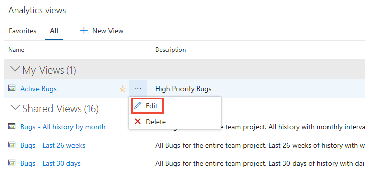
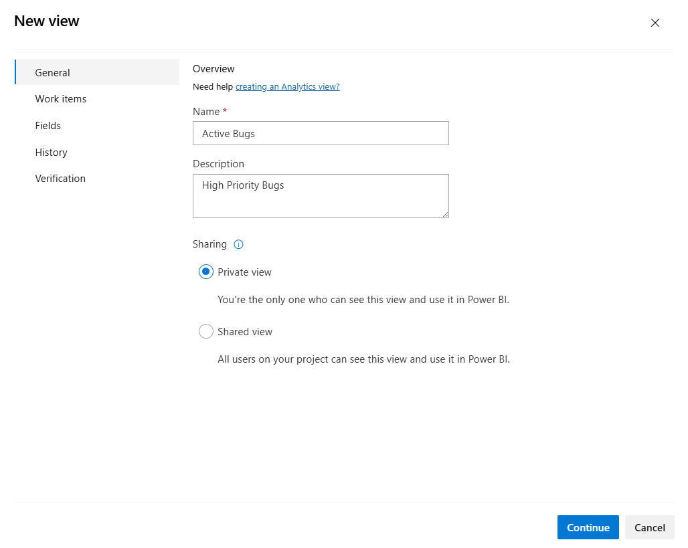
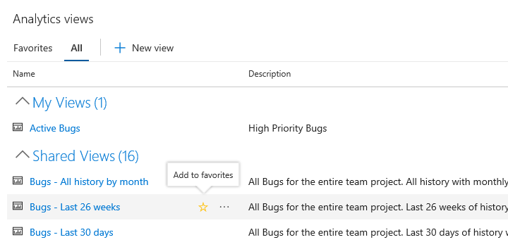

# Manage Analytics views 

[!INCLUDE [version-gt-eq-2019](../../includes/version-gt-eq-2019.md)]

With Analytics views, you gain a simplified way to specify and share the filter criteria for a Power BI report based on Analytics data. Analytics provides the reporting platform for Azure DevOps. 

[!INCLUDE [temp](includes/analytics-views-warning.md)]

Use this article to learn how to:

> [!div class="checklist"]
> * Meet prerequisites to access Analytics views
> * Open **Analytics views**
> * Edit an existing view
> * Share a view
> * Favorite a view
> * Manage permissions for a shared view
> * Delete a view

[!INCLUDE [temp](../includes/boards-disabled.md)]

[!INCLUDE [temp](../includes/analytics-prerequisites.md)] 

[!INCLUDE [temp](../includes/analytics-open.md)] 

## Edit an existing view

The creator of a view and all members of the Project Administrators and Project Collection Administrators groups have permissions to edit, manage, and delete views.

1. From either the **Favorites** or **All** page, hover over the view you want to edit, select the :::image type="icon" source="../media/icons/actions-icon.png" border="false"::: actions icon, and choose the **Edit** option. You can also choose **Edit** from the Summary panel. 

	> [!div class="mx-imgBorder"]
	> 

2. You can edit any part of the view, in the same way you did to define a view. For details, see [Create an Analytics view.](analytics-views-create.md)

3. Save your changes.

	Refresh your Power BI report to access the changes you made to the view.

   > [!TIP]
   > If you remove fields from a view that are in use in the report, you'll need to update any Power BI report that references the view. 

<a id="share-view" />

## Share a view 

All contributors to a project can view shared views and create Power BI reports based on them. When you create a view, you can choose to make it private or shared. 

To share a private view, edit the view and change the sharing option to **Shared**. To unshare a view, switch the sharing option to **Private**.
 

> [!IMPORTANT]
> If you plan to share [Power BI reports or dashboards](/power-bi/service-share-dashboards) based on an Analytics view, make sure the view is **Shared**. Otherwise, you are the only one who can modify the view and manually refresh the data. We recommend sharing views to support shared reports and dashboards.
> 
> [!div class="mx-imgBorder"]
> 

## Favorite a view

Favoriting an item provides a quick way to navigate to items you regularly visit. 
To favorite a view, hover over the view and choose the .
    
> [!div class="mx-imgBorder"]
> 

<a id="manage-permissions" />
 

[!INCLUDE [temp](includes/manage-shared-view-permissions.md)]

 

## Delete a view

You can always delete a view you created. Once you delete a view, any Power BI report or dashboard that depends on the view will no longer refresh.

To delete a view, select the :::image type="icon" source="../media/icons/actions-icon.png" border="false"::: actions icon and choose :::image type="icon" source="../../media/icons/delete-icon.png" border="false"::: **Delete** from the menu.

## Next steps

> [!div class="nextstepaction"]
> [Create a Power BI report using an Analytics view](data-connector-connect.md)

## Related articles
- [Create an Analytics view](analytics-views-create.md) 
- [Data available from Analytics](data-available-in-analytics.md)
- [Grant permissions to access Analytics](./analytics-security.md)
- [Power BI integration overview](overview.md)
- [Query work tracking data using Analytics](../extend-analytics/analytics-recipes.md)
- [Entities and properties reference for Azure Boards](../analytics/entity-reference-boards.md) 

## Related resources 

- [Wiql to OData Marketplace extension](https://marketplace.visualstudio.com/items?itemName=ms-eswm.wiql-to-odata)