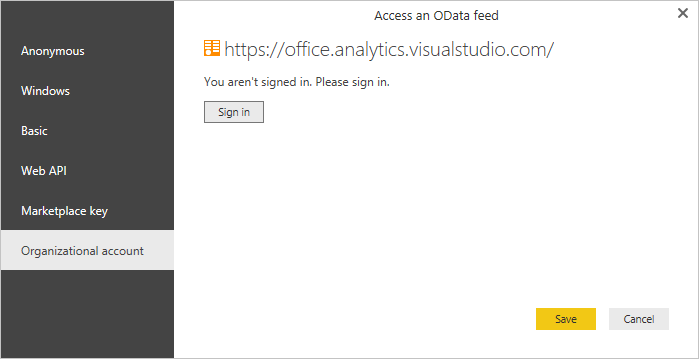
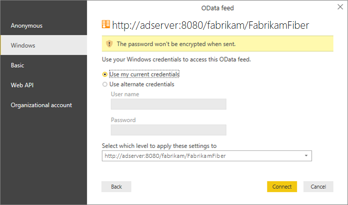
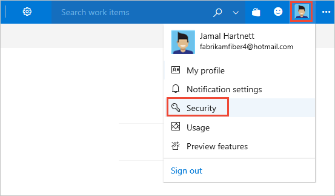
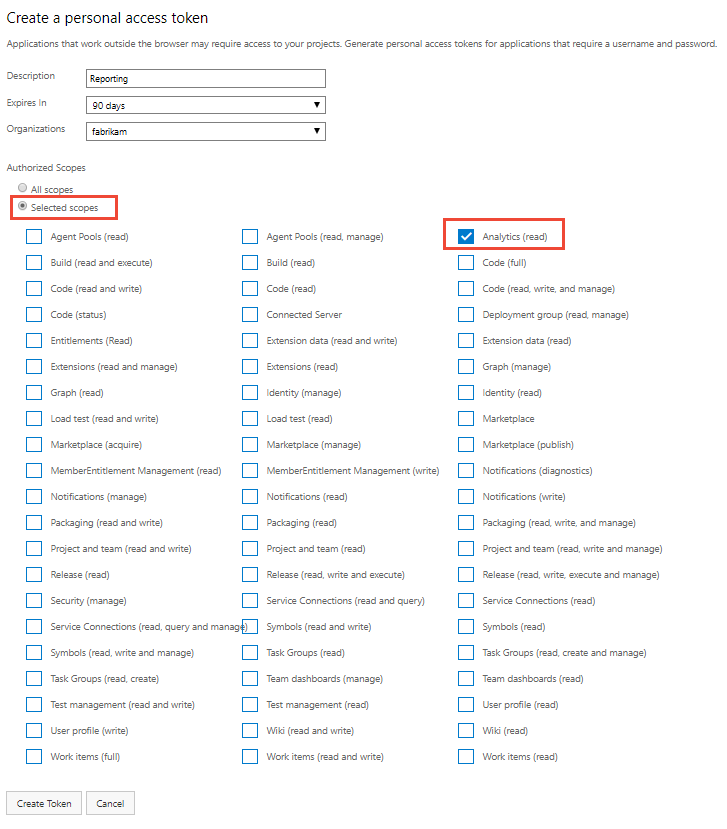
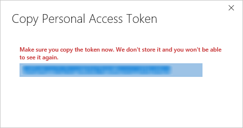

# Enter client credentials in Power BI or Excel 

[!INCLUDE [temp](../includes/version-azure-devops.md)]

::: moniker range="azure-devops"

When connecting from Power BI or Excel to Analytics using the OData feed, choose Azure Active Directory (**Azure AD**) for the most secure option. The next secure option is the use of Personal Access Tokens (**PATs**).

::: moniker-end

::: moniker range=">= azure-devops-2019 < azure-devops"

When connecting from Power BI or Excel to Analytics using the OData feed, choose Windows credentials as the most secure option. The next secure option is the use of Personal Access Tokens (**PATs**).

::: moniker-end

[!INCLUDE [temp](../includes/analytics-preview.md)]

#### Why use a Personal Access Token over an Alternate Access Credential? 

For these three reasons:

- As part of good password management, these tokens automatically expire so you don't have to remember to change your password
- Since PATs are a generated password, you won't use a common password as part of your AAC, which means a more limited surface area for attack  
- If you need to provide a diagnostic trace and forget to replace the value, you can simply revoke the credential thereby maintaining secure access to Azure DevOps.

::: moniker range="azure-devops"

## Azure Active Directory (Azure AD) 

Azure Active Directory is also known as "Organizational Credential" in Power BI Desktop. You can use it in  [PowerBI.com](https://powerbi.microsoft.com) through OAuth selection when configuring data refresh.

1. When connecting with Power BI Desktop you will be prompted to enter your credentials for the data source. Click Organizational account as shown here:

	 

2. Choose <strong>Sign in</strong> and enter your Azure AD credentials. After that, you're done.

To change an existing URL to use Azure AD instead of a PAT or AAC, see [Change authentication credentials](#update-credentials) later in this article.

::: moniker-end

::: moniker range=">= azure-devops-2019 < azure-devops"

## Windows

You can use Windows authentication in [PowerBI.com](https://powerbi.microsoft.com) through OAuth selection when configuring data refresh.

1. When connecting with Power BI Desktop you will be prompted to enter your credentials for the data source. Click Windows as shown here:

	

2. Enter your Windows credentials and choose <strong>Connect</strong>.

To change an existing URL to use Windows instead of a PAT, see [Change authentication credentials](#update-credentials) later in this article.

::: moniker-end

## Create a Personal Access Token  

1. Sign in to Azure DevOps Services, open your user profile menu, and select **Security**.  

	  

1. Enter the required information: 
   - Add a description  
   - Set the expiration period  
   - Select the organization 
   - Choose Selected scopes
   - Check the **Analytics (read)**
	
     And, then choose **Create Token**.  

     > [!div class="mx-imgBorder"]  
     >   

2. Copy the token that displays. If you navigate away from the page, you won't be able to retrieve it later.  

	  

3. If you need to revoke a token, simply navigate to this page and choose the **Revoke** link. That token will immediately be denied access to Azure DevOps Services.
	
	These tokens are your identity. When used, the token is acting as you. Keep your tokens secret and treat them like your password. To help keep your token more secure, consider using credential managers so that you don't have to enter your credentials every time you push.  

## Enter credentials within a client

Both Power BI and Excel work using Power Query when accessing OData, therefore the authentication mechanism, including the various
authentication screens are identical. This walkthrough is done using Power BI Desktop, however it also applies to Excel.

1. Open <strong>Power BI Desktop</strong>.  

2. Choose <strong>Get Data</strong>.  

3. Click <strong>OData Feed</strong> (or <strong>More>Other>OData Feed</strong>).  

4. Enter the URL for the OData endpoint and choose <strong>OK</strong>.  

	::: moniker range="azure-devops"

	
	
	::: moniker-end  

	::: moniker range=">= azure-devops-2019 < azure-devops"

	

	::: moniker-end

5. In the authentication dialog, choose <strong>Basic</strong>, enter your credentials, and then choose <strong>Connect</strong>:  
   - If you are using an AAC, enter your username and password  
   - If you are using a PAT, enter a text string, such as "test" or "user" for the username and enter the token in the password field.  

     ::: moniker range="azure-devops"

       

     ::: moniker-end

     ::: moniker range=">= azure-devops-2019 < azure-devops"

       

     ::: moniker-end

## Change authentication credentials

If you receive an access denied message, you may need to change your authentication credentials. Power Query caches your credential information so you only have to enter it once. However, Personal Access Tokens expire and you may need to update or change your authentication information. 

### Update credentials in Power BI Desktop

1. Open **Power BI Desktop**.  

2. Click **File** > **Options and Settings** > **Data Source Settings**. Select the correct URL to the OData Feed and click **Edit**.  

	::: moniker range="azure-devops"

	   

	::: moniker-end

	::: moniker range=">= azure-devops-2019 < azure-devops"

	   

	::: moniker-end

3. In the next **Data Source Settings** dialog, click the Edit button under the Credentials setting.   

	::: moniker range="azure-devops"

	

	::: moniker-end

	::: moniker range=">= azure-devops-2019 < azure-devops"

	 

	::: moniker-end

4. Edit the credentials as noted above, click **Save**, then **Done**, then **Close**. 

### Update credentials in Excel 

1. Open **Excel** and click the **Data** tab.  

2. Click **New Query** > **Data Source Settings...**

	

3. Select the correct URL to the OData Feed and click **Edit**.  

	::: moniker range="azure-devops"

	   

	::: moniker-end

	::: moniker range=">= azure-devops-2019 < azure-devops"

	   

	::: moniker-end

4. In the next **Data Source Settings** dialog, click the Edit button under the Credentials setting. 
 
	::: moniker range="azure-devops"

	

	::: moniker-end

	::: moniker range=">= azure-devops-2019 < azure-devops"

	 

	::: moniker-end

5. Edit the credentials as noted above, click **Save**, then **Done**, then **Close**.

## Publish to PowerBI.com

After you have created a model and loaded it with data you can [publish it to Power BI](publish-power-bi-desktop-to-power-bi.md). When using Azure AD or Windows, make sure to select
the **oAuth2** option. 

## Related articles
 
- [Authenticate your identity with personal access tokens](../../organizations/accounts/use-personal-access-tokens-to-authenticate.md)  
- [Access data through Excel](access-analytics-excel.md)  
- [Access data through Power BI desktop](access-analytics-power-bi.md)  
- [Publish a Power BI Desktop file to PowerBI.com](publish-power-bi-desktop-to-power-bi.md)  

<!---
From the Personal access tokens page, choose **Add**:  

  
-->