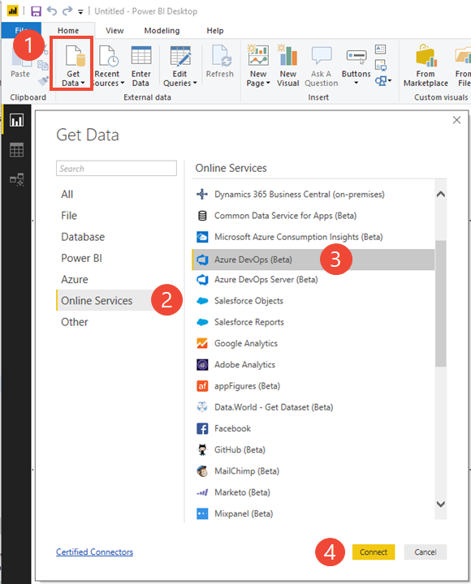
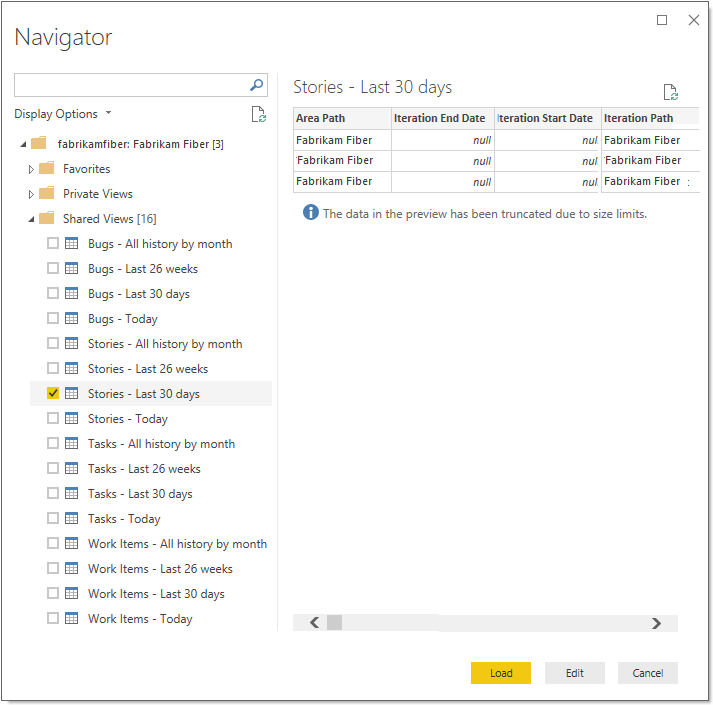
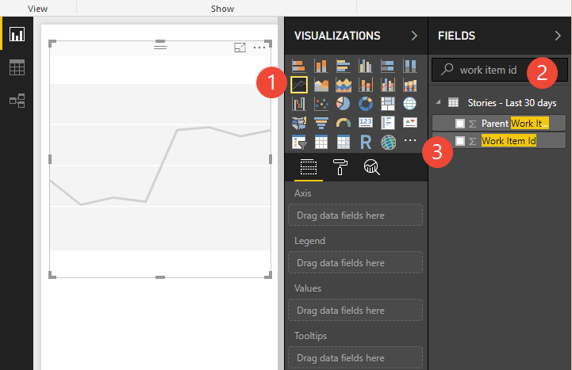
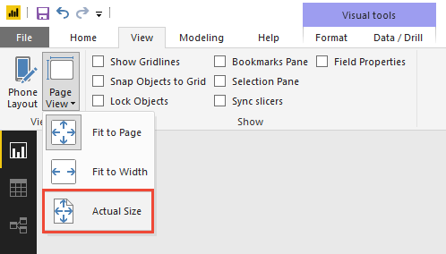
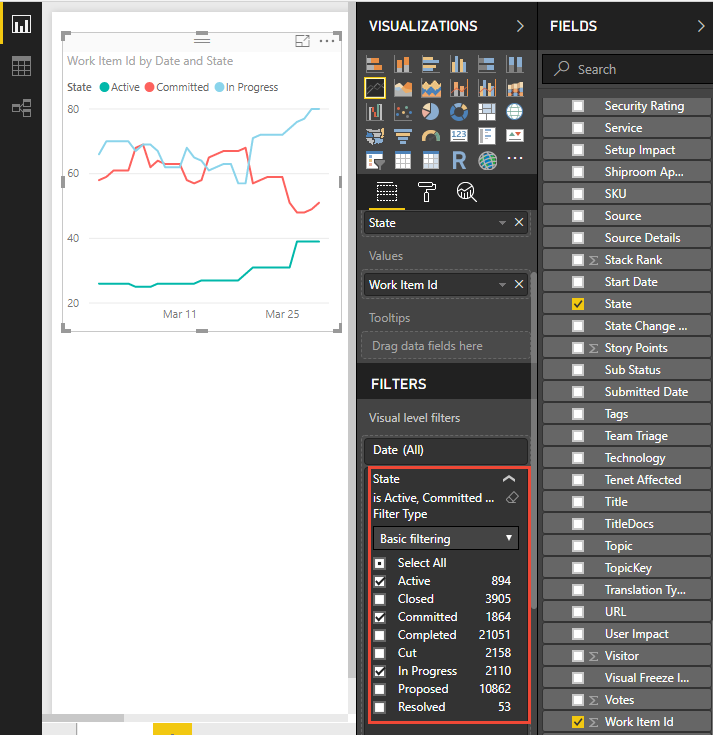
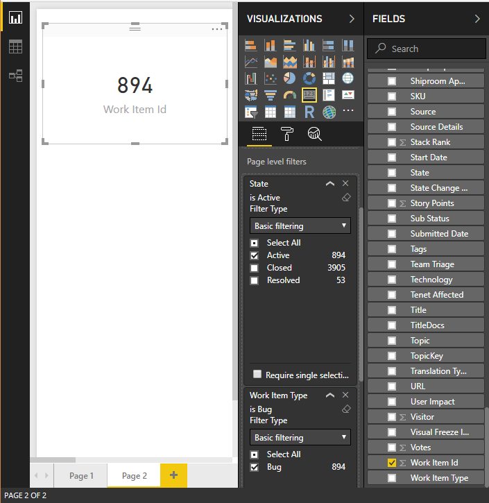

# Create a Power BI report with a default Analytics view

[!INCLUDE [temp](../../_shared/version-vsts-only.md)]

With Power BI Desktop, you can easily connect to an Analytics view to start creating reports for your Azure DevOps team project. An Analytics view provides a simplified way to specify the filter criteria for a Power BI report based on the Analytics Service data store. 

If you don't have Power BI Desktop, you can [download](https://powerbi.microsoft.com/desktop) and install it for free.

You can create status and trend reports of your work tracking data using one of the default Analytics views available to you. As needed, you can also [create a custom Analytics view](../analytics/analytics-views-create.md). 
 
Follow these steps to create two reports in Power BI desktop that shows a **daily trend of backlog items** and a **count of active user stories** based on a default **Analytics view**:

1. From the web portal for Azure DevOps:  
	a. Open **Analytics view**   
	b. Verify a default Analytics view for your data.    
2. From the Power BI Desktop:  
	a. Get the dataset defined by the Analytics view     
	b. Create a trend report   
	c. Apply filters to your trend report    
	d. Create a card and apply the **Is Current=True** filter to show current count.    

[!INCLUDE [temp](../_shared/analytics-view-availability.md)]

## Prerequisites  

In order to create a Power BI report that references an Analytics view, you must meet the following criteria:  

* You must be a member of a project. If you don't have a project yet, [create one](../../boards/get-started/sign-up-invite-teammates.md). 
* If you haven't been added as a team member, [get added now](/azure/devops/organizations/accounts/add-organization-users-from-user-hub). Anyone with access to the team project, except stakeholders, can view Analytics views.
* Have installed the [Analytics Marketplace extension](https://marketplace.visualstudio.com/items?itemName=ms.vss-analytics). You must be an account owner or a member of the [Project Collection Administrator group](/azure/devops/organizations/security/set-project-collection-level-permissions) to add extensions.
* Have the **View Analytics** permission set to **Allow**. See [Grant permissions  to access the Analytics Service](/azure/devops/report/analytics/analytics-security).
- Have installed *Power BI Desktop* *February 2018 Update* or later version. You can download this client application from the official [Power BI Desktop download page](https://powerbi.microsoft.com/desktop).
- Have tracked work items for some period of time on which to generate a trend report. 

[!INCLUDE [temp](../_shared/analytics-open.md)]

## Verify the default Analytics view for your data 

By verifying the view you'll use in Power BI, your view is more likely to load correctly in Power BI. If verification takes too long, you can quickly adjust the view. Add filters or narrow your history and verify your view again.

0. From the **Analytics view>All** page, choose the  actions icon next to the default view and select the **Edit** option. For a team project that uses the Agile process, this will be the **Stories -Last 30 days** view.  

	> [!div class="mx-imgBorder"]
	>   

0. Choose the **Verification** tab and then the **Verify view** button. 

 	> [!div class="mx-imgBorder"]  
	>   

	Wait until the verification process completes. Verification time varies according to the amount of data defined in your view. For example, a view that includes all work item types and specifies "All history", will take more time to verify than a view that includes only stories and specifies a rolling period of 30 days.

 	> [!div class="mx-imgBorder"]  
	>   

0. If your view successfully verifies, then proceed to the next step. If it is unsuccessful, click the **Work Items** tab and adjust the selections to select fewer teams or specify fewer work items in the dataset.  

	To learn more about defining views, see [Create an Analytics view](../analytics/analytics-views-create.md).  

## Connect to an Analytics view 

0. Open Power BI Desktop.  
 
0. Choose **Get Data**, choose **Online Services**, then **Azure DevOps (Beta)**, and then click **Connect**. 

    > [!div class="mx-imgBorder"]  
    >   

0. Enter your account name and a team project for the data you want to report on.  

	 

0. Expand the **Shared Views** folder, choose an Analytics view, and then choose **Load**. All views listed, except those appended with "Today", will provide historical trend data. 

	Here we choose **Stories - Last 30 days**. This view filters for product backlog items.

	 

	Need help connecting? See [Connect with Power BI Data Connector](data-connector-connect.md).

	> [!NOTE]  
	> Because you verified the view in the previous section, the view should load. However, if the view won't load, it is most likely because the dataset is too large. Return to the view under the **Analytics view** in the web portal and adjust the filters to decrease the size of the dataset. 

## Create a daily trend report 

0. In your report, (1) select the Line chart visual, (2) enter `work item id` in the search field, and then (3) check the box for **Work Item Id**.   

    > [!div class="mx-imgBorder"]  
    >   

	This will change your chart to a single dot.  

	> [!TIP]    
	> To change the chart size, choose the **View** tab, **Page View**, and then select the **Adjust Size** option as shown. You can then resize the chart to your desired dimensions.  
	> 
	>   
	
0. Next, (1) select the **Date** field in the fields list as your axis. By default, Power BI creates a date hierarchy from any date field. To see a daily trend, (2) click the context menu icon next to the field and change it from **Date Hierarchy** to **Date**.

   > [!div class="mx-imgBorder"]
   > 

    > [!NOTE]
    > To view trends over time, you want to use the **Date** format and not **Date Hierarchy**. The **Date Hierarchy** in Power BI rolls ups everything into a simple number for the period. The day level in the hierarchy rolls all days to a number between 1-31. For example, April 3 and May 3 both roll up into number 3. This is not the same as counting items per actual date.

## Group and filter the trend by State

- To group your user stories by State, drag the **State** field into the Legend area. Optionally, filter the set of States to show in the chart. 

	Here we've filtered the list to show work items in the Active, Committed, and In Progress states. 

    > [!div class="mx-imgBorder"]
    > 

	The chart now shows a daily distinct count of user stories, grouped by Active, Committed, and In Progress.

	> [!TIP]    
	> If you need to modify your Analytics view, you can do so and then return to your Power BI report and refresh the data. Simply click the **Refresh** option as shown.  
	> 
	> 

## Create a card to show the latest active stories count

0. Add a new page by clicking the plus sign (+) at the bottom of the page. 

0. Select the card visual, add the **Work Item Id** field, and then drag the **State** and **Work Item Type** fields under Page level filters. Filter the State to show Active, and filter the Work Item Type for Bugs. 

	The card now shows the number of active stories times the number of days each one was defined during the past 60 days. For this example, that number is 894. 
    
    > [!div class="mx-imgBorder"]
    > 
    

0. To get the latest active stories count, you filter the card to count only the latest revision of the filtered set of work items. Add **Is Current** as a filter and select `True` to filter only the data for the latest day. **Is Current** is a field added to the view automatically marking the rows that contain the latest revision of the work items. 

	Applying this filter brings the Active stories count to 39. 

    > [!div class="mx-imgBorder"]
    > 

	The value should match the count on the last day of the trend chart that you created in the previous section.

## Continue to explore your data

The reports shown in this quickstart illustrate how easy it is to generate reports of your work tracking data using Analytics views. 

## Try this next
> [!div class="nextstepaction"]
> [Create an Active bugs report](active-bugs-sample-report.md)

## Related articles 
- [Get started with Power BI Desktop](/power-bi/desktop-getting-started)
- [Power BI integration overview](overview.md) 
- [Create Analytics views](../analytics/analytics-views-create.md)
- [Connect with Power BI Data Connector](./data-connector-connect.md)
- [Dataset design for the Power BI Data Connector](data-connector-dataset.md)
