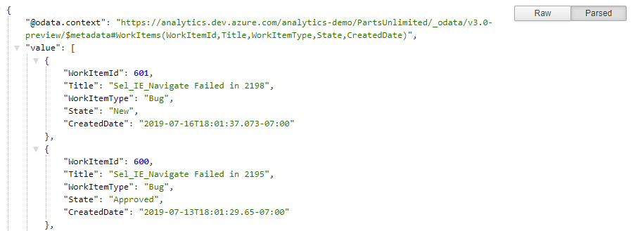
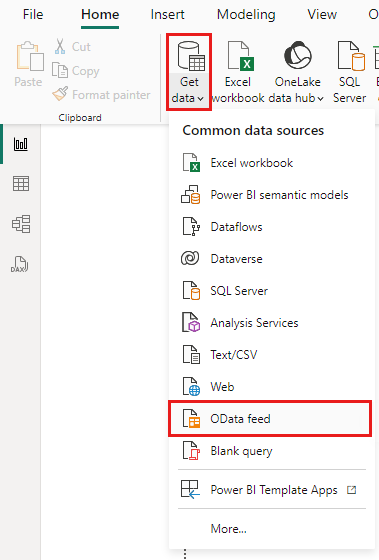
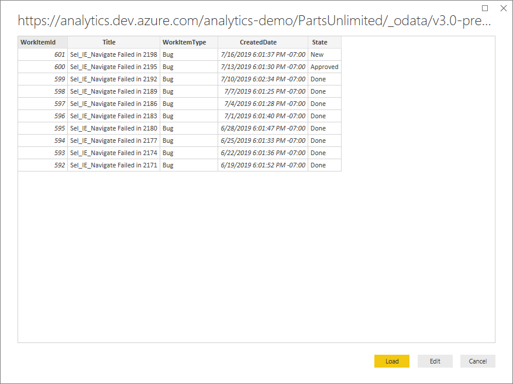
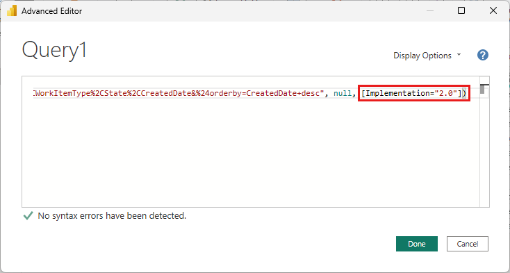

# Connect with data by using Power BI and OData queries

[!INCLUDE [temp](../includes/version-azure-devops.md)]

Using OData queries is the recommended approach for pulling data into Power BI. OData (Open Data Protocol) is an ISO/IEC approved, OASIS standard that defines a set of best practices for building and consuming REST APIs. To learn more, see [OData documentation](/odata/).

To get started quickly, check out the [Overview of sample reports that use OData queries](sample-odata-overview.md). For information about other approaches, see [Power BI integration overview](overview.md). 

Power BI can run OData queries, which can return a filtered or aggregated set of data to Power BI. OData queries have two advantages: 
* All filtering is done server-side. Only the data you need is returned, which leads to shorter refresh times.
* You can pre-aggregate data server-side. An OData query can perform aggregations such as work item rollup and build failure rates. The aggregations are accomplished server-side, and only the aggregate values are returned to Power BI. With pre-aggregation, you can perform aggregations across large data sets, without needing to pull all the detail data into Power BI.

In this article, you learn how to:

> [!div class="checklist"]
> * Write and test OData queries.
> * Run an OData query from Power BI.

[!INCLUDE [temp](./includes/prerequisites-power-bi.md)]

## Use Visual Studio Code to write and test OData queries

The easiest way to write and test OData is to use [Visual Studio Code](https://aka.ms/vscode) with the [OData extension](https://marketplace.visualstudio.com/items?itemName=stansw.vscode-odata). Visual Studio Code is a free code editor available on Windows, Mac, and Linux. The OData extension provides syntax highlighting and other functions that are useful for writing and testing queries. 

### 1. Install Visual Studio Code
 
To download and install Visual Studio Code, go to the [Visual Studio Code download page](https://aka.ms/vscode).

### 2. Install the OData extension

Open Visual Studio Code, select **Extensions**, and then search for *odata*. In the results list, select **vscode-odata**, and then install it.

### 3. Create an .odata file

In Visual Studio Code, create and save a file called *filename.odata*. You may name it whatever you want, but it must have an *.odata* extension to enable the OData extension functionality.

### 4. Write the OData query

Write the OData query. For example queries, review the [Overview of sample reports using OData queries](sample-odata-overview.md). 

The following query returns the top 10 work items under a specific area path. Replace {organization}, {project}, and {area path} with your values.

```
https://analytics.dev.azure.com/{organization}/{project}/_odata/v3.0-preview/WorkItems?
    $select=WorkItemId,Title,WorkItemType,State,CreatedDate
    &$filter=startswith(Area/AreaPath,'{area path}')
    &$orderby=CreatedDate desc
    &$top=10
``` 
To query across projects, omit `/{project}` entirely. 

For more information about how to write OData queries against Analytics, see [OData query quick reference](../extend-analytics/quick-ref.md). 

After you've written the query in Visual Studio Code, you should see syntax highlighting:


### 5. Test the OData query

To test the OData query, place your cursor anywhere in the query text and select **View** > **Command Palette**. In the search box, type **odata** to bring up all the OData commands:


Select **OData: Open**. This action combines the multiline query into a one-line URL and opens it in your default browser. 

The OData query result set is in JSON format. To view the results, install the JSON Formatter extension for your browser. Several options are available for both Chrome and Microsoft Edge.



If the query has an error, the Analytics service returns an error in JSON format. For example, this error states that the query has selected a field that doesn't exist:

> 

After you've verified that the query works correctly, you can run it from Power BI.

## Run the OData query from Power BI

### 1. Combine the multiline OData query into a single-line query

Before you use the query in Power BI, you must convert the multiline OData query into a single-line query. The simplest way to do this is to use [Visual Studio Code](https://aka.ms/vscode) with the [OData extension](https://marketplace.visualstudio.com/items?itemName=stansw.vscode-odata) and use the **OData: Combine** command.

> [!NOTE]
> In your *filename.odata* file, you might want to first create a copy of the multiline query text and then run **OData: Combine** on the copy. You do this because there's no way to convert the single-line query back to a readable multiline query. 

In Visual Studio Code, place your query anywhere in the query text, and then select **View** > **Command Palette**. In the search box, type **odata** and then, in the results list, select **OData: Combine**.

The multiline query is converted into a single-line query.


Copy the entire line for use in the next section.

### 2. Run the query from Power BI

Open Power BI, select **Get Data**, and then select the **OData feed** connector. For more information, see [Create a Power BI report with an OData query](create-quick-report-odataq.md).



In the **OData feed** window, in the **URL** box, paste the OData query that you copied in the preceding section, and then select **OK**.


Power BI displays a preview page:




### 3. Specify query options

On the preview page, select **Edit** to open the Power Query Editor.


In the ribbon, select **Advanced Editor**.


In the **Query** pane, scroll horizontally to view the `[Implementation="2.0"]` parameter.



Replace `[Implementation="2.0"]` with the following string:

`[Implementation="2.0",OmitValues = ODataOmitValues.Nulls,ODataVersion = 4]` 


> [!NOTE]
> The following actions help accomplish this preventative measure: 
>
> **Prevent throttling errors**. Power Query attempts to resolve null values as errors by generating an additional query for every null value it encounters. This can result in thousands of queries, which will quickly exceed your usage threshold, beyond which your user account will be throttled.
>
> To prevent this issue:  
> - Instruct Power BI to reference OData v4.
> - Instruct the Analytics service to omit any values that are null, which improves query performance.

> [!NOTE]
> The following action is required for Power BI to successfully run an OData query against the Azure DevOps Analytics Service.
>
> Select **OK** to close the Advanced Editor and return to the Power BI Power Query Editor. You can use Power Query Editor to perform these optional actions:  
> - Rename the "Query1" query as something more specific.
> - Transform columns to a specific type. Power BI auto-detects the type, but you might want to convert column to a specific data type. 
> - Add computed columns.
> - Remove columns.
> - Expand columns into specific fields.

### 4. Create a report by using the data

Select **Close & Apply** to save your settings and pull the data into Power BI. After the data is refreshed, you can create a report as you would normally in Power BI.


## Related articles

- [Sample Power BI Reports by using OData queries](sample-odata-overview.md)
- [Data available from Analytics](data-available-in-analytics.md)
- [Grant permissions to access Analytics](./analytics-security.md)
- [Power BI integration overview](overview.md)

