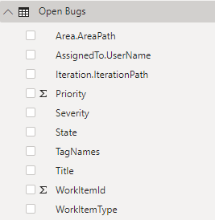

# Open bugs or user stories sample reports 

[!INCLUDE [version-gt-eq-2019](../../includes/version-gt-eq-2019.md)]

To create a list of bugs or user stories, you select the matrix report in Power BI and using a query similar to the ones provided in this article. The report you generate lists open bugs broken down by State and Assigned To fields, as shown in  the following image. 

:::image type="content" source="media/reports-boards/open-bugs-report.png" alt-text="Screenshot of Open Bugs sample matrix report.":::

[!INCLUDE [temp](includes/sample-required-reading.md)]

[!INCLUDE [temp](./includes/prerequisites-power-bi.md)]


## Sample queries

Several queries are provided which filter bugs or user stories by area path, iteration path, or team.  

### Bugs filtered by Area Path

#### [Power BI query](#tab/powerbi/)

[!INCLUDE [temp](includes/sample-powerbi-query.md)]

```
let
   Source = OData.Feed ("https://analytics.dev.azure.com/{organization}/{project}/_odata/v3.0-preview/WorkItems?"
        &"$filter=WorkItemType eq 'Bug' "
            &"and StateCategory ne 'Completed' "
            &"and startswith(Area/AreaPath,'{areapath}') "
        &"&$select=WorkItemId,Title,WorkItemType,State,Priority,Severity,TagNames,AreaSK "
        &"&$expand=AssignedTo($select=UserName),Iteration($select=IterationPath),Area($select=AreaPath) "
    ,null, [Implementation="2.0",OmitValues = ODataOmitValues.Nulls,ODataVersion = 4]) 
in
    Source
```

#### [OData query](#tab/odata/)

[!INCLUDE [temp](includes/sample-odata-query.md)]

```
https://analytics.dev.azure.com/{organization}/{project}/_odata/v3.0-preview/WorkItems?
        $filter=WorkItemType eq 'Bug'
            and StateCategory ne 'Completed'
            and startswith(Area/AreaPath,'{areapath}')
        &$select=WorkItemId,Title,WorkItemType,State,Priority,Severity,TagNames,AreaSK
        &$expand=AssignedTo($select=UserName),Iteration($select=IterationPath),Area($select=AreaPath)
```

***

### Substitution strings

[!INCLUDE [temp](includes/sample-query-substitutions.md)]
- `{areapath}` - Your Area Path. Example format: `Project\Level1\Level2`


### Query breakdown

The following table describes each part of the query.

:::row:::
   :::column span="2":::
   **Query part**
   :::column-end:::
   :::column span="2":::
   **Description**
   :::column-end:::
:::row-end:::
:::row:::
   :::column span="2":::
   `$filter=WorkItemType eq 'Bug'`
   :::column-end:::
   :::column span="2":::
   Return Bugs.
   :::column-end:::
:::row-end:::
:::row:::
   :::column span="2":::
   `and StateCategory ne 'Completed'`
   :::column-end:::
   :::column span="3":::
   Filters out items that are completed. For more information on State Categories, see [How workflow states and state categories](../../boards/work-items/workflow-and-state-categories.md) are used in Backlogs and Boards.
   :::column-end:::
:::row-end:::
:::row:::
   :::column span="2":::
   `and startswith(Area/AreaPath,'{areapath}')`
   :::column-end:::
   :::column span="2":::
   Work items under a specific Area Path. Replacing with `Area/AreaPath eq '{areapath}'` returns items at a specific Area Path.
   
   To filter by Team Name, use the filter statement `Teams/any(x:x/TeamName eq '{teamname})'`.
   :::column-end:::
:::row-end:::
:::row:::
   :::column span="2":::
   `&$select=WorkItemId, Title, WorkItemType, State, Priority, Severity, TagNames`
   :::column-end:::
   :::column span="2":::
   Select fields to return.
   :::column-end:::
:::row-end:::
:::row:::
   :::column span="2":::
   `&$expand=AssignedTo($select=UserName), Iteration($select=IterationPath), Area($select=AreaPath)`
   :::column-end:::
   :::column span="2":::
   Expand Assigned To, Iteration, Area entities and select entity fields.
   :::column-end:::
:::row-end:::


### User stories filtered by teams 

You can query for open bugs by one or more teams rather than Area Path.  

#### [Power BI query](#tab/powerbi/)

[!INCLUDE [temp](includes/sample-powerbi-query.md)]

```
let
   Source = OData.Feed ("https://analytics.dev.azure.com/{organization}/{project}/_odata/v3.0-preview/WorkItems?"
        &"$filter=WorkItemType eq 'Bug' "
            &"and StateCategory ne 'Completed'' "
            &"and (Teams/any(x:x/TeamName eq '{teamname}') or Teams/any(x:x/TeamName eq '{teamname}') or Teams/any(x:x/TeamName eq '{teamname}') "
        &"&$select=WorkItemId,Title,WorkItemType,State,Priority,Severity,TagNames,AreaSK "
        &"&$expand=AssignedTo($select=UserName),Iteration($select=IterationPath),Area($select=AreaPath) "
    ,null, [Implementation="2.0",OmitValues = ODataOmitValues.Nulls,ODataVersion = 4]) 
in
    Source
```

#### [OData query](#tab/odata/)

[!INCLUDE [temp](includes/sample-odata-query.md)]

```
https://analytics.dev.azure.com/{organization}/{project}/_odata/v3.0-preview/WorkItems?
        $filter=WorkItemType eq 'Bug'
            and StateCategory ne 'Completed'
            and (Teams/any(x:x/TeamName eq '{teamname}') or Teams/any(x:x/TeamName eq '{teamname}') or Teams/any(x:x/TeamName eq '{teamname}')
        &$select=WorkItemId,Title,WorkItemType,State,Priority,Severity,TagNames,AreaSK
        &$expand=AssignedTo($select=UserName),Iteration($select=IterationPath),Area($select=AreaPath)
```

***

### User Stories in a specific Area Path and Iteration Path

The following query supports filterg  user stories for a specific Area Path and Iteration Path.

#### [Power BI query](#tab/powerbi/)

[!INCLUDE [temp](includes/sample-powerbi-query.md)]

```
let
   Source = OData.Feed ("https://analytics.dev.azure.com/{organization}/{project}/_odata/v3.0-preview/WorkItems?"
        &"$filter=WorkItemType eq 'User Story' "
            &"and startswith(Area/AreaPath,'{areapath}') "
            &"and startswith(Iteration/IterationPath,'{iterationpath}') "
        &"&$select=WorkItemId,Title,WorkItemType,State,Priority,Severity,TagNames,AreaSK "
        &"&$expand=AssignedTo($select=UserName),Iteration($select=IterationPath),Area($select=AreaPath) "
    ,null, [Implementation="2.0",OmitValues = ODataOmitValues.Nulls,ODataVersion = 4]) 
in
    Source
```

#### [OData query](#tab/odata/)

[!INCLUDE [temp](includes/sample-odata-query.md)]

```
https://analytics.dev.azure.com/{organization}/{project}/_odata/v3.0-preview/WorkItems?
        $filter=WorkItemType eq 'User Story'
            and startswith(Area/AreaPath,'{areapath}')
            and startswith(Iteration/IterationPath,'{iterationpath}')
        &$select=WorkItemId,Title,WorkItemType,State,Priority,Severity,TagNames,AreaSK
        &$expand=AssignedTo($select=UserName),Iteration($select=IterationPath),Area($select=AreaPath)
```

***


[!INCLUDE [temp](includes/query-filters-work-items.md)]

## Expand columns in Power BI

The `&$expand=AssignedTo($select=UserName), Iteration($select=IterationPath), Area($select=AreaPath)` clause returns records that contain several fields. Prior to creating the report, you need to expand the record to flatten it into specific fields. In this instance, you'll want to expand the following records: 

- `AssignedTo`
- `AreaPath`
- `IterationPath`

To learn how, see [Transform Analytics data to generate Power BI reports](transform-analytics-data-report-generation.md). 
 

## (Optional) Rename fields

Once you have expanded the columns, you may want to rename one or more fields. For example, you can rename the column `AreaPath` to `Area Path`. To learn how, see [Rename column fields](transform-analytics-data-report-generation.md#rename-column-fields). 


## (Optional) Rename query 

You can the default query label, *Query1* to something more meaningful. To do so, see [Rename the query](transform-analytics-data-report-generation.md#rename-the-query).  


## Create the report

Power BI shows you the fields you can report on. 

> [!NOTE]   
> The example below assumes that no one renamed any columns. 

> [!div class="mx-imgBorder"] 
> 

For a simple report, do the following steps:

1. Select Power BI Visualization **Matrix**. 
1. Add the field "State" to **Columns**.
1. Add the field "AssignedTo.UserName" to **Rows**.
1. Add the field "WorkItemId" to **Values**.
    - Right-click "WorkItemId" field and ensure **Count** is selected.

The example report displays. 
 
:::image type="content" source="media/reports-boards/open-bugs-report.png" alt-text="Screenshot of Sample Open Bugs matrix report.":::


## Related articles

[!INCLUDE [temp](includes/sample-relatedarticles.md)]
