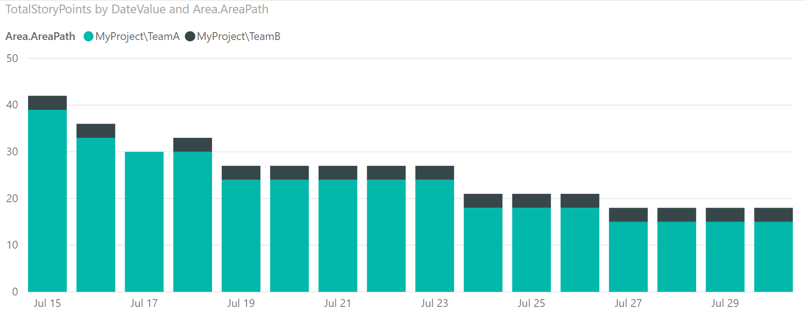
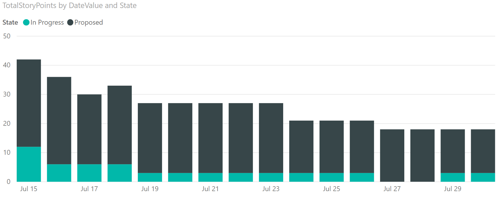

# Release burndown sample queries and reports

[!INCLUDE [version-gt-eq-2019](../../includes/version-gt-eq-2019.md)]

Burndown and burnup reports show how much work is getting completed over time. The following image shows burndown both by count of User Stories and sum of Story Points.

:::image type="content" source="media/reports-boards/release-burndown-clustered-column-chart-report.png" alt-text="Screenshot of Power BI Release burndown clustered column chart report.":::

Burndown charts only make sense if you plan your work for the time period of the chart. Otherwise, if you plan on a sprint-by-sprint basis, you won't see a standard burndown. In these instances, a burnup chart makes more sense to see how progress is made over time. 

To learn more about burndown and burnup, see [Configure a Burndown or Burnup widget](../dashboards/configure-burndown-burnup-widgets.md) and [Burndown and burnup guidance](../dashboards/burndown-guidance.md).


[!INCLUDE [temp](includes/sample-required-reading.md)]

[!INCLUDE [prerequisites-simple](../includes/analytics-prerequisites-simple.md)]

## Sample queries

The queries in this section show how to generate burndown charts of work items based on historical data. All of these queries specify the `WorkItemSnapshot` entity set.  

[!INCLUDE [temp](includes/query-filters-work-items.md)]

### Burndown of User Stories in an area path from start and end date

The following query shows you how to return historical data of User Stories for a release based on work items tagged with a release tag. 

> [!NOTE]  
> For reports based on filtering a tag, the tag must be assigned to the work item at the start of the release or burndown/burnup start date. Otherwise, the work item isn't included in the returned data.  

#### [Power BI query](#tab/powerbi/)

[!INCLUDE [temp](includes/sample-powerbi-query.md)]

```
let
   Source = OData.Feed ("https://analytics.dev.azure.com/{organization}/{project}/_odata/v3.0-preview/WorkItemSnapshot?"
        &"$apply=filter(WorkItemType eq 'User Story' "
            &"and StateCategory ne 'Completed' "
            &"and startswith(Area/AreaPath,'{areapath}') "
            &"and Tags/any(x:x/TagName eq '{tagname}') "
            &"and DateValue ge {startdate} "
            &"and DateValue le {enddate} "
        &") "
        &"/groupby ( "
            &"(DateValue,State,Area/AreaPath), "
            &"aggregate ($count as Count, StoryPoints with sum as TotalStoryPoints) "
        &") "
    ,null, [Implementation="2.0",OmitValues = ODataOmitValues.Nulls,ODataVersion = 4]) 
in
    Source
```

#### [OData query](#tab/odata/)

[!INCLUDE [temp](includes/sample-odata-query.md)]

```
https://analytics.dev.azure.com/{organization}/{project}/_odata/v3.0-preview/WorkItemSnapshot?
        $apply=filter(WorkItemType eq 'User Story'
            and StateCategory ne 'Completed'
            and startswith(Area/AreaPath,'{areapath}')
            and Tags/any(x:x/TagName eq '{tagname}')
            and DateValue ge {startdate}
            and DateValue le {enddate}
        )
        /groupby (
            (DateValue,State,Area/AreaPath),
            aggregate ($count as Count, StoryPoints with sum as TotalStoryPoints)
        )
```

***

### Substitution strings

[!INCLUDE [temp](includes/sample-query-substitutions.md)]

- `{organization}` - Your organization name 
- `{project}` - Your team project name, or omit "/{project}" entirely, for a cross-project query
- `{areapath}` - Your Area Path. Example format: `Project\Level1\Level2`
- `{tag}` - A tag that represents your release. All work items tagged with `{tagname}` are included in the report
- `{startdate}` - The date to start the burndown report with the format: `YYYY-MM-DDZ`. For example: `2022-04-01Z` represents 2022-April-01. Don't enclose in quotes. 
- `{enddate}` - The date to end the burndown report.


### Query breakdown

The following table describes each part of the query.


:::row:::
   :::column span="1":::
   **Query part**
   :::column-end:::
   :::column span="1":::
   **Description**
   :::column-end:::
:::row-end:::
:::row:::
   :::column span="1":::
   `$apply=filter(WorkItemType eq 'User Story'`
   :::column-end:::
   :::column span="1":::
   Include User Stories in burndown.
   :::column-end:::
:::row-end:::
:::row:::
   :::column span="1":::
   `and StateCategory ne 'Completed'`
   :::column-end:::
   :::column span="1":::
   Filters out items that are completed. For more information on State Categories, see [How workflow states and state categories are used in Backlogs and Boards.](../../boards/work-items/workflow-and-state-categories.md)
   :::column-end:::
:::row-end:::
:::row:::
   :::column span="1":::
   `and startswith(Area/AreaPath,'{areapath}')`
   :::column-end:::
   :::column span="1":::
   Include only User Stories under a specific **Area Path** replacing `'{areapath}'`.<br>To filter by a team name, use the filter statement `Teams/any(x:x/TeamName eq '{teamname})'`.
   :::column-end:::
:::row-end:::
:::row:::
   :::column span="1":::
   `and Tags/any(x:x/TagName eq '{tagname}')`.
   :::column-end:::
   :::column span="1":::
   Specifies the tag label that represents the release to burndown on, and to include all work items tagged with {tagname} in the report. 
   :::column-end:::
:::row-end:::
:::row:::
   :::column span="1":::
   `and DateValue ge {startdate}`
   :::column-end:::
   :::column span="1":::
   Start burndown on or after the specified date. Example: **2019-04-01Z** represents 2019-April-01.
   :::column-end:::
:::row-end:::
:::row:::
   :::column span="1":::
   `and DateValue le {enddate}`
   :::column-end:::
   :::column span="1":::
   Start burndown on or before the specified date. Same format as {startdate}.
   :::column-end:::
:::row-end:::
:::row:::
   :::column span="1":::
   `)`
   :::column-end:::
   :::column span="1":::
   Close  `filter()` clause.
   :::column-end:::
:::row-end:::
:::row:::
   :::column span="1":::
   `/groupby (`
   :::column-end:::
   :::column span="1":::
   Start `groupby()` clause.
   :::column-end:::
:::row-end:::
:::row:::
   :::column span="1":::
   `(DateValue, State, Area/AreaPath), `
   :::column-end:::
   :::column span="1":::
   Group by `DateValue` (used for trending), and any fields you want to report on.
   :::column-end:::
:::row-end:::
:::row:::
   :::column span="1":::
   `aggregate ($count as Count, StoryPoints with sum as TotalStoryPoints)`
   :::column-end:::
   :::column span="1":::
   Aggregate by count of user stories and sum of **Story Points**.
   :::column-end:::
:::row-end:::
:::row:::
   :::column span="1":::
   `)`
   :::column-end:::
   :::column span="1":::
   Close `groupby()` clause.
   :::column-end:::
:::row-end:::


### Burndown of User Stories for a team  

The following query returns burndown data filtered by team name rather than **Area Path**. 

#### [Power BI query](#tab/powerbi/)

[!INCLUDE [temp](includes/sample-powerbi-query.md)]

```
let
   Source = OData.Feed ("https://analytics.dev.azure.com/{organization}/{project}/_odata/v3.0-preview/WorkItemSnapshot?"
        &"$apply=filter(WorkItemType eq 'User Story' "
            &"and StateCategory ne 'Completed' "
            &"and (Teams/any(x:x/TeamName eq '{teamname}') or Teams/any(x:x/TeamName eq '{teamname}') or Teams/any(x:x/TeamName eq '{teamname}') "
            &"and Tags/any(x:x/TagName eq '{tagname}') "
            &"and DateValue ge {startdate} "
            &"and DateValue le {enddate} "
        &") "
        &"/groupby ( "
            &"(DateValue,State,Area/AreaPath), "
            &"aggregate ($count as Count, StoryPoints with sum as TotalStoryPoints) "
        &") "
    ,null, [Implementation="2.0",OmitValues = ODataOmitValues.Nulls,ODataVersion = 4]) 
in
    Source
```

#### [OData query](#tab/odata/)

[!INCLUDE [temp](includes/sample-odata-query.md)]

```
https://analytics.dev.azure.com/{organization}/{project}/_odata/v3.0-preview/WorkItemSnapshot?
        $apply=filter(WorkItemType eq 'User Story'
            and StateCategory ne 'Completed'
            and (Teams/any(x:x/TeamName eq '{teamname}') or Teams/any(x:x/TeamName eq '{teamname}') or Teams/any(x:x/TeamName eq '{teamname}')
            and Tags/any(x:x/TagName eq '{tagname}')
            and DateValue ge {startdate}
            and DateValue le {enddate}
        )
        /groupby (
            (DateValue,State,Area/AreaPath),
            aggregate ($count as Count, StoryPoints with sum as TotalStoryPoints)
        )
```

* * *

### Burndown User Stories with a snapshot every Friday

Using a weekly snapshot reduces the amount of data pulled into Power BI and increases query performance. 

#### [Power BI query](#tab/powerbi/)

[!INCLUDE [temp](includes/sample-powerbi-query.md)]

```
let
   Source = OData.Feed ("https://analytics.dev.azure.com/{organization}/{project}/_odata/v3.0-preview/WorkItemSnapshot?"
        &"$apply=filter(WorkItemType eq 'User Story' "
            &"and StateCategory ne 'Completed' "
            &"and startswith(Area/AreaPath,'{areapath}') "
            &"and Tags/any(x:x/TagName eq '{tagname}') "
            &"and DateValue ge {startdate} "
            &"and DateValue le {enddate} "
            &"and Date/DayName eq 'Friday' "
        &") "
        &"/groupby ( "
            &"(DateValue,State,Area/AreaPath,AreaSK), "
            &"aggregate ($count as Count, StoryPoints with sum as TotalStoryPoints) "
        &") "
    ,null, [Implementation="2.0",OmitValues = ODataOmitValues.Nulls,ODataVersion = 4]) 
in
    Source
```

#### [OData query](#tab/odata/)

[!INCLUDE [temp](includes/sample-odata-query.md)]

```
https://analytics.dev.azure.com/{organization}/{project}/_odata/v3.0-preview/WorkItemSnapshot?
        $apply=filter(WorkItemType eq 'User Story'
            and StateCategory ne 'Completed'
            and startswith(Area/AreaPath,'{areapath}')
            and Tags/any(x:x/TagName eq '{tagname}')
            and DateValue ge {startdate}
            and DateValue le {enddate}
            and Date/DayName eq 'Friday'
        )
        /groupby (
            (DateValue,State,Area/AreaPath,AreaSK),
            aggregate ($count as Count, StoryPoints with sum as TotalStoryPoints)
        )
```

***


### Burndown User Stories based on an area and iteration path  

Some organizations use **Iteration Paths** to mark Stories for a release. For example, they may have an **Iteration Path** of *MyProject\Release1*. The following query shows how to select User Stories by Iteration Path.

#### [Power BI query](#tab/powerbi/)

[!INCLUDE [temp](includes/sample-powerbi-query.md)]

```
let
   Source = OData.Feed ("https://analytics.dev.azure.com/{organization}/{project}/_odata/v3.0-preview/WorkItemSnapshot?"
        &"$apply=filter(WorkItemType eq 'User Story' "
            &"and StateCategory ne 'Completed' "
            &"and startswith(Area/AreaPath,'{areapath}') "
            &"and startswith(Iteration/IterationPath,'{iterationpath}') "
            &"and DateValue ge {startdate} "
            &"and DateValue le {enddate} "
            &") "
        &"/groupby ( "
            &"(DateValue,StateCategory,State,Area/AreaPath,AreaSK), "
            &"aggregate ($count as Count, StoryPoints with sum as TotalStoryPoints) "
        &") "
    ,null, [Implementation="2.0",OmitValues = ODataOmitValues.Nulls,ODataVersion = 4]) 
in
    Source
```

#### [OData query](#tab/odata/)

[!INCLUDE [temp](includes/sample-odata-query.md)]

```
https://analytics.dev.azure.com/{organization}/{project}/_odata/v3.0-preview/WorkItemSnapshot?
        $apply=filter(WorkItemType eq 'User Story'
            and StateCategory ne 'Completed'
            and startswith(Area/AreaPath,'{areapath}')
            and startswith(Iteration/IterationPath,'{iterationpath}')
            and DateValue ge {startdate}
            and DateValue le {enddate}
            )
        /groupby (
            (DateValue,StateCategory,State,Area/AreaPath,AreaSK),
            aggregate ($count as Count, StoryPoints with sum as TotalStoryPoints)
        )
```

***

### Burndown User Stories with a custom field value  

Some organizations use a custom field to mark User Stories for a release. For example, they may have a field called **Milestone**. This query shows you how to select User Stories by a custom field.  

You'll need to replace both `{customfieldname}` and `{releasevalue}` in the query. To determine the name of your custom field, see [Metadata reference for Azure Boards, Custom properties](../analytics/entity-reference-boards.md#custom-properties). You'll replace `{customfieldname}` with the custom property name, for example `Custom_Milestone`.

#### [Power BI query](#tab/powerbi/)

[!INCLUDE [temp](includes/sample-powerbi-query.md)]

```
let
   Source = OData.Feed ("https://analytics.dev.azure.com/{organization}/{project}/_odata/v3.0-preview/WorkItemSnapshot?"
        &"$apply=filter(WorkItemType eq 'User Story' "
            &"and StateCategory ne 'Completed' "
            &"and startswith(Area/AreaPath,'{areapath}') "
            &"and {customfieldname} eq '{releasevalue}' "
            &"and DateValue ge {startdate} "
            &"and DateValue le {enddate} "
            &") "
        &"/groupby ( "
            &"(DateValue,StateCategory,State,Area/AreaPath,AreaSK), "
            &"aggregate ($count as Count, StoryPoints with sum as TotalStoryPoints) "
        &") "
    ,null, [Implementation="2.0",OmitValues = ODataOmitValues.Nulls,ODataVersion = 4]) 
in
    Source
```

#### [OData query](#tab/odata/)

[!INCLUDE [temp](includes/sample-odata-query.md)]

```
https://analytics.dev.azure.com/{organization}/{project}/_odata/v3.0-preview/WorkItemSnapshot?
        $apply=filter(WorkItemType eq 'User Story'
            and StateCategory ne 'Completed'
            and startswith(Area/AreaPath,'{areapath}')
            and {customfieldname} eq '{releasevalue}'
            and DateValue ge {startdate}
            and DateValue le {enddate}
            )
        /groupby (
            (DateValue,StateCategory,State,Area/AreaPath,AreaSK),
            aggregate ($count as Count, StoryPoints with sum as TotalStoryPoints)
        )
```

* * *


[!INCLUDE [temp](includes/rename-query.md)]


## Expand columns in Power Query Editor

Prior to creating the report, you'll need to expand columns that return records containing several fields. In this instance, you'll want to expand the following records: 
- `Links` 
- `Links.TargetWorkItem`
- `Area`
- `Iteration`
- `AssignedTo` 

To learn how to expand work items, see [Transform Analytics data to generate Power BI reports](transform-analytics-data-report-generation.md#expand-columns). 

[!INCLUDE [temp](includes/close-apply.md)]


## Create the clustered column chart  

Power BI shows you the fields you can report on. The following example assumes that columns weren't renamed. 


1. In Power BI, choose **Clustered column chart** under **Visualizations** and select the fields as shown in the following image. 

	:::image type="content" source="media/reports-boards/release-burndown-visualizations.png" alt-text="Screenshot of Power BI Visualizations and Fields selections for Release burndown clustered column chart report. ":::

1. Add `DateValue` to **X-Axis**, right-click and select `DateValue`, rather than `Date Hierarchy`   

1. Add `Count` to **Y-Axis**. 

1. Add `TotalStoryPoints` to **Y-Axis**. 
  

The example report displays burndown on both the Count of Stories and Story Points.

:::image type="content" source="media/reports-boards/release-burndown-clustered-column-chart-report.png" alt-text="Screenshot of Power BI Sample Release burndown clustered column chart report.":::

 
## Related articles

[!INCLUDE [temp](includes/sample-relatedarticles.md)]


<!-- 
To pivot burndown by Area Path, do the following steps:

1. Select Power BI Visualization **Stacked bar chart**. 
1. Add the field "DateValue" to **Axis**.
    - Right-click "DateValue" and select "DateValue", rather than Date Hierarchy.
1. Add the field "TotalStoryPoints" or "Count" to **Values**. You can't have two fields in Values.
1. Add the field "Area.AreaPath" to **Legend**.

The example report displays burndown pivoted by Area Path.

> [!div class="mx-imgBorder"] 
> 

To pivot the burndown by State, add the field "State" to **Values**, replacing "Area.AreaPath".

> [!div class="mx-imgBorder"] 
>  

-->