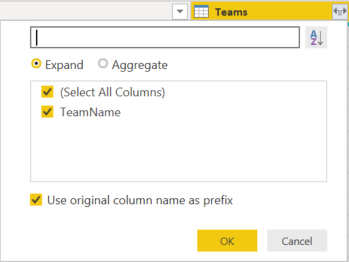
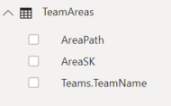

# Add a team slicer to a Power BI report

[!INCLUDE [version-gt-eq-2019](../../includes/version-gt-eq-2019.md)]

Often Power BI reports include data from multiple teams for aggregation and comparison. This article shows you how to add a Team slicer to an existing Power BI report. The Team slicer allows you to filter the report data by Teams, rather than Area Path.

> [!IMPORTANT]
> The Team filter requires that the **"AreaSK"** field is included in the query used by the report you want to filter. 
> All of the queries provided in the sample reports already include **"AreaSK"**. 
> If you have created your own query, make sure it returns "AreaSK" in either the $select or groupby() clauses.

[!INCLUDE [temp](includes/sample-required-reading.md)]


[!INCLUDE [prerequisites-simple](../includes/analytics-prerequisites-simple.md)]

## Sample queries

You'll need to add another query to your Power BI report. The query below returns the mapping between Teams and Area Paths.

#### [Power BI query](#tab/powerbi/)

[!INCLUDE [temp](includes/sample-powerbi-query.md)]

```
let
   Source = OData.Feed ("https://analytics.dev.azure.com/{organization}/{project}/_odata/v1.0/Areas?"
        &"$filter=startswith(AreaPath,'{areapath}') "
            &"&$select=AreaSK,AreaPath "
            &"&$expand=Teams($select=TeamName) "
    ,null, [Implementation="2.0",OmitValues = ODataOmitValues.Nulls,ODataVersion = 4]) 
in
    Source
```

#### [OData query](#tab/odata/)

[!INCLUDE [temp](includes/sample-odata-query.md)]

```
https://analytics.dev.azure.com/{organization}/{project}/_odata/v1.0/Areas?
        $filter=startswith(AreaPath,'{areapath}')
            &$select=AreaSK,AreaPath
            &$expand=Teams($select=TeamName)
```

***

### Substitution strings

[!INCLUDE [temp](includes/sample-query-substitutions.md)]

- `{organization}` - Your organization name 
- `{project}` - Your team project name, or omit "/{project}" entirely, for a cross-project query
- `{areapath}` - Your Area Path. Example format: `Project\Level1\Level2`.


### Query breakdown


The following table describes each part of the query.

:::row:::
   :::column span="1":::
   **Query part**
   :::column-end:::
   :::column span="1":::
   **Description**
   :::column-end:::
:::row-end:::
:::row:::
   :::column span="1":::
   `$filter=startswith(AreaPath, '{areapath}')`
   :::column-end:::
   :::column span="1":::
   Return all teams mapped to an Area Path at or under the specified `{areapath}`. To include all teams in a project, omit this statement.
   :::column-end:::
:::row-end:::
:::row:::
   :::column span="1":::
   `&$select=AreaSK, AreaPath`
   :::column-end:::
   :::column span="1":::
   Returning Area Path fields, to use for mapping
   :::column-end:::
:::row-end:::
:::row:::
   :::column span="1":::
   `&$expand=Teams($select=TeamName)`
   :::column-end:::
   :::column span="1":::
   Returning the Team associated with the Area Path
   :::column-end:::
:::row-end:::


[!INCLUDE [temp](includes/query-filters-work-items.md)]

## Power BI transforms

### Expand the Teams column

1. Choose the expand button.

    > [!div class="mx-imgBorder"] 
    > 

1. Select the fields to flatten.

    > [!div class="mx-imgBorder"] 
    > 

1. Table will now contain entity field(s).

    > [!div class="mx-imgBorder"] 
    > 

[!INCLUDE [temp](includes/sample-finish-query.md)]

## Create a Relationship using "AreaSK"

After selecting Close & Apply, and returning to Power BI, follow these steps:

1. Select **Modeling** menu
1. Select **Manage Relationships**
1. Create a relationship between your Report query and the Teams query. It's likely that Power BI will autodetect and create the relationship for you. Here's an example of a relationship between the query in the [Open Bugs](sample-boards-openbugs.md) report and the Teams query:

    > [!div class="mx-imgBorder"] 
    > 
    
## Add the Team Filter to an existing report

Power BI shows you the fields you can report on. 

> [!NOTE]   
> The example below assumes that no one renamed any columns. 

> [!div class="mx-imgBorder"] 
> 

To add a team filter to the Power BI report, follow these steps:

1. Select Visualization **Slicer**
1. Add the "Team.TeamName" field to **Field**

The example below shows the [Open Bugs](sample-boards-openbugs.md) report with a Team filter added. Selecting a team in the slicer filters the results of the Open Bugs report. It will work for any report, as long as its query returns AreaSK.

> [!div class="mx-imgBorder"] 
> 

## Additional queries

You can use the following additional queries to create different but similar reports. You can use these queries with the steps defined above.

### Filter by Teams, rather than Area Path

This query is the same as the one used above, except it filters by Team Name rather than Area Path. 

#### [Power BI query](#tab/powerbi/)

[!INCLUDE [temp](includes/sample-powerbi-query.md)]

```
let
   Source = OData.Feed ("https://analytics.dev.azure.com/{organization}/{project}/_odata/v1.0/Areas?"
        &"$filter=(Teams/any(x:x/TeamName eq '{teamname}) or Teams/any(x:x/TeamName eq '{teamname}) or Teams/any(x:x/TeamName eq '{teamname}) "
            &"&$select=AreaSK,AreaPath "
            &"&$expand=Teams($select=TeamName) "
    ,null, [Implementation="2.0",OmitValues = ODataOmitValues.Nulls,ODataVersion = 4]) 
in
    Source
```

#### [OData query](#tab/odata/)

[!INCLUDE [temp](includes/sample-odata-query.md)]

```
https://analytics.dev.azure.com/{organization}/{project}/_odata/v1.0/Areas?
        $filter=(Teams/any(x:x/TeamName eq '{teamname}) or Teams/any(x:x/TeamName eq '{teamname}) or Teams/any(x:x/TeamName eq '{teamname})
            &$select=AreaSK,AreaPath
            &$expand=Teams($select=TeamName)
```

***

## Full list of sample reports

[!INCLUDE [temp](includes/sample-fulllist.md)]

## Related articles

[!INCLUDE [temp](includes/sample-relatedarticles.md)]
