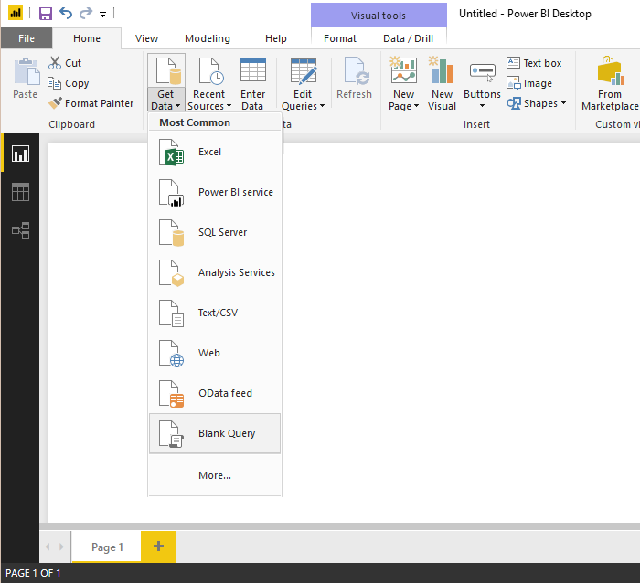

# Overview of sample reports using OData queries

[!INCLUDE [temp](../includes/version-azure-devops.md)]

In this section, we provide samples for the most popular reports:

::: moniker range=">= azure-devops-2020"

---
:::row:::
   :::column span="2":::
      **Azure Boards**
   :::column-end:::
   :::column span="2":::
      **Azure Test Plans**  
   :::column-end:::
:::row-end:::
---
:::row:::
   :::column span="2":::
      [!INCLUDE [temp](includes/sample-fulllist.md)]
   :::column-end:::
   :::column span="2":::
      [!INCLUDE [temp](includes/sample-full-list-test-plans.md)]
   :::column-end:::
:::row-end:::
---

[!INCLUDE [temp](includes/sample-full-list-pipelines.md)]

--- 
::: moniker-end

::: moniker range="azure-devops-2019"

[!INCLUDE [temp](includes/sample-fulllist.md)] 

::: moniker-end

All sample report articles provide the following sections and information: 

* **Sample queries** - The Power BI Query and raw OData query used to pull data into Power BI
* **Power BI transforms** - Steps to transform the data into a reportable format
* **Create the report** - Steps to create a simple report from the data
* **Additional queries** - Additional sample queries for similar, but different reports.

[!INCLUDE [temp](./includes/prerequisites-power-bi.md)]

## A Power BI query
    
Get started quickly with the following steps which embed the OData query in the Power BI query. The query can be pasted directly into Power BI's Advanced Query editor as follows:

1. Select **Get Data**, and then **Blank Query**.

    > [!div class="mx-imgBorder"] 
    > 

2. From the Power BI Query editor, select **Advanced Editor**.

    > [!div class="mx-imgBorder"] 
    > 

3. The Advanced Editor window opens.

    > [!div class="mx-imgBorder"] 
    > 

4. Replace the contents with one of the sample queries provided in the linked articles listed at the top of this article.  

    > [!div class="mx-imgBorder"] 
    > 

5. The sample queries have strings that must be substituted with your values, such as {organization} and {project}.

    * {organization} - Your organization name 
    * {project} - Your team project name. Or omit "/{project}" entirely, for a cross-project query.

    Depending on the sample query, there may be one or more additional strings to substitute, such as:

    * {areapath} - Your Area path. Format: Project\Level1\Level2
    * {iterationpath} - Your Iteration path. Format: Project\Level1\Level2
    * {startdate} - The date to start your trend report on. Format: YYYY-MM-DDZ. Example: 2019-04-01Z represents 2019-April-01. Do not enclose in quotes.

    > [!div class="mx-imgBorder"] 
    > 

6. To execute the query, select **Done**. 

    If you have never connected to your account, Power BI may require you to authenticate. For details, see [Client authentication options](client-authentication-options.md).

## Raw OData query

The OData Query is provided in case you want to modify and test the OData query separately, before using it in Power BI. This method provides more flexibility, but involves additional steps before using the OData Query in Power BI as described in [Connect using Power BI and OData queries](odataquery-connect.md)

For more information on how to write OData queries against Analytics, check out the [OData Query Quick Reference](../extend-analytics/quick-ref.md) 

## Related articles

- [Data available from Analytics](data-available-in-analytics.md)
- [Data model for Analytics](../extend-analytics/data-model-analytics-service.md)
- [Analytics views dataset design](data-connector-dataset.md)
- [OData API versioning](../extend-analytics/odata-api-version.md)