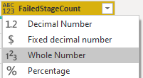
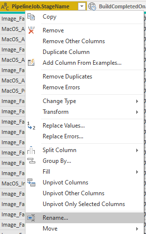

# Pipeline stage wise failures sample report 

[!INCLUDE [temp](../_shared/version-azure-devops-cloud.md)]

This article shows you how to create a report of a pipeline's daily stage failures. This report is similar to the 'Failure trend' chart of the [Pipeline pass rate report](../../pipelines/reports/pipelinereport.md#pipeline-pass-rate-report). 

[!INCLUDE [temp](_shared/preview-note.md)]

The following image shows an example of such a chart.

> [!div class="mx-imgBorder"] 
> 

[!INCLUDE [temp](_shared/sample-required-reading.md)]


## Sample queries

#### [Power BI query](#tab/powerbi/)

[!INCLUDE [temp](_shared/sample-powerbi-query.md)]

```
let
   Source = OData.Feed ("https://analytics.dev.azure.com/{organization}/{project}/_odata/v3.0-preview/BuildTaskResults?"
        &"$apply=filter( "
                &"BuildPipeline/BuildPipelineName eq '{pipelinename}' "
                &"and BuildCompletedOn/Date ge {startdate} "
                &"and BuildOutcome eq 'Failed' "
        &"and TaskOutcome eq 'Failed' "
        &") "
            &"/groupby( "
                &"(BuildCompletedOn/Date, BuildId, PipelineJob/StageName ), "
                &"aggregate (FailedCount with sum as FailedCount)) "
            &"/groupby( "
                &"(BuildCompletedOn/Date, PipelineJob/StageName ), "
            &"aggregate "
        &"(cast(FailedCount gt 0, Edm.Int32) with sum as FailedStageCount)) "
    ,null, [Implementation="2.0",OmitValues = ODataOmitValues.Nulls,ODataVersion = 4]) 
in
    Source
```

#### [OData query](#tab/odata/)

[!INCLUDE [temp](_shared/sample-odata-query.md)]

```
https://analytics.dev.azure.com/{organization}/{project}/_odata/v3.0-preview/BuildTaskResults?
$apply=filter(
	BuildPipeline/BuildPipelineName eq '{pipelinename}'
	and BuildCompletedOn/Date ge {startdate}
	and BuildOutcome eq 'Failed'
	and TaskOutcome eq 'Failed'
	)
/groupby(
	(BuildCompletedOn/Date, BuildId, PipelineJob/StageName ),
	aggregate (FailedCount with sum as FailedCount))
/groupby(
	(BuildCompletedOn/Date, PipelineJob/StageName ),
	aggregate
(cast(FailedCount gt 0, Edm.Int32) with sum as FailedStageCount))
```

***

### Substitution strings

[!INCLUDE [temp](_shared/pipelines-sample-query-substitutions.md)]


### Query breakdown

The following table describes each part of the query.

<table width="90%">
<tbody valign="top">
<tr><td width="25%"><b>Query part</b></td><td><b>Description</b></td><tr>
<tr><td><code>$apply=filter(</code></td>
<td>Start filter()</td>
<tr>
<tr>
<td><code>BuildPipeline/BuildPipelineName eq '{pipelinename}'</code></td>
<td>Return task results for a specific pipeline</td>
<tr>
<tr>
<td><code>and BuildCompletedOn/Date ge {startdate}</code></td>
<td>Return task results for pipeline runs on or after the specified date</td>
<tr>
<tr>
<td><code>and BuildOutcome eq 'Failed'</code></td>
<td>Return task results where build outcome is failed</td>
<tr>
<tr><td><code>and TaskOutcome eq 'Failed'</code></td>
<td>Return task results where task outcome is failed</td>
<tr>
<tr><td><code>)</code></td>
<td>Close of filter statement</td>
<tr>
<tr><td><code>/groupby(</code></td>
<td>Start groupby()</td>
<tr>
<tr><td><code>(BuildCompletedOn/Date, BuildId, PipelineJob/StageName ),</code></td>
<td>Group by date of completion of pipeline run, Build Id and stage name.</td>
<tr>
<tr><td><code>aggregate (FailedCount with sum as FailedCount))</code></td>
<td>For each day, build Id and Stage, count the total number of failures. This will be the total number of task failures & not stage failures</td>
<tr>
<tr><td><code>/groupby(</code></td>
<td>Start groupby()</td>
<tr>
<tr><td><code>(BuildCompletedOn/Date, PipelineJob/StageName ),</code></td>
<td>Group by day and stage name.</td>
<tr>
<tr><td><code>aggregate</code></td>
<td>Start of aggregate</td>
<tr>
<tr><td><code>(cast(FailedCount gt 0, Edm.Int32) with sum as FailedStageCount))</code></td>
<td>For each day, sum the number of times a stage failed</td>
<tr>
</tbody>
</table>


## Power BI transforms

### Expand BuildCompletedOn and PipelineJob column

The query returns some columns that you need to expand and flatten into its fields before you can use them in Power BI. In this example, such entities are BuildCompletedOn and PipelineJob. 

After closing the Advanced Editor and while remaining in the Power Query Editor, select the expand button on both of these entities.

1. Choose the expand button.

    > [!div class="mx-imgBorder"] 
    > 
    
1. Select the checkbox "(Select All Columns)" to expand.

    > [!div class="mx-imgBorder"] 
    > 

1. The table now contains the expanded entity **CompletedOn.Date**.

    > [!div class="mx-imgBorder"] 
    > 


### Change column type

The query doesn't return all the columns in the format in which you can directly consume them in Power BI reports.

1. Change the type of column FailedStageCount to **Whole Number**.

    > [!div class="mx-imgBorder"] 
    > 
    

### Rename fields and query 

When finished, you may choose to rename columns. 

1. Right-click a column header and select **Rename...**

	> [!div class="mx-imgBorder"] 
	> 
  
1. You also may want to rename the query from the default **Query1**, to something more meaningful. 

	> [!div class="mx-imgBorder"] 
	> 
  
1. Once done, choose **Close & Apply** to save the query and return to Power BI.

	> [!div class="mx-imgBorder"] 
	> 
  
  
## Create the report

Power BI shows you the fields you can report on. 

> [!NOTE]   
> The example below assumes that no one renamed any columns. 

> [!div class="mx-imgBorder"] 
> 

For a simple report, do the following steps:

1. Select Power BI Visualization **Stacked column chart**. 

1. Add the field "BuildCompletedOn.Date" to **Axis**.
    - Right-click "BuildCompletedOn.Date" and select "BuildCompletedOn.Date", rather than Date Hierarchy.
	
1. Add the field "FailedStageCount" to **Values**.
	  - Right-click "FailedStageCount" field and ensure **Sum** is selected.

1. Add the field "PipelineJob.StageName" to **Legend**.
	  - Right-click "PipelineJob.StageName" field and ensure **Sum** is selected.
  

Your report should look similar to the following image. 

> [!div class="mx-imgBorder"] 
> 


## Additional queries

You can use the following additional queries to create different but similar reports using the same steps defined previously in this article.


### Task wise failure trend, rather than Stage wise failure trend

You may want to view the task wise failure trend, rather than stage wise failure trend.

#### [Power BI query](#tab/powerbi/)
[!INCLUDE [temp](_shared/sample-powerbi-query.md)]
```
let
   Source = OData.Feed ("https://analytics.dev.azure.com/{organization}/{project}/_odata/v3.0-preview/BuildTaskResults?"
        &"$apply=filter( "
                &"BuildPipeline/BuildPipelineName eq '{pipelinename}' "
                &"and BuildCompletedOn/Date ge {startdate} "
                &"and BuildOutcome eq 'Failed' "
        &"and TaskOutcome eq 'Failed' "
        &") "
            &"/groupby( "
                &"(BuildCompletedOn/Date, TaskDisplayName), "
                &"aggregate "
            &"(FailedCount with sum as FailedCount)) "
    ,null, [Implementation="2.0",OmitValues = ODataOmitValues.Nulls,ODataVersion = 4]) 
in
    Source
```
#### [OData query](#tab/odata/)
[!INCLUDE [temp](_shared/sample-odata-query.md)]
```
https://analytics.dev.azure.com/{organization}/{project}/_odata/v3.0-preview/BuildTaskResults?
$apply=filter(
	BuildPipeline/BuildPipelineName eq '{pipelinename}'
	and BuildCompletedOn/Date ge {startdate}
	and BuildOutcome eq 'Failed'
	and TaskOutcome eq 'Failed'
	)
/groupby(
	(BuildCompletedOn/Date, TaskDisplayName),
	aggregate
(FailedCount with sum as FailedCount))
```

***

### Job wise failure trend, rather than Stage wise failure trend

You may want to view the job wise failure trend, rather than stage wise failure trend.

#### [Power BI query](#tab/powerbi/)

[!INCLUDE [temp](_shared/sample-powerbi-query.md)]

```
let
   Source = OData.Feed ("https://analytics.dev.azure.com/{organization}/{project}/_odata/v3.0-preview/BuildTaskResults?"
        &"$apply=filter( "
                &"BuildPipeline/BuildPipelineName eq '{pipelinename}' "
                &"and BuildCompletedOn/Date ge {startdate} "
                &"and BuildOutcome eq 'Failed' "
        &"and TaskOutcome eq 'Failed' "
        &") "
            &"/groupby( "
                &"(BuildCompletedOn/Date, BuildId, PipelineJob/JobName ), "
                &"aggregate (FailedCount with sum as FailedCount)) "
            &"/groupby( "
                &"(BuildCompletedOn/Date, PipelineJob/JobName ), "
            &"aggregate "
        &"(cast(FailedCount gt 0, Edm.Int32) with sum as FailedStageCount)) "
    ,null, [Implementation="2.0",OmitValues = ODataOmitValues.Nulls,ODataVersion = 4]) 
in
    Source
```
#### [OData query](#tab/odata/)

[!INCLUDE [temp](_shared/sample-odata-query.md)]

```
https://analytics.dev.azure.com/{organization}/{project}/_odata/v3.0-preview/BuildTaskResults?
$apply=filter(
	BuildPipeline/BuildPipelineName eq '{pipelinename}'
	and BuildCompletedOn/Date ge {startdate}
	and BuildOutcome eq 'Failed'
	and TaskOutcome eq 'Failed'
	)
/groupby(
	(BuildCompletedOn/Date, BuildId, PipelineJob/JobName ),
	aggregate (FailedCount with sum as FailedCount))
/groupby(
	(BuildCompletedOn/Date, PipelineJob/JobName ),
	aggregate
(cast(FailedCount gt 0, Edm.Int32) with sum as FailedStageCount))
```

***

## Full list of sample reports for Pipelines

[!INCLUDE [temp](_shared/sample-full-list-pipelines.md)]

## Related articles

[!INCLUDE [temp](_shared/sample-related-articles-pipelines.md)]
