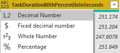
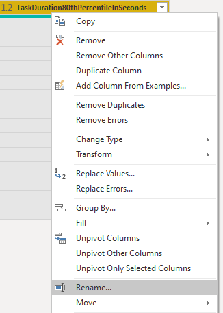

# Pipeline task duration trend sample report 

[!INCLUDE [temp](../_shared/version-azure-devops-cloud.md)]

This article shows you how to get the daily trend report of the time taken to execute a pipeline task. 

[!INCLUDE [temp](_shared/preview-note.md)]

The following image shows an example of such a chart.

> [!div class="mx-imgBorder"] 
> 

[!INCLUDE [temp](_shared/sample-required-reading.md)]


## Sample queries

#### [Power BI query](#tab/powerbi/)

[!INCLUDE [temp](_shared/sample-powerbi-query.md)]

```
let
   Source = OData.Feed ("https://analytics.dev.azure.com/{organization}/{project}/_odata/v3.0-preview/PipelineRunActivityResults?"
        &"$apply=filter( "
                &"Pipeline/PipelineName eq '{pipelinename}' "
                &"and TaskDisplayName eq '{taskname}' "
                &"and PipelineRunCompletedOn/Date ge {startdate} "
        &"and (PipelineRunOutcome eq 'Succeed' or PipelineRunOutcome eq 'PartiallySucceeded') "
        &"and (CanceledCount ne 1 and SkippedCount ne 1 and AbandonedCount ne 1) "
            &"    ) "
                &"/compute( "
                &"percentile_cont(ActivityDurationSeconds, 0.8, PipelineRunCompletedDateSK) as TaskDuration80thPercentileInSeconds) "
            &"/groupby( "
                &"(TaskDuration80thPercentileInSeconds, PipelineRunCompletedOn/Date)) "
            &"&$orderby=PipelineRunCompletedOn/Date asc "
    ,null, [Implementation="2.0",OmitValues = ODataOmitValues.Nulls,ODataVersion = 4]) 
in
    Source
```

#### [OData query](#tab/odata/)

[!INCLUDE [temp](_shared/sample-odata-query.md)]

```
https://analytics.dev.azure.com/{organization}/{project}/_odata/v3.0-preview/PipelineRunActivityResults?
$apply=filter(
    Pipeline/PipelineName eq '{pipelinename}'
    and TaskDisplayName eq '{taskname}'
    and PipelineRunCompletedOn/Date ge {startdate}
    and (PipelineRunOutcome eq 'Succeed' or PipelineRunOutcome eq 'PartiallySucceeded')
    and (CanceledCount ne 1 and SkippedCount ne 1 and AbandonedCount ne 1)
    )
/compute(
    percentile_cont(ActivityDurationSeconds, 0.8, PipelineRunCompletedDateSK) as TaskDuration80thPercentileInSeconds)
/groupby(
    (TaskDuration80thPercentileInSeconds, PipelineRunCompletedOn/Date))
&$orderby=PipelineRunCompletedOn/Date asc
```

***

### Substitution strings

[!INCLUDE [temp](_shared/pipelines-sample-query-substitutions-task-name.md)]


### Query breakdown

The following table describes each part of the query.

<table width="90%">
<tbody valign="top">
<tr><td width="25%"><b>Query part</b></td><td><b>Description</b></td><tr>
<tr><td><code>$apply=filter(</code></td>
<td>Start filter()</td>
<tr>
<tr>
<td><code>Pipeline/PipelineName eq '{pipelinename}'</code></td>
<td>Return task results for a specific pipeline</td>
<tr>
<tr>
<td><code>and TaskDisplayName eq '{taskname}'</code></td>
<td>Return task results for a specific task</td>
<tr>
<tr>
<td><code>and PipelineRunCompletedOn/Date ge {startdate}</code></td>
<td>Return task results for pipeline runs on or after the specified date</td>
<tr>
<tr>
<td><code>and (PipelineRunOutcome eq 'Succeed' or PipelineRunOutcome eq 'PartiallySucceeded')</code></td>
<td>Return task results from only the successful or partially successful pipeline runs</td>
<tr>
<td><code>and (CanceledCount ne 1 and SkippedCount ne 1 and AbandonedCount ne 1)</code></td>
<td>Omit the pipeline runs that were canceled, skipper or abandoned</td>
<tr>
<tr><td><code>)</code></td>
<td>Close filter()</td>
<tr>
<tr><td><code>/compute(</code></td>
<td>Start compute()</td>
<tr>
<tr><td><code>percentile_cont(ActivityDurationSeconds, 0.8, PipelineRunCompletedDateSK) as TaskDuration80thPercentileInSeconds)</code></td>
<td>For each day, compute the 80th percentile of task durations of all tasks that match the filter criteria</td>
<tr>
<tr><td><code>/groupby(</code></td>
<td>Start groupby()</td>
<tr>
<tr><td><code>(TaskDuration80thPercentileInSeconds, PipelineRunCompletedOn/Date))</code></td>
<td>Group by date of completion of pipeline run and calculated day wise 80th percentile task duration</td>
<tr>
<tr><td><code>&$orderby=PipelineRunCompletedOn/Date asc</code></td>
<td>Order the response by completed date</td>
<tr>
</tbody>
</table>


## Power BI transforms

### Expand PipelineRunCompletedOn column

The query returns some columns that you need to expand and flatten into its fields before you can use them in Power BI. Here in this example, such an entity is PipelineRunCompletedOn.

After closing the Advanced Editor and while remaining in the Power Query Editor, select the expand button on **PipelineRunCompletedOn**.

1. Choose the expand button

    > [!div class="mx-imgBorder"] 
    > 
    
1. Select the checkbox "(Select All Columns)" to expand

    > [!div class="mx-imgBorder"] 
    > 

1. The table now contains the expanded entity **CompletedOn.Date**

    > [!div class="mx-imgBorder"] 
    > 


### Change column type

The query doesn't return all the columns in the format in which you can directly consume them in Power BI reports.

1. 1. Change the type of column **TaskDuration80thPercentileInSeconds** to **Decimal Number**.

    > [!div class="mx-imgBorder"] 
    > 


### Rename fields and query 

When finished, you may choose to rename columns. 

1. Right-click a column header and select **Rename...**

	> [!div class="mx-imgBorder"] 
	> 
  
1. You also may want to rename the query from the default **Query1**, to something more meaningful. 

	> [!div class="mx-imgBorder"] 
	> 
  
1. Once done, choose **Close & Apply** to save the query and return to Power BI.

	> [!div class="mx-imgBorder"] 
	> 
  
  
## Create the report

Power BI shows you the fields you can report on. 

> [!NOTE]   
> The example below assumes that no one renamed any columns. 
> [!div class="mx-imgBorder"] 
> 

For a simple report, do the following steps:

1. Select Power BI Visualization **Line Chart**.

1. Add the field "PipelineRunCompletedOn.Date" to **Axis**.

    - Right-click "PipelineRunCompletedOn.Date" and select "PipelineRunCompletedOn.Date", rather than Date Hierarchy.
	
1. Add the field "TaskDuration80thPercentileInSeconds" to **Values**.

    - Right-click "TaskDuration80thPercentileInSeconds" field and ensure **Sum** is selected.

Your report should look like this. 

> [!div class="mx-imgBorder"] 
> 


## Additional queries

You can use the following additional queries to create different but similar reports using the same steps defined previously in this article.


### Use Pipeline Id, rather than Pipeline Name

You can change your Pipeline name. To ensure that the Power BI reports don't break when the pipeline name is changed, use the pipeline ID rather than pipeline name. You can obtain the pipeline ID  from the URL of the pipeline runs page.
https://dev.azure.com/{organization}/{project}/_build?definitionId= **{pipelineid}**

#### [Power BI query](#tab/powerbi/)

[!INCLUDE [temp](_shared/sample-powerbi-query.md)]

```
let
   Source = OData.Feed ("https://analytics.dev.azure.com/{organization}/{project}/_odata/v3.0-preview/PipelineRunActivityResults?"
        &"$apply=filter( "
                &"Pipeline/PipelineId eq {pipelineid} "
                &"and TaskDisplayName eq '{taskname}' "
                &"and PipelineRunCompletedOn/Date ge {startdate} "
        &"and (PipelineRunOutcome eq 'Succeed' or PipelineRunOutcome eq 'PartiallySucceeded') "
        &"and (CanceledCount ne 1 and SkippedCount ne 1 and AbandonedCount ne 1) "
            &") "
                &"/compute( "
                &"percentile_cont(ActivityDurationSeconds, 0.8, PipelineRunCompletedDateSK) as TaskDuration80thPercentileInSeconds) "
            &"/groupby( "
                &"(TaskDuration80thPercentileInSeconds, PipelineRunCompletedOn/Date)) "
            &"&$orderby=PipelineRunCompletedOn/Date asc "
    ,null, [Implementation="2.0",OmitValues = ODataOmitValues.Nulls,ODataVersion = 4]) 
in
    Source
```
#### [OData query](#tab/odata/)

[!INCLUDE [temp](_shared/sample-odata-query.md)]

```
	https://analytics.dev.azure.com/{organization}/{project}/_odata/v3.0-preview/PipelineRunActivityResults?
$apply=filter(
    Pipeline/PipelineId eq {pipelineid}
    and TaskDisplayName eq '{taskname}'
    and PipelineRunCompletedOn/Date ge {startdate}
    and (PipelineRunOutcome eq 'Succeed' or PipelineRunOutcome eq 'PartiallySucceeded')
    and (CanceledCount ne 1 and SkippedCount ne 1 and AbandonedCount ne 1)
    )
/compute(
    percentile_cont(ActivityDurationSeconds, 0.8, PipelineRunCompletedDateSK) as TaskDuration80thPercentileInSeconds)
/groupby(
    (TaskDuration80thPercentileInSeconds, PipelineRunCompletedOn/Date))
&$orderby=PipelineRunCompletedOn/Date asc
```

***

### Get 50th and 90th percentile, along with 80th percentile duration trend

You may want to view the task duration trend calculated using other percentile value. The following query gives 50th and 95th percentile task duration along with 80th percentile.

#### [Power BI query](#tab/powerbi/)

[!INCLUDE [temp](_shared/sample-powerbi-query.md)]

```
let
   Source = OData.Feed ("https://analytics.dev.azure.com/{organization}/{project}/_odata/v3.0-preview/PipelineRunActivityResults?"
        &"$apply=filter( "
                &"Pipeline/PipelineName eq '{pipelinename}' "
                &"and TaskDisplayName eq '{taskname}' "
                &"and PipelineRunCompletedOn/Date ge {startdate} "
        &"and (PipelineRunOutcome eq 'Succeed' or PipelineRunOutcome eq 'PartiallySucceeded') "
        &"and (CanceledCount ne 1 and SkippedCount ne 1 and AbandonedCount ne 1) "
            &") "
                &"/compute( "
                &"percentile_cont(ActivityDurationSeconds, 0.5, PipelineRunCompletedDateSK) as TaskDuration50thPercentileInSeconds, "
            &"percentile_cont(ActivityDurationSeconds, 0.8, PipelineRunCompletedDateSK) as TaskDuration80thPercentileInSeconds, "
                &"percentile_cont(ActivityDurationSeconds, 0.95, PipelineRunCompletedDateSK) as TaskDuration95thPercentileInSeconds) "
            &"/groupby( "
        &"(TaskDuration50thPercentileInSeconds, TaskDuration80thPercentileInSeconds, TaskDuration95thPercentileInSeconds, PipelineRunCompletedOn/Date)) "
    &"&$orderby=PipelineRunCompletedOn/Date asc "
    ,null, [Implementation="2.0",OmitValues = ODataOmitValues.Nulls,ODataVersion = 4]) 
in
    Source
```
#### [OData query](#tab/odata/)

[!INCLUDE [temp](_shared/sample-odata-query.md)]

```
https://analytics.dev.azure.com/{organization}/{project}/_odata/v3.0-preview/PipelineRunActivityResults?
$apply=filter(
Pipeline/PipelineName eq '{pipelinename}'
and TaskDisplayName eq '{taskname}'
and PipelineRunCompletedOn/Date ge {startdate}
and (PipelineRunOutcome eq 'Succeed' or PipelineRunOutcome eq 'PartiallySucceeded')
and (CanceledCount ne 1 and SkippedCount ne 1 and AbandonedCount ne 1)
)
/compute(
percentile_cont(ActivityDurationSeconds, 0.5, PipelineRunCompletedDateSK) as TaskDuration50thPercentileInSeconds,
percentile_cont(ActivityDurationSeconds, 0.8, PipelineRunCompletedDateSK) as TaskDuration80thPercentileInSeconds,
percentile_cont(ActivityDurationSeconds, 0.95, PipelineRunCompletedDateSK) as TaskDuration95thPercentileInSeconds)
/groupby(
(TaskDuration50thPercentileInSeconds, TaskDuration80thPercentileInSeconds, TaskDuration95thPercentileInSeconds, PipelineRunCompletedOn/Date))
&$orderby=PipelineRunCompletedOn/Date asc
```

***

### Filter by branch

You may want to view the duration trend of a task for a particular **branch** only. To create the report, follow the below additional steps along with what is defined previously in this article.

- Expand Branch into Branch.BranchName
- Select Power BI Visualization **Slicer** and add the field Branch.BranchName to the slicer's **Field**
- Select the branch from the slicer for which you need to see the task duration trend

#### [Power BI query](#tab/powerbi/)

[!INCLUDE [temp](_shared/sample-powerbi-query.md)]

```
let
   Source = OData.Feed ("https://analytics.dev.azure.com/{organization}/{project}/_odata/v3.0-preview/PipelineRunActivityResults?"
        &"$apply=filter( "
                &" Pipeline/PipelineName eq '{pipelinename}' "
                &" and TaskDisplayName eq '{taskname}' "
                &" and PipelineRunCompletedOn/Date ge {startdate} "
        &" and (PipelineRunOutcome eq 'Succeed' or PipelineRunOutcome eq 'PartiallySucceeded') "
        &" and (CanceledCount ne 1 and SkippedCount ne 1 and AbandonedCount ne 1) "
            &" ) "
                &"/compute( "
                &" percentile_cont(ActivityDurationSeconds, 0.8, BranchSK, PipelineRunCompletedDateSK) as TaskDuration80thPercentileInSeconds) "
            &"/groupby( "
                &" (TaskDuration80thPercentileInSeconds, Branch/BranchName, PipelineRunCompletedOn/Date)) "
            &"&$orderby=PipelineRunCompletedOn/Date asc "
    ,null, [Implementation="2.0",OmitValues = ODataOmitValues.Nulls,ODataVersion = 4]) 
in
    Source
```

#### [OData query](#tab/odata/)

[!INCLUDE [temp](_shared/sample-odata-query.md)]

```
https://analytics.dev.azure.com/{organization}/{project}/_odata/v3.0-preview/PipelineRunActivityResults?
$apply=filter(
    Pipeline/PipelineName eq '{pipelinename}'
    and TaskDisplayName eq '{taskname}'
    and PipelineRunCompletedOn/Date ge {startdate}
    and (PipelineRunOutcome eq 'Succeed' or PipelineRunOutcome eq 'PartiallySucceeded')
    and (CanceledCount ne 1 and SkippedCount ne 1 and AbandonedCount ne 1)
    )
/compute(
    percentile_cont(ActivityDurationSeconds, 0.8, BranchSK, PipelineRunCompletedDateSK) as TaskDuration80thPercentileInSeconds)
/groupby(
    (TaskDuration80thPercentileInSeconds, Branch/BranchName, PipelineRunCompletedOn/Date))
&$orderby=PipelineRunCompletedOn/Date asc
```

***

### Task duration trend for all pipeline tasks

You may want to view the task duration trend for all the pipeline tasks in a single report. To create the report, perform the following additional steps along with those steps defined previously in this article.

- Select Power BI Visualization **Slicer** and add the field TaskDisplayName to the slicer's **Field**  

- Select the task from the slicer for which you need to see the duration trend
 

#### [Power BI query](#tab/powerbi/)

[!INCLUDE [temp](_shared/sample-powerbi-query.md)]

```
let
   Source = OData.Feed ("https://analytics.dev.azure.com/{organization}/{project}/_odata/v3.0-preview/PipelineRunActivityResults?"
        &"$apply=filter( "
                &"Pipeline/PipelineName eq '{pipelinename}' "
                &"and PipelineRunCompletedOn/Date ge {startdate} "
                &"and (PipelineRunOutcome eq 'Succeed' or PipelineRunOutcome eq 'PartiallySucceeded') "
        &"and (CanceledCount ne 1 and SkippedCount ne 1 and AbandonedCount ne 1) "
        &") "
            &"/compute( "
                &"percentile_cont(ActivityDurationSeconds, 0.8, TaskDisplayName, PipelineRunCompletedDateSK) as TaskDuration80thPercentileInSeconds) "
                &"/groupby( "
            &"(TaskDuration80thPercentileInSeconds, TaskDisplayName, PipelineRunCompletedOn/Date)) "
                &"&$orderby=PipelineRunCompletedOn/Date asc "
    ,null, [Implementation="2.0",OmitValues = ODataOmitValues.Nulls,ODataVersion = 4]) 
in
    Source
```
#### [OData query](#tab/odata/)

[!INCLUDE [temp](_shared/sample-odata-query.md)]

```
https://analytics.dev.azure.com/{organization}/{project}/_odata/v3.0-preview/PipelineRunActivityResults?
$apply=filter(
    Pipeline/PipelineName eq '{pipelinename}'
    and PipelineRunCompletedOn/Date ge {startdate}
    and (PipelineRunOutcome eq 'Succeed' or PipelineRunOutcome eq 'PartiallySucceeded')
    and (CanceledCount ne 1 and SkippedCount ne 1 and AbandonedCount ne 1)
    )
/compute(
    percentile_cont(ActivityDurationSeconds, 0.8, TaskDisplayName, PipelineRunCompletedDateSK) as TaskDuration80thPercentileInSeconds)
/groupby(
    (TaskDuration80thPercentileInSeconds, TaskDisplayName, PipelineRunCompletedOn/Date))
&$orderby=PipelineRunCompletedOn/Date asc
```

***


## Full list of Pipelines sample reports

[!INCLUDE [temp](_shared/sample-full-list-pipelines.md)]

## Related articles

[!INCLUDE [temp](_shared/sample-related-articles-pipelines.md)]
