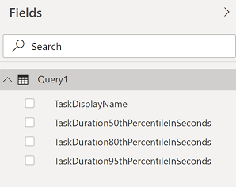

# Pipeline Task duration sample report 

[!INCLUDE [temp](../_shared/version-azure-devops.md)]

This article shows you how to get the time taken to execute different tasks of a pipeline. An example is shown in the following image.


> [!div class="mx-imgBorder"] 
> 

[!INCLUDE [temp](_shared/sample-required-reading.md)]


## Sample queries

#### [Power BI Query](#tab/powerbi/)

[!INCLUDE [temp](_shared/sample-powerbi-query.md)]

```
let
   Source = OData.Feed ("https://analytics.dev.azure.com/{organization}/{project}/_odata/v3.0-preview/BuildTaskResults?"
        &"$apply=filter( "
                &"BuildPipeline/BuildPipelineName eq '{pipelinename}' "
                &"and BuildCompletedOn/Date ge {startdate} "
                &"and (BuildOutcome eq 'Succeed' or BuildOutcome eq 'PartiallySucceeded') "
        &"and (CanceledCount ne 1 and SkippedCount ne 1 and AbandonedCount ne 1) "
        &") "
            &"/compute( "
                &"percentile_cont(ActivityDurationSeconds, 0.5, TaskDisplayName) as TaskDuration50thPercentileInSeconds, "
                &"percentile_cont(ActivityDurationSeconds, 0.8, TaskDisplayName) as TaskDuration80thPercentileInSeconds, "
            &"percentile_cont(ActivityDurationSeconds, 0.95, TaskDisplayName) as TaskDuration95thPercentileInSeconds) "
                &"/groupby( "
            &"(TaskDuration50thPercentileInSeconds, TaskDuration80thPercentileInSeconds,TaskDuration95thPercentileInSeconds, TaskDisplayName)) "
        &"&$orderby=TaskDuration50thPercentileInSeconds desc "
    ,null, [Implementation="2.0",OmitValues = ODataOmitValues.Nulls,ODataVersion = 4]) 
in
    Source
```

#### [OData Query](#tab/odata/)

[!INCLUDE [temp](_shared/sample-odata-query.md)]

```
https://analytics.dev.azure.com/{organization}/{project}/_odata/v3.0-preview/BuildTaskResults?
$apply=filter(
	BuildPipeline/BuildPipelineName eq '{pipelinename}'
	and BuildCompletedOn/Date ge {startdate}
	and (BuildOutcome eq 'Succeed' or BuildOutcome eq 'PartiallySucceeded')
	and (CanceledCount ne 1 and SkippedCount ne 1 and AbandonedCount ne 1)
	)
/compute(
	percentile_cont(ActivityDurationSeconds, 0.5, TaskDisplayName) as TaskDuration50thPercentileInSeconds,
	percentile_cont(ActivityDurationSeconds, 0.8, TaskDisplayName) as TaskDuration80thPercentileInSeconds,
	percentile_cont(ActivityDurationSeconds, 0.95, TaskDisplayName) as TaskDuration95thPercentileInSeconds)
/groupby(
	(TaskDuration50thPercentileInSeconds, TaskDuration80thPercentileInSeconds,TaskDuration95thPercentileInSeconds, TaskDisplayName))
&$orderby=TaskDuration50thPercentileInSeconds desc
```

***

### Substitution strings

[!INCLUDE [temp](_shared/pipelines-sample-query-substitutions.md)]

### Query breakdown

The following table describes each part of the query.

<table width="90%">
<tbody valign="top">
<tr><td width="25%"><b>Query part</b></td><td><b>Description</b></td><tr>
<tr><td><code>$apply=filter(</code></td>
<td>Start filter()</td>
<tr>
<tr>
<td><code>BuildPipeline/BuildPipelineName eq '{pipelinename}'</code></td>
<td>Return pipeline runs for the specified pipeline</td>
<tr>
<tr>
<td><code>and BuildCompletedOn/Date ge {startdate}</code></td>
<td>Return task results for pipeline runs on or after the specified date</td>
<tr>
<tr>
<td><code>and (BuildOutcome eq 'Succeed' or BuildOutcome eq 'PartiallySucceeded')</code></td>
<td>Return task results from only the successful or partially successful pipeline runs</td>
<tr>
<td><code>and (CanceledCount ne 1 and SkippedCount ne 1 and AbandonedCount ne 1)</code></td>
<td>Omit the pipeline runs that were cancelled, skipper or abandoned</td>
<tr>
<tr><td><code>)</code></td>
<td>Close filter()</td>
<tr>
<tr><td><code>/compute(</code></td>
<td>Start compute()</td>
<tr>
<tr><td><code>percentile_cont(ActivityDurationSeconds, 0.5, TaskDisplayName) as TaskDuration50thPercentileInSeconds,</code></td>
<td>For each task, compute the 50th percentile of task durations of all tasks that match the filter criteria</td>
<tr>
<tr><td><code>percentile_cont(ActivityDurationSeconds, 0.8, TaskDisplayName) as TaskDuration80thPercentileInSeconds,</code></td>
<td>For each task, compute the 80th percentile of task durations of all tasks that match the filter criteria</td>
<tr>
<tr><td><code>percentile_cont(ActivityDurationSeconds, 0.95, TaskDisplayName) as TaskDuration95thPercentileInSeconds)</code></td>
<td>For each task, compute the 95th percentile of task durations of all tasks that match the filter criteria</td>
<tr>
<tr><td><code>/groupby(</code></td>
<td>Start groupby()</td>
<tr>
<tr><td><code>(TaskDuration50thPercentileInSeconds, TaskDuration80thPercentileInSeconds,TaskDuration95thPercentileInSeconds, TaskDisplayName))</code></td>
<td>Group by task of pipeline run and calculated day wise 50th percentile task duration, 80th percentile task duration and 95th percentile task duration</td>
<tr>
<tr><td><code>&$orderby=TaskDuration50thPercentileInSeconds desc</code></td>
<td>Order the response by task having highest 50th percentile duration</td>
<tr>
</tbody>
</table>


## Power BI transforms

### Change column type

The query doesn't return all the columns in the format in which you can directly consume them in Power BI reports.

1. Change the type of column **TaskDuration80thPercentileInSeconds, TaskDuration80thPercentileInSeconds** and **TaskDuration95thPercentileInSeconds** to **Decimal Number**.

    > [!div class="mx-imgBorder"] 
    > 


### Rename fields and query, then Close & Apply

When finished, you may choose to rename columns. 

1. Right-click a column header and select **Rename...**

	> [!div class="mx-imgBorder"] 
	> 
  
1. You also may want to rename the query from the default **Query1**, to something more meaningful. 

	> [!div class="mx-imgBorder"] 
	> 
  
1. Once done, choose **Close & Apply** to save the query and return to Power BI.

	> [!div class="mx-imgBorder"] 
	> 
  
  
## Create the report

Power BI shows you the fields you can report on. 

> [!NOTE]   
> The example below assumes that no one renamed any columns. 
> [!div class="mx-imgBorder"] 
> 

For a simple report, perform the following steps:

1. Select Power BI Visualization **Line Chart**.

1. Add the field "BuildCompletedOn.Date" to **Axis**.

    - Right click "BuildCompletedOn.Date" and select "BuildCompletedOn.Date", rather than Date Hierarchy.
	
1. Add the field "TaskDuration80thPercentileInSeconds" to **Values**.

    - Right click "TaskDuration80thPercentileInSeconds" field and ensure **Sum** is selected.

Your report should look like this. 

> [!div class="mx-imgBorder"] 
> 


## Full list of sample reports for Pipelines
[!INCLUDE [temp](_shared/sample-full-list-pipelines.md)]
## Related articles
[!INCLUDE [temp](_shared/sample-related-articles-pipelines.md)]
