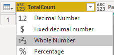
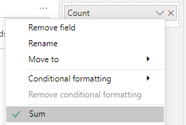

# Manual test suites aggregated view sample report

[!INCLUDE [version-gt-eq-2020](../../includes/version-gt-eq-2020.md)] 

Some scenarios have a hierarchical organization of test suites as per organization departments or modules as shown below. 

> [!div class="mx-imgBorder"] 
> 

As shown in the above image, there are level 3 test suites with same names under different level 2 test suites. In that case, an aggregation at a particular test suite level may be required. This article explains how to do it for all level 3 test suites in a test plan.

[!INCLUDE [temp](includes/preview-note.md)]

For a sample test suite hierarchy in a test plan like below, you can configure this report.
 
> [!div class="mx-imgBorder"] 
> 

[!INCLUDE [temp](includes/sample-required-reading.md)]

[!INCLUDE [temp](./includes/prerequisites-power-bi-2020.md)]

For the report to generate useful data, the team must carry out the following activities to manage test plans:

- Define test plans, test suites, and test cases. Specify their state. For a Test Suite to run, it must be in the In Progress state. For a Test Case to run, it must be in the Ready state. For details, see [Create test plans and test suites](../../test/create-a-test-plan.md) and [Create manual test cases](../../test/create-test-cases.md). 
- Run manual tests and verify the results. Mark the results of each validation step in the test case as passed or failed. For details, see [Run manual tests](../../test/run-manual-tests.md).

	> [!NOTE]  
	> Testers must mark a test step with a status if it is a validation test step. The overall result for a test reflects the status of all the test steps that were marked. Therefore, the test will have a status of failed if any test step is marked as failed or not marked.   


## Sample queries

#### [Power BI query](#tab/powerbi/)

[!INCLUDE [temp](includes/sample-powerbi-query.md)]

```
let 
    Source = OData.Feed ("https://analytics.dev.azure.com/{organization}/{project}/_odata/v3.0-preview/TestPoints?" 
        &"$apply=filter((TestSuite/TestPlanTitle eq '{testPlanTitle}' and TestSuite/IdLevel3 ne null))" 
            &"/groupby(" 
                &"(TestSuite/TitleLevel3)," 
                &"aggregate(" 
                    &"$count as TotalCount," 
                    &"cast(LastResultOutcome eq 'Passed', Edm.Int32) with sum as PassedCount," 
                    &"cast(LastResultOutcome eq 'Failed', Edm.Int32) with sum as FailedCount," 
                    &"cast(LastResultOutcome eq 'None', Edm.Int32) with sum as  NotRunCount," 
                    &"cast(LastResultOutcome ne 'None', Edm.Int32) with sum as RunCount" 
            &")" 
        &")" 
        &"/compute(" 
            &"RunCount mul 100 div TotalCount as RunPercentage," 
            &"NotRunCount mul 100 div TotalCount as NotRunPercentage," 
            &"iif(TotalCount gt NotRunCount, PassedCount mul 100 div RunCount,0) as PassedPercentage," 
            &"iif(TotalCount gt NotRunCount, FailedCount mul 100 div RunCount,0) as FailedPercentage" 
        &")" 
        &"&$orderby=RunPercentage desc", null, [Implementation="2.0"]) 
in 
    Source 
```

#### [OData query](#tab/odata/)

[!INCLUDE [temp](includes/sample-odata-query.md)]

```
https://analytics.dev.azure.com/{organization}/{project}/_odata/v3.0-preview/TestPoints?  
$apply=filter((TestSuite/TestPlanTitle eq '{testPlanTitle}' and TestSuite/IdLevel3 ne null)) 
/groupby( 
    (TestSuite/TitleLevel3), 
    aggregate( 
        $count as TotalCount,  
        cast(LastResultOutcome eq 'Passed', Edm.Int32) with sum as PassedCount, 
        cast(LastResultOutcome eq 'Failed', Edm.Int32) with sum as FailedCount, 
        cast(LastResultOutcome eq 'None', Edm.Int32) with sum as  NotRunCount, 
        cast(LastResultOutcome ne 'None', Edm.Int32) with sum as RunCount 
    )
)
/compute( 
    RunCount mul 100 div TotalCount as RunPercentage, 
    NotRunCount mul 100 div TotalCount as NotRunPercentage, 
    iif(TotalCount gt NotRunCount, PassedCount mul 100 div RunCount,0) as PassedPercentage, 
    iif(TotalCount gt NotRunCount, FailedCount mul 100 div RunCount,0) as FailedPercentage 
) 
&$orderby=RunPercentage desc
```

***

### Substitution strings
 

[!INCLUDE [temp](includes/sample-query-substitutions.md)]

- `{organization}` - Your organization name 
- `{project}` - Your team project name, or omit "/{project}" entirely, for a cross-project query
- `{testPlanTitle}` - Title of the test plan whose data you want to return.


### Query breakdown

The following table describes each part of the query.


:::row:::
   :::column span="1":::
   **Query part**
   :::column-end:::
   :::column span="1":::
   **Description**
   :::column-end:::
:::row-end:::
:::row:::
   :::column span="1":::
   `filter((TestSuite/TestPlanTitle eq '{testPlanTitle}' and TestSuite/IdLevel3 ne null))`
   :::column-end:::
   :::column span="1":::
   Return data for only selected test plan. Also return the data for level 3 test suites onwards. You can add multiple plans with a clause like `filter((TestSuite/TestPlanTitle eq '{testPlanTitle1}' or TestSuite/TestPlanTitle eq '{testPlanTitle2}' and TestSuite/IdLevel3 ne null))`. You can also apply any other filters related to test suites, test configurations here.
   :::column-end:::
:::row-end:::
:::row:::
   :::column span="1":::
   `/groupby((TestSuite/TitleLevel3),`
   :::column-end:::
   :::column span="1":::
   The test suites to group by. If you're interested in getting report for all distinct test suites lying at level 3 of test suite hierarchy, you can specify this query part. You can change the level number from 1-14. If you wish to separate test suites with same name, you can use  `/groupby((TestSuite/TitleLevel3, TestSuite/IdLevel3),` to sure that even if you've two test suites with same name, they'll be shown as two different entries as they would have two different IDs.
   :::column-end:::
:::row-end:::
:::row:::
   :::column span="1":::
   `/aggregate($count as TotalCount,`
   :::column-end:::
   :::column span="1":::
   Aggregate data across the filtered test points with having count as `TotalCount`.
   :::column-end:::
:::row-end:::
:::row:::
   :::column span="1":::
   `cast(LastResultOutcome eq 'Passed', Edm.Int32) with sum as Passed,`
   :::column-end:::
   :::column span="1":::
   While aggregating, type-cast test points having latest execution outcome 'Passed' to 1 and sum them up as '`Passed`' metric.
   :::column-end:::
:::row-end:::
:::row:::
   :::column span="1":::
   `/compute(Executed mul 100 div TotalCount as ExecPct`
   :::column-end:::
   :::column span="1":::
   Provide a computed metric ExecPct that is equal to (Executed test points / Total count * 100).
   :::column-end:::
:::row-end:::


[!INCLUDE [temp](includes/query-filters-test.md)]

## Power BI transforms

In Power BI, do the following steps.  

When finished, you may choose to rename columns. 

1. Expand `TestSuite`
    - Choose the expand button.

        > [!div class="mx-imgBorder"] 
	    > 

    - Select the fields to flatten.

        > [!div class="mx-imgBorder"] 
	    > 

    - The table now contains entity field of `TestSuite.IdLevel3` and `TestSuite.TitleLevel3`.

        > [!div class="mx-imgBorder"] 
	    > 

1. Right-click a column header and select **Rename...**

	> [!div class="mx-imgBorder"] 
	> 

1. Change the type of count columns to **Whole Number** and percentage fields to **Decimal Number**.

	> [!div class="mx-imgBorder"]
	> 

1. You also may want to rename the query from the default **Query1**, to something more meaningful. 

	> [!div class="mx-imgBorder"] 
	> 

1. Once done, choose **Close & Apply** to save the query and return to Power BI.

	> [!div class="mx-imgBorder"] 
	> 


## Create the report

Power BI shows you the fields you can report on. 

> [!NOTE]   
> The example below assumes that no one renamed any columns. 

To create the report, do the following steps:

1. Create a Power BI visualization **Table**.
1. Add the columns **TestSuite.TitleLevel3, NotRunCount, RunCount, PassedCount, TotalCount**.
1. Select **Sum** as aggregation for **Count**.
	> [!div class="mx-imgBorder"] 
	> 

Your report should look similar to the following image.

> [!div class="mx-imgBorder"] 
> 


## Related articles

- [Overview of sample reports using OData queries](./sample-odata-overview.md)
- [Connect using Power BI and OData queries](./odataquery-connect.md)
- [Sample reports and quick reference index](../extend-analytics/quick-ref.md)