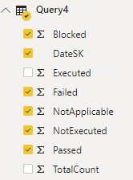

# Sample - Manual Test Execution Trend

[!INCLUDE [temp](../_shared/version-azure-devops-cloud.md)]

This article shows you how to get the execution trend of one or more Test Plans in Power BI. This will be similar to the 'Outcome trend' widget shown in [Progress report](../../test/track-test-status.md) of Test Plans.
 
> [!div class="mx-imgBorder"] 
> 

[!INCLUDE [temp](_shared/sample-required-reading.md)]


## Sample queries

#### [Power BI Query](#tab/powerbi/)

[!INCLUDE [temp](_shared/sample-powerbi-query.md)]

```
let 
    Source = OData.Feed ("https://analytics.dev.azure.com/{organization}/{project}/_odata/v3.0-preview/TestPointHistorySnapshot?" 
        &"$apply=filter((TestSuite/TestPlanTitle eq '{testPlanTitle}') and (DateSK ge {startDate} and DateSK le {endDate}))" 
        &"/groupby(" 
            &"(DateSK)," 
            &"aggregate(" 
                &"$count as TotalCount," 
                &"cast(ResultOutcome  eq 'Passed', Edm.Int32) with sum as Passed," 
                &"cast(ResultOutcome  eq 'Failed', Edm.Int32) with sum as Failed," 
                &"cast(ResultOutcome eq 'Blocked', Edm.Int32) with sum as Blocked," 
                &"cast(ResultOutcome eq 'NotApplicable', Edm.Int32) with sum as NotApplicable," 
                &"cast(ResultOutcome eq 'None', Edm.Int32) with sum as NotExecuted," 
                &"cast(ResultOutcome ne 'None', Edm.Int32) with sum as Executed 
            ) 
        )", null, [Implementation="2.0"]) 
in 
    Source 
```

#### [OData Query](#tab/odata/)

[!INCLUDE [temp](_shared/sample-odata-query.md)]

```
https://analytics.dev.azure.com/{organization}/{project}/_odata/v3.0-preview/TestPointHistorySnapshot? 
$apply=filter( 
    (TestSuite/TestPlanTitle eq '{testPlanTitle}') and (DateSK ge {startDate} and DateSK le {endDate}) 
)
/groupby( 
    (DateSK),  
    aggregate( 
        $count as TotalCount, 
        cast(ResultOutcome  eq 'Passed', Edm.Int32) with sum as Passed, 
        cast(ResultOutcome  eq 'Failed', Edm.Int32) with sum as Failed, 
        cast(ResultOutcome eq 'Blocked', Edm.Int32) with sum as Blocked, 
        cast(ResultOutcome eq 'NotApplicable', Edm.Int32) with sum as NotApplicable, 
        cast(ResultOutcome eq 'None', Edm.Int32) with sum as NotExecuted,  
        cast(ResultOutcome ne 'None', Edm.Int32) with sum as Executed 
    ) 
)
```

***

### Substitution strings

[!INCLUDE [temp](_shared/sample-query-substitutions.md)]
- {testPlanTitle} - Title of your test plan. Example: Fabrikam test plan.
- {startDate} and {endDate} - Date range of interest. You can enter the dates in YYYYMMDD format. e.g. 20190822 for 22nd August 2019.


### Query breakdown

The following table describes each part of the query.


<table width="90%">
<tbody valign="top">
<tr><td width="25%"><b>Query part</b></td><td><b>Description</b></td><tr>
<tr><td><code>filter((TestSuite/TestPlanTitle eq '{testPlanTitle}'))</code></td><td>Return data for only selected test plan. You can add multiple plans with a clause like <code>filter((TestSuite/TestPlanTitle eq '{testPlanTitle1}' or TestSuite/TestPlanTitle eq '{testPlanTitle2}'))</code>. You can also apply any other filters related to test suites, test configurations here.</td><tr>
<tr><td><code>and (DateSK ge {startDate} and DateSK le {endDate})</code></td><td>Date range of interest. You can enter the dates in YYYYMMDD format.</td><tr>
<tr><td><code>/groupby((DateSK)</code></td><td>Group the data into bins of same date. This produces one set of values per day in given date range.</td><tr>
<tr><td><code>/aggregate($count as TotalCount,</code></td><td>Aggregate data across the filtered test points with having count as <code>TotalCount</code></td><tr>
<tr><td><code>cast(LastResultOutcome eq 'Passed', Edm.Int32) with sum as Passed,</code></td><td>While aggregating, type-cast test points having latest execution outcome 'Passed' to 1 and sum them up as '<code>Passed</code>' metric.</td><tr>
</tbody>
</table>


## Power BI transforms

[!INCLUDE [temp](_shared/sample-testplans-finish-query.md)]


## Create the report

Power BI shows you the fields you can report on. 

> [!NOTE]   
> The example below assumes that no one renamed any columns. 


> [!div class="mx-imgBorder"] 
> 

To create the report, perform the following steps:

1. Create a Power BI visualization **Stacked Area Chart**.
1. Drag and drop **DateSK** in **Axis**.
1. Drag and drop **Passed, Failed, Blocked, NotApplicable** and **NotExecuted** in **Values**.

Your report should look like this -

> [!div class="mx-imgBorder"] 
> 

## Full list of sample reports for Test Plans

[!INCLUDE [temp](_shared/sample-fulllist-testplans.md)]

## Related articles

[!INCLUDE [temp](_shared/sample-relatedarticles.md)]
