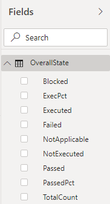

# Sample - Overall Execution State

[!INCLUDE [temp](../_shared/version-azure-devops-cloud.md)]

This article shows you how to get the execution state of one or more Test Plans in Power BI. This will be similar to the 'Summary' widget shown in Progress report of Test Plans.
 
> [!div class="mx-imgBorder"] 
> 

[!INCLUDE [temp](_shared/sample-required-reading.md)]


## Sample queries

#### [Power BI Query](#tab/powerbi/)

[!INCLUDE [temp](_shared/sample-powerbi-query.md)]

```
let 
    Source = OData.Feed ("https://analytics.dev.azure.com/{organization}/{project}/_odata/v3.0-preview/TestPoints?" 
        &"$apply=filter(( TestSuite/TestPlanTitle eq '{testPlanTitle}' ))" 
        &"/aggregate(" 
            &"$count as TotalCount," 
            &"cast(LastResultOutcome eq 'Passed', Edm.Int32) with sum as Passed," 
            &"cast(LastResultOutcome eq 'Failed', Edm.Int32) with sum as Failed," 
            &"cast(LastResultOutcome eq 'Blocked', Edm.Int32) with sum as Blocked," 
            &"cast(LastResultOutcome eq 'NotApplicable', Edm.Int32) with sum as NotApplicable," 
            &"cast(LastResultOutcome eq 'None', Edm.Int32) with sum as NotExecuted," 
            &"cast(LastResultOutcome ne 'None', Edm.Int32) with sum as Executed" 
        &")/compute(" 
            &"Executed mul 100 div TotalCount as ExecPct," 
            &"iif(TotalCount gt NotExecuted, Passed mul 100 div Executed,0) as PassedPct" 
        &")", null, [Implementation="2.0"]) 
in 
    Source
```

#### [OData Query](#tab/odata/)

[!INCLUDE [temp](_shared/sample-odata-query.md)]

```
https://analytics.dev.azure.com/{organization}/{project}/_odata/v3.0-preview/TestPoints? 
$apply=filter( 
    (TestSuite/TestPlanTitle eq '{testPlanTitle}')
) 
/aggregate( 
    $count as TotalCount,  
    cast(LastResultOutcome eq 'Passed', Edm.Int32) with sum as Passed,  
    cast(LastResultOutcome eq 'Failed', Edm.Int32) with sum as Failed, 
    cast(LastResultOutcome eq 'Blocked', Edm.Int32) with sum as Blocked, 
    cast(LastResultOutcome eq 'NotApplicable', Edm.Int32) with sum as NotApplicable, 
    cast(LastResultOutcome eq 'None', Edm.Int32) with sum as NotExecuted, 
    cast(LastResultOutcome ne 'None', Edm.Int32) with sum as Executed 
)
/compute( 
    Executed mul 100 div TotalCount as ExecPct, 
    iif(TotalCount gt NotExecuted, Passed mul 100 div Executed,0) as PassedPct 
)
```

***

### Substitution strings

[!INCLUDE [temp](_shared/sample-query-substitutions.md)]
- {testPlanTitle} - Title of your test plan. Example: Fabrikam test plan.


### Query breakdown

The following table describes each part of the query.


<table width="90%">
<tbody valign="top">
<tr><td width="25%"><b>Query part</b></td><td><b>Description</b></td><tr>
<tr><td><code>filter((TestSuite/TestPlanTitle eq '{testPlanTitle}')) </code></td><td>Return data for only selected test plan. You can add multiple plans with a clause like <code>filter((TestSuite/TestPlanTitle eq '{testPlanTitle1}' or TestSuite/TestPlanTitle eq '{testPlanTitle2}'))</code>. You can also apply any other filters related to test suites, test configurations here.</td><tr>
<tr><td><code>/aggregate($count as TotalCount,</code></td><td>Aggregate data across the filtered test points with having count as <code>TotalCount</code>.</td><tr>
<tr><td><code>cast(LastResultOutcome eq 'Passed', Edm.Int32) with sum as Passed</code></td><td>While aggregating, type-cast test points having latest execution outcome 'Passed' to 1 and sum them up as '<code>Passed</code>' metric.</td><tr>
<tr><td><code>/compute(Executed mul 100 div TotalCount as ExecPct</code>.</td><td>Provide a computed metric <code>ExecPct</code> which is equal to (Executed test points / Total count * 100).</td><tr>
</tbody>
</table>


## Power BI transforms

[!INCLUDE [temp](_shared/sample-testplans-finish-query.md)]


## Create the report

Power BI shows you the fields you can report on. 

> [!NOTE]   
> The example below assumes that no one renamed any columns. 


> [!div class="mx-imgBorder"] 
> 

To create the report, perform the following steps:

1. To create donut chart of Executed v/s Not executed:
    - Create a Power BI visualization **Donut chart**.
    - Drag and drop **Executed** and **NotExecuted** in **Values**.
2. To create donut chart of split by outcome
    - Create a Power BI visualization **Donut chart**.
    - Drag and drop outcome values like **Passed, Failed, Blocked, NotApplicable** etc. into **Values**.

Your report should look like this -

> [!div class="mx-imgBorder"] 
> 

## Full list of sample reports for Test Plans

[!INCLUDE [temp](_shared/sample-fulllist-testplans.md)]

## Related articles

[!INCLUDE [temp](_shared/sample-relatedarticles.md)]
