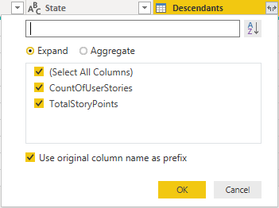

---
title:Power BI data transformations
titleSuffix: Azure DevOps
description: Learn how to expand columns and transform Analytics data in Power BI to support report generation.
ms.subservice: azure-devops-analytics
ms.custom: powerbi
ms.author: kaelli
author: KathrynEE
ms.topic: how-to
monikerRange: '>= azure-devops-2019'
ms.date: 12/05/2022
---

# Transform Analytics data to generate Power BI reports

[!INCLUDE [version-gt-eq-2019](../../includes/version-gt-eq-2019.md)]

Expand Area Path, Iteration Path
Expand Assigned To
Expand Descendents
Expand Links
Expand Teams

## Expand columns 

The query returns several columns that you need to expand before you can use them in Power BI. Any entity pulled in using an OData **$expand** statement returns a record with potentially several fields. You need to expand the record to flatten the entity into its fields. Examples of such entities are: AssignedTo, Iteration, and Area. 

After closing the Advanced Editor and while remaining in the Power Query Editor, select the expand button on the entities you need to flatten.

1. Choose the expand button.

    > [!div class="mx-imgBorder"] 
    > 

1. Select the fields to flatten.

    > [!div class="mx-imgBorder"] 
    > 

1. The table now contains entity field(s).

    > [!div class="mx-imgBorder"] 
    > 

1. Repeat steps 1 through 3 for all columns representing several fields. For work items, these typically include:  
	- `AssignedTo`
	- `AreaPath`
	- `IterationPath`

### Expand Descendants column

1. Choose the expand button, and select the columns to report on:

    > [!div class="mx-imgBorder"] 
    > 

2. Check all the columns and choose **OK**.

    > [!div class="mx-imgBorder"] 
    > 

3. The Descendants entity is flattened to the selected columns:

    > [!div class="mx-imgBorder"] 
    > 

<a id="rename-column-fields" /> 

## Rename column fields

When finished with your expansion, you may choose to rename one or more columns. 

1. Right-click a column header and select **Rename...**

	> [!div class="mx-imgBorder"] 
	> 

1. Enter a new label for the column field and then press Enter. 

## Rename the query

1. You can rename the query from the default **Query1**, to something more meaningful. 

	> [!div class="mx-imgBorder"] 
	> 

1. Once done, choose **Close & Apply** to save the query and return to Power BI.

	> [!div class="mx-imgBorder"] 
	> 

