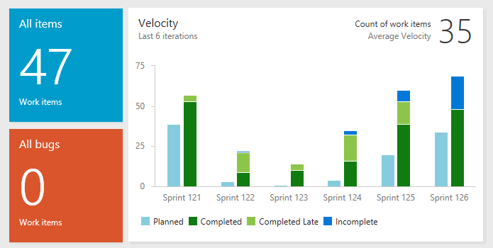

# What is the Analytics service?

[!INCLUDE [temp](../includes/version-azure-devops.md)]

The Analytics service is the reporting platform for Azure DevOps, replacing the previous platform based on SQL Server Reporting Services. Built for reporting, Analytics is optimized for fast read-access and server-based aggregations. Use it to answer quantitative questions about the past or present state of your projects. 

Specifically, Analytics provides you with insights about your Azure DevOps projects through the following tools: 

::: moniker range=">= azure-devops-2020"

>[!div class="checklist"]      
> - Analytics widgets that you can add to your dashboards
> - In-context Analytics reports available from select Azure DevOps pages
> - Rollup bars and counts for Azure Boards backlogs 
> - Custom reports you can create using Power BI 
> - Custom reports you can create using OData queries 
> - Support to develop and add your custom Analytics widgets you can add to dashboards   

::: moniker-end

::: moniker range=">= azure-devops-2020"

>[!div class="checklist"]      
> - Analytics widgets that you can add to your dashboards
> - Custom reports you can create using Power BI 
> - Custom reports you can create using OData queries 
> - Support to develop and add your custom Analytics widgets you can add to dashboards  

::: moniker-end

[!INCLUDE [temp](../../includes/version-selector/minimize.md)]

## Data available in Analytics

Analytics is generally available for Azure DevOps Service and Azure DevOps Server 2020. It is in preview for Azure DevOps Server 2019. The service provides a concise data model over Azure DevOps. 

Data available via the Analytics service depends on your version and platform.   For specifics, read [Data available in Analytics](./data-available-in-analytics.md) and [Data model for Analytics](../extend-analytics/data-model-analytics-service.md).

[!INCLUDE [temp](../includes/analytics-preview.md)]

::: moniker range="azure-devops"

Analytics is enabled for all Azure DevOps Services projects and automatically populates itself with all available Azure DevOps data. Once populated, it updates itself as data changes occur. For more information, read [Data available in Analytics](./data-available-in-analytics.md) and [Performance and latency](performance-latency.md).

::: moniker-end

::: moniker range="azure-devops-2020"

Analytics is enabled for all projects on new project collections and automatically populates itself with all available Azure DevOps data. Once populated, it updates itself as data changes occur. For more information, read [Data available in Analytics](./data-available-in-analytics.md) and [Performance and latency](performance-latency.md).

::: moniker-end

::: moniker range="azure-devops-2019"

Once you've [enabled or installed Analytics](../dashboards/analytics-extension.md), the service populates itself with all available Azure DevOps data. Once populated, it updates itself as data changes occur. For more information, read [Data available in Analytics](./data-available-in-analytics.md) and [Performance and latency](performance-latency.md).

::: moniker-end

::: moniker range="< azure-devops"

> [!NOTE]   
> Azure DevOps Server 2019 and later versions support Analytics. TFS 2018 and earlier versions do not support Analytics. For TFS 2018 and earlier, you may use [Dashboards](../dashboards/dashboards.md) with a [variety of widgets](../dashboards/widget-catalog.md) that don't require Analytics. You may also use [SQL Server Reporting](../sql-reports/reporting-services-reports.md). 

::: moniker-end

## Dashboard widgets

You can create [dashboards](../dashboards/dashboards.md) and [add widgets to them](../dashboards/add-widget-to-dashboard.md). We provide several [widgets based on Analytics](../dashboards/analytics-widgets.md). These widgets take advantage of the power of Analytics. Widgets provide the easiest way to get insights from your data. 

For example, the Velocity widget shown in the following image provides insights into a team's historical performance over six iterations. 

Here, the Velocity widget shows that this team has a history of closing stories late. It also shows a discrepancy between planned and completed work across all the sprints displayed. The team can drill into the data to determine the root causes. After implementing new practices, the team can use the Velocity widget to track their effectiveness.

::: moniker range=">= azure-devops-2019 < azure-devops"

Check out [Add an Analytics widget to a dashboard](../dashboards/add-widget-to-dashboard.md#add-analytics-widget) for a step-by-step guide to get started with the Velocity widget.

::: moniker-end

If you want to develop your own widget based on Analytics, see [Create an Analytics widget](../extend-analytics/example-analytics-widget.md).

::: moniker range=">= azure-devops-2020"

## In-context reports and roll-up columns 

Work tracking in-context reports are now based on Analytics data. These reports appear on the **Analytics** tab of the product and portfolio backlogs and Kanban boards. In addition, there are some pipelines and test in-context reports. To learn more, see the following articles: 

- [Cumulative flow](../dashboards/cumulative-flow.md)
- [Team velocity](../dashboards/team-velocity.md)
- [View/configure sprint burndown](../dashboards/configure-sprint-burndown.md) 
- [Pipeline pass rate report](../../pipelines/reports/pipelinereport.md#pipeline-pass-rate-report)
- [Test failures report](../../pipelines/test/test-analytics.md#test-failures)

Also, you can add rollup columns to product and portfolio backlogs which provide progress bars, counts of work items, or sums of selected fields. For details, see [Display rollup progress or totals](../../boards/backlogs/display-rollup.md). 

::: moniker-end

## Custom Power BI reports

[Power BI](https://powerbi.microsoft.com) is a suite of business analytics tools. Use it to do ad hoc analysis, produce beautiful reports, and publish for enterprise consumption.

To get started with Power BI and Azure DevOps Analytics:

1. Read the [Power BI integration overview](overview.md)
1. Check out the [Power BI Sample Reports](sample-odata-overview.md). They will get you started quickly on the most popular reports.
 
## Custom reports based on OData queries

Analytics is fully accessible via OData. If you would like to prepare custom queries and tooling with our OData API, see [Extend on Analytics](../extend-analytics/quick-ref.md).

## Try this next

> [!div class="nextstepaction"]
> [Analytics widgets](../dashboards/analytics-widgets.md) 

## Related articles 

::: moniker range="azure-devops"
- [What are Analytics views?](what-are-analytics-views.md)  
- [Data available in Analytics](./data-available-in-analytics.md) 
- [Data model for Analytics](../extend-analytics/data-model-analytics-service.md)
- [Create an Analytics widget for Azure DevOps](../extend-analytics/example-analytics-widget.md) 

::: moniker-end

::: moniker range="< azure-devops"
- [Install/uninstall or enable/disable the Analytics service](../dashboards/analytics-extension.md)
- [What are Analytics views?](what-are-analytics-views.md)  
- [Data available in Analytics](./data-available-in-analytics.md) 
- [Data model for Analytics](../extend-analytics/data-model-analytics-service.md)
- [Create an Analytics widget for Azure DevOps](../extend-analytics/example-analytics-widget.md) 

::: moniker-end