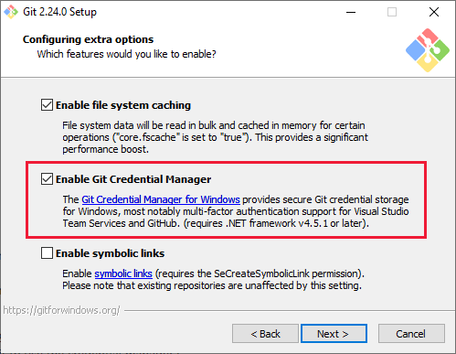
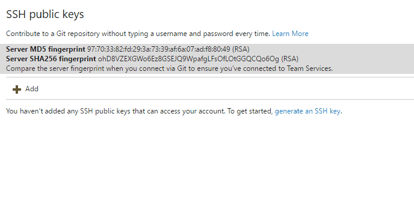

# Authentication overview

#### Azure Repos | Azure DevOps Server 2019 | TFS 2018 | TFS 2017 | TFS 2015 Update 3

Choose a method to securely access the code in Azure Repos or Azure DevOps Server 2019 Git repositories.
Use these credentials with Git at a command prompt. These credentials also work with any Git client that supports HTTPS or SSH authentication.
Limit the scope of access and revoke these credentials when they're no longer needed.

Azure DevOps Server was formerly named Visual Studio Team Foundation Server (TFS).

> [!TIP]
> Using Visual Studio? Team Explorer handles authentication with Azure Repos for you.

## Authentication comparison

| Authentication Type | When to use | Secure? | Ease of setup | Additional tools |   
|---------------------|:-------------:|:------------:|:---------------------|-------------|   
| Personal access tokens | When you need an easy way to configure credential or need configurable access controls | Very secure (when using HTTPS) |  Easy | (Optional) [Git Credential Manager](set-up-credential-managers.md) |   
| SSH | When you already have SSH keys set up, or are on macOS or Linux | Very secure | Intermediate | Windows users need the SSH tools included with [Git for Windows](https://git-for-windows.github.io/)  |
| Alternate credentials | When you can't use personal access tokens or SSH |  Least secure | Easy | No |

## Personal access tokens

Personal access tokens let you create a password for use with the command line or other Git client. You don't need to use your Azure Repos username and password directly.
An expiration date is set on these tokens when they're created.
You can restrict the scope of the data they can access.
Use personal access tokens to authenticate if you don't already have SSH keys set up on your system. If you need to restrict the permissions the credential can grant, use personal access tokens.

* [Learn more about personal access tokens and how to create one](../../organizations/accounts/use-personal-access-tokens-to-authenticate.md)

### Use Git Credential Manager to generate tokens

[Git Credential Manager](set-up-credential-managers.md) is an optional tool that makes it easy to create personal access tokens when working with Azure Repos.
Normally, you'd need to sign into the [Azure DevOps web portal](https://dev.azure.com) to generate a token. Then you can use the token as your password when you connect to Azure Repos.

Personal access tokens are generated on demand when you have the credential manager installed.
The credential manager creates the token in Azure Repos. It saves the token locally for use with the Git command prompt or other client.

>[!NOTE]
>Current versions of [Git for Windows](https://git-for-windows.github.io/) include the Git credential manager as an optional feature during installation.
>
>

## SSH key authentication

Key authentication with SSH works through a public and private key pair that you create on your computer.
You associate the public key with your username from the web. Azure Repos encrypts the data sent to you by using that key when you work with Git.
You decrypt the data on your computer with the private key, which is never shared or sent over the network.

SSH is a great option if you've already got it set up on your system. Just add a public key to Azure Repos and clone your repos using SSH.
If you don't have SSH set up on your computer, you should use personal access tokens and HTTPS instead. Personal access tokens are secure and easier to set up.

Learn more about [setting up SSH with Azure Repos](use-ssh-keys-to-authenticate.md).

::: moniker range="azure-devops"

## Alternate credentials

Use alternate credentials as a last resort when you can't use personal access tokens or SSH keys.

>[!IMPORTANT]
> - We don't recommend using alternate credentials.
> - Azure DevOps Server doesn't support alternate credentials.
> - The username specified for the alternate credentials must be unique within that user's Azure DevOps Services organization.

Create an alternate username and password to access your Git repository using alternate credentials.
Unlike personal access tokens, this username doesn't expire. It can't be scoped to limit access to your Azure Repos data.

::: moniker-end