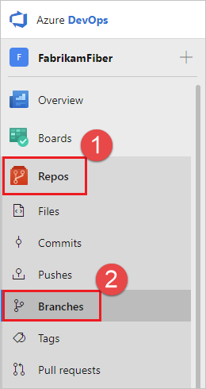

# Set branch permissions

[!INCLUDE [version-lt-eq-azure-devops](../../includes/version-lt-eq-azure-devops.md)]

Set up permissions to control who can read and update the code in a branch on your Git repo.
You can set permissions for individual users and groups, and inherit and override permissions as needed from your [repo permissions](set-git-repository-permissions.md#git-repository).

[!INCLUDE [version-selector](../../includes/version-selector.md)]

## Use the branches view to configure security

::: moniker range=">= azure-devops-2019"

1. Open the **Branches** page by navigating to your project in the web portal and selecting **Repos**, **Branches**.

   

::: moniker-end

2. Locate your branch in the page. You can browse the list or you can search for your branch using the **Search all branches** box in the upper right.

   

3. Open the context menu by selecting the **...** icon next to the branch name. Select **Branch security** from the menu.

   

## Add users or groups

> [!TIP]    
> You can only add permissions for users and groups already in your Project. [Add new users and groups to your Project](../../organizations/security/add-users-team-project.md) before setting branch permissions. 

Add users or groups to your branch permissions by selecting **Add**.  
Enter the sign-in address or group alias, then select **Save Changes**.

## Remove users or groups

Remove permissions for a user or group by selecting the user or Azure DevOps group, then selecting **Remove**. 
The user or group will still exist in your Project and this change will not affect other permissions for the user or group.    

 
## Set permissions 

Control branch permission settings from the branch permission view. Users and groups with permissions set at the repository level will
[inherit those permissions](../../organizations/security/about-permissions.md#permission-inheritance) by default.

::: moniker range=">= azure-devops-2019"
The following permissions are automatically assigned to branch creators: **Contribute**, **Force push**, **Manage permissions** (when allowed through the repository setting **Permissions management**), and **Remove others' locks**.

> [!NOTE]
> The **Exempt from policy enforcement** permission was removed for Azure DevOps Server 2019 and later versions. It's functionalilty is now supported with the following two permissions: 
>
>- **Bypass policies when completing pull requests**
>- **Bypass policies when pushing**
>
> Users that previously had **Exempt from policy enforcement** enabled now have the two new permissions enabled instead. See the following table for more details on these two new permissions.
::: moniker-end

:::row:::
   :::column span="":::
      **Permission**
   :::column-end:::
   :::column span="":::
      **Description**
   :::column-end:::
:::row-end:::
---
::: moniker range=">= azure-devops-2019"
:::row:::
   :::column span="":::
      **Bypass policies when completing pull requests**
   :::column-end:::
   :::column span="":::
      Users with this permission are exempt from the [branch policy](branch-policies.md) set for the branch when completing pull requests and can opt-in to override the policies by checking **Override branch policies and enable merge** when completing a PR.
   :::column-end:::
:::row-end:::
::: moniker-end
::: moniker range=">= azure-devops-2019"
:::row:::
   :::column span="":::
      **Bypass policies when pushing**
   :::column-end:::
   :::column span="":::
      Users with this permission can push to a branch that has branch policies enabled. Note that when a user with this permission makes a push that would override branch policy, the push automatically bypasses branch policy with no opt-in step or warning.
   :::column-end:::
:::row-end:::
::: moniker-end
 
:::row:::
   :::column span="":::
      **Contribute**
   :::column-end:::
   :::column span="":::
      Can push new commits to the branch and lock the branch. Can't rewrite existing commits on the branch. 
   :::column-end:::
:::row-end:::

:::row:::
   :::column span="":::
      **Edit policies**
   :::column-end:::
   :::column span="":::
      Can edit [branch policies](branch-policies.md). 
   :::column-end:::
:::row-end:::

:::row:::
   :::column span="":::
      **Force push (rewrite history, delete branches and tags)**
   :::column-end:::
   :::column span="":::
      Can force push to a branch, which can rewrite history. This permission is also required to delete a branch.
   :::column-end:::
:::row-end:::

:::row:::
   :::column span="":::
      **Manage permissions**
   :::column-end:::
   :::column span="":::
      Can set permissions for the branch.
 
   :::column-end:::
:::row-end:::

:::row:::
   :::column span="":::
      **Remove others' locks**
   :::column-end:::
   :::column span="":::
     Can remove [locks](lock-branches.md) set on branches by other users.
 
   :::column-end:::
:::row-end:::

