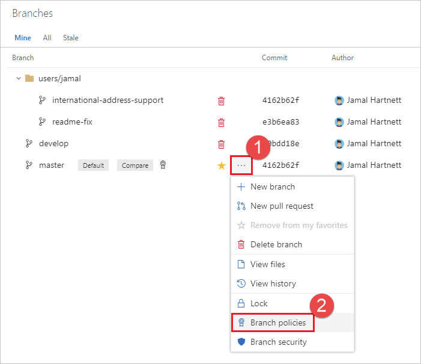
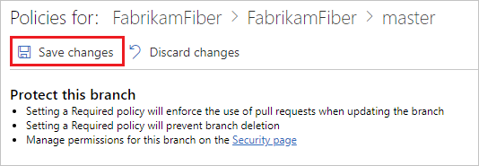
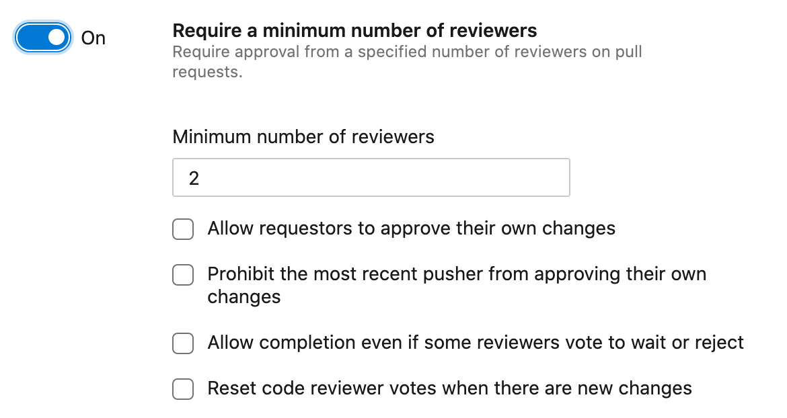
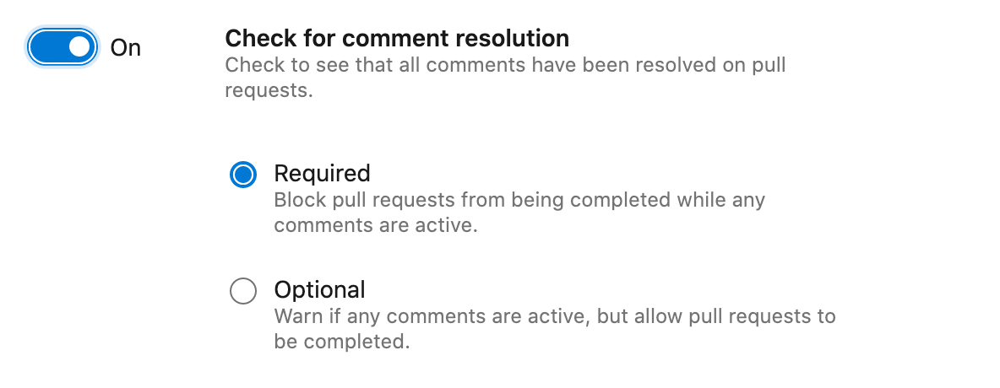
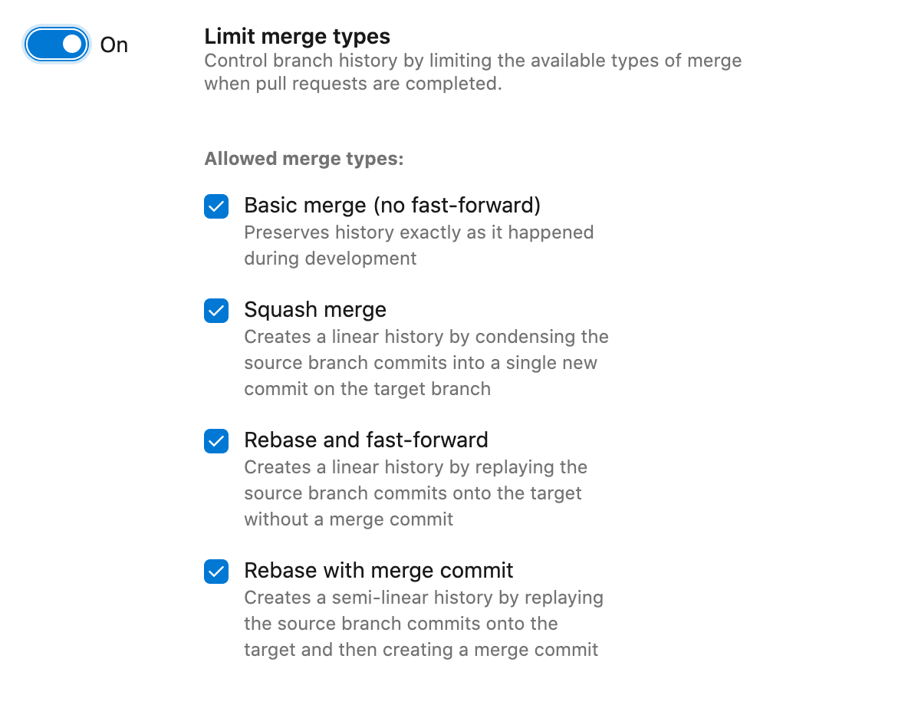
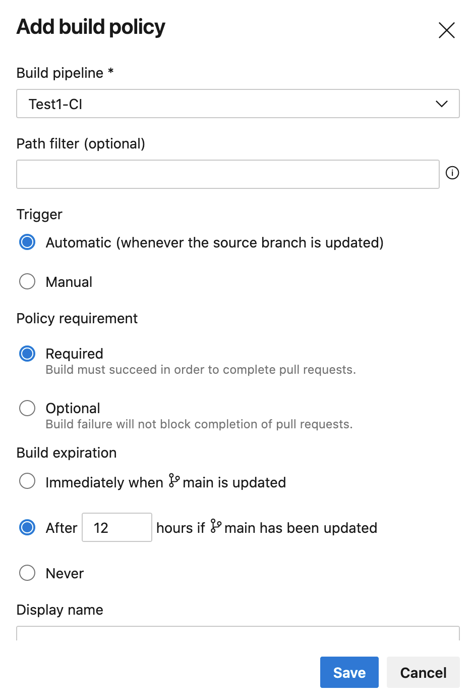
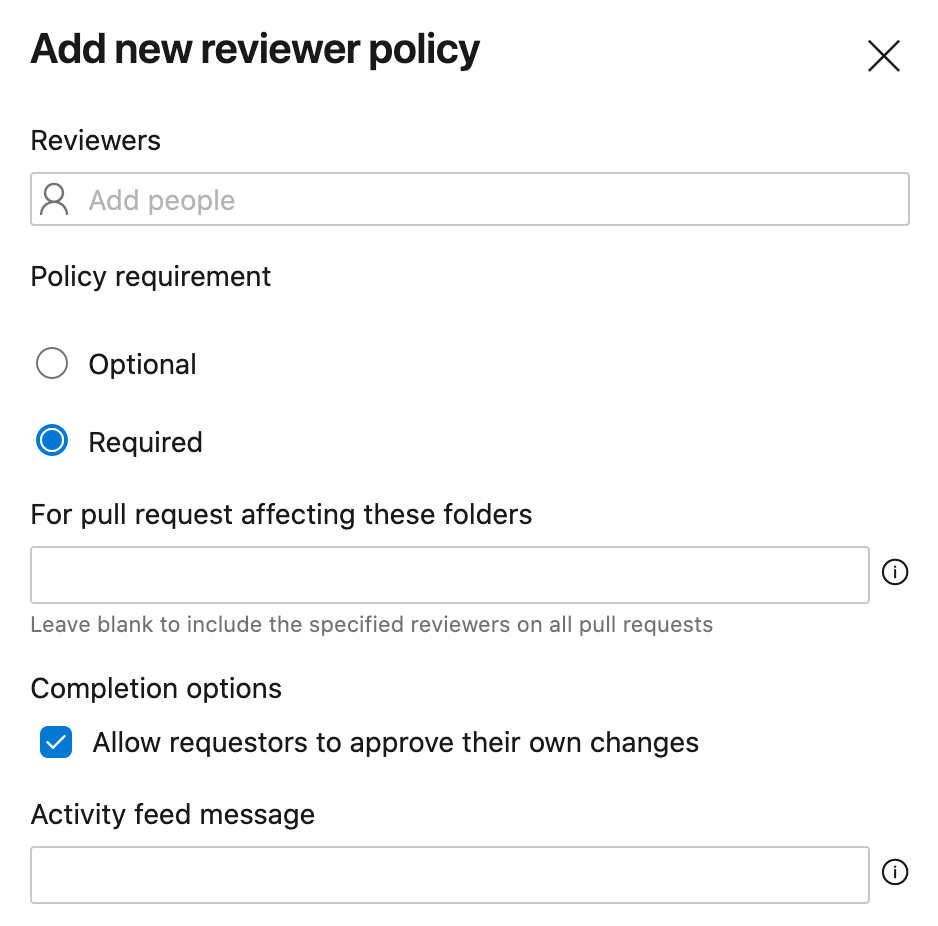

# Improve code quality with branch policies

#### Azure Repos | Azure DevOps Server 2019 | TFS 2018 | TFS 2017 | TFS 2015

Branch policies help teams protect their important [branches](branches.md) of development.
Policies enforce your team's code quality and change management standards.

## Configure branch policies

1. Select **Repos** > **Branches** to open the **Branches** page in the web portal.

   

1. Locate your branch in the page. You can browse the list or you can search for your branch using the **Search all branches** box in the upper right.

   

1. Select the **...** button. Select **Branch policies** from the context menu.

   

::: moniker range=">= azure-devops-2020"

1. Configure policies on the **Settings** page. See the following sections for descriptions of each policy type.

::: moniker-end

::: moniker range="< azure-devops-2020"

1. Configure your policies in the **Policies** page. See the following sections for descriptions of each policy type. Select **Save changes** to apply your new policy configuration.

     

::: moniker-end

## Require a minimum number of reviewers

Code reviews are a best practice for most software development projects.
To require teams to review their changes before completing a pull request, select **Require a minimum number of reviewers**.

The basic policy requires that a certain number of reviewers approve the code with no rejections.

::: moniker range=">= azure-devops-2020"

  

- If **Allow requestors to approve their own changes** is selected, the creator of the pull request may vote on its approval. If not, they can still vote **Approve** on their pull request, but their vote won't count toward the **Minimum number of reviewers**.
- By default, anyone with push permissions on the source branch may both add commits and vote on the pull request's approval. By enabling **Prohibit the most recent pusher from approving their own changes**, you can enforce segregation of duties - having the most recent push automatically makes the pusher's vote not count.
- If any reviewer rejects the changes, the pull request can't finish unless you select **Allow completion even if some reviewers vote to wait or reject**.
- You can reset code reviewer votes when new changes are pushed to the source branch. Select **Reset code reviewer votes when there are new changes**.

::: moniker-end

::: moniker range="< azure-devops-2020"

  

- If **Requestors can approve their own changes** isn't selected, the creator of the pull request can still vote **Approve** on their pull request, but their vote won't count toward the **Minimum number of reviewers**.
- If any reviewer rejects the changes, the pull request can't finish unless you select **Allow completion even if some reviewers vote to wait or reject**.
- You can reset code reviewer votes when new changes are pushed to the source branch. Select **Reset code reviewer votes when there are new changes**.

::: moniker-end

When the required number of reviewers approve the pull request, it can finish.

>[!NOTE]
> The **Requestors can approve their own changes** setting only applies to the **Require a minimum number of reviewers** policy. It doesn't affect other policies such as [Automatically include code reviewers](#automatically-include-code-reviewers). For example, Jamal Hartnett creates a pull request with the following policies configured:
>
> - **Minimum number of reviewers** requires two reviewers.
> - **Requestors can approve their own changes** isn't set.
> - The **Fabrikam Team** group is a required reviewer, and Jamal is a member of that group.
>
>In this example, since Jamal is part of the **Fabrikam Team** group, his **Approve** vote satisfies the required reviewer policy. The pull request still requires two additional **Approve** votes to satisfy the **Minimum number of reviewers** policy, since his vote doesn't count toward that policy.

## Check for linked work items

Require associations between pull requests and a work item to ensure that changes to your branch have [work item management tracking](../../boards/backlogs/connect-work-items-to-git-dev-ops.md).
Linking work items provides additional context for your changes and ensures that updates go through your work item tracking process.

::: moniker range=">= azure-devops-2020"

::: moniker-end

::: moniker range="< azure-devops-2020"

::: moniker-end

::: moniker range=">= azure-devops-2020" 

## Check for comment resolution

Configure a comment resolution policy for your branch by selecting **Check for comment resolution**.

For more information on working with pull request comments, see [Pull requests - leave comments](pull-requests.md#leave-comments).

::: moniker-end

::: moniker range=">= tfs-2017  < azure-devops-2020"

## Check for comment resolution

Configure a comment resolution policy for your branch by selecting **Check for comment resolution**.

For more information on working with pull request comments, see [Pull requests - leave comments](pull-requests.md#leave-comments).

::: moniker-end

::: moniker range=">= azure-devops-2020"

## Limit merge types

Maintain a consistent branch history by enforcing a merge strategy when a pull request finishes.
Azure Repos has multiple merge strategies, and by default, all of them are allowed.
Select **Limit merge types** to pick which ones you'll allow in your repo.

- **Basic merge (no fast-forward)** - creates a merge commit in the target whose parents are the target and source branches.
- **Squash merge** - creates a linear history with a single commit in the target branch with the changes from the source branch. [Learn more about squash merging](merging-with-squash.md) and how it affects your branch history.
- **Rebase and fast-forward** - creates a linear history by replaying source commits onto the target branch with no merge commit.
- **Rebase with merge commit** - replays the source commits onto the target and still creates a merge commit

  
::: moniker-end 
 
::: moniker range="< azure-devops-2020"

## Enforce a merge strategy

Maintain a consistent branch history by enforcing a merge strategy when a pull request finishes.
Select **Enforce a merge strategy** and pick an option to require that pull requests merge using that strategy.

- **No fast-forward merge** - This option merges the commit history of the source branch when the pull request closes and creates a merge commit in the target branch.
- **Squash merge** - Complete all pull requests with a squash merge, creating a single commit in the target branch with the changes from the source branch. [Learn more about squash merging](merging-with-squash.md) and how it affects your branch history.

  
::: moniker-end 
 
::: moniker range=">= azure-devops-2020" 

## Build validation

Set a policy requiring changes in a pull request to build successfully with the protected branch before the pull request can be completed.
Build policies reduce breaks and keep your test results passing. Build policies help even if you're using [continuous integration](/azure/devops/learn/what-is-continuous-integration) (CI) on your development branches to catch problems early.

If a build validation policy is enabled, a new build is queued when either a new pull request is created, or if changes are pushed to an existing pull request targeting the branch. The build policy then evaluates the results of the build to determine whether the pull request can be completed.

>[!IMPORTANT]
>Before specifying a build validation policy, you must have a build pipeline. If you don't have one, see [Create a build pipeline](../../pipelines/apps/index.md) and choose the type of build that matches your project type.

Choose the **+** button next to **Build validation**.

1. Select the **Build pipeline**.
1. Optionally set a **Path filter**. Learn more about [path filters](#path-filters) in branch policies.
1. Choose the type of **Trigger**. Select **Automatic (whenever the source branch is updated)** or **Manual**.
1. Select the **Policy requirement**. If you choose **Required**, builds must complete successfully to complete pull requests. Choose **Optional** to provide a notification of the build failure but still allow pull requests to complete.
1. Set a build expiration to make sure that updates to your protected branch don't break changes for open pull requests.

   - **Immediately when `branch name` is updated**: This option sets the build policy status in a pull request to *failed* when the protected branch is updated. Requeue a build to refresh the build status. This setting ensures that the changes in pull requests build successfully even as the protected branch changes. This option is best for teams that have important branches with a lower volume of changes. Teams working in busy development branches may find it disruptive to wait for a build to complete every time the protected branch is updated.
   - **After `n` hours if `branch name` has been updated**: This option expires the current policy status when the protected branch updates if the passing build is older than the threshold entered. This option is a compromise between always requiring a build when the protected branch updates and never requiring one. This choice is excellent for reducing the number of builds when your protected branch has frequent updates.
   - **Never**: Updates to the protected branch don't change the policy status. This value reduces the number of builds for your branch. It can cause problems when closing pull requests that haven't updated recently.
  
1. Enter an optional **Display name** for this build policy. This name identifies the policy on the **Branch policies** page. If you don't specify a display name, the policy uses the build pipeline name.
1. Select **Save**.

When the owner pushes changes that build successfully, the policy status is updated. If you have an **Immediately when `branch name` is updated** or **After `n` hours if `branch name` has been updated** build policy chosen, the policy status updates when the protected branch is updated if the most recent build is no longer valid.

::: moniker-end

::: moniker range=">= tfs-2015 < azure-devops-2020" 

## Build validation

Set a policy requiring changes in a pull request to build successfully with the protected branch before the pull request can be completed.
Build policies reduce breaks and keep your test results passing. Build policies help even if you're using [continuous integration](/azure/devops/learn/what-is-continuous-integration) (CI) on your development branches to catch problems early.

If a build validation policy is enabled, a new build is queued when either a new pull request is created, or if changes are pushed to an existing pull request targeting the branch. The build policy then evaluates the results of the build to determine whether the pull request can be completed.

>[!IMPORTANT]
>Before specifying a build validation policy, you must have a build definition. If you don't have one, see [Create a build definition](../../pipelines/apps/index.md) and choose the type of build that matches your project type.

Choose **Add build policy** and configure your options in **Add build policy**.

1. Select the **Build definition**.
1. Choose the type of **Trigger**. Select **Automatic (whenever the source branch is updated)** or **Manual**.
1. Select the **Policy requirement**. If you choose **Required**, builds must complete successfully to complete pull requests. Choose **Optional** to provide a notification of the build failure but still allow pull requests to complete.
1. Set a build expiration to make sure that updates to your protected branch don't break changes for open pull requests.

   - **Immediately when `branch name` is updated**: This option sets the build policy status in a pull request to *failed* when the protected branch is updated. Requeue a build to refresh the build status. This setting ensures that the changes in pull requests build successfully even as the protected branch changes. This option is best for teams that have important branches with a lower volume of changes. Teams working in busy development branches may find it disruptive to wait for a build to complete every time the protected branch is updated.
   - **After `n` hours if `branch name` has been updated**: This option expires the current policy status when the protected branch updates if the passing build is older than the threshold entered. This option is a compromise between always requiring a build when the protected branch updates and never requiring one. This choice is excellent for reducing the number of builds when your protected branch has frequent updates.
   - **Never**: Updates to the protected branch don't change the policy status. This value reduces the number of builds for your branch. It can cause problems when closing pull requests that haven't updated recently.
  
1. Enter an optional **Display name** for this build policy. This name identifies the policy on the **Branch policies** page. If you don't specify a display name, the policy uses the build definition name.
1. Select **Save**.

When the owner pushes changes that build successfully, the policy status is updated. If you have an **Immediately when `branch name` is updated** or **After `n` hours if `branch name` has been updated** build policy chosen, the policy status updates when the protected branch is updated if the most recent build is no longer valid.

::: moniker-end

::: moniker range="azure-devops" 

## Status Checks

External services can use the PR [Status API](https://go.microsoft.com/fwlink/?linkid=854107) to post detailed status to your PRs. The branch policy for additional services brings the ability for those third-party services to participate in the PR workflow and establish policy requirements.

For instructions on configuring this policy, see [Configure a branch policy for an external service](pr-status-policy.md).

::: moniker-end 

## Automatically include code reviewers

Select reviewers for specific directories and files in your repo.

::: moniker range=">= azure-devops-2020"

::: moniker-end

::: moniker range="< azure-devops-2020"

::: moniker-end

These reviewers are automatically added to pull requests that change files along those paths. You can also specify an **Activity feed message**.

::: moniker range=">= azure-devops-2020"

::: moniker-end

::: moniker range="< azure-devops-2020"

::: moniker-end

If you select **Required**, then the pull request can't be completed until:

- Every user added as a reviewer for the path approves the changes.
- At least one person in every group added to the path approves the changes.

::: moniker range="< azure-devops-2020"

::: moniker-end

Select **Optional** if you want to add reviewers automatically, but not require their approval to complete the pull request.

::: moniker range=">= azure-devops-2020"
You can select **Allow requestors to approve their own changes**.
::: moniker-end

::: moniker range="< azure-devops-2020"
You can select **Requestors can approve their own changes**.
::: moniker-end

When all required reviewers approve the code, you can complete the pull request.

::: moniker range="< azure-devops-2020"

::: moniker-end

## Bypass branch policies

In some cases, you need to bypass policy requirements. Bypassing lets you push changes to the branch directly or complete a pull request even if branch policies aren't satisfied. You can grant a permission from the previous list to a user or group. You can scope this permission to an entire project, a repo, or a single branch. Manage this permission along with other [Git permissions](../../organizations/security/permissions.md#git-repository-permissions-object-level).  

::: moniker range=">= azure-devops-2019"
In Azure DevOps Server 2019 and above, including the hosted service, there are two permissions that allow users to bypass branch policy in different ways.
**Bypass policies when completing pull requests** applies only to pull requests completion.
**Bypass policies when pushing** applies to pushes from a local repository and edits made on the web.

This [replaces the previous single permission](/azure/devops/release-notes/2018/jul-10-vsts#allow-bypassing-branch-policies-without-giving-up-push-protection).

::: moniker-end

::: moniker range="< azure-devops-2019"

In TFS 2015 through TFS 2018 Update 2, the **Exempt from policy enforcement** permission allows users with this permission to perform the following actions:

- When completing a pull request, opt-in to override policies and complete a pull request even if the current set of branch policies is not satisfied.
- Push directly to a branch even if that branch has branch policies set. Note that when a user with this permission makes a push that would override branch policy, the push automatically bypasses branch policy with no opt-in step or warning.

::: moniker-end

>[!IMPORTANT]
> Use caution when granting the ability to bypass policy, especially
> at the repo and project level.
> Policies are a cornerstone of secure and compliant source code management.

::: moniker range=">= azure-devops-2019"

## Path filters

Several branch policies offer path filters.
If a path filter is set, the policy wil only apply when files which match the filter are changed.
Leaving this field blank means that the policy will always apply.

You can specify absolute paths and wildcards.
Examples:
- `/WebApp/Models/Data.cs`
- `/WebApp/*`
- `*.cs`

You can specify multiple paths using `;` as a separator.
Example:
- `/WebApp/Models/Data.cs;ClientApp/Models/Data.cs`

Paths prefixed with `!` are excluded if they would otherwise be included.
Example:
- `/WebApp/*;!/WebApp/Tests/*` - includes all files in `/WebApp` except files in `/WebApp/Tests`
- `!/WebApp/Tests/*` - specifies no files, since nothing is included first

The order of filters is significant.
They're applied left-to-right.

::: moniker-end

::: moniker range=">= tfs-2015" 

## Q & A

- [Can I push changes directly to a branch after a branch policy is configured?](#can-i-push-changes-directly-to-a-branch-after-a-branch-policy-is-configured)
- [What is auto-complete?](#what-is-auto-complete)
- [When are the conditions set in branch policies checked?](#when-are-the-conditions-set-in-branch-policies-checked)
- [Can I use XAML build definitions in branch policies?](#can-i-use-xaml-build-definitions-in-branch-policies)
- [What wildcard characters can you use for required code reviewers?](#what-wildcard-characters-can-you-use-for-required-code-reviewers)
- [Are the required code reviewer paths case-sensitive?](#are-the-required-code-reviewer-paths-case-sensitive)
- [How can I configure multiple users as required reviewers, but only require that one of them approve?](#how-can-i-configure-multiple-users-as-required-reviewers-but-only-require-that-one-of-them-approve)
- [I have the exempt from policy permission set, why am I still seeing policy failures in the pull request status?](#i-have-the-exempt-from-policy-permission-set-why-am-i-still-seeing-policy-failures-in-the-pull-request-status)
- [Where can I get more information on advanced policy configurations?](#where-can-i-get-more-information-on-advanced-policy-configurations)

#### Can I push changes directly to a branch after a branch policy is configured?

No. After you set up a required branch policy, you can't directly push changes to the branch. Changes to the branch are only made through [pull requests](pull-requests-overview.md).

>[!NOTE]
>* If you have permissions that allow you to [bypass branch policies](#bypass-branch-policies) you can push directly to a branch after a required branch policy is configured.
>* If you configured optional branch policies, but no required branch policies, you can push changes directly to a branch.

#### What is auto-complete?

When you  make a pull request into a branch with branch policies configured, it enables the **Set auto-complete** button for the pull request. Use this option to [automatically complete](pull-requests.md#complete-the-pull-request) if you don't expect any problems with your changes. Your pull request finished once it meets all policies.

#### When are the conditions set in branch policies checked?

Branch policies are reevaluated on the server as changes are pushed and reviewers vote.
If there's a build triggered by the policy, the build status is set to waiting until the build completes.

#### Can I use XAML build definitions in branch policies?

You can't use XAML build definitions in branch policies.

#### What wildcard characters can you use for required code reviewers?

Single asterisks (`*`) and match any number of characters, including both forward-slashes (`/`) and back-slashes (`\`).  Question marks (`?`) match any single character.  

Examples:

* `*.sql` match all files with the *.sql* extension
* `/ConsoleApplication/*` match all files under the folder named *ConsoleApplication*
* `/.gitattributes` match the *.gitattributes* file in the root of the repo
* `*/.gitignore` match any *.gitignore* file in the repo

#### Are the required code reviewer paths case-sensitive?

No, branch policies aren't case-sensitive at this time.

#### How can I configure multiple users as required reviewers, but only require that one of them approve?

You can [add the users to a group](../../organizations/security/add-users-team-project.md), and then add the group as a reviewer.  Any member of the group can then approve for the group to meet the policy requirement.

#### I have the exempt from policy permission set, why am I still seeing policy failures in the pull request status?

The configured policies are still evaluated when you add changes to a pull request. Policies apply even for users that are exempt from policy enforcement. For exempt users, policy status is advisory only and doesn't block completion of the pull request.

#### Where can I get more information on advanced policy configurations?

Check out the [REST API documentation](https://go.microsoft.com/fwlink/?LinkId=526702) for more details.

::: moniker-end 
