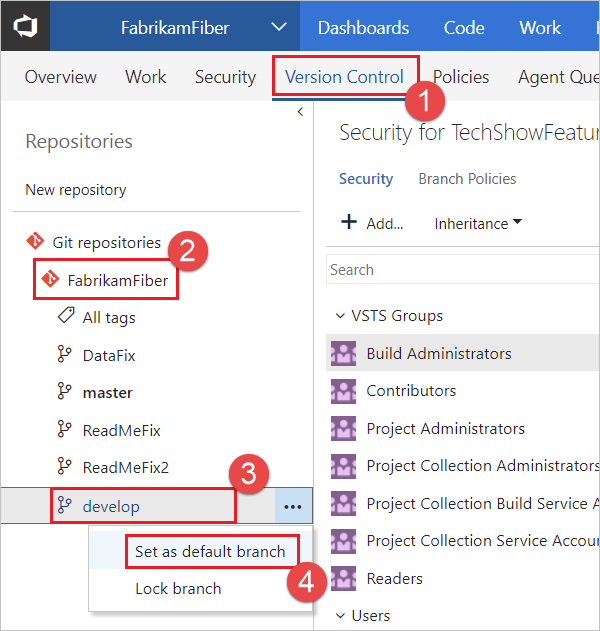

>[!NOTE]
>This step requires [Edit Policies permissions](../../../organizations/security/set-git-tfvc-repository-permissions.md#git-repository) on your Git repo.

Configure your Git repo to use a different default branch to merge code into when your team creates new pull requests.
You can use a branch other than `master` for new changes or change your main line of development in your repo.

::: moniker range=">= azure-devops-2019"

1. [Navigate](../../../project/navigation/go-to-project-repo.md) to your repository and select **Branches**.

3. Select the desired new default branch.

4. Select the **...** beside the desired branch and choose **Set as default branch**.

   

::: moniker-end

::: moniker range="<= tfs-2018"

1. Select the settings button in your project open to open the project administration page.

   

1. Select **Version Control**.

1. Select your Git repository. Your branches are displayed under your repo.

1. Select the **...** next to the branch you want to set as default, then select **Set as default branch**.

   

::: moniker-end
