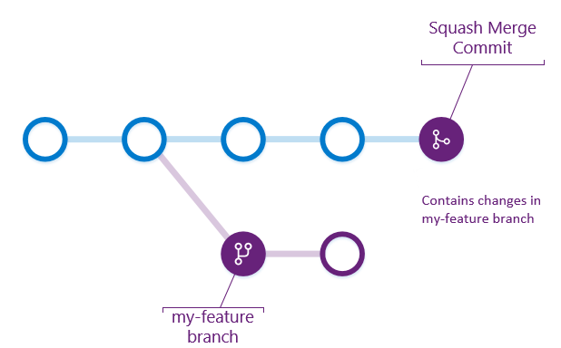
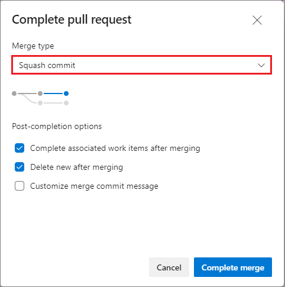
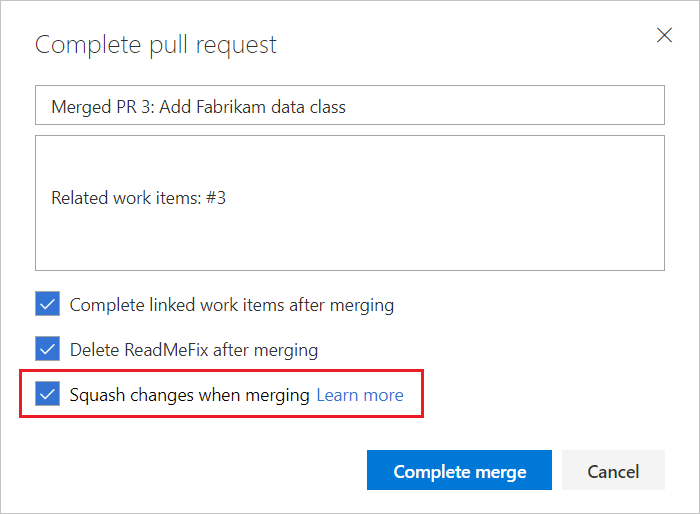

# Merge strategies and squash merge

[!INCLUDE [version-lt-eq-azure-devops](../../includes/version-lt-eq-azure-devops.md)]

When you complete a [pull request](pull-requests.md), you merge the topic branch into your default branch, usually `main`. This merge adds the commits of the topic branch to your main branch and creates a merge commit to reconcile any conflicts between the default and topic branch. The comments and discussion in the pull request give additional context for the changes made in the topic branch.


The [commit](commits.md) history on your `main` branch (or other default branch) doesn't follow a straight line, because of the related topic branch history. As a project grows larger, the number of topic branches worked on at the same time increases, making the default branch history increasingly harder to follow.

The default branch is an accurate representation of the history of each topic branch, but it's difficult to use to answer broader questions about your project's development.

## Squash merge

Squash merging is a merge option that allows you to condense the Git history of topic branches when you complete a pull request. Instead of each commit on the topic branch being added to the history of the default branch, a squash merge adds all the file changes to a single new commit on the default branch. Squash merge commit doesn't have reference to topic branch, it is absolutely new commit containing all the changes. Furthermore it is recommended to delete topic branch to prevent confusion with it.



A simple way to think about this is that squash merge gives you just the file changes, and a regular merge gives you the file changes and the commit history. 

### How is a squash merge helpful?

Squash merging keeps your default branch histories clean and easy to follow without demanding any workflow changes on your team. Contributors to the topic branch work how they want in the topic branch, and the default branches keep a linear history through the use of squash merges. The commit history of a `main` branch updated with squash merges has one commit for each merged branch. You can step through this history to find out exactly when work was done.

### Considerations when squash merging

Squash merging condenses the history of changes in your default branch, so it's important to work with your team to decide when you should squash merge or when you want to keep the full commit history of a topic branch. When squash merging, it's a good practice to delete the source branch. Deleting the source branch prevents confusion as the topic branch itself doesn't have a commit merging it into the default branch.

::: moniker range=">= azure-devops-2019"
### Complete pull requests with squash merge

You can choose to squash merge when completing a pull request in Azure Repos.

Choose **Squash commit** under **Merge type** in the **Complete pull request** dialog to squash merge the topic branch.



::: moniker-end

::: moniker range="tfs-2018"
### Complete pull requests with squash merge

You can choose to squash merge when completing a pull request in Azure Repos.

Choose **Squash changes when merging** on the **Complete pull request** dialog to squash merge the topic branch.



::: moniker-end

## Multiple merge bases

The **Files** tab in a pull request detects diffs by a three-side comparison. The algorithm takes into account the last commit in the target branch, the last commit in the source branch, and their [common merge base](https://git-scm.com/docs/git-merge-base) (i.e. the best common ancestor). The algorithm is a fast, cost-efficient, and reliable method of detecting changes. Unfortunately, in some cases, there's more than one true base. In most repositories this situation is rare, but in large repositories with many active users, it can be common. You can check your branches for a multiple merge bases manually with ```git merge-base --all feature master``` command. Also there is an automatic detection for such a cases that will notify you with message "Multiple merge bases detected. The list of commits displayed might be incomplete".

>[!NOTE]
>In case you are have a lost changes during a PR reviewing, please ensure the multiple merge bases is not the root cause.

The following scenarios can cause multiple bases:

- Cross-merges (also known as a criss-cross) between different branches
```
---1---o---A
    \ /
     X
    / \
---2---o---o---B
```
- Handling aftermaths of main branch reverts, e.g. ammend the merge commit
```
*   42bb2d2 (HEAD, A) Amended merge commit
|\  
| | *   67c9bb8 (other) Merge branch 'A' into B
| | |\  
| |/ /  
|/| /   
| |/    
| * fa78e32 add second commit
* | 15845c9 add first commit
|/  
* 6a52130 add init
```
- Active reuse of feature branches
- Other non-intuitive and convoluted manipulations with reverts, cherry picks, and merges


Multiple merge base detection is part of security awareness. If there are multiple merge bases, the file-diff algorithm for the user interface might not properly detect file changes, depending on which merge base it chooses. If the files in the pull request have different versions between the merge bases, a multiple merge base warning occurs.

Please review [the official git documentation](https://git-scm.com/docs/git-merge-base) for more details.

### Potential security risks of merging from multiple bases

- A malicious user could abuse the UI algorithm to commit malicious changes that aren't present in the PR.
- If changes proposed in the PR are already in the target branch, they're displayed in the **Files** tab, but they might not trigger branch policies that are mapped to folder changes.
- Two sets of changes to the same files from multiple merge bases might not be present in the PR. That case might create treacherous logic gaps.

### How to resolve the multiple merge bases issue

Having multiple merge bases isn't necessarily bad, but you should double-check that everything is fine. To get rid of multiple merge bases, tie the branches to a single common ancestor by either rebasing your branch on target, or merging target into your branch. Those actions get rid of the warning message and help you check if the actual changes are fine.

One approach is to soft reset and stash your progress before rebasing or merging. You can then create a new branch or rebase an empty one, and apply your changes from a clear point. This process might require a force push to remote if your changes are already there.

### How to avoid the multiple merge bases issue

Here are general tips for avoiding the multiple merge base issue:

- When preparing a pull request, create feature branches from the latest versions of the main or release branch.
- Avoid creating branches that don't originate directly from stable branches of your repository, unless required.

### What to do if the multiple merge bases issue reappears

In large repos with many active contributors, this issue can be especially inconvenient. Even if you get rid of multiple bases via merge, the situation might reappear. If someone closes a longstanding pull request, that can recreate the situation. Even though build policies and tests are running, you have no means to complete the pull request. Resetting and starting a new branch might help. If nothing is changed, your changes are probably clear, even if the situation repeats itself.

## Next steps

- [Resolve merge conflicts](merging.md)
- [Complete a pull request](complete-pull-requests.md)
- [About pull requests](about-pull-requests.md)

