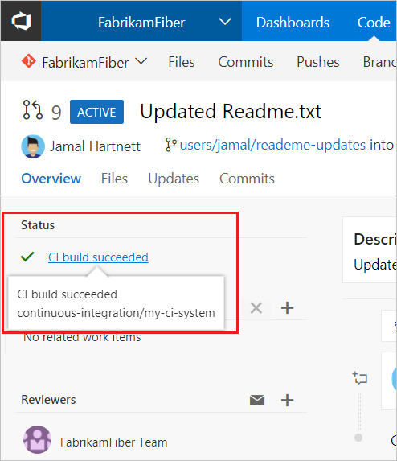
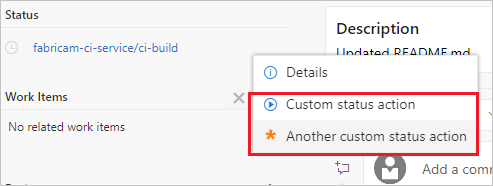

# Customize and extend pull request workflows with pull request status

#### Azure Repos | Azure DevOps Server 2019 | TFS 2018 Update 2

[Pull requests](pull-requests.md) are a great tool for facilitating code reviews and managing code movement within a repository. 
[Branch policies](branch-policies.md) enforce code quality during the pull request process by establishing requirements that must be performed for every code change. 
These policies enable teams to enforce many best practices related to reviewing code and running automated builds, but many teams have additional requirements and validations to perform on code. To cover these individual and custom needs, Azure Repos offers pull request statuses. Pull request statuses integrate into the PR workflow and allow external services to programmatically sign off on a code change by associating simple success/failure type information with a pull request. Optionally, pull requests can be blocked until the external service approves the change.

Integrating into the PR workflow involves a few different concepts:

* [Pull request status](#pull-request-status) - provides a way for services to associate success/failure information with a pull request.
* [Status policy](#status-policy) - provides a mechanism to block pull request completion until the pull request status indicates success.
* [Custom actions](#custom-actions) - provides a way to extend the status menu using Azure DevOps Services extensions.

In this topic, you'll learn about pull request statuses and how they can be used to integrate in the PR workflow.

## Pull request status

Pull request status provides a way for services to associate simple success/failure type information with a pull request, using the [Status API](https://go.microsoft.com/fwlink/?linkid=854107). 
A status consists of four key pieces of data:

* **State**. One of the following predefined states: `succeeded`, `failed`, `pending`, `notSet`, `notApplicable`, or `error`.
* **Description**. A string that describes the status to the end user.
* **Context**. A name for the status - typically describing the entity posting the status.
* **URL**. A link where users can get more information specific to the status. 

Essentially, status is the way a user or service posts their evaluation about a pull request and provides the answer to questions such as:

* Did the changes meet the requirements? 
* Where can I learn more about what I need to do to meet the requirements?

Let's look at an example. 
Consider a [CI service](../../pipelines/index.yml) that is required to build all code changes in a project. 
When that service evaluates the changes in a pull request, it needs to post back the results of the build and tests. 
For changes that pass the build, a status like this might be posted on the PR:

``` json
{
    "state": "succeeded",
    "description": "CI build succeeded",
    "context": {
        "name": "my-ci-system",
        "genre": "continuous-integration"
    },
    "targetUrl": "http://contoso.com/CI/builds/1"
}
```

This status would be displayed to the end user in the PR Details view:



* The `state` is shown to the user using an icon (green check for `succeeded`, red X for `failed`, a clock for `pending`, and a red ! for `error`). 
* The `description` is displayed next to the icon, and the `context` is available in a tooltip. 
* When a `targetUrl` is applied, the description will be rendered as a link to the URL. 

### Updating status

A service may update a PR status for a single PR by posting additional statuses, only the latest of which is shown for each unique `context`. 
Posting multiple statuses helps users manage expectations.
For example, posting a `pending` status is a good way to acknowledge to the user that a system has received an event and is starting work. 
Using an informative `description` such as the following examples can further help the user understand how the system is working:

* "Build queued"
* "Build in progress"
* "Build succeeded"

### Iteration status

When the source branch in a PR changes, a new "iteration" is created to track the latest changes. 
Services that evaluate code changes will want to post new status on each iteration of a PR. 
Posting status to a specific iteration of a PR guarantees that status applies only to the code that was evaluated and none of the future updates. 

Conversely, if the status posted applies to the entire PR, independent of the code, posting to the iteration may be unnecessary. For example, checking that the author (an immutable PR property) belongs to a specific group would only need to be evaluated once, and iteration status would not be needed.

When configuring the status policy, if iteration status is being used, the **Reset conditions** should be set to **Reset status whenever there are new changes**. 
This further guarantees that the PR will not be able to be merged until the latest iteration has a status of `succeeded`.


See the REST API examples for posting status [on an iteration](/rest/api/vsts/git/pull%20request%20statuses/create?view=vsts-rest-4.1#on-iteration) and [on a pull request](/rest/api/vsts/git/pull%20request%20statuses/create?view=vsts-rest-4.1#on-pull-request).

## Status policy

Using status alone, details from an external service can be provided to users within the PR experience. 
Sometimes, sharing information about a PR is all that is necessary, but in other cases PRs should be blocked from merging until requirements are met. 
Like the in-box policies, the **Status policy** provides a way for external services to block PR completion until requirements are met. If the policy is required, it must pass in order to complete the pull request. If the policy is optional, it is informational only, and a status of `succeeded` is not required in order to complete the pull request.

Status policies are configured just like other [branch policies](branch-policies.md). 
When adding a new status policy, the **name** and **genre** of the status policy must be entered. If the status has been posted previously you can pick it from the list; if it is a new policy you can type in the name of the policy in the format **genre**/**name**.


When a status policy is specified, it requires that a status of `succeeded` with the `context` matching the selected name be present to in order for this policy to pass.
  
An **Authorized account** can also be selected to require that a specific account has the authority to post status that will approve the policy. 

### Policy applicability

The **Policy applicability** options determine whether this policy applies as soon as a pull request is created, or whether the policy applies only after the first status is posted to the pull request.


1. **Apply by default** - The policy applies as soon as the pull request is created. With this option, the policy does not pass after pull request creation until a `succeeded` status is posted.
A PR can be marked exempt from the policy by posting a status of `notApplicable`, which will remove the policy requirement. 

2. **Conditional** - The policy doesn't apply until the first status is posted to the pull request.

Together, these options can be used to create a suite of dynamic policies. 
A top-level "orchestration" policy could be set to apply by default while the PR is being evaluated for applicable policies. 
Then, as additional conditional policies are determined to apply (perhaps based on specific build output), status can be posted to make them required. 
This orchestration policy could be marked `succeeded` when it is finished evaluating or could be marked `notApplicable` to indicate to the PR that the policy doesn't apply.

## Custom actions

In addition to predefined service hook events that can trigger the service to update PR status, it is possible to extend the status menu by using [Azure DevOps Services extensions](../../extend/index.md) to give trigger actions to the end user. For example, if status corresponds to a test run that can be restarted by the end user, it is possible to have a **Restart** menu item to the status menu that would trigger tests to run. To add a status menu, you'll need to use the [contribution model](../../extend/develop/contributions-overview.md). Check out the [Contributions guide sample](https://github.com/Microsoft/vsts-extension-samples/blob/master/contributions-guide/vss-extension.json#L670) on Github where you can see the parts of code that add the following sample items to the status menu..



## Next Steps

Learn more about the [PR Status API](https://go.microsoft.com/fwlink/?linkid=854107) and check out the how-to guides:

* [Create a pull request status server with Node.js](create-pr-status-server.md)
* [Use Azure Functions to create custom branch policies](create-pr-status-server-with-azure-functions.md)
* [Configure a branch policy for an external service](pr-status-policy.md)
