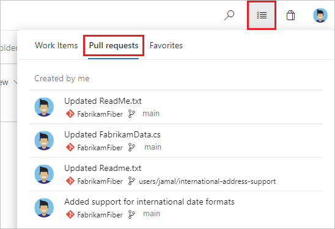
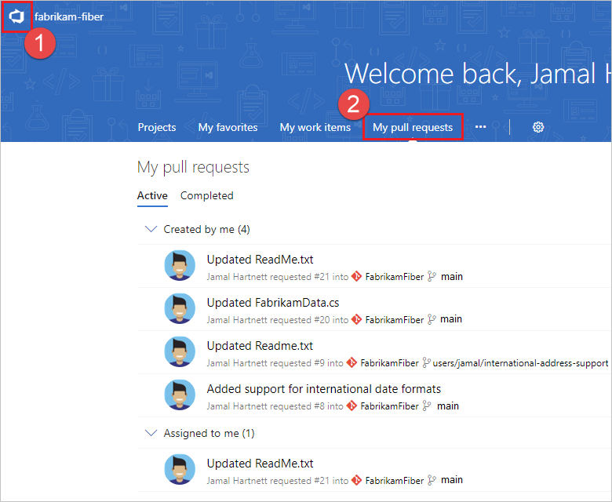
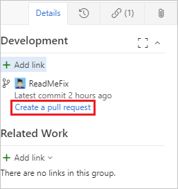
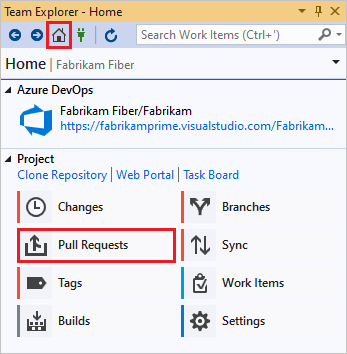
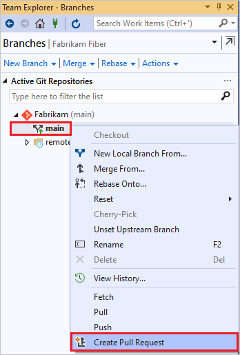
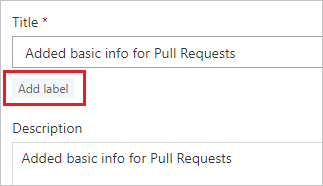
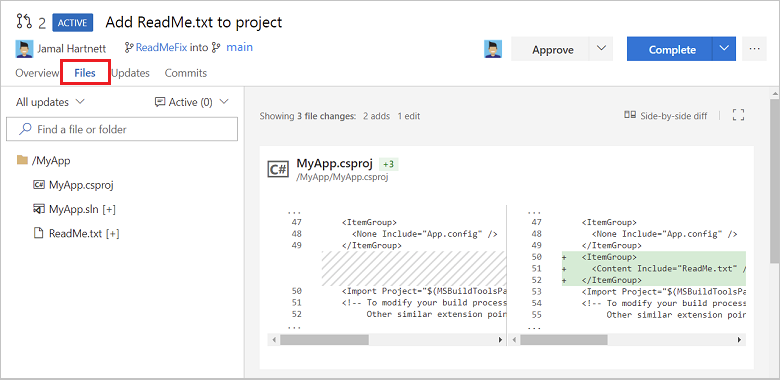
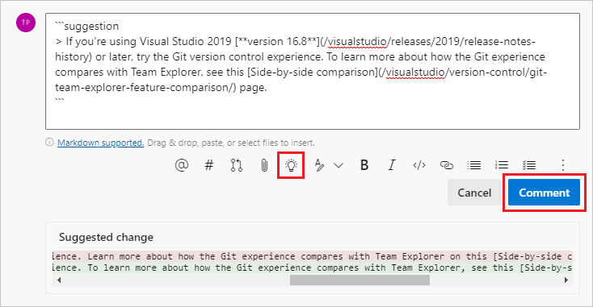
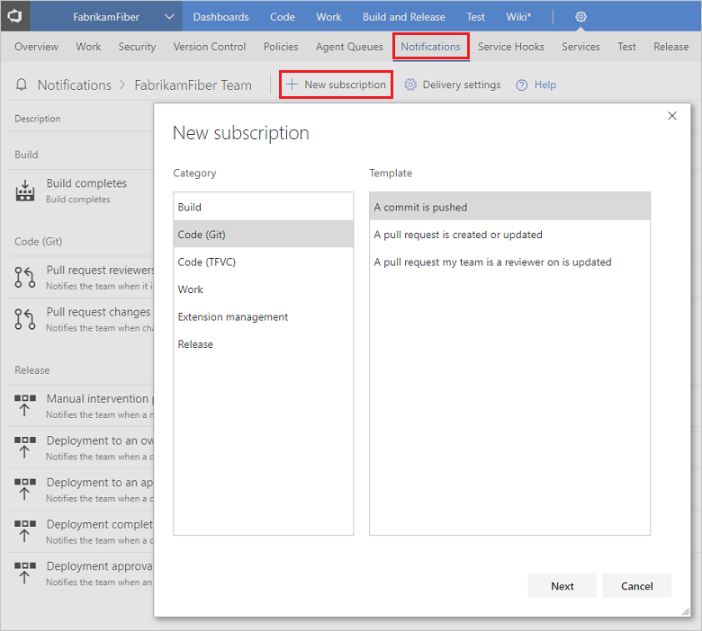

# Create, review, and manage pull requests

**Azure Repos | Azure DevOps Server 2020 | Azure DevOps Server 2019 | TFS 2018 | TFS 2017 | TFS 2015 | VS 2017 | VS 2015**

Create pull requests (PRs) to change, review, and merge code in a [Git project](../../organizations/projects/create-project.md). PRs can come from branches within the same repository or from branches in [forks](forks.md) of the repository. Teams can use PRs to review code and give feedback on changes before merging the code into the main branch. Reviewers can step through the proposed changes, leave comments, and vote to approve or reject the code.

The following video shows the pull request process. In the video, some terminology and user interface elements might be out-of-date.

> [!VIDEO https://www.youtube.com/embed/J_DHkUKxI0E?start=0]

New to pull requests? Learn more about how to [get feedback with Git pull requests](/devops/develop/git/git-pull-requests).

## Pull request guidelines

Use the following guidelines to create, review, and merge PRs.

### Get great feedback

High quality reviews start with high quality feedback. Here are some keys to great PR feedback:

- The PR owner should have the right people review the PR, and make sure that reviewers know what the code does.
- Reviewers should give actionable, constructive feedback.
- Owners and reviewers should comment and reply in a timely manner.

PR owners should:

- Make sure to select the right reviewers to assign to a PR.
- Include reviewers that know how the code works.
- Ask developers working in other areas to share their ideas.
- Give a clear description of changes.
- [Provide reviewer guidance with pull request templates](pull-request-templates.md).
- Provide a build of the code with the fix or feature running in it.
- Reply to comments, accepting the suggestion or explaining why the suggested change isn't ideal.
- For good suggestions outside the scope of the PR, create new work items, branches, and PRs to make those changes.

Reviewers should:

- Provide feedback on changes they don't agree with.
- Identify issues and give specific suggestions on what to do differently.
- Make sure the feedback has clear intent and is easy to understand.
- [Leave comments](#leave-comments).
- [Vote on the changes](#vote-on-the-changes).

### Protect branches with policies

Your team might rely on critical branches in your repo, such as the `main` branch, to always be in good shape. You can set [branch policies](branch-policies.md) to require PRs for any changes on these protected branches, and reject any changes pushed directly to the branches.

You can add more policies to PRs to enforce better code quality in key branches. Extra requirements like a clean build of the proposed code or approval from multiple reviewers can help protect key branches.

The number of required approvals for a PR is set in a branch policy. A PR can be set to auto-complete with the required number of approvals, even if other reviewers reject the changes. It's best practice for at least two reviewers to review and approve changes in a significant PR.

To reset votes when a PR author pushes new changes, select **Reset code reviewer votes when there are new changes** in the [Require a minimum number of reviewers](branch-policies.md#require-a-minimum-number-of-reviewers) branch policy.

For more information, see:

- [Branch policies overview](branch-policies-overview.md)
- [How to configure branch policies](branch-policies.md)
- [Branch permissions](branch-permissions.md)

### Extend workflow with PR status checks

Pull requests and branch policies let teams enforce best practices for reviewing code and running automated builds. Many teams have further requirements and validations to perform on code. To cover these needs, you can integrate PR status checks into the PR workflow. With PR status checks, external services can programmatically sign off on code changes by associating success or failure information with the PR.

- [Pull request status overview](pull-request-status.md)
- [Create a PR status server with Node.js](create-pr-status-server.md)
- [Use Azure Functions to create custom branch policies](create-pr-status-server-with-azure-functions.md)
- [Configure a branch policy for an external service](pr-status-policy.md)

## View pull requests

::: moniker range=">= azure-devops-2019"

1. To view PRs in a specific repository in a project, [go to that project](../../project/navigation/go-to-project-repo.md) in the web portal and select **Repos** > **Pull requests**.

   

1. Verify that you selected the correct repository.

   

1. The default view shows your PRs under the **Mine** tab. Select **Active** to show all active PRs for the current repository. Select **Completed** or **Abandoned** to bring up lists of closed PRs.

   Select any PR in the list to go to that PR's **Overview** page.

   

1. You can view all of your PRs across different projects in your organization by choosing **Pull requests** in the **My Work** view.

   

::: moniker-end

::: moniker range="<= tfs-2018"

Manage PRs you own or are assigned to with the **Pull Requests** tab in the **Code** page on the web.

::: moniker-end 

::: moniker range="<= tfs-2017" 

Select **Active** to show all active PRs for the current repo.

Select **Completed** or **Abandoned** to bring up a history of closed PRs.

::: moniker-end 

::: moniker range="<= tfs-2018"

You can view all of your PRs in your organization, across all projects, by choosing **My pull requests** from the **Projects** page.

::: moniker-end 

### Filter PRs

Filtering helps you find and organize PRs to prioritize the most important files in your workflow.

::: moniker range=">= azure-devops-2019"

- To filter PRs by target branch, on the **Pull requests** page, select the **Filter** icon at upper right, and then select **Target branch**. Select the branch you want from the dropdown list.

::: moniker-end

::: moniker range=">= azure-devops-2020"

On the PR **Files** page, you can select **Filter** to use several filters for faster reviews:

- Keyword
- Reviewed/Unreviewed: **All** (default), **Pending**, **Reviewed**
- Commented files: **All files** (default), **Files with comments**
- Comments: **Show** (default), **What's new**, **Hide**
- Comment status: **Active** (default), **Pending**, **Resolved**, **As designed**, **Won't fix**, **Closed**.
- Commented by: **All comments** (default), or filter for comments by a specific person.

You can create queries on the PR page with additional filters, such as draft state. These queries create separate and collapsible sections to enable better PR actionability. The queries work across repositories on the **My pull requests** tab of the organization home page.

::: moniker-end

## Create a pull request

You can create a new PR from:

- [A feature branch pushed to your repo](#from-a-pushed-branch).
- [The Development section in a linked Azure Boards work item](#from-a-linked-work-item).
- [The Pull requests page on the project's Azure DevOps website](#from-the-pull-requests-page-on-the-project-website).
- [Team Explorer in Visual Studio](#from-visual-studio).

::: moniker range=">= azure-devops-2020"

You can also create and manage PRs and other resources from the [Azure command-line interface (CLI)](/cli/azure/?view=azure-cli-latest&preserve-view=true). For more information about working with the Azure DevOps Services CLI, see [Get started with Azure DevOps CLI](../../cli/index.md).

::: moniker-end

### From a pushed branch

::: moniker range=">= azure-devops-2019"

After you push or update a feature branch, Azure Repos displays a prompt to create a PR.

- On the **Pull Requests** page:

  

- On the **Files** page:

  

Select **Create a pull request** to go to a page where you can [enter your PR details](pull-requests.md#finish) and create the PR.

::: moniker-end

::: moniker range="<= tfs-2018"

After you push or update a feature branch, Azure Repos prompts you to create a PR in the **Code** view on the web. This prompt is displayed on **Pull Requests** and **Files**.

Select **Create a pull request** to go to a page where you can [enter your PR details](pull-requests.md#finish) and create the PR.

::: moniker-end

### From a linked work item

You can create a PR directly from an Azure Boards work item linked to the branch.

1. From **Backlogs** or **Queries** in the **Work** view, open a work item that's linked to the branch.
2. In the **Development** area of the work item, select **Create a pull request**.

   

The link takes you to a page where you can [enter your PR details](pull-requests.md#finish) and create the PR.

### From the Pull requests page on the project website

You can create PRs for any branch from your project's **Pull requests** page on the web.

1. On the **Repos** > **Pull requests** page, select **New pull request** at upper right.

   

1. Select the branch with the changes and the branch you want to merge the changes into, such as the main branch.

   

1. [Enter your PR details](pull-requests.md#finish) and create the PR.

### From Visual Studio

You can initiate PRs directly from Visual Studio.

1. [Connect to your project from Visual Studio](../../organizations/projects/connect-to-projects.md).

1. Select **View** > **Team Explorer** to open Team Explorer. You can also press **Ctrl**+**\\**, **Ctrl**+**M**.

1. From **Home**, select **Pull Requests**.

   

1. Select **New Pull Request** to open your project's Azure Repos website to create a new PR.

   

   You can also view PRs opened by you or assigned to you under **Pull Requests**. Starting with Visual Studio 2017 Update 6, you can check out a PR's source branch directly from **Pull Requests**. Right-click the PR, and choose **Checkout Source Branch**.

   

You can also initiate PRs from the **Branches** view in Team Explorer by right-clicking the branch name and selecting **Create pull request**.

[!INCLUDE [temp](includes/note-new-git-tool.md)]

::: moniker range=">=azure-devops-2019"

## Create draft PRs

::: moniker-end

:::moniker range="azure-devops-2019"

> [!NOTE]
> Draft PRs were added in the Azure DevOps Server 2019.1 update.

:::moniker-end

::: moniker range=">=azure-devops-2019"

If your PR isn't ready for review, you can create a draft PR to indicate work in progress. When the PR is ready for review, you can publish it, and begin or resume the full review process.

Draft PRs have the following differences from published PRs:

- Build validation policies don't run automatically. You can queue build validations manually by selecting the more options menu next to the the build in the PR.
- Voting is disabled while in draft mode.
- Required reviewers aren't automatically added. Notifications are sent only to reviewers that you explicitly add to the draft PR.
- Draft PRs display in the PR list with a **Draft** badge.

  

To create a draft PR, select the arrow next to **Create** and select **Create as draft** when creating the PR. You don't have to use title prefixes such as WIP or DO NOT MERGE.

::: moniker-end

::: moniker range="< azure-devops"

- If you start your PR title with WIP, **Create as draft** is selected as the default.

  

::: moniker-end

::: moniker range=">=azure-devops-2019"

When you're ready to have the PR reviewed and completed, select **Publish** at upper right in the PR. Publishing a PR assigns required reviewers, evaluates policies, and kicks off voting.

To change an existing published PR to a draft, choose **Mark as draft**. Marking a PR as draft removes all votes.

::: moniker-end

## Add details to PRs

On the **New pull request** page, describe your changes so others can see what problems the changes solve. Just as in an existing PR, you can see the **Files** and **Commits** in your PR on separate tabs. You can change the PR title, add reviewers, link work items, and add tags and a detailed description to explain your changes.

When you're ready to have your changes reviewed, select **Create** to create the PR.

:::moniker range="azure-devops"

:::image type="content" source="media/pull-requests/create-new-pull-request-2020.png" alt-text="Screenshot that shows creating a new PR.":::

:::moniker-end

:::moniker range="<= azure-devops-2020"

:::image type="content" source="media/pull-requests/add-detail-to-pr.png" alt-text="Adding details to a new PR.":::

:::moniker-end

Don't worry if you don't have all of the work items, reviewers, or details ready when you create your PR. You can add or update these items after you create the PR.

::: moniker range="azure-devops"

### Use tags

Use tags to show important details and help organize PRs. Tags can communicate extra information to reviewers, such as that the PR is still a work in progress, or is a hotfix for an upcoming release. 

To add a tag when creating a PR, type a tag name in the **Tags** section. After you create the PR, you can manage tags in the **Tags** section.

:::image type="content" source="media/pull-requests/pull-request-tags-section.png" alt-text="Screenshot that shows the PR Tags section highlighted.":::

::: moniker-end

::: moniker range="<= azure-devops-2020"

### Help reviewers by using PR labels

You can communicate extra information about a PR to the reviewers by using labels. Maybe the PR is still a work in progress, or it's a hotfix for an upcoming release. Use labels to communicate important details and help organize PRs.

To add a label when creating a PR, choose **Add label**. After you create a PR, you can manage its labels in the **Labels** section.

::: moniker-end

### Add reviewers

::: moniker range="azure-devops"

You can add reviewers when you create a PR, or in the **Reviewers** section of an existing PR. You can also make existing optional reviewers required, or change required reviewers to optional or remove them, unless they're required by policy.

To add reviewers to your PR:

1. On the PR **Overview** tab, in the **Reviewers** area, select **Add** and then select **Required reviewer** or **Optional reviewer**.

   :::image type="content" source="media/pull-requests/pull-request-add-reviewer-v2.png" alt-text="Pull request overview":::

1. Enter the name of a user or group to add to the reviewer list for the PR. If a reviewer isn't a member of your project, you'll need to [add them to the project](../../organizations/security/add-users-team-project.md) first.

1. As you enter a name or email address, a list of matching users or groups appears. Select the user or group from the list to add them as a reviewer.

   :::image type="content" source="media/pull-requests/pull-request-add-reviewer.png" alt-text="Add PR reviewer.":::

To change a reviewer between required and optional, or remove a reviewer, select **More options** to the right of the reviewer name. To see the members of a team or group designated as reviewers, select the group's icon.

::: moniker-end

:::moniker range="<= azure-devops-2020"

To add reviewers to your PR:

1. Select **Overview** in the PR.

   :::image type="content" source="media/pull-requests/pull-request-overview-reviewers-new-nav.png" alt-text="Screenshot that shows the PR Overview tab":::    

1. Select the **Add** button in the **Reviewers** area.

1. Enter the name of the user or group to add to the reviewer list for the PR. If the user isn't a member of your project, you'll need to [add them](../../organizations/security/add-users-team-project.md).

1. As you enter a name or email address, a list of matching users or groups appears. Select the user or group from the list to add them as a reviewer.

   :::image type="content" source="media/pull-requests/add-pr-reviewer.png" alt-text="Add PR reviewer.":::

:::moniker-end

::: moniker range="<= tfs-2018"

To add reviewers to your PR:

1. Select the **Overview** tab in the PR.

   

1. Select the add button in the **Reviewers** area. :::image type="icon" source="media/pull-requests/pull-request-add-button.png":::

1. Enter the name of the user or group to add to the reviewer list for the PR. If the user isn't a member of your project, you'll need to [add them](../../organizations/security/add-users-team-project.md).

1. As you enter a name or email address, a list of matching users or groups appears. Select the user or group from the list to add them as a reviewer.

   

::: moniker-end

### Link work items

::: moniker range="azure-devops"

To link work items to your PR:

1. On the PR **Overview** tab, in the **Work Items** area, select **+**.

   :::image type="content" source="media/pull-requests/pull-request-link-work-items-2020.png" alt-text="Screenshot that shows selecting the Overview tab and the work items section.":::

1. Enter the ID of the work item or search for work item titles. Select the work item from the list that appears.

Remove a work item link by selecting the **x** icon next to the work item. Removing a link only removes the link between the work item and the PR. Links created in the branch or from commits remain in the work item.

::: moniker-end

:::moniker range="<= azure-devops-2020"

To link work items to your PR:

1. Select the **Overview** tab in the PR.

   :::image type="content" source="media/pull-requests/pull-request-overview-work-items-new-nav.png" alt-text="Screenshot that shows selecting the Overview tab and the link items button.":::

2. Select the add button in the **Work Items** area. 

3. Enter the ID of the work item or search for work items with titles that match your text. Select the work item from the list that appears.

Remove work item links by selecting the remove button that appears when you hover over the work item. 
Removing a link only removes the link between a work item to a PR. Links created in the branch or from commits stay in the work item.

:::moniker-end

::: moniker range="<= tfs-2018"

To link work items to your PR:

1. Select **Overview** in the PR.

   

2. Select the add button in the **Work Items** area. :::image type="icon" source="media/pull-requests/pull-request-add-button.png":::

3. Enter the ID of the work item or search for work items with titles that match your text. Select the work item from the list that appears.

Remove work item links by selecting the remove button that appears when you hover over the work item. 
Removing a link only removes the link between a work item to a PR. Links created in the branch or from commits stay in the work item.

::: moniker-end

### Edit PR title and description

Update a PR title by selecting the current title and updating the text. Select the **Save** icon to save changes, or select the **Undo** icon to discard the changes.

Edit the PR description by selecting the **Edit** icon in the **Description** section.

:::image type="content" source="media/pull-requests/pull-request-edit-title-description-2020.png" alt-text="Screenshot that shows editing the PR title and selecting the description Edit button.":::

Keep these fields up to date so reviewers can understand the changes in the PR.

::: moniker range=">=azure-devops-2019"

### Change the target branch of a PR

For most teams, nearly all PRs target a default branch, such as `main` or `develop`. If you need to target a different branch, it's easy to forget to change the target branch when creating the PR. To change the target branch of an active PR, see [Change the target branch of a PR](/azure/devops/release-notes/2018/sprint-141-update#azure-repos).

::: moniker-end

## Review pull requests

The PR **Overview** tab shows the current state of the PR at a glance. You can review the title, description, and comments to understand proposed changes and see issues raised by other reviewers.

To help get a quick picture of PR status, the **Overview** tab summarizes branch policies that are passing or failing. If available, the summary shows a snippet of the failure message from the check's log. The overview lists only failed policies, but you can see all the passed and failed policy checks by selecting **View checks**.

:::image type="content" source="media/pull-requests/pull-request-overview-2020.png" alt-text="Screenshot that shows the PR overview tab.":::

### Browse changes

::: moniker range="azure-devops"
- Select the **Files** tab of a PR to view the changes made in the source branch inline or side-by-side with the target branch.
  
  You can see how a file will look published by selecting the **View** button on a file, and then selecting **Preview**.
  
  :::image type="content" source="media/pull-requests/pull-request-browse-changes-2020.png" alt-text="Screenshot that shows a side-by-side diff view of file changes in a PR.":::
  
  >[!NOTE]
  >When viewing the difference for a *single selected file*, there's a file size limit of 5 MB. To view and diff files larger than 5 MB, you can download the file and view it using a local diff tool. When viewing the difference for a *collection of files*, the size limit for each file is 0.5 MB, for performance reasons.
::: moniker-end

::: moniker range="<= azure-devops-2020"
- Select **Files** to view the changes made to the source branch next to the target branch of the pull request.
  
  
  
  >[!NOTE]
  >When viewing the difference for a *single selected file*, there's a file size limit of 5 MB. To view and diff files larger than 5 MB, you can download the file and view it using a local diff tool. When viewing the difference for a *collection of files*, the size limit for each file is 0.5 MB, for performance reasons.
::: moniker-end

::: moniker range="azure-devops"
- You can review previous versions of the code from the **All Changes** drop-down list.
  
  Every update to the branch adds a new version to the list and on the **Updates** tab of the PR. As you select different updates, the diff view updates to show the differences between the files in each version of the PR.

  You can catch up with PR updates after being away from the PR by stepping through changes made since your last review. You can view multiple updates at once by pressing shift and selecting the updates you want to see. 
  
  :::image type="content" source="media/pull-requests/pull-request-all-changes-dropdown.png" alt-text="Screenshot that shows the All changes drop-down.":::

::: moniker-end

::: moniker range="<= azure-devops-2020"

- Review previous versions of the code from the **All updates** drop-down list.
  
  

  Every update to the branch adds a new version to the list and on the **Updates** tab of the PR. As you select different updates, the diff view updates to show the differences between the files in each version of the PR.

  Catch up with PR updates after being away from the PR by stepping through changes made since your last review.

::: moniker-end

::: moniker range=">= azure-devops-2019"

- View code coverage metrics for changes to ensure that you've adequately tested your changes through automated tests. Coverage status appears as a comment in the PR overview. You can view details of coverage information for every code line changed in the file diff view.

:::moniker-end

::: moniker range="azure-devops"
- Browse a list of changes from the author on the **Updates** tab.
  
  

- View and select changes made in commits to the branch on the **Commits** tab.
  
  
::: moniker-end

::: moniker range="<= azure-devops-2020"
- Browse a list of changes from the author on the **Updates** tab.
  
  

- View and select changes made in commits to the branch on the **Commits** tab.
  
  
::: moniker-end

### Make comments

Add comments to a PR to make suggestions, reply to previous comments, and point out problems with proposed changes.

::: moniker range="azure-devops"
- Comment inline in the **Files** tab of a PR by selecting the comment button :::image type="icon" source="./media/pull-requests/new-comment-icon.png"::: next to the line you want to comment on.

  
::: moniker-end

::: moniker range="<= azure-devops-2020"
- Comment inline in the **Files** tab of a PR by hovering over the line you want to comment on and selecting the comment button. .

  
::: moniker-end

- To suggest changes directly, select the lightbulb icon in the comment interface, make your suggested changes in the code, and then select **Comment**.

  

- Leave feedback not tied to a specific code line by commenting on the **Overview** tab.

- Address the author or other reviewers directly in your comments by using `@username`, and reference work items by using `#workitemID`. You can also reference other PRs by using `!pullrequestID`.

### Vote on changes

Use the button at upper right in the PR to vote on the PR changes. The default option is **Approve**, but you can select other options from the dropdown list:

- **Approve**: Approve the proposed changes in the PR.
- **Approve with suggestions**: Approve the PR, but provide optional suggestions for improvement.
- **Wait for author**: Don't approve the changes, and ask the author to review your comments. The author should let you know to review the code again after they address your concerns.
- **Reject**: The changes aren't acceptable. Leave a comment in the PR to explain why.
- **Reset feedback**: Remove your vote.

## Respond to reviews

::: moniker range="azure-devops"
After updating your code in response to comments or to fix issues, [commit](commits.md) the changes and [push](pushing.md) the updates to the branch in your Git repo.

To make quick updates to your branch, select **Edit** on the **Files** page in your branch on the web.

::: moniker-end

::: moniker range="<= azure-devops-2020"
You can make quick updates to your branch directly from the **Files** tab in **Code** on the web.

::: moniker-end

### Address comments

Reply directly to reviewers by using `@username` in the reply, and reference work items by using `#workitemID`. You can also reference other PRs by using `!pullrequestID`.

Update the comment status to let reviewers know how you're addressing their review comments and suggestions. New comments start in **Active** status. Select **Resolve** or **Reply & resolve** to update comment status.

More options are available in the comment resolution dropdown list:

- **Active**: The comment is still under review.
- **Pending**: The issue in this comment will be addressed, but isn't fixed yet.
- **Resolved**: The issue brought up in this comment is fixed.
- **Won't fix**: The suggestion in the comment is noted, but this PR won't address it.
- **Closed**: Discussion for this comment is closed.

:::moniker range=">= azure-devops-2019"

To keep track of files that have already been reviewed, select **More options** next to a file in your PR, and then select **Mark as reviewed**.

:::moniker-end

## Complete a pull request

After the PR gets all required approvals and meets all required policies, you can complete the PR.

::: moniker range="azure-devops"

1. Select **Complete** at upper right to complete the PR. Or select the dropdown arrow next to the **Complete** button, and select one of the following options:

   - **Complete**: Complete the PR now, and merge the changes to the target branch.
   - **Set auto-complete**: Configure the PR to complete and merge once it meets all required branch policies.
   - **Mark as draft**: Return the PR to draft status and reset all votes.
   - **Abandon**: Close the PR without merging the changes.

   

1. On the **Complete pull request** screen:

   1. Under **Merge type**, select one of the following options:
      - **Merge (no fast forward)**: Non-linear history that preserves all commits.
      - **Squash commit**: Linear history that combines all commits into a single commit on the target, or [squash merges](merging-with-squash.md) the PR.
      - **Rebase and fast-forward**: Rebase the source commits onto the target and fast-forward.
      - **Semi-linear merge**: Rebase source commits onto the target and create a two-parent merge.
   
      > [!NOTE]
      > Existing policies are still enforced. For example, if your branch currently has a "squash merge only" policy, you have to change that policy if you want to use the other merge types.
   
   1. Select any of the following post-completion options. Some options aren't available for some merge types.
      - **Complete associated work items after merging**: Complete any linked work items.
      - **Delete \<branch name> after merging**: Delete the PR's source branch after merging.
      - **Customize merge commit message**: Add a custom merge commit message. If you select this option, update the [merge commit](merging.md) message.
      - **Override branch policies and enable merge**. Force the merge even if the PR doesn't satisfy all branch policies. This option is only available if you have [Exempt from policy enforcement](branch-policies.md#bypass-branch-policies) permission.
   
   1. Select **Complete merge**.
     
   :::image type="content" source="media/pull-requests/pull-request-complete-merge-2020.png" alt-text="Screenshot that shows the complete PR dialog.":::

::: moniker-end

::: moniker range=">= azure-devops-2019 <= azure-devops-2020"

1. Select **Complete** at upper right to complete the PR. Or, select the dropdown arrow next to the **Complete** button, and select one of the following options:

   

   - **Complete**: Complete the PR now, and merge the changes to the target branch.
   - **Set auto-complete**: If you have branch policies, configure the PR to complete and merge once it meets all required branch policies.
   - **Abandon**: Close the PR without merging the changes.

1. On the **Complete pull request** screen, enter the message for the [merge commit](merging.md) and update the PR description.

   

1. Select any of the following options:
   - **Complete linked work items after merging** to complete any linked work items.
   - **Delete `<branch name>` after merging** to delete the source branch from the PR.
   - **Squash changes when merging** to [squash merge](merging-with-squash.md) your PR.
   - **Override branch policies and enable merge** to force a branch to merge even if it doesn't satisfy all branch policies. This option is only available if you have [Exempt from policy enforcement](branch-policies.md#bypass-branch-policies) permissions.
     
     
     > [!NOTE]
     > Existing policies are still enforced. For example, if your branch currently has a "squash merge only" policy in place, you have to edit that policy in order to use the other merge types.  

5. Select **Complete merge**.

::: moniker-end

::: moniker range=">= azure-devops-2019"
When you complete the merge, any linked work items automatically update to show the PR completion.

### Rebase during PR completion

There are a few situations when rebasing during PR completion isn't possible:

- If a policy on the target branch prohibits using rebase strategies, you need **Override branch policies** permission to rebase.
- If the PR source branch has policies, you can't rebase it. Rebasing would modify the source branch without going through the policy approval process.
- If you used the Merge Conflict Extension to resolve merge conflicts, you can't rebase. Conflict resolutions applied to a three-way merge are seldom successful or valid when rebasing all the PR commits individually.

In all these cases, you can still rebase your branch locally and then push upstream, or squash-merge your changes when you complete the PR.

::: moniker-end

::: moniker range="<= tfs-2018"

1. Select **Complete** in the upper right of the PR view to complete your PR after the reviewers approve of the changes.

   

   - **Complete**: Complete the PR now and merge the changes to the target branch.
   - **Set auto-complete**: If you have branch policies, you can choose **Set auto-complete** to configure the PR to close once it meets all branch policies.
   - **Abandon**: Close the PR without merging the changes.

2. In **Complete pull request**, enter the message for the [merge commit](merging.md) and update the PR description.

   

3. Select any of the following post-completion options:

   - **Complete linked work items after merging** to complete any linked work items.
   - **Delete `<branch name>` after merging** to delete the source branch from the PR.
   - **Squash changes when merging** to [squash merge](merging-with-squash.md) your PR.
   - **Override branch policies and enable merge** to force a branch to merge even if it doesn't satisfy all branch policies. This option is only available if you have [Exempt from policy enforcement](branch-policies.md#bypass-branch-policies) permissions.

4. Select **Complete merge**.

Linked work items are also updated showing the PR completion.

::: moniker-end

### Resolve merge conflicts

When you complete a PR, Git adds a new *merge commit* to the end of the main branch. This merge commit links the earlier histories of the main branch and the PR source branch. You must resolve any [merge conflicts](merging.md) between the PR branch and the target branch before you can merge the PR.

::: moniker range=">= tfs-2017"

### Complete automatically

Select **Set auto-complete** from the **Complete** dropdown list to complete and merge the PR changes as soon as conditions satisfy all [branch policies](branch-policies.md). When the PR is completed, you receive an email notification. If a conflict or error prevents PR completion, email notifies you of the issue.

>[!NOTE]
>The **Set auto-complete** option is available in Azure Repos and TFS 2017 and higher when you have branch policies. If you don't see **Set auto-complete**, you don't have any branch policies. For more information, see [Branch policies](branch-policies.md).

By default, a PR that's set to auto-complete waits only on required policies. In the **Enable automatic completion** panel, you can choose to wait on optional policies as well.

Starting with TFS 2018 Update 2, the PR **Overview** page [displays the list of outstanding policy criteria](/azure/devops/release-notes/2018/jan-24-vsts#view-remaining-policy-criteria-for-pull-request-auto-complete) the PR is waiting for. If you set a policy to required in the **Enable automatic completion** panel, you can set it back to optional here.

Select **Cancel auto-complete** to turn off auto-complete. 

::: moniker-end 

::: moniker range="azure-devops"

::: moniker-end 

::: moniker range=">= tfs-2017 <= azure-devops-2020"

::: moniker-end 

A PR set to auto-complete displays an **Auto-complete** badge on the **Pull requests** page.

### Abandon your changes

To abandon your changes, select **Abandon** from the dropdown list on the **Complete** button. You can still view the abandoned PR, and it stays linked to work items.

To reactivate an abandoned PR at any time, open the PR from the **Abandoned** tab in the **Pull Request** view, and select **Reactivate** at upper right.

## Receive PR update notifications

Subscribe to email alerts to be notified of changes to PRs.

>[!NOTE]
>By default, you're subscribed to several common PR notifications. For a complete list of default subscription notifications, see [Out-of-the-box (OOB) or default subscriptions](../../notifications/oob-built-in-notifications.md#out-of-the-box-oob-or-default-subscriptions).

::: moniker range=">= azure-devops-2019"

- To view your notification settings, [go to your project](../../project/navigation/go-to-project-repo.md) and select **Project settings** > **Notifications**.

  

- To subscribe to more notifications, select **New subscription**.

  

- To edit a notification, select **...** next to the notification and select **View**, then edit the subscription.

  

- To opt out of a notification, set the **State** to **Off**.

  

::: moniker-end

::: moniker range="<= tfs-2018"

Select the settings button while you have your project open to bring up the project administration page.

 

- Select the **Notifications** tab to view your notification settings, and choose **New subscription** to subscribe to additional notifications.

  

- To edit a notification, select **...** for the notification and choose **View** to edit the subscription. 

  

- To opt-out of a notification, set the **State** to **Off**.

   

::: moniker-end

::: moniker range=">= tfs-2017" 

## Revert a PR

To undo the changes from a PR, follow these steps:

1. Open the completed PR and select **Revert**. This action creates a new branch with changes that undo the PR in an existing target branch in your repo.

1. In the **Revert pull request** pane:

   1. Under **Target branch**, select the branch where you want to undo the PR changes.
   1. Under **Topic branch name required**, change the revert PR branch name if you want.
   1. Select **Revert**.

1. On the **New pull request** screen, select **Create**.

1. Merge the new PR to complete the revert.

> [!NOTE]
> The branch created during this revert has a single commit that reverts all the file changes from the original PR. The branch doesn't contain a reverted commit for each of the commits in the original PR.

## Cherry-pick a PR

To copy changes made in a PR to another branch in your repo, follow these steps:

1. In a completed PR, select **Cherry-pick**, or for an active PR, select **Cherry-pick** from the **...** menu. This action creates a new branch with the copied changes.

1. In the **Cherry-pick pull request** pane:

   1. Under **Target branch**, select the branch where you want to copy the PR changes.
   1. Under **Topic branch name required**, change the cherry-pick PR branch name if you want.
   1. Choose whether to **Cherry-pick as a single commit**.
   1. Select **Cherry-pick**.

1. On the **New pull request** screen, select **Create**.

1. Merge the new PR to complete the cherry-pick.

::: moniker-end 

## Set a new default branch

[!INCLUDE ]

There are other aspects you should consider before making this change. For more information, see [Change the default branch](change-default-branch.md).

## Multiple merge bases issue

The **Files** tab in a PR detects diffs by three-side comparison. The algorithm takes into account the last commit in the target branch, the last commit in the source branch, and their common merge base. The algorithm is a fast, cost-efficient, and reliable method of detecting changes. Unfortunately, in some cases, there is more than one true base. In most repositories this situation is rare, but in large repositories with many active users, it can be common.

The following scenarios can cause multiple bases:

- Cross-merges between different branches
- Active reuse of feature branches
- Handling aftermaths of main branch reverts
- Other non-intuitive and convoluted manipulations with reverts, cherry picks, and merges

Multiple merge base detection is part of security awareness. If there are multiple merge bases, the file-diff algorithm for the user interface (UI) might not properly detect file changes, depending on which merge base was chosen. The multiple merge base warning only happens if the files affected in the PR have different versions between the merge bases.

### Potential security risks of merging from multiple bases

- A malicious user could abuse the UI algorithm to commit malicious changes that aren't present in the PR.
- If changes proposed in the PR are already in the target branch, they're displayed in the **Files** tab, but they might not trigger branch policies that are mapped to folder changes.
- Two sets of changes to the same files from multiple merge bases might not be present in the PR. That case might create treacherous logic gaps.

### How to resolve the multiple merge bases issue

Having multiple merge bases isn't necessarily bad, but you should double-check that everything is fine. To get rid of multiple merge bases, tie branches to a single common ancestor. Either rebase your branch on target, or merge target into main. Those actions get rid of the warning message and help you check if the actual changes are fine.

One approach is to soft reset and stash your progress before rebasing or merging. You can then create a new branch or rebase an empty one, and apply your changes from a clear point. This process might require a force push to remote if your changes are already there.

### How to avoid the multiple merge bases issue

Here are general tips for avoiding the multiple merge base issue:

- When preparing a PR, create feature branches from the latest versions of the main or release branch.
- Avoid creating branches that don't originate directly from stable branches of your repository, unless required.

### What to do if the multiple merge bases issue reappears

In large repos with many active contributors, this issue can be especially inconvenient. Even if you get rid of multiple bases via merge, the situation might reappear. If someone closes a longstanding PR, that can recreate the situation. Even though build policies and tests are running, you have no means to complete the PR. Resetting and starting a new branch might help. If nothing is changed, your changes are probably clear, even if the situation repeats itself.

