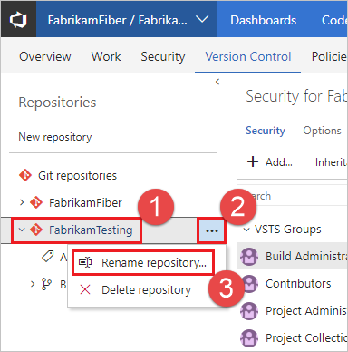
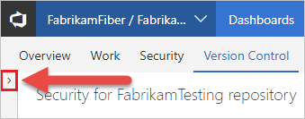
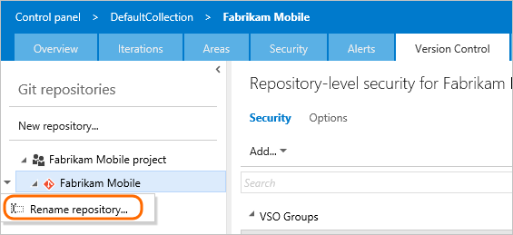
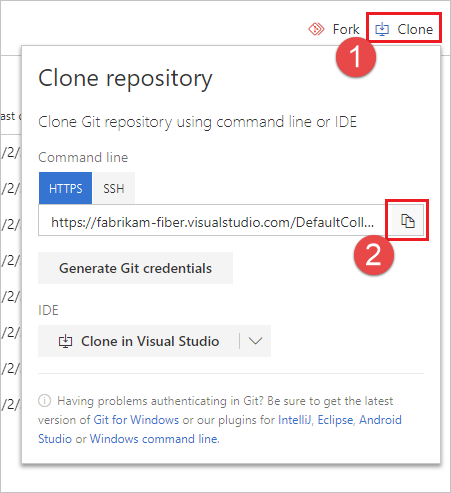
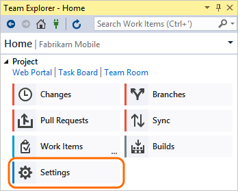
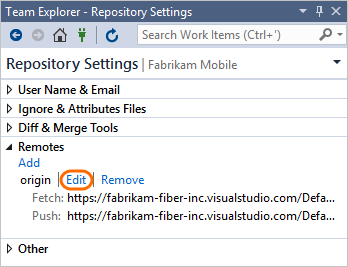
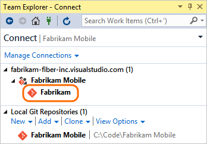

#  Rename a Git repository in your project

[!INCLUDE [version-tfs-2015-cloud](../includes/version-tfs-2015-cloud.md)]
[!INCLUDE [version-vs-2015-vs-2019](../includes/version-vs-2015-vs-2019.md)]

You can rename a Git repository in a project from your web browser. After you rename the repo, each member of your team should take a few steps to re-enable their dev machines to connect to the repo on the server.

> [!VIDEO https://www.microsoft.com/en-us/videoplayer/embed/RE4sVSK]

## Prerequisites

- To rename a repository, you must have [Rename Repository permissions](set-git-repository-permissions.md#git-repository) on your Git repo.

## Rename the repository

::: moniker range=">= azure-devops-2019"

1. From the web portal, select **Repos**, **Files**.

   

2. From the repo drop-down, select **Manage repositories**.

   

3. Select the name of the repository from the **Repositories** list, choose the **...** menu, and then choose **Rename repository**.

   

4. Rename the repository by typing the repo's new name and selecting **Rename**.

   

::: moniker-end

::: moniker range=">= tfs-2017 <= tfs-2018"

1. 1. From the web portal, open the project administration page for your project and select **Version Control**.

   

2. Select the repo you want to rename under **Git repositories** on the left and select **...**. Select **Rename repository...** from the menu.

   

   > [!NOTE]
   > If the **Repositories** pane is not expanded, select **>** to expand it and display the list of repositories.
   >
   >

3. Enter a new repo name in the **Repository name** field in the dialog, then select **Rename**.

   

::: moniker-end

::: moniker range="tfs-2015"

1. Open a project (on-premises ```http://{your_server}:8080/tfs/DefaultCollection/{your_project}``` or Azure DevOps Services ```https://dev.azure.com/{your_account}/{your_project}```) in your web browser.

2. Go to the control panel.

   


1. Rename the repo from the Version Control tab.

   

::: moniker-end

## Update the Git remotes on your dev machines

Git uses remote references to fetch and push changes between your local copy of a repository and the remote version that is stored on the server. After a Git repository or project has been renamed, you should update your remote references. Update your references to that the remote repository URL contains the project and the repository name. 

Each member of your team must update their local Git repos to continue connecting from their dev machines to the repo in the project. The instructions below show how to update the remotes for the **Fabrikam Mobile** repo that was renamed to **Fabrikam**.

<a name="copy_remote_repo_url"></a>

### Get the new URL for the repo

::: moniker range=">= azure-devops-2019"

1. Select **Repos**, **Files**.

   

2. Select **Clone** in the upper-right corner of the **Files** window and copy the clone URL.

   

::: moniker-end

::: moniker range=">= tfs-2017 <= tfs-2018"

- Select **Clone** in the upper-right corner of the **Code** window and copy the **Clone URL**.

   

::: moniker-end

::: moniker range="tfs-2015"

- Copy the repository URL to your clipboard.

	

::: moniker-end


### Update your remote in Visual Studio 

1. Connect to the repo.

   
 
2. Open the project settings.
 
   

3. Open the repo settings.

   

4. Edit the fetch and push remote references and paste the URL that you [copied from the remote repo](#copy_remote_repo_url).

   

### Update your remote in older versions of Visual Studio from the command prompt

If you use an older version of Visual Studio or work with Git from the command prompt:

1. Open the Git command prompt.

2. Go to the local repository and update the remote to the URL you [copied from the remote repo](#copy_remote_repo_url).

    ```git remote set-url origin {URL_you_copied_from_the_remote_repo}```

### Refresh Team Explorer

1. Refresh Team Explorer.

   

2. Team Explorer now shows the updated repo name. 

   

## Q&A

<!-- BEGINSECTION class="m-qanda" -->

#### Q: Can I rename my repo again? Can I reuse an old repo name?

A: Yes

#### Q: What if I named my remote something other than the default origin?

A: If you're using:

 * Visual Studio 2015, then edit the remote with the name you used. 

 * An older version of Visual Studio or the command prompt, then run this command: ```git remote set-url  {remote_name} {URL_you_copied_from_the_remote_repo}```


<!-- ENDSECTION -->
