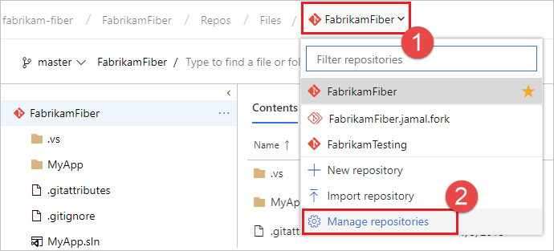
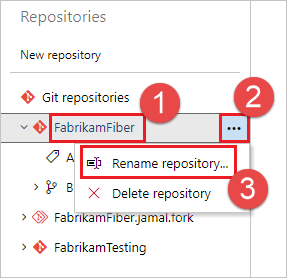
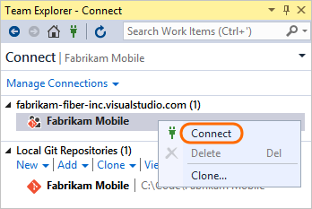
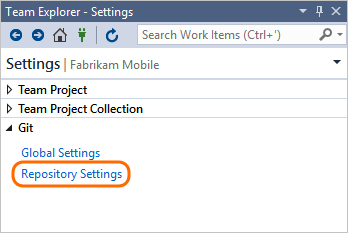

#  Rename a Git repository in your project

[!INCLUDE [version-lt-eq-azure-devops](../../includes/version-lt-eq-azure-devops.md)]
[!INCLUDE [version-vs-gt-eq-2019](../../includes/version-vs-gt-eq-2019.md)]

You can rename a Git repository in a project from your web browser. After you rename the repo, each member of your team should take a few steps to re-enable their dev machines to connect to the repo on the server.

## Prerequisites

- To rename a repository, you must have [Rename Repository permissions](set-git-repository-permissions.md#git-repository) on your Git repo.
::: moniker range=">= azure-devops-2020"
- If you want to use **az repos update** command to rename a repository, be sure to follow the steps in [Get started with Azure DevOps CLI](../../cli/index.md).
::: moniker-end

## Rename the repository

#### [Browser](#tab/browser)

::: moniker range=">= azure-devops-2019"

1. From the web portal, select **Repos**, **Files**.

   

2. From the repo drop-down, select **Manage repositories**.

   

3. Select the name of the repository from the **Repositories** list, choose the **...** menu, and then choose **Rename repository**.

   

4. Rename the repository by typing the repo's new name and selecting **Rename**.

   

::: moniker-end

<a name="repos-rename" />

#### [Azure DevOps CLI](#tab/azure-devops-cli/)

::: moniker range="azure-devops" 
[!INCLUDE [az-repos-update](./includes/azure-repos-update.md)]

::: moniker-end

[!INCLUDE [temp](../../includes/note-cli-not-supported.md)]

***

## Update the Git remotes on your dev machines

Git uses remote references to fetch and push changes between your local copy of a repository and the remote version that is stored on the server. After a Git repository or project has been renamed, you should update your remote references. Update your references to that the remote repository URL contains the project and the repository name. 

Each member of your team must update their local Git repos to continue connecting from their dev machines to the repo in the project. The instructions below show how to update the remotes for the **Fabrikam Mobile** repo that was renamed to **Fabrikam**.

### Get the new URL for the repo

::: moniker range=">= azure-devops-2019"

1. Select **Repos**, **Files**.

   

2. Select **Clone** in the upper-right corner of the **Files** window and copy the clone URL.

   

::: moniker-end

### Update your remote in Visual Studio

To update your remote:

1. In the **Git** menu from the menu bar, select **Manage Remotes**.

1. In the **Options** dialog, select the remote to edit, then select **Edit**.

   :::image type="content" source="media/repo-rename/options-rename-remote.png" border="true" alt-text="Screenshot shows the Options dialog with the option to edit remotes." :::

1. Replace the fetch and push remote references with the URL that you [copied from the remote repo](#copy_remote_repo_url).

1. Select **Save** and then **OK** to close the **Options** dialog.

Visual Studio 2019 version 16.8 and later versions provides a Git version control experience while maintaining the **Team Explorer** Git user interface. To use **Team Explorer**, uncheck **Tools** > **Options** > **Preview Features** > **New Git user experience** from the menu bar. You can exercise Git features from either interface interchangeably.

To update your remote from Visual Studio Team Explorer:

1. Connect to the repo.

   
 
2. Open the project settings.
 
   

3. Open the repo settings.

   

4. Edit the fetch and push remote references and paste the URL that you [copied from the remote repo](#copy_remote_repo_url).

   

## Q&A

<!-- BEGINSECTION class="m-qanda" -->

#### Q: Can I rename my repo again? Can I reuse an old repo name?

A: Yes

<!-- ENDSECTION -->

## Related articles

- [Set Git repository settings and policies](repository-settings.md)