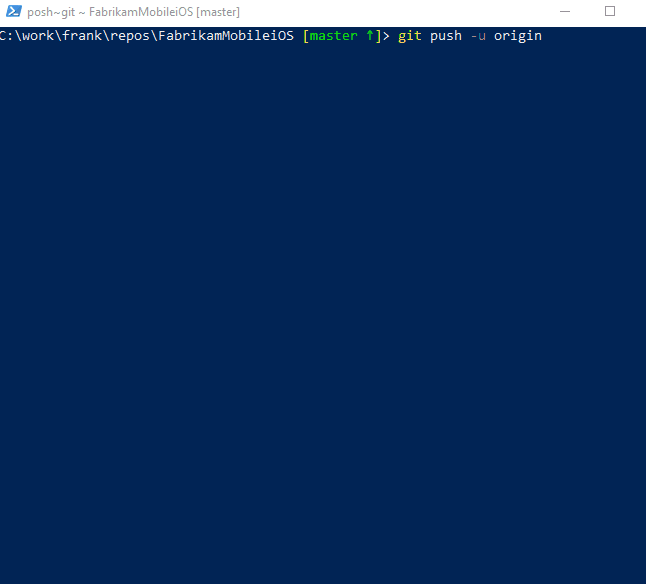

# Use Git Credential Managers to Authenticate to Azure Repos
#### Azure Repos | Azure DevOps Server 2019 | TFS 2018 | TFS 2017 | TFS 2015 | VS 2017 | VS 2015

Git Credential Managers simplify authentication with your Azure Repos Git repositories. Credential managers let you use the same credentials that you use for the Azure DevOps Services web portal. Credential managers support multi-factor authentication through Microsoft account or Azure Active Directory (Azure AD).  Besides supporting multi-factor authentication with Azure Repos, credential managers also provide support [two-factor authentication](https://help.github.com/articles/about-two-factor-authentication/) with GitHub repositories.

Azure Repos provides IDE support for Microsoft account and Azure AD authentication through the following clients:

- [Team Explorer in Visual Studio](../../organizations/projects/connect-to-projects.md)
- [IntelliJ and Android Studio with the Azure Repos Plugin for IntelliJ](/azure/devops/java/download-intellij-plug-in)
- [Eclipse with the Team Explorer Everywhere plug-in](https://github.com/Microsoft/team-explorer-everywhere)

If your environment doesn't have an integration available, configure your IDE with a [Personal Access Token](../../organizations/accounts/use-personal-access-tokens-to-authenticate.md) or [SSH](use-ssh-keys-to-authenticate.md) to connect to your repositories.

## Install the Git Credential Manager

### Windows

Download and run the latest [Git for Windows installer](https://git-scm.com/download/win), which includes the Git Credential Manager for Windows. Make sure to leave the Git Credential Manager installation option enabled when prompted.

    

### macOS and Linux

We recommend [using SSH keys](use-ssh-keys-to-authenticate.md) to authenticate to Azure Repos, not a credential manager.

> [!TIP]
> Review the [system and software requirements](https://github.com/Microsoft/Git-Credential-Manager-for-Mac-and-Linux/blob/master/Install.md#system-requirements) before installing the credential manager.

On macOS and Linux, there are [several install options](https://github.com/Microsoft/Git-Credential-Manager-for-Mac-and-Linux/blob/master/Install.md) that use native package managers to install the credential manager. After installing the package for your platform, run the following command to configure Git to use the credential manager:

```bash
git-credential-manager install
```

## Using the Git Credential Manager

When you connect to a Git repository from your Git client for the first time, the credential manager prompts for credentials. Provide your Microsoft account or Azure AD credentials. If your account has multi-factor authentication enabled, the credential manager prompts you to go through that process as well.



Once authenticated, the credential manager creates and caches a [personal access token](../../organizations/accounts/use-personal-access-tokens-to-authenticate.md) for future connections to the repo. Git commands that connect to this account won't prompt for user credentials until the token expires. A token can be revoked through Azure Repos.

### Getting help

You can open and report issues with the Git Credential Manager for Windows on the [project GitHub](https://github.com/Microsoft/Git-Credential-Manager-for-Windows/issues).
Frequently Asked Questions for the Git Credential Manager for Windows are available in [the online readme](https://github.com/Microsoft/Git-Credential-Manager-for-Windows/blob/master/Docs/Faq.md).

Manual installation steps for the [Windows Git Credential Manager](https://github.com/Microsoft/Git-Credential-Manager-for-Windows/blob/master/README.md#manual-installation) and the [macOS and Linux Git Credential Manager](https://github.com/Microsoft/Git-Credential-Manager-for-Mac-and-Linux/blob/master/Install.md#installing-on-mac-or-linux-without-a-package-manager) are available. Use these steps to install the credential manager if the recommended steps above aren't suitable for your environment.

## Learn more

We provide full source code for credential managers. We've also documented how the credential manager integrates with Git. Refer to the MSDN blog posts on the [macOS and Linux Git Credential Manager](https://blogs.msdn.com/b/visualstudioalm/archive/2015/11/18/visual-studio-team-services-git-credential-manager-for-mac-and-linux.aspx) and the 
[Windows Credential Manager](https://blogs.msdn.com/b/visualstudioalm/archive/2015/12/08/announcing-the-git-credential-manager-for-windows-1-0.aspx).

For information on the low-level internals of the Git Credential Manager for Windows, see [How the Git Credential Manager works](https://github.com/Microsoft/Git-Credential-Manager-for-Windows/wiki/How-the-Git-Credential-Managers-works).
