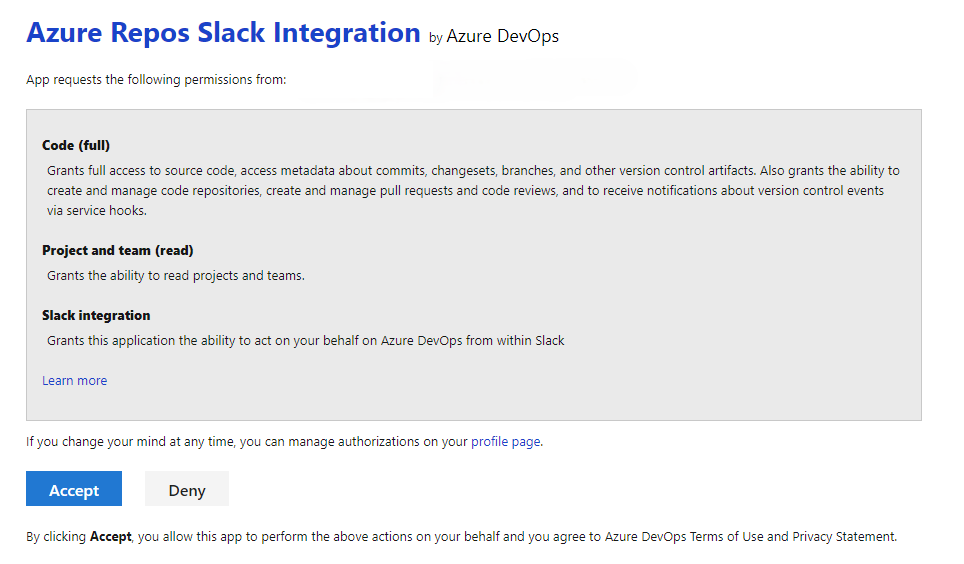
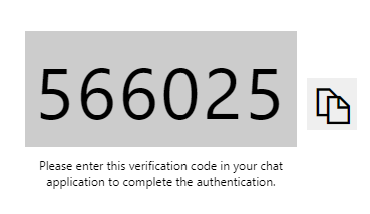
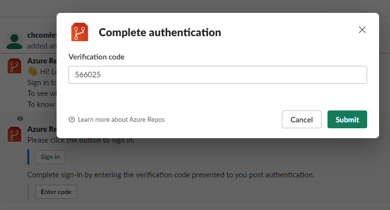
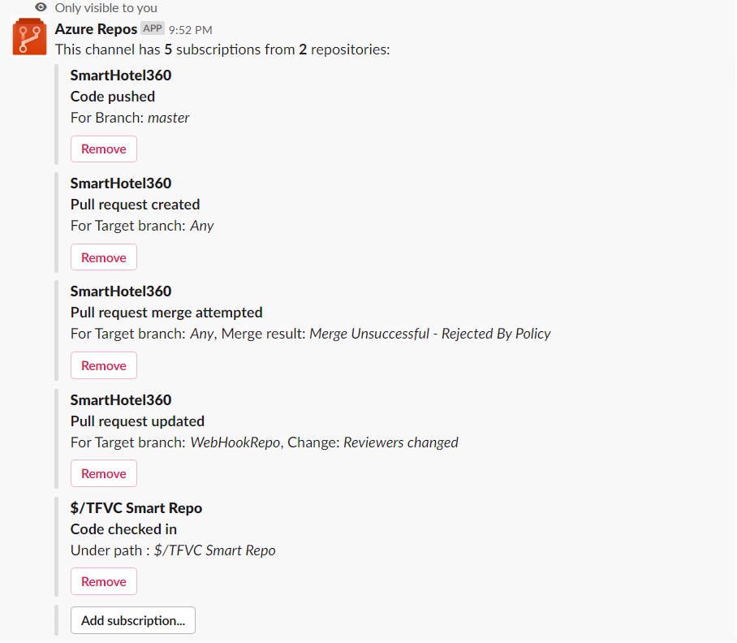
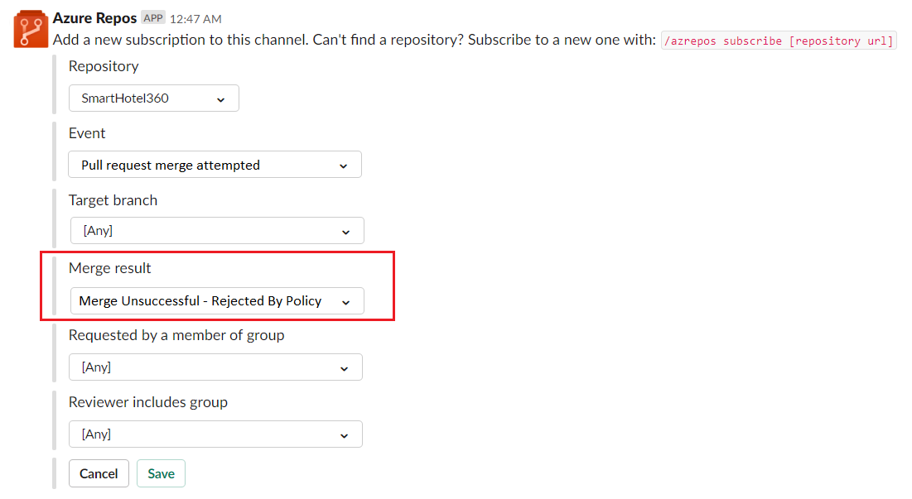

# Azure Repos with Slack

[!INCLUDE [version-eq-azure-devops](../../includes/version-eq-azure-devops.md)]

If you use [Slack](https://slack.com), you can use the [Azure Repos app for Slack](https://azchatopprodcus1.azchatops.visualstudio.com/_slack/installreposapp) to easily monitor your Azure Repos repositories. Set up and manage subscriptions to receive notifications in your channel whenever code is pushed or checked in and whenever a pull request (PR) gets created, updated, or merged. This app supports both Git and Team Foundation Version Control (TFVC) events.

## Prerequisites

- To create subscriptions in a Slack channel for repository-related events, you must be a member of the **Project Administrators** group, or be a team administrator. To get added, see [Change project-level permissions](../../organizations/security/change-project-level-permissions.md) or [Add a team administrator](../../organizations/settings/add-team-administrator.md). 
- To receive notifications, the **Third-party application access via OAuth** setting must be enabled for the organization. For more information, see [Change application 
access policies for your organization](../../organizations/accounts/change-application-access-policies.md).

> [!NOTE]
> * You can only link the Azure Repos app for Slack to a project hosted on Azure DevOps Services at this time.
> * Notifications are currently not supported inside direct messages.

## Add the Azure Repos app to your Slack workspace

1.	Go to the [Azure Repos Slack app](https://azchatopprodcus1.azchatops.visualstudio.com/_slack/installreposapp) and select **Add to Slack**. 
    
    > [!div class="mx-imgBorder"]
    > 
    
    Once added, you receive something like the following welcome message.
   
    > [!div class="mx-imgBorder"]
    > 

3.	Use the `/azrepos` Slack handle to interact with the app. A full list of commands is provided in the [Command reference](#command-reference) section of this article.

## Connect the Azure Repos app to your repositories

1.	Connect and authenticate yourself to Azure Repos using `/azrepos signin` command.
   
    > [!div class="mx-imgBorder"]
    > 

2. Select **Sign in**.
3. **Accept** the Azure Repos Slack Integration.
    
    > [!div class="mx-imgBorder"]
    > 

    A verification code displays for use in your chat app to complete authentication.

4.  Copy the authentication code.

    > [!div class="mx-imgBorder"]
    > 

5.  Select **Enter code**, paste the code, and then select **Submit**.

    > [!div class="mx-imgBorder"]
    > 

    Confirmation of sign-in displays within the chat.

    :::image type="content" source="media/integrations-slack/signed-in-confirmation.png" alt-text="Screenshot sign-in confirmation in chat.":::

To start monitoring all Git repositories in a project, use the following slash command inside a channel:

```slash command
/azrepos subscribe [project url]
```

The project URL can be to any page within your project (except URLs to repositories). For example:

```slash command
/azrepos subscribe https://dev.azure.com/myorg/myproject/
```

You can also monitor a specific repository using the following command:

```slash command
/azrepos subscribe [repository url]
```

The repository URL can be to any page within your repository that has your repository name. For example, for Git repositories, use:

```slash command
/azrepos subscribe https://dev.azure.com/myorg/myproject/_git/myrepository
```

For TFVC repositories, use:

```slash command
/azrepos subscribe https://dev.azure.com/myorg/myproject/_versionControl
```

> [!NOTE]
> You can only subscribe to public repositories. 

The subscribe command gets you started with a default subscription. For Git repositories, the channel is subscribed to the **Pull request created** event (with target branch =  main), and for TFVC repositories, the channel is subscribed to the **Code checked in** event.

> [!div class="mx-imgBorder"]
> 

## Manage subscriptions

To view, add, or remove subscriptions for a channel, use the following `subscriptions` command:

```slash command
/azrepos subscriptions
```

This command lists all the current subscriptions for the channel and allows you to add new subscriptions or remove existing ones. 
When adding subscriptions, you can customize the notifications you get by using various filters, as described in the following section.

>[!NOTE]
>Team administrators can't remove or modify subscriptions created by Project administrators.

> [!div class="mx-imgBorder"]
> 

## Use filters to customize subscriptions

When a user subscribes to a repository using the `/azrepos subscribe` command, a default subscription gets created. Often, users need to customize these subscriptions. For example, users might want to get notified only when PRs have a specific reviewer. 

The following steps demonstrate how to customize subscriptions.

1.	Run the `/azrepos subscriptions` command.
2.	In the list of subscriptions, if there's a subscription that is unwanted or must be modified (Example: creating noise in the channel), select the **Remove** button.
3.	Select the **Add subscription** button.
4.	Select the required repository and the desired event.
5.	Select the appropriate filters.

### Example: Get notifications only when my team is in the reviewer list for a PR

> [!div class="mx-imgBorder"]
> 

### Example: Tell me when merge attempts fail due to a policy violation

> [!div class="mx-imgBorder"]
> 

> [!NOTE]
>* All the filters are typically drop-downs. But if the drop-down has greater than 100 items, then users must enter the values manually.
>* For the TFVC **Code Checked in** event, the filter **Under path** must be of the format `$/myproject/path`.

## Preview pull request URLs

When a user pastes the URL of a PR, a preview display like the following image, which helps to keep PR-related conversations contextual and accurate.

> [!div class="mx-imgBorder"]
> 

Once users sign in, this feature works for all channels in a workspace.

## Remove subscriptions and repositories from a channel

Use the following command to clean up your channel by removing repositories and subscriptions.

```slash command
/azrepos unsubscribe all [project url]
```

For example, the following command deletes all the subscriptions related to any repository in the project and removes the repositories from the channel. Only project admins can run this command.

```slash command
/azrepos unsubscribe all https://dev.azure.com/myorg/myproject
```

## Command reference

The following table lists all the `/azrepos commands` you can use in your Slack channel.

|Slash command	| Functionality |
| -------------------- |----------------|
| /azrepos subscribe [repository url/ project url]	| Subscribe to a repository or all repositories in a project for notifications |
| /azrepos subscriptions	| Add or remove subscriptions for this channel |
| /azrepos signin	| Sign in to your Azure Repos organization |
| /azrepos signout	| Sign out from your Azure Repos organization |
| /azrepos feedback	| Report a problem or suggest a feature |
| /azrepos unsubscribe all [project url] | Remove all repositories (belonging to a project) and their associated subscriptions from a channel |

### Notifications in private channels

The Azure Repos app can help you monitor the repository events in your private channels, too. Invite the bot to your private channel by using `/invite @azrepos`. Then, you can manage your notifications the same way you would for a public channel.

## Troubleshoot

If you're experiencing the following errors when using the [Azure Repos App for Slack](https://azchatopprodcus1.azchatops.visualstudio.com/_slack/installreposapp), follow the procedures in this section. 

[!INCLUDE [troubleshooting](./includes/repos-troubleshoot-authentication.md)]

In the **same browser**, start a new tab, navigate to `https://slack.com`, and sign in to your work space (**use web client**). Run the `/azrepos signout` command followed by the `/azrepos signin` command. 

Select the `Sign in` button and you're redirected to a consent page like the one in the following example. Ensure that the directory shown beside the email is same as what was chosen in the previous step. Accept and complete the sign in process.

> [!div class="mx-imgBorder"]
> 

If these steps don't resolve your authentication issue, reach out to us at [Developer Community](https://developercommunity.visualstudio.com/spaces/21/index.html).

## Related articles

- [Integrate Azure Boards with Slack](../../boards/integrations/boards-slack.md)
- [Integrate Azure Pipelines with Slack](../../pipelines/integrations/slack.md)
- [Create a service hook with Slack](../../service-hooks/services/slack.md)
