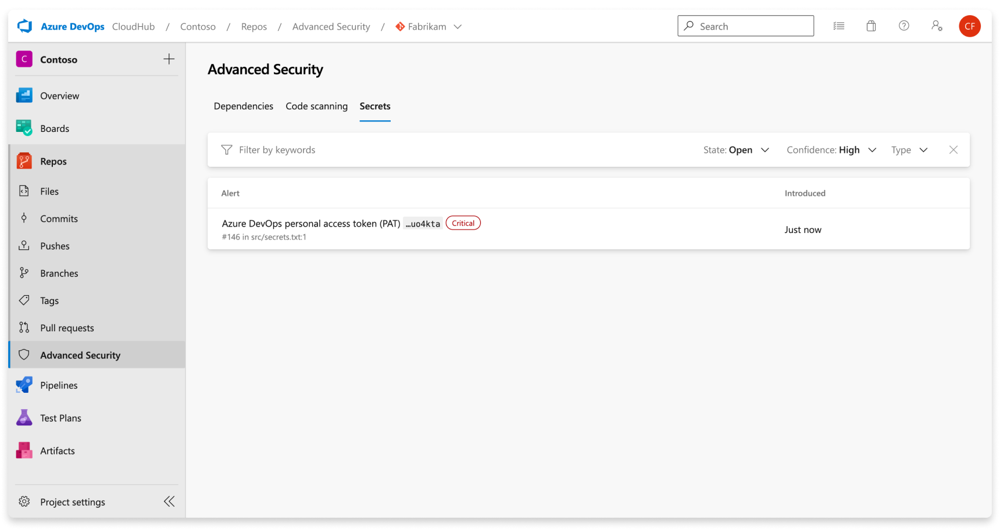
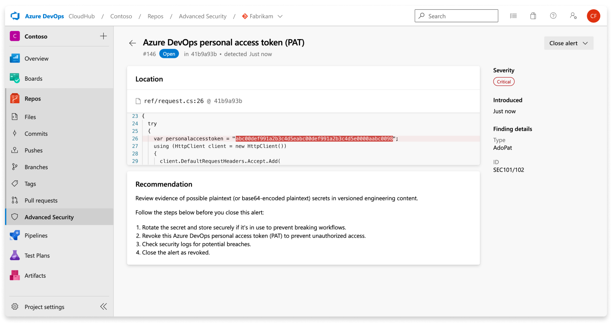
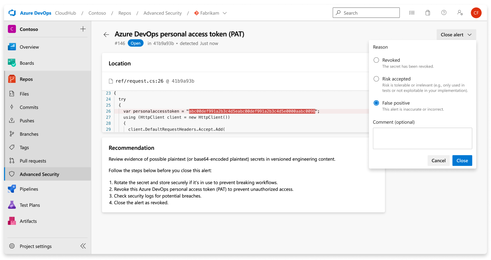
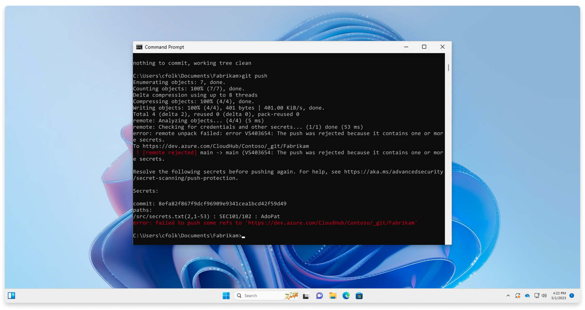

# Secret scanning 

Exposed credentials in engineering systems provide easily exploitable opportunities for attackers. To defend against this threat, [GitHub Advanced Security for Azure DevOps](configure-github-advanced-security-features.md)'s secret scanning tool scans for credentials and other sensitive content in your source code. Push protection also prevents any credentials from being leaked in the first place.  

Secret scanning for your repository scans for any secrets that may already exist in your source code across history and push protection prevents any new secrets from being exposed in source code. 

[!INCLUDE [GitHub Advanced Security for Azure DevOps is different from GitHub Advanced Security.](includes/github-advanced-security.md)]

## About secret scanning alerts

When Advanced Security is enabled, it scans repositories for secrets issued by a large variety of service providers and generates secret scanning alerts.

If access to a resource requires paired credentials, then secret scanning may create an alert only when both parts of the pair are detected in the same file. Pairing ensures that the most critical leaks aren't hidden behind information about partial leaks. Pair matching also helps reduce false positives since both elements of a pair must be used together to access the provider's resource.​​​​​​

The Advanced Security tab at **Repos** > **Advanced Security** in Azure DevOps is the hub to view your security alerts. Select the **Secrets** tab to view secret scanning alerts. You can filter by state and secret type. You can navigate into an alert for more details, including remediation guidance. Once you've enabled Advanced Security, a scan kicks off for the selected repository, including all historical commits. Over time, alerts will start to appear as the scan progresses.

There's no impact to results if branches are renamed - it may take up to 24 hours before the new name is displayed.

To remediate exposed secrets, invalidate the exposed credential and create a new one in its place. The newly created secret should then be stored securely in a way that doesn't directly push it back into the code. For example, the secret could be stored in Azure Key Vault. Most resources have both a primary and secondary credential. The method to roll a primary credential over versus a secondary credential are identical, unless otherwise noted.  

## Manage secret scanning alerts

### Viewing alerts for a repository 

Anyone with contributor permissions for a repository can view a summary of all alerts for a repository in the Advanced Security tab under Repos. Select on the **Secrets** tab to view all secret scanning alerts.

If Advanced Security was recently enabled for your repository, you may see a card indicating that Advanced Security is still scanning your repository. 

Once the scan is complete, any results are displayed. A single alert gets generated for each detected unique credential, across all branches and history of your repository. There are no branch filters as they're rolled up into one alert. 

Non-provider secrets are viewable by selecting "Other" from the confidence dropdown on the secret scanning tab. 

:::image type="content" source="media/secret-scanning-confidence-filter.png" lightbox="media/enable-github-advanced-security.png" alt-text="Screenshot of GitHub Advanced Security secret scanning confidence filter."::: 

### Alert details 

When you navigate into an alert, a detailed alert view appears and reveals more details about the finding and provide specific remediation guidance to resolve the alert.

| Section  | Explanation  |
|---|---|
|  Location | The **Locations** section details the path(s) where secret scanning has discovered the leaked credential. There may be multiple locations or multiple commits in history that contain the leaked credential. All of these locations and commits are displayed under the **Locations** with a direct link to the code snippet and commit it was identified in. |
| Recommendation | The recommendation section contains remediation guidance or link to third-party documentation remediation guidance for the identified credential. |
| Close alert | There's no autofix behavior for secret scanning alerts. All secret scanning alerts must be manually attested as fixed through the alert detail page. Select the **Close** button to verify that the secret has been revoked. |
| Severity | All secret scanning alerts are set as critical. Any exposed credential is potentially an opportunity for a malicious actor. |
| Finding details | The type of credential and rule used to find the credential are listed under the **Finding details** on the sidebar of the alert details page. |

With non-provider secrets, the **Confidence: other** tag also appears by the severity badge in the alert detail view. 

:::image type="content" source="media/secret-scanning-detail-confidence-other.png" lightbox="media/enable-github-advanced-security.png" alt-text="Screenshot of GitHub Advanced Security secret scanning generic alert detail.":::

### Fixing secret scanning alerts

Each secret has unique remediation steps to guide you through how to revoke and regenerate a new secret in its place. The alert detail shares specific steps or documentation for each alert.

A secret scanning alert stays open until closed. To attest that a secret scanning alert has been fixed: 

1. Navigate to the alert you wish to close and select the alert.
1. Select the **Close alert** drop-down.
1. If not already selected, select **Fixed**.
1. Select **Close** to submit and close the alert.

### Dismissing secret scanning alerts 

To dismiss alerts in Advanced Security, you need the appropriate permissions. By default, only project administrators can dismiss Advanced Security alerts. For more about Advanced Security permissions, see [Manage Advanced Security permissions](github-advanced-security-permissions.md).

To dismiss an alert: 

1. Navigate to the alert you wish to close and select on the alert.
1. Select the **Close alert** drop-down.
1. If not already selected, select either **Risk accepted** or **False positive** as the closure reason.
1. Add an optional comment into the **Comment** text box. 
1. Select **Close** to submit and close the alert. 
1. The alert state changes from **Open** to **Closed** and displays your dismissal reason.

 

Any alert that has been previously dismissed can be manually reopened.

### Securing compromised secrets 

Once a secret has been committed to a repository, the secret is compromised. Microsoft recommends the following actions for compromised secrets:

* For a compromised Azure DevOps personal access token, delete the compromised token, create a new token, and update any services that use the old token.
* For all other secrets, first verify that the secret committed to Azure Repos is valid. If so, create a new secret, update any services that use the old secret, and then delete the old secret.
* identify any actions taken by the compromised token on your enterprise's resources. 

When updating a secret, be sure to store the new secret securely, and ensure that it's always accessed and never stored as plaintext. This can be through Azure Keyvault or other secret management solutions. 

## Secret push protection 

Push protection checks any incoming pushes for high-confidence secrets and prevent the push from going through. An error message displays all identified secrets for you to remove them or continue to push the secrets if needed. 

### About push protection alerts

Push protection alerts are user alerts that reported by push protection. Secret scanning as a push protection currently scans repositories for secrets issued by some service providers.

If access to a resource requires paired credentials, then secret scanning may create an alert only when both parts of the pair are detected in the same file. The pairing ensures that the most critical leaks aren't hidden behind information about partial leaks. Pair matching also helps reduce false positives since both elements of a pair must be used together to access the provider's resource.

Push protection may not block older versions of certain tokens as these tokens may generate a higher number of false positives than their most recent version. Push protection may also not block legacy tokens. For tokens such as Azure Storage Keys, Advanced Security only supports recently created tokens, not tokens that match the legacy patterns. 

### Push protection from the command line 

Push protection is built natively into Azure DevOps Git. If your commits contain an identified secret, you see an error that your push was rejected.

 

### Push protection from the web interface 

Push protection also works from the web interface. If a secret is identified in a commit, you see the following error block that stops you from pushing your changes:

  

### What to do if your push was blocked 

Push protection blocks secrets found in plain text files that are usually (but not limited to) text files such as source code or JSON configuration files. These secrets are stored in plaintext. If a bad actor gains access to the files and they get published to a public repository, the secrets are usable by anyone. 

It's recommended to remove the secret from the flagged file then remove the secret from the commit history. If the flagged secret is a placeholder or example secret, it's recommended that you update the fake secret to prepend the string `Placeholder` in front of the fake secret.

If the secret was added in your immediate previous commit, amend the commit and create a new commit:  
1. Remove the secret from your code.
1. Commit the changes by using `git commit --amend`
1. Push your changes again.

If the secret was added further back in history, edit your commits using an interactive rebase:  
1. Use `git log` to determine which commit you first committed the secret.
1. Perform an interactive rebase:
`git rebase -i [commit ID before credential introduction]~1`
1. Identify your commit to edit by changing `pick` to `edit` on the first line of the text that appears in the editor.
1. Remove the secret from your code.
1. Commit the change with `git commit --amend`.
1. Run `git rebase --continue` to finish the rebase.

### Push a blocked secret

Bypassing flagged secrets isn't recommended because bypassing can put your company’s security at risk. If you confirm that an identified secret isn't a false positive, you should remove the secret from your entire branch history before attempting to push your changes again.

If you believe a blocked secret is a false positive or safe to push, you can bypass push protection. Include the string `skip-secret-scanning:true` in your commit message. Even if you bypass push protection, a secret scanning alert is generated in the alert UX once the secret has been pushed.

## Secret scanning patterns

Advanced Security maintains multiple sets of default secret scanning patterns: 

1. **Push protection patterns** - used to detect potential secrets at push time in repositories with secret scanning push protection enabled.
1. **User alert patterns** - used to detect potential secrets in repositories with secret scanning alerts enabled.
1. **Non-provider patterns** - used to detect common occurrences of structured secrets in repositories with secret scanning alerts enabled.

### Supported secrets 

| Section  | Explanation  |
|---|---|
|  Provider | The name of the token provider. |
| Token name | The type of token discovered by Advanced Security secret scanning. |
| User | A token for which leaks are reported to users post-push. This applies to all repositories where Advanced Security is enabled |
| Push protection | A token for which leaks are reported to users on push. This applies to all repositories where secret push protection enabled. |
| Validity | Tokens for which Advanced Security will attempt to perform a validity check. |

#### Partner provider patterns

The following table lists the partner provider patterns supported by secret scanning. 

[!INCLUDE [provider-table](includes/provider-table.md)]

#### Non-provider patterns

The following table lists the non-provider generated secrets detected by secret scanning. Non-provider secrets are viewable by selecting "Other" from the confidence dropdown on the secret scanning tab. For more information, see [Manage secret scanning alerts](#manage-secret-scanning-alerts).

> [!TIP]
> The detection of non-provider patterns is currently in beta and subject to change.

[!INCLUDE [non-provider-table](includes/non-provider-table.md)] 

