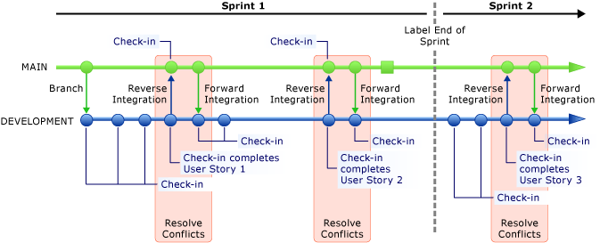
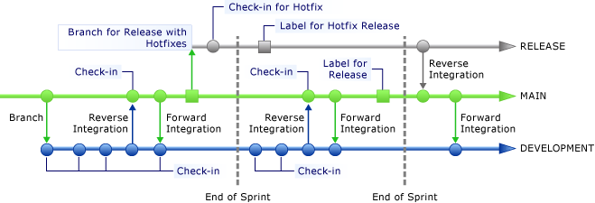

# Branch strategically

[!INCLUDE [version-lt-eq-azure-devops](../../includes/version-lt-eq-azure-devops.md)]

Source code is an important asset in your development effort. But it can be a challenge to effectively manage and evolve source files when multiple developers work concurrently on file updates. You can use a version control system to store source code in shared repositories, to isolate parallel development efforts, to integrate code changes, and to recover previous file versions. A key element in version control is branching that enables simultaneous development. If you branch strategically, you can maintain the order and consistency of multiple versions of your software.

Team Foundation provides a flexible and reliable version control system. You can use Team Foundation version control to manage multiple revisions during development of source code, documents, work items, and other critical information that is worked on by your team. 

## How does your team manage code while it introduces multiple changes simultaneously through several project releases?

When you work with a version control system, you must consider how to set up a branch structure. You can create a branch by mirroring the source code file. Then you can change the branch without affecting the source. For example, as the branch structure in the following illustration shows, the MAIN branch contains completed functionality that has passed integration tests, and the DEVELOPMENT branch contains the code that is under construction. When a new functionality in the DEVELOPMENT branch is completed and can pass integration tests, you can promote the code from the DEVELOPMENT branch to the MAIN branch. This process is referred to as reverse integration. Conversely, if you merge the code from the MAIN branch to the DEVELOPMENT branch, the process is referred to as forward integration.

   
   For more information about how to create and merge code branches, see the following page on the CodePlex Web site: [Team Foundation Server Branching Guide 2.0](https://devblogs.microsoft.com/buckh/tfs-branching-guide-2-0-released/).

Branching and merging entail the following principles:

1.  Each branch must have a defined policy about how to integrate code into this branch. For example, in the branch structure of the previous illustration, you can assign a team member to own and manage the MAIN branch. This member is responsible for performing the initial branch operation, reverse integrating changes from the DEVELOPMENT branch to the MAIN branch, and forward integrating changes from the MAIN branch to the DEVELOPMENT branch. Forward integration is important when the MAIN branch also integrates changes from other branches.

2.  The MAIN branch must contain code that has passed integration tests so that it is always ready for a release.

3.  The DEVELOPMENT (or work) branch constantly evolves because team members check in changes periodically.

4.  Labels are snapshots of the files in a branch at a specific time.

    For more information, see [Use labels to take a snapshot of your files](use-labels-take-snapshot-your-files.md).

Team Foundation Build allows you to choose from several types of builds for your branches: manual, continuous, gated, rolling, and scheduled. We recommend that the MAIN branch has a gated check-in build type. This means that the DEVELOPMENT branch must pass all requirements for the MAIN branch before you can commit a reverse integration. The DEVELOPMENT branch should run a continuous build type because your team must know as soon as possible when a new check-in affects the DEVELOPMENT branch.

## How often should your team reverse integrate and forward integrate?

As shown in the following illustration, reverse integration and forward integration should occur at least when you complete a user story. Although each team might define completeness differently, completion of a user story generally means that you complete both the functionality and the corresponding unit tests. You can reverse integrate to the MAIN branch only after unit tests have verified the stability of the DEVELOPMENT branch.

   
If you have more than one work (DEVELOPMENT) branch, forward integration to all work branches should occur as soon as any branch integrates into the MAIN branch. Because the MAIN branch is kept stable, forward integration is safe. Conflicts or failures at the work branches might occur because you cannot guarantee that the work branches are stable.

It is important that you resolve all conflicts as soon as possible. By using a gated check-in for the MAIN branch, you help make the reverse integration much easier because quality gates help avoid conflicts or errors in the MAIN branch. For more information, see [Check in to a folder that is controlled by a gated check-in build process](check-folder-controlled-by-gated-check-build-process.md).

## How does your team manage sources that implement different user stories?

As the following illustration shows, you can check in changes to a work branch periodically to complete a user story. You can implement multiple user stories in the same branch at the same time. However, you can reverse integrate to the MAIN branch only when you complete all the in-progress work. It is recommended that you group user stories by similar size because you do not want a large user story to block the integration of many small ones. You can split the two sets of user stories into two branches.

## When should the team add a branch?

You should create branches in the following situations:

-   When you must release code on a different schedule/cycle than the existing branches.

-   When your code requires a different branch policy. If you create a new branch that has the new policy, you can add strategic value to your project.

-   When functionality is released to a customer and your team plans to make changes that do not affect the planned release cycle.

You should not create a branching for each user story because it creates a high integration cost. Although TFVC makes branching easy, the overhead of managing branches can become significant if you have many branches.

## How does the team manage releases from the version control perspective?

Your team should be able to release code at the end of any sprint. By using Team Foundation Server, you can label a branch to take a snapshot of the code at a specific point in time. As the following illustration shows, you can label the MAIN branch for a release. This lets you return the branch to its state at this point.

   
Because you must implement updates on releases, creating a branch for a release helps your team continue to work independently on the next sprint without creating conflicts with future releases. The following illustration shows a branch that contains code for an update and that is reverse integrated into the MAIN branch after a release at the end of the second sprint.

   
When you create a branch for a release, you should create that branch from the MAIN branch, which is the most stable. If you branch for release from a work branch, it can cause integration challenges because the stability of work branches is not guaranteed.

## Related articles 

- [Select an effective branching strategy](branching-strategies-with-tfvc.md) 

