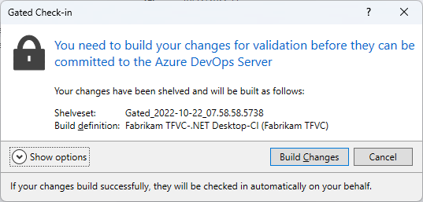

# Check in to a folder controlled by gated check-in

[!INCLUDE [version-lt-eq-azure-devops](../../includes/version-lt-eq-azure-devops.md)] 
[!INCLUDE [version-vs-gt-eq-2019](../../includes/version-vs-gt-eq-2019.md)]

When you check in files to a version control folder that's controlled by a [gated check-in build process](../../pipelines/repos/tfvc.md#gated), you must take more steps to complete the check-in.

## Prerequisites

- You must be a **Contributor** for your project. For more information, see [Default TFVC permissions](../../organizations/security/default-tfvc-permissions.md).

- You can't have [Limit job authorization scope to current project for non-release pipelines](../../pipelines/process/access-tokens.md#job-authorization-scope) set. If you receive an error such as `The shelveset _Build_95;Build\6bc8a077-3f27-4936-82e6-415fbd53ba07 could not be found for check-in`, check this setting and make sure it's not enabled.

## Gated check-in build process

If the **Gated Check-in** dialog box appears during your check-in, your changes must be built by Azure Pipelines before they can be checked in.

### Check in changes to a folder controlled by a gated check-in

1. In the **Gated Check-in** dialog box, if the **Build pipeline** menu appears and you want to run a build, choose the build pipeline you want to use.

1. If a build pipeline name already appears in **Gated Check-in**, or after you select a pipeline, select one of the following options:

   - If you don't want to build your changes yet, select **Cancel**. You can then build the shelveset manually in a private build if you choose. For more information, see [Get started with CI/CD](../../pipelines/create-first-pipeline.md).

   - If you don't want to build your changes, and you have **Override check-in validation by build** permission set to **Allow**, you can bypass the gated check-in build requirement and check in. Choose **Show options**, and then choose **Bypass validation build and check in my changes directly (requires permissions)**.
   
   - If you want to proceed with the gated check-in and discard your local workspace changes, select **Show options**, and then clear the **Preserve my pending changes locally** checkbox. Select **Build Changes**, and when the build completes, follow the instructions under [Delete the latest changes in your workspace after a gated check-in](#delete-the-latest-changes-in-your-workspace-after-a-gated-check-in).

   - To build changes and proceed with check-in, select **Build Changes**. If you want to keep your local workspace changes, after the build completes, follow the instructions under [Reconcile the latest changes in your workspace after a gated check-in](#reconcile-the-latest-changes-in-your-workspace-after-a-gated-check-in).

During the build, the **Pending Changes** page of the **Team Explorer** window displays an informational message, and you can select the **here** link to monitor the build in the build results window. You can also monitor builds on the **Builds** page of **Team Explorer**.

### Reconcile the latest changes in your workspace after a gated check-in

If you continue working in your workspace during the gated check-in, and you want to keep your changes, you should reconcile your latest changes with the changes that are now checked into version control.

After the build completes:

- If the build results window shows **Check-in committed**, reconcile your workspace as follows:

  - If you're using the Build Notifications application, the **Gated Check-in** dialog box appears. Choose **Reconcile**.
  - Or, on the **Builds** page of **Team Explorer**, right click the completed build and choose **Reconcile Workspace**. Use the **Reconcile Workspace** dialog box to resolve any version control conflicts.

- If the build results window shows **Check-in rejected**, correct the problems that caused the check-in to be rejected. In **Team Explorer**, on the **Builds** page, double-click the build that failed under **My Builds**, or right-click the build and select **Open**.

  The Azure Pipelines build results window opens, containing information that can help you resolve the problem that caused the build to fail. For some types of problems, you may be able to choose the error or issue and view the file that requires corrections.

### Delete the latest changes in your workspace after a gated check-in

If you want to proceed with gated check-in and you don't plan to continue working with your changes, you can delete the changes in your workspace. Your changes are preserved in a shelveset and built. If the build completes, then your changes are checked in. If the build fails, then you can unshelve the shelveset to get the changes back into your workspace.

1. When you check in, in the **Gated Check-in** dialog box, choose **Show Options**. Clear the **Preserve my pending changes locally** checkbox, and then choose **Build Changes**.

1. After the build completes:

   - If the build results window shows **Check-in committed**, now that your changes are checked in, you might want to get the latest version of the files so that your workspace contains these changes. For more information, see [Download (get) files from the server](download-get-files-from-server.md).

   - If the build results window shows **Check-in rejected**, correct the problems that caused the check-in to be rejected. In **Team Explorer**, on the **Builds** page, double-click the build that failed under **My Builds**, or right-click the build and select **Open**.

     In the Azure Pipelines build results window, look for information that can help you resolve the problem that caused the build to fail. For some types of problems, you may be able to choose the error or issue and view the file that requires corrections.

1. Retrieve your changes from the shelveset. For more information, see [Suspend your work and manage your shelvesets](suspend-your-work-manage-your-shelvesets.md).

1. In your files, correct the problems that caused the build to fail.

## Related articles

- [Use a gated check-in build process to validate changes](../../pipelines/build/triggers.md)
- [Develop code and manage pending changes](develop-code-manage-pending-changes.md) 
- [Suspend your work and manage your shelvesets](suspend-your-work-manage-your-shelvesets.md)