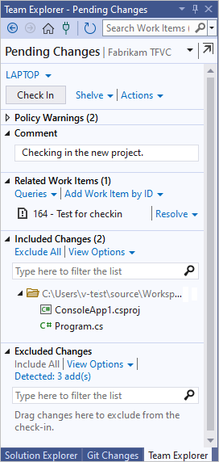
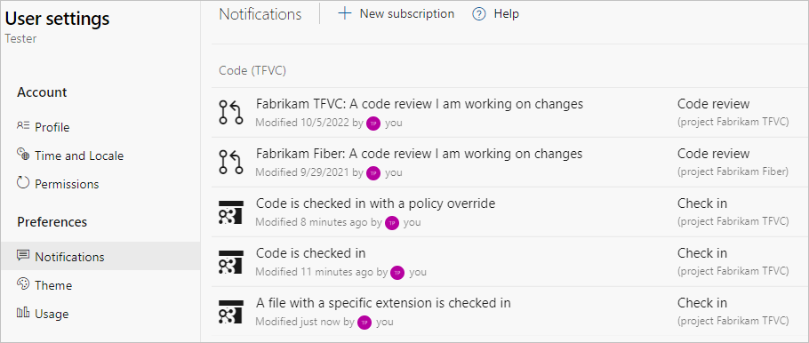

# Check in your work to the team's codebase

[!INCLUDE [version-lt-eq-azure-devops](../../includes/version-lt-eq-azure-devops.md)]
[!INCLUDE [version-vs-gt-eq-2019](../../includes/version-vs-gt-eq-2019.md)]

In Visual Studio **Team Explorer**, use the **Pending Changes** page to check in your code to a new changeset. On your keyboard, press Ctrl+O, P.

## Choose the files you want to check in

You can specify which file changes you want to check in by dragging them between the **Included Changes** and **Excluded Changes** sections of the **Pending Changes** page in Team Explorer. You can also check in as you work in other areas of Visual Studio.

- In **Solution Explorer**, right-click the solution, one or more code projects, or one or more files, and select **Check In**.

- In **Source Control Explorer**, select one or more items with pending changes, or one or more folders that contain items with pending changes. The TFVC checked-out status icon :::image type="icon" source="media/check-your-work-team-codebase/IC51402.gif"::: indicates items with pending changes. Right-click the selected items and choose **Check In**.

> [!IMPORTANT]
> The **Check In** option isn't displayed if there are no pending changes to the selected items.

If you don't see pending changes for an item you want to check in, make sure that it isn't listed as an excluded change. Open the **Pending Changes** view and select the **Detected** link under **Excluded Changes**. In the **Promote Candidate Changes** dialog box, select any of the items that you want to check in, and select **Promote**. The items move into the **Included Changes** section and can now be checked in.

## Associate work items

When you check in changes, you should associate work items with the changes. This practice offers the following benefits:

- A team member who looks at the work item can [link directly to the changeset](../../boards/queries/link-work-items-support-traceability.md) to see the work that you did.
- A team member who [reviews the history of a file](view-manage-past-versions.md) you changed can view the changeset and see the work items that were the justification for the change.
- You might build your changes in your automated build system, for example with a [CI Build](../../pipelines/build/triggers.md), or a [Gated Check-in Build](../../pipelines/repos/index.md). Your team members can see in which completed build the task was completed or the bug was fixed.

To associate work items with your changes, select **Add Work Item by ID** in the **Related Work Items** section of the **Pending Changes** page. Enter the work item ID and select **Add**.

After you add a work item, you can select the link next to the item to choose how the item should be related to your changes: **Associate** or **Resolve**. These options are available only if the work item isn't already in a state that precludes this relationship, such as **Resolved**, **Done**, or **Closed**.

## Check in your changes

1. In **Team Explorer**, choose :::image type="icon" source="media/check-your-work-team-codebase/IC547418.png"::: **Home**, and then select **Pending Changes** or press Ctrl+0, P.

1. On the **Pending Changes** page, enter a **Comment** so that teammates who later need to [review and understand the history of your files](view-manage-past-versions.md) can understand what you did. For example: *Implemented shopping cart controller*.

   Some teams want their members to provide certain kinds of information about each changeset, and they might implement a check-in policy to require this practice. If a project administrator has [enabled or required check-in notes](configure-check-notes.md), you can type the information into the **Notes** section.

1. Select **Check In**.

One of the following outcomes occurs:

- Your changes are checked in.

  All the included file changes from your workspace along with the comment, check-in notes, and links to related work items are stored on the server as a single [changeset](find-view-changesets.md).

- Conflicts block your changes.

  The system presents you with the conflicts between your changes and the latest version of the files on the server. See [Resolve Team Foundation Version Control conflicts](resolve-team-foundation-version-control-conflicts.md).

- A check-in policy blocks your check-in.

  Administrators of your project can implement check-in policies to encourage your team to follow best practices. For example, a check-in policy can encourage or require team members to associate at least one work item with their changes. For more information, see [Set and Enforce Quality Gates](set-enforce-quality-gates.md).

  To override these check-in policies, in the **Policy Warnings** section, select **Override Warnings**, and enter an override reason.

- You're checking in changes to a folder that's controlled by a gated check-in build process.

  If you're checking in changes to version control folders that are controlled by a [gated check-in build process](../../pipelines/repos/index.md), the **Gated Check-in** dialog box appears. For information about how to complete the check-in, see [Check in to a folder that is controlled by a gated check-in build process](check-folder-controlled-by-gated-check-build-process.md).

  

## Subscribe to alerts

If you want to be notified when someone checks in code in your TFVC project, you can [subscribe](../../notifications/manage-your-personal-notifications.md) to receive email alerts. In your TFVC project **User settings**, select **Notifications**. Select **New subscription**, and then choose from and customize the **Check in** templates for **Code (TFVC)**.

## Work from the command prompt

- The [Checkin command](checkin-command.md) lets you view pending changes and check in files.

## Tips

- You can :::image type="icon" source="media/check-your-work-team-codebase/IC667296.png"::: undock the **Pending Changes** page from **Team Explorer** and open it in a new window.

- You can toggle between list and tree views by selecting **View Options** from the **Included Items** or **Excluded Items** sections of the **Pending Changes** page.

- Before checking in new code, you should consider conducting a code review. See [Suspend work, fix a bug, and conduct a code review](day-life-alm-developer-suspend-work-fix-bug-conduct-code-review.md).

- You can manage and, if necessary, undo your pending changes. See [Develop code and manage pending changes](develop-code-manage-pending-changes.md).

- If you need to set aside your changes, see [Suspend your work and manage your shelvesets](suspend-your-work-manage-your-shelvesets.md).

- Changes are checked in atomically. The operation either succeeds completely or fails completely. If any one of the changes can't be submitted, none of the changes are committed and a changeset isn't created. For example, if you lose network connectivity in the middle of a check-in operation, the whole operation fails.

  There is one exception, which is the association of work items with the changeset. If work item association fails but all other aspects of the check-in operation succeed, then the changeset is created. You can manually associate a work item with a changeset. See [Manage dependencies, link work items to support traceability](../../boards/queries/link-work-items-support-traceability.md).

## Next steps

[Rename or move files and folders](rename-move-files-folders.md)
