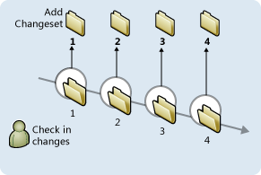
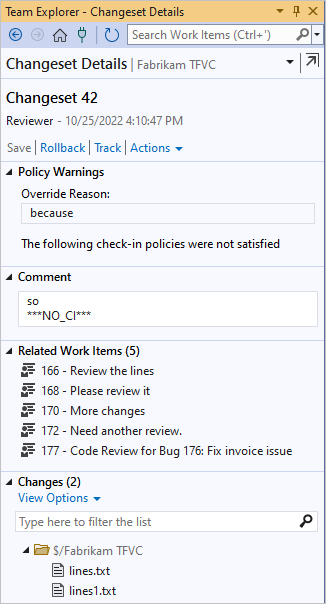
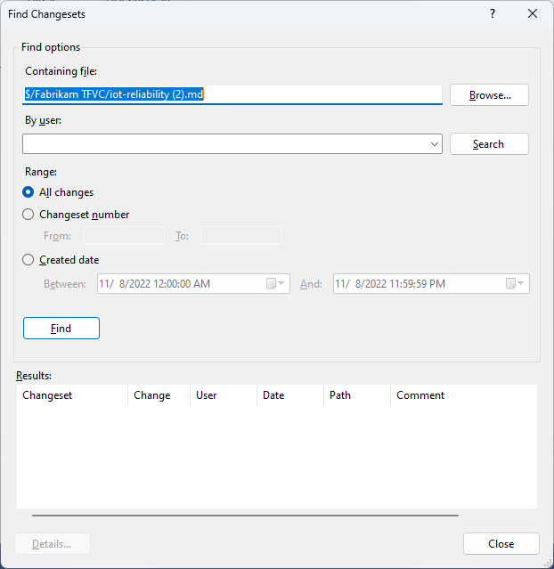

# Find and view changesets

[!INCLUDE [version-lt-eq-azure-devops](../../includes/version-lt-eq-azure-devops.md)]
[!INCLUDE [version-vs-gt-eq-2019](../../includes/version-vs-gt-eq-2019.md)]

When you [check in your changes](check-your-work-team-codebase.md) in Team Foundation Version Control (TFVC), they are stored on the server as a changeset. Changesets contain the history of each item in version control.

   

You can view a changeset to see what the exact file changes were, discover the owner's comments, find linked work items, and see if any policy warnings were triggered.

## Prerequisites

You must be one of the **Contributors** for your project. To learn more, see [Default TFVC permissions](../../organizations/security/default-tfvc-permissions.md).

## Find a changeset by ID

1. In Visual Studio [Source Control Explorer](use-source-control-explorer-manage-files-under-version-control.md), press Ctrl+G. The **Go to Changeset** dialog box appears.

   

1. Type the number of a changeset and choose **OK**.

   The changeset details appear on the **Changeset Details** page in **Team Explorer**.

   If you don't know the number, choose **Find**. See [Find a changeset](find-view-changesets.md#find).

## List changesets that update a specific file or folder

1. In Visual Studio **Solution Explorer** or **Source Control Explorer**, right-click the folder or file and choose **View History**.

1. In the [History window](get-history-item.md), right-click the row that contains the changeset for which you want to view details, and choose **Changeset Details**.

   The changeset details appear on the **Changeset Details** page in **Team Explorer**.

   

> [!TIP]
> - You can  undock the **Changeset Details** page from **Team Explorer** and open it in its own window.
> 
> - You can toggle between tree and list view by selecting **View Options** in the **Changes** section.

<a name="find"></a>

## Search for changesets

1. On the Visual Studio menu bar, choose **File** > **Source Control** > **Find** > **Find Changesets**.

   The **Find Changesets** dialog box appears.

   

1. In the **Find Changesets** dialog box, enter a file or folder name in **Containing file**, or:

   - Select **Browse** to find and select a file or folder.

   - In the **By user** box, optionally enter a user name or select **Search** to select a project team member who's associated with the changeset.

   - Under **Range**, optionally choose one of the following ranges:

   - **All changes** retrieves all changesets that were applied to that file or folder.

   - **Changeset number** retrieves changesets from a range of numbers. In the **From** and **To** boxes, type the range.

   - **Created date** retrieves changesets from a range of dates. In the **Between** and **And** boxes, specify start and end dates.

1. Select **Find**.

   Changesets that match your criteria appear in the **Results** list. You can select a changeset and then select **Details** to view its details.

## Work with changesets

1. In the **Find Changesets** dialog box, select the changeset you want details for and select **Details**, or right-click the changeset and select **Changeset Details**.

   The **Details for Changeset** dialog box appears.

   

7. In the **Details for Changeset** dialog box, view the change types that were added and any comments, work items, check-in notes, and policy warnings that are associated with the changeset.

8. Close the **Details for Changeset** dialog box.

9. Choose **OK**.

The **Changeset Details** view in Team Explorer has links to perform the following tasks:

-   **Rollback** to remove the effects of the changeset. See [Roll back changesets](roll-back-changesets.md).

-   **Track** to determine which branches have and have not received a set of changes. See [View where and when changesets have been merged](view-where-when-changesets-have-been-merged.md).

-   **Actions**, **Request Review** to request a code review.

-   **Actions**, **Open in Browser** to view the changeset in your browser (for example, if you want to copy the URL into an email to discuss the change with your team).


## Work from the command prompt

To find a changeset from the [command prompt](use-team-foundation-version-control-commands.md):

```
c:\users\jamal\workspaces\fabrikam>tf changeset
```

To view or modify changesets and to learn about other options, see [Changeset Command](changeset-command.md).

## Tips

-    You can download the version of a file in a changeset. See [Download (get) files from the Server](download-get-files-from-server.md).

-    You can add a link between a changeset and one or more work items. See [Manage dependencies, link work items to support traceability](../../boards/queries/link-work-items-support-traceability.md).
