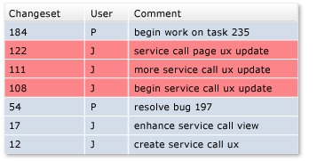

# Roll back changesets

[!INCLUDE [temp](../includes/version-tfs-2013-cloud.md)]
[!INCLUDE [temp](../includes/version-vs-2013-vs-2019.md)]

A [changeset](find-view-changesets.md) is a permanent part of the history of your version-controlled items and cannot be undone or removed. However, you can roll back the effects of one or more changesets.

> [!TIP]
> You can confirm the changes that result from rolling back some items match what you intend to do before you commit them to the server. See [Tips](roll-back-changesets.md#tips) for details.

## Prerequisites

You must be one of the **Contributors** for your project. To learn more, see [Default TFVC permissions](../../organizations/security/default-tfvc-permissions.md).

## Roll back changes from a single changeset

For example, a developer wants to remove the effects of a changeset:

### To roll back a changeset from the Changeset Details page

-   On the [Changeset Details](find-view-changesets.md) page, choose **Rollback**.

### To roll back a changeset from the History window

-   In the [History](get-history-item.md) window, open the shortcut menu of a version and choose **Rollback Entire Changeset**.

### To roll back a changeset from Source Control Explorer

1.  In [Source Control Explorer](use-source-control-explorer-manage-files-under-version-control.md), select an item, open its shortcut menu, and choose **Rollback**.

    > [!NOTE]
    > The items you select determine the scope that the rollback changes.

2.  In the **Rollback** dialog box, select **Rollback changes from a single changeset**.

## Roll back changes from a range of changesets

For example, a developer wants to remove the effects of some consecutive changesets:

### To roll back a changeset from the History window

-   In the [History](get-history-item.md) window, select two or more consecutive versions, open their shortcut menu, and choose **Rollback**.

### To roll back a changeset from Source Control Explorer

1.  In [Source Control Explorer](use-source-control-explorer-manage-files-under-version-control.md), select an item, open its shortcut menu, and choose **Rollback**.

    > [!NOTE]
    > The items you select determine the scope that the rollback changes.

2.  In the **Rollback** dialog box, select **Rollback changes from a range of changesets**.

## Roll back to a specific version

For example, a developer wants to roll back a file to an earlier version, eliminating the effect of all changesets that occurred after that version:

### To roll back to a specific version

1.  In [Source Control Explorer](use-source-control-explorer-manage-files-under-version-control.md), select an item, open its shortcut menu, and choose **Rollback**.

2.  In the **Rollback** dialog box, select **Rollback to a specific version**.

## Work from the command prompt

-    [Rollback Command (Team Foundation Version Control)](rollback-command-team-foundation-version-control.md) 

## Tips

-   If your change is still pending (you have not yet checked it in), you can undo the change instead of rolling it back. See [Develop code and manage pending changes](develop-code-manage-pending-changes.md).

-    Like most changes you make to files, a rollback change is queued as a pending change. After you roll back the files, you can [view the files you are changing](develop-code-manage-pending-changes.md) and [compare the content of the files with the latest version on the server](compare-files.md). After you confirm the actual changes match what you intend to do, you can [then check them in](check-your-work-team-codebase.md).

-   Rollback does not delete changesets or any data. If you change your mind, use rollback to revert the content of the files back to their state before the rollback.